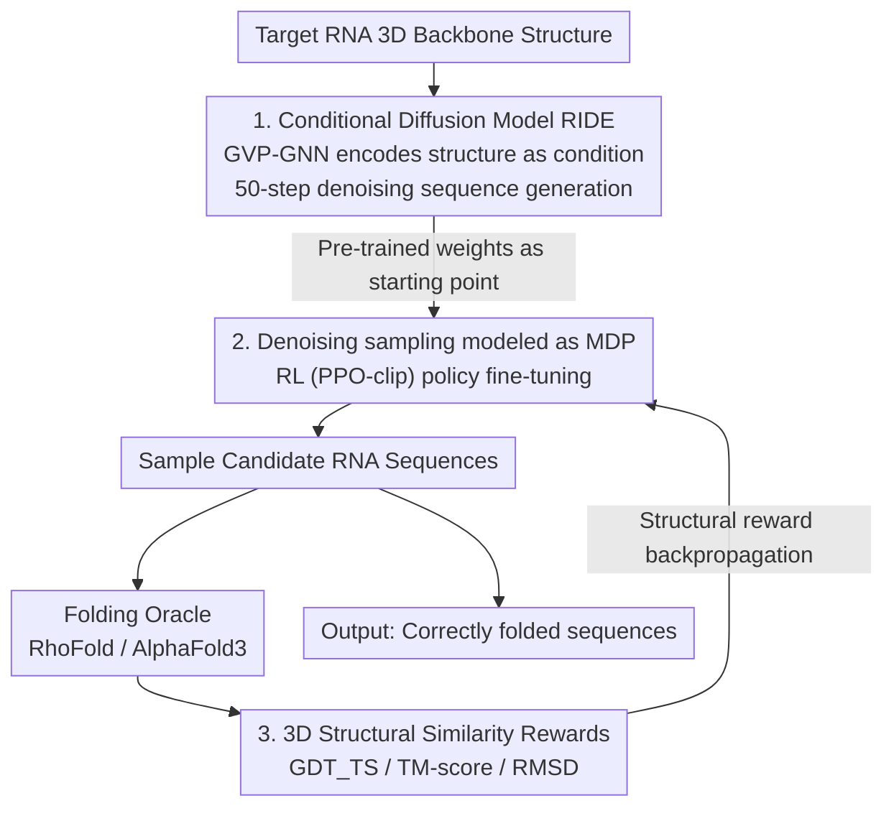

# RIDER: 3D RNA Inverse Design with Reinforcement Learning-Guided Diffusion

**Conference**: ICLR 2026  
**arXiv**: [2602.16548](https://arxiv.org/abs/2602.16548)  
**Code**: —  
**Area**: Biomolecular Design / Diffusion Models / Reinforcement Learning  
**Keywords**: RNA Inverse Design, 3D Structural Similarity, Diffusion Models, Reinforcement Learning Fine-tuning, DDPO

## TL;DR

The RIDER framework is proposed, marking the first introduction of reinforcement learning into RNA 3D inverse design. It first pre-trains a conditional diffusion model, RIDE, to learn sequence-structure relationships, and then fine-tunes it using RL to directly optimize 3D structural similarity rather than Native Sequence Recovery (NSR), achieving over 100% improvement across all 3D self-consistency metrics.

## Background & Motivation

RNA inverse design (identifying a nucleotide sequence that folds into a target 3D structure) is a pivotal problem in therapeutic drug development and synthetic biology.

**Core Problem with Existing Methods**: Almost all SOTA methods (gRNAde, RiboDiffusion, RDesign, etc.) optimize **Native Sequence Recovery (NSR)** as a proxy objective. However, RNA exhibits high degeneracy—multiple distinct sequences can fold into similar structures, and similar sequences do not necessarily produce similar structures. Consequently:

1. NSR lacks significant correlation with structural similarity (at NSR ≈ 50%, GDT_TS can range from 0 to 0.9).
2. Over-optimizing NSR restricts the exploration of non-natural sequences.

## Method

### Overall Architecture

RIDER addresses the "objective misalignment" in RNA inverse design: while the field typically optimizes sequence recovery (NSR), the true goal is for the sequence to fold back into the target 3D structure. The framework resolves this through two stages: first, pre-training a conditional diffusion model, RIDE, to learn to generate reasonable in-distribution sequences based on the target backbone structure; second, modeling the entire denoising sampling process as a decision trajectory and using reinforcement learning to fine-tune the policy with folded structural similarity as the reward. Pre-training ensures that generation quality remains within the distribution, while RL fine-tuning shifts the optimization from "mimicking natural sequences" to "correct folding." The rewards are composed of a set of 3D structural similarity metrics, backpropagating signals of "folding accuracy" to the sampling policy.

### Key Designs

**1. Conditional Diffusion Model RIDE: Encoding target structures as generation conditions**

To enable the model to "write sequences based on structure," the 3D backbone must be transformed into conditions the model can process. RIDER represents the RNA backbone as a geometric graph—nodes are nucleotides and edges encode spatial proximity—using a 5-layer GVP-GNN encoder to extract equivariant node embeddings $\mathbf{h}_c$ as diffusion conditions. The diffusion model learns the conditional distribution $p(\mathbf{x}_0 \mid \mathbf{h}_c)$, where $\mathbf{x}_0 \in \{0,1\}^{N \times 4}$ is the one-hot encoded sequence, and forward noise is added as $\mathbf{x}_t = \alpha_t \mathbf{x}_0 + \sigma_t \varepsilon$. Training follows the standard noise prediction objective $\mathcal{L}_{\text{pretrain}}(\theta) = \mathbb{E}_{t, \mathbf{x}_0, \varepsilon, \mathbf{h}_c}[\|\varepsilon - \epsilon_\theta(\alpha_t \mathbf{x}_0 + \sigma_t \varepsilon, t, \mathbf{h}_c)\|^2]$. The noise prediction network also consists of GVP-GNNs, and inference utilizes 50-step DDIM sampling. This step embeds the sequence-structure correspondence into the model, providing a high-quality starting point for subsequent RL; pre-training alone achieves 61% NSR, higher than gRNAde's 50%.

**2. Modeling Denoising Sampling as an MDP with RL Fine-tuning: Direct alignment with structural rewards**

Diffusion models inherently mimic training sequences and cannot actively optimize for "folding quality." The key advancement of RIDER is modeling 50-step denoising as a Markov Decision Process (MDP): the state is $s_t = (\mathbf{x}_t, t, \mathbf{h}_c)$, the action $a_t$ is the transition from $\mathbf{x}_t$ to $\mathbf{x}_{t-\Delta t}$, and the policy $\pi_\theta(a_t\mid s_t)$ is parameterized by the diffusion model. The reward is only provided at the end of the trajectory—after Obtaining the full sequence and predicting its folded structure. Thus, the advantage function carries authentic structural signals. To stabilize high-variance trajectory rewards, advantage estimation uses the batch reward mean $b = \mathbb{E}_\tau[R_{\text{traj}}]$ as a baseline, further refined via a moving average $b^{(i)} = \beta_{\text{baseline}} \cdot b^{(i-1)} + (1-\beta_{\text{baseline}}) \cdot \bar{R}^{(i)}_{\text{batch}}$ to suppress inter-batch fluctuations. The update applies the PPO-clip objective $\mathcal{L}^{RL}(\theta) = \mathbb{E}[\sum_{k}\min(r_k(\theta)A, \text{clip}(r_k(\theta), 1-\epsilon_{\text{clip}}, 1+\epsilon_{\text{clip}})A)]$ to prevent excessive single-step updates from destabilizing the pre-trained model.

**3. 3D Structural Similarity Reward Design: Translating abstract goals into optimizable scalars**

The direction of RL is entirely determined by rewards; hence, rewards must directly reflect "folding accuracy." RIDER constructs rewards based on three structural similarity metrics: $R^{\text{gdt}} = (\text{GDT\_TS} \times w)^2$, $R^{\text{tm}} = (\text{TM-score} \times w)^2$, $R^{\text{rmsd}} = -(\text{RMSD} \times w)^2$, and a composite reward $R^{\text{gdt\_rmsd}}$ combining GDT and RMSD. The squaring operation amplifies gradients in high-score regions, encouraging the model to reach sequences that fold perfectly. A threshold reward $R_{\text{bonus}}$—granted when GDT_TS > 0.5 or RMSD < 2.0Å—provides an explicit encouragement signal for samples that "already fold well." These metrics require the sampled sequence to be processed by a folding oracle (RhoFold or AlphaFold3) to predict the 3D structure, which is then aligned with the target structure for calculation. In experiments, the combined reward $R^{\text{gdt\_rmsd}}$ proved most balanced, as it simultaneously considers global alignment (GDT) and per-atom error (RMSD).

## Key Experimental Results

### Main Results

| Method | NSR ↑ |
|------|------|
| gRNAde | 50% |
| RiboDiffusion | 52% |
| **RIDE (Ours)** | **61%** |

### Ablation Study (RL Fine-tuning)

| Method | GDT_TS ↑ | RMSD ↓ | TM-score ↑ |
|------|----------|--------|-----------|
| gRNAde | 0.28 (27%) | 10.89 (3%) | 0.30 (28%) |
| RIDE (Pre-trained) | 0.33 (31%) | 10.36 (8%) | 0.33 (36%) |
| **RIDER** ($R^{\text{tm}}$) | **0.62 (72%)** | 4.31 (31%) | **0.61 (72%)** |
| **RIDER** ($R^{\text{gdt\_rmsd}}$) | **0.62 (72%)** | **3.35 (33%)** | 0.56 (68%) |

Percentages represent the proportion exceeding the design threshold. RIDER achieves 100%+ improvement across all metrics.

### Key Findings

- NSR indeed lacks a significant correlation with 3D structural similarity.
- NSR typically decreases after RL fine-tuning, but GDT_TS increases, suggesting the model discovers novel sequences that differ from natural sequences but fold correctly.
- GDT_TS and TM-score show high correlation (Pearson 0.885) but have different points of emphasis.
- The combined reward $R^{\text{gdt\_rmsd}}$ yields the most balanced results.

## Highlights & Insights

- First RL framework for RNA 3D inverse design that directly optimizes structural similarity.
- Provides empirical and theoretical evidence for the inadequacy of NSR as a proxy objective.
- The RL fine-tuning strategy (moving average baseline + PPO clipping) is stable and effective.
- A lightweight model (only 10.2M parameters) can achieve significant results.

## Limitations & Future Work

- Dependency on structural prediction models like RhoFold as folding oracles; prediction errors can propagate.
- RL training requires substantial sampling (60 trajectories per epoch × 80 epochs).
- Trained and evaluated on only 12,011 RNA structures, reflecting limited data scale.
- Lack of experimental (wet-lab) validation for the designed sequences.

## Related Work & Insights

- **RNA Inverse Design**: gRNAde, RiboDiffusion, RDesign, etc., based on supervised learning.
- **RNA Structure Prediction**: RhoFold, AlphaFold3, and other prediction tools.
- **RL Fine-tuning for Generative Models**: DDPO, RLHF, Constitutional AI, etc.

## Rating

- Novelty: ⭐⭐⭐⭐⭐ — First RL-driven RNA 3D inverse design.
- Motivation: ⭐⭐⭐⭐⭐ — Clear and compelling analysis of NSR deficiencies.
- Experimental Thoroughness: ⭐⭐⭐⭐ — Multiple reward functions + cross-oracle validation.
- Value: ⭐⭐⭐⭐ — Significant implications for RNA drug design.

<!-- RELATED:START -->

<!-- RELATED:END -->

## Related Papers

- [\[ICLR 2026\] Hierarchical Entity-centric Reinforcement Learning with Factored Subgoal Diffusion](hierarchical_entity-centric_reinforcement_learning_with_factored_subgoal_diffusi.md)
- [\[AAAI 2026\] Structure-based RNA Design by Step-wise Optimization of Latent Diffusion Model](../../AAAI2026/image_generation/structure-based_rna_design_by_step-wise_optimization_of_latent_diffusion_model.md)
- [\[CVPR 2026\] Refining Few-Step Text-to-Multiview Diffusion via Reinforcement Learning](../../CVPR2026/image_generation/refining_few-step_text-to-multiview_diffusion_via_reinforcement_learning.md)
- [\[ICML 2025\] Hierarchical Reinforcement Learning with Uncertainty-Guided Diffusional Subgoals](../../ICML2025/image_generation/hierarchical_reinforcement_learning_with_uncertainty-guided_diffusional_subgoals.md)
- [\[ICLR 2026\] Flow Matching with Injected Noise for Offline-to-Online Reinforcement Learning](flow_matching_with_injected_noise_for_offline-to-online_reinforcement_learning.md)

<!-- RELATED:END -->
