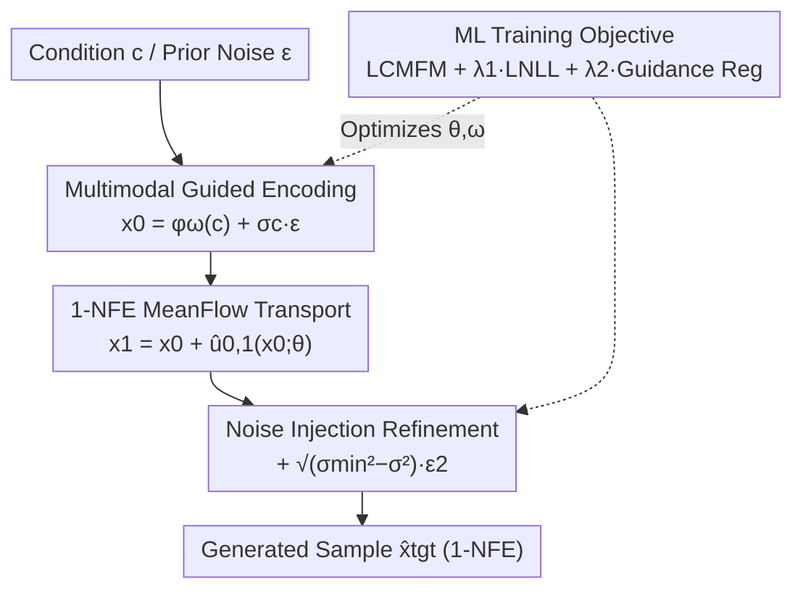

# RMFlow: Refined Mean Flow by a Noise-Injection Step for Multimodal Generation

**Conference**: ICLR 2026  
**arXiv**: [2602.00849](https://arxiv.org/abs/2602.00849)  
**Code**: None  
**Area**: Diffusion Models / One-step Generation / Mean Flow Enhancement  
**Keywords**: mean flow, noise injection refinement, 1-NFE, likelihood maximization, multimodal generation  

## TL;DR
RMFlow is proposed to compensate for 1-NFE transport errors in MeanFlow by incorporating a noise-injection refinement step. By adding a maximum likelihood objective during training to minimize the KL divergence between the learned and target distributions, it achieves near-SOTA 1-NFE results across T2I, molecule generation, and time-series generation.

## Background & Motivation

**Background**: MeanFlow achieves few-step generation by learning an average velocity field without requiring pre-training or distillation. However, performance drops significantly at 1-NFE because single-step transport is imprecise, causing generated samples to deviate from the target distribution.

**Limitations of Prior Work**: 1-NFE MeanFlow exhibits large biases on Gaussian mixture distributions and generates invalid structures (e.g., fragmented molecules) in molecule generation. While multi-step (8/32 NFE) results are better, they lose the efficiency advantage.

**Key Challenge**: The deterministic output of 1-NFE transport deviates from the true distribution (due to approximation errors in the mean velocity), yet increasing the NFE is undesirable.

**Goal**: To improve the generation quality of MeanFlow while maintaining 1-NFE efficiency.

**Key Insight**: Treat 1-NFE as a "coarse transport" followed by a noise-injection "refinement" step. This essentially transforms the deterministic output of MeanFlow into a probabilistic one, using noise to compensate for transport errors. An additional maximum likelihood objective is introduced during training to minimize KL divergence.

**Core Idea**: Deterministic output of 1-NFE MeanFlow + Gaussian noise injection $\approx$ a better approximation of the target distribution.

## Method

### Overall Architecture

RMFlow addresses the issue where 1-NFE MeanFlow transport is too coarse, causing samples to deviate from the target distribution without increasing NFE. The framework explicitly splits generation into "coarse transport + noise refinement" stages, supported by a guidance encoder for cross-modal tasks. A sample follows this path: the condition $c$ is embedded via an encoder to obtain the prior $x_0$; 1-NFE MeanFlow transports $x_0$ to an intermediate state $x_1$; finally, noise injection yields the final sample. These stages are consolidated into a single-step formula:

$$\hat{x}_{\text{tgt}} = x_0 + \hat{u}_{0,1}(x_0;\theta) + \sqrt{\sigma_{\min}^2-\sigma^2}\,\epsilon_2,\quad \epsilon_2\sim\mathcal{N}(\mathbf{0},I),$$

where $\hat{u}_{0,1}$ is the average velocity field learned by MeanFlow (one network evaluation). The noise term is added in parallel with almost zero overhead, maintaining 1-NFE efficiency. Training jointly optimizes the velocity field (Wasserstein control), the terminal distribution (KL control), and guidance encoding constraints.

### Key Designs

**1. Multimodal Guided Encoding: Unified framework for conditional and unconditional generation**

MeanFlow is inherently unconditional. To support cross-modal generation (T2I, context-to-molecule, time series), RMFlow incorporates condition signals via an encoder $\phi_\omega(c)$ to construct the prior: $x_0=\phi_\omega(c)+\sigma_c\epsilon$ for conditional generation ($\sigma_c\ll1$, e.g., $10^{-3}$), and $x_0=\epsilon$ for unconditional generation. This allows the same MeanFlow to operate from either "noise near conditional embeddings" or pure Gaussian noise. The encoder and MeanFlow are trained jointly. (Remark 1: Guided encoding and noise injection are the two primary distinctions from vanilla MeanFlow).

**2. Noise Injection Refinement: Softening deterministic point estimates into distributions**

The output $x_0+\hat{u}_{0,1}$ of 1-NFE MeanFlow is a deterministic point. Since the average velocity is only an approximation, single-step transport inevitably carries errors, leading to systematic deviations from the target—high TV in Gaussian mixtures or fragmented structures in molecules. RMFlow splits generation: Stage 1 transports the prior to an intermediate state $x_1=x_{\text{data}}+\sigma\epsilon_1$ ($\sigma<\sigma_{\min}$); Stage 2 injects noise $x_{\text{tgt}}=x_1+\sqrt{\sigma_{\min}^2-\sigma^2}\,\epsilon_2$ to reach the terminal variance $\sigma_{\min}^2$. This "softens" the hard error of the model's prediction into a distribution centered at the transport result with variance $\sigma_{\min}^2-\sigma^2$, covering the true modes rather than being stuck at a biased point.

**3. Likelihood Maximization: Theoretical grounding for noise injection via KL**

Noise injection ensures the final sample follows a conditional Gaussian $\hat{x}_{\text{tgt}}\mid x_0\sim\mathcal{N}\big(x_0+\hat{u}_{0,1},(\sigma_{\min}^2-\sigma^2)I\big)$. Its log-likelihood is a squared error term, defining the negative log-likelihood (NLL) loss:

$$\mathcal{L}_{\text{NLL}} = \mathbb{E}\big[\|(x_{\text{data}}+\sigma_{\min}\epsilon)-(x_0+\hat{u}_{0,1}(x_0;\theta))\|^2\big].$$

Theorem 4.1 proves that $-A\cdot\mathcal{L}_{\text{NLL}}+C$ is a lower bound of the expected log-likelihood $-H(p_{\text{tgt}})-D_{\text{KL}}(p_{\text{tgt}}\|p_\theta)$. Thus, minimizing $\mathcal{L}_{\text{NLL}}$ reduces the KL divergence between the learned and target distributions, supplementing the Wasserstein distance $W_2^2(p_{\text{tgt}},p_\theta)$ constraint provided by the standard MeanFlow loss $\mathcal{L}_{\text{CMFM}}$.

### Loss & Training

The final objective is a weighted combination of three terms:

$$\mathcal{L}_{\text{RMFlow}}(\theta,\omega)=\underbrace{\mathcal{L}_{\text{CMFM}}}_{\text{Wasserstein Control}}+\lambda_1\underbrace{\mathcal{L}_{\text{NLL}}}_{\text{KL Control}}+\lambda_2\underbrace{\mathbb{E}_{(x_{\text{data}},c)}[\|\phi_\omega(c)\|^2]}_{\text{Guidance Reg}}.$$

$\mathcal{L}_{\text{CMFM}}$ constrains the probability path, $\mathcal{L}_{\text{NLL}}$ constrains the terminal distribution, and $\lambda_2$ regularizes the guidance encoding. For large-scale tasks (e.g., T2I), a two-stage training is used: first train MeanFlow normally, then introduce NLL refinement during a PEFT/LoRA fine-tuning stage to reduce overhead.

## Key Experimental Results

### Main Results

| Method | NFE | Mixture Gaussian TV ↓ | QM9 Molecule Stability ↑ |
|------|-----|---------------------|----------------|
| MeanFlow | 1 | 1.44 | Low (fragmented) |
| MeanFlow | 8 | 0.80 | Medium |
| MeanFlow | 32 | 0.67 | High |
| **RMFlow** | **1** | **0.76** | **Near 32-NFE** |

T2I (COCO FID-30K): RMFlow achieves FID comparable to Distilled SD and StyleGAN-T without requiring auxiliary models.

### Key Findings
- 1-NFE RMFlow outperforms 8-NFE MeanFlow (TV 0.76 vs 0.80) and approaches 32-NFE quality.
- Noise injection effectively prevents structural fragmentation in molecule generation.
- Training cost is comparable to MeanFlow (noise injection has near-zero inference overhead).

## Highlights & Insights
- **Minimalist Improvement**: Simply adding $\sigma\epsilon$ significantly improves 1-NFE quality by shifting from point estimation to distribution estimation.
- **Multimodal Generality**: The framework handles images, molecules, and time series, suggesting noise-injection refinement is a modality-agnostic technique.
- **Theoretical Grounding**: Provides a principled explanation for noise injection by linking the NLL loss to KL divergence.

## Limitations & Future Work
- The noise injection parameter $\sigma$ is a hyperparameter requiring tuning.
- T2I experiments utilize COCO and a smaller U-Net; validation on ImageNet or larger models is missing.
- Lack of direct comparison with recent one-step methods like SoFlow or TwinFlow.
- Uncertainty remains if noise injection is beneficial across all tasks; it might introduce blur in high-dimensional images.

## Related Work & Insights
- **vs MeanFlow**: 1-NFE RMFlow > 8-NFE MeanFlow; core improvements are noise injection and NLL loss.
- **vs SoFlow**: Different approaches; SoFlow learns the solution function, whereas RMFlow learns average velocity with refinement.

## Rating
- Novelty: ⭐⭐⭐ (Simple idea, but first application to MeanFlow)
- Experimental Thoroughness: ⭐⭐⭐⭐ (Validated on multiple modalities, though image scale is small)
- Writing Quality: ⭐⭐⭐⭐ (Clear, structured, and mathematically rigorous)
- Value: ⭐⭐⭐⭐ (Provides a simple and effective solution to improve MeanFlow)

<!-- RELATED:START -->

## Related Papers

- [\[CVPR 2026\] Stable Mean Flow: Lyapunov-Inspired One-Step Flow Matching](../../CVPR2026/image_generation/stable_mean_flow_lyapunov-inspired_one-step_flow_matching.md)
- [\[CVPR 2026\] Functional Mean Flow in Hilbert Space](../../CVPR2026/image_generation/functional_mean_flow_in_hilbert_space.md)
- [\[ICLR 2026\] CMT: Mid-Training for Efficient Learning of Consistency, Mean Flow, and Flow Map Models](cmt_mid-training_for_efficient_learning_of_consistency_mean_flow_and_flow_map_mo.md)
- [\[ICLR 2026\] Flow Matching with Injected Noise for Offline-to-Online Reinforcement Learning](flow_matching_with_injected_noise_for_offline-to-online_reinforcement_learning.md)
- [\[ICLR 2026\] ReDDiT: Rehashing Noise for Discrete Visual Generation](reddit_rehashing_noise_for_discrete_visual_generation.md)

<!-- RELATED:END -->
