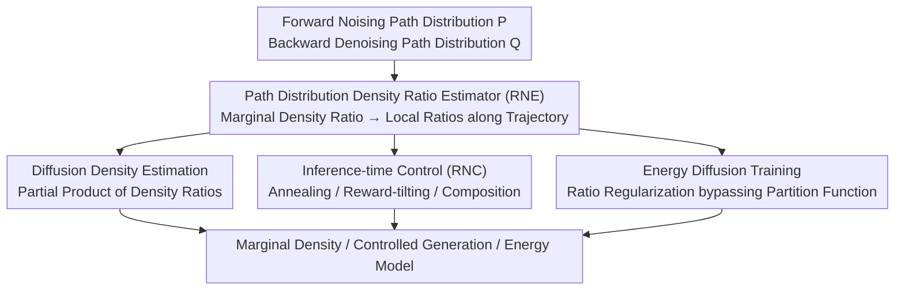

# RNE: plug-and-play diffusion inference-time control and energy-based training

**Conference**: ICLR 2026  
**arXiv**: [2506.05668](https://arxiv.org/abs/2506.05668)  
**Code**: None  
**Area**: Image Generation / Diffusion Models  
**Keywords**: Diffusion models, density ratio estimation, inference-time control, energy-based training, Radon-Nikodym derivative

## TL;DR

The Radon-Nikodym Estimator (RNE) is proposed. Based on the density ratio between path distributions, it reveals the fundamental connection between marginal densities and transition kernels, providing a unified plug-and-play framework for diffusion density estimation, inference-time control, and energy-based training.

## Background & Motivation

Diffusion models generate data through step-wise denoising, corresponding to the time-reversal of a noising process. In many applications, merely obtaining denoising kernels is insufficient; knowing the **marginal densities** along the generation trajectory is required. Knowledge of marginal densities supports:

**Density Estimation**: Evaluating the probability density of a generative model at any point.

**Inference-time Control**: Dynamically guiding outputs during generation, such as conditional generation or composing multiple models.

**Energy-based Training**: Training energy functions to parameterize diffusion models.

However, obtaining the marginal density of diffusion models has been a long-standing challenge:
- Direct calculation requires integrating over all possible forward paths, which is computationally infeasible.
- Existing methods (e.g., likelihood estimation via ODE probability flows) are computationally expensive or lack precision.
- Inference-time control methods often require specific assumptions (e.g., Tweedie's formula approximations), limiting their scope.

**Key Insight**: By utilizing the concept of the Radon-Nikodym derivative (density ratio), a fundamental mathematical connection can be established between marginal densities and transition kernels. This connection requires no additional model training and does not depend on specific diffusion model architectures.

## Method

### Overall Architecture

Diffusion models generate data through step-wise denoising, but many applications require the **marginal density** along the generation trajectory. Directly calculating this requires integrating over all forward paths, which is computationally infeasible. RNE addresses this by treating the entire trajectory as a single object and comparing the forward (noising) path distribution $\mathbb{P}$ and the backward (denoising) path distribution $\mathbb{Q}$. Using the Radon-Nikodym derivative, the density ratio between the two can be expressed entirely using known transition kernels and naturally decomposes into local ratios multiplied along the trajectory. This density ratio estimator (RNE) serves as the engine of the framework, unifying three seemingly unrelated tasks—density estimation, inference-time control, and energy training—into the estimation and manipulation of the same density ratio. Since the derivation relies only on the abstraction of "path distributions," it applies equally to both continuous and discrete diffusion.

### Key Designs

**1. Path Distribution Density Ratio Estimation (RNE): Converting Intractable Global Marginal Density into Computable Local Ratios**

The root of the marginal density problem is the need to integrate over all forward paths. RNE avoids the marginal density itself and instead examines the ratio of two complete path distributions. For a forward process $q(x_0, x_1, \dots, x_T)$ and a backward process $p(x_T, x_{T-1}, \dots, x_0)$, the Radon-Nikodym derivative links them directly:

$$\frac{d\mathbb{Q}}{d\mathbb{P}}(x_{0:T}) = \frac{p(x_T) \prod_{t=1}^{T} p_\theta(x_{t-1}|x_t)}{q(x_0) \prod_{t=1}^{T} q(x_t|x_{t-1})}.$$

This ratio naturally decomposes into a product of step-wise local ratios, where each step involves only known transition kernels and requires no additional trained models. The theoretical foundation is the fact that a diffusion process and its **exact time-reversal** induce the same path measure, making their RN derivative equal to 1. This allows marginal density ratios to be derived from transition kernels. Since the derivation depends only on the path distribution abstraction and not on the continuity of the state space, RNE is applicable to both continuous and discrete diffusion (e.g., discrete denoising for text).

**2. Diffusion Density Estimation: Reading Marginal Density via Partial Products of Ratios**

With the path density ratio, the marginal density of state $x_t$ at any intermediate time $t$ can be estimated using the **partial product** of the path density ratio. This process reuses the transition kernels of the diffusion model itself without requiring a separate density model. In practice, Monte Carlo sampling in the path space approximates this ratio, making the evaluation of probability density at any point achievable using existing models.

**3. Inference-time Control (RNC): Unifying Annealing, Reward-tilting, and Composition via Importance Sampling Correction**

As a plug-and-play module for frozen pre-trained models, RNE guides sampling from an original distribution $p_0$ to a target $q_0$ without weight modification. The paper unifies multiple control methods: **Annealing** ($q_0 \propto p_0^{\,t}$ for temperature adjustment), **Reward-tilting/Posterior Sampling** ($q_0 \propto p_0 \exp(r)$ reweighting by reward or likelihood $r$), and **Composition** (multiplying density ratios from multiple models). The Radon-Nikodym Corrector (RNC) implements this; instead of high-variance importance sampling at the endpoint, RNC use Sequential Monte Carlo (SMC) to **spread importance weights across the trajectory** through step-wise resampling. Since control strength scales with the number of sampled paths, RNE naturally supports inference-time scaling.

**4. Energy Diffusion Training: Bypassing Partition Functions via Ratio Regularization**

Traditional energy-based diffusion training is hindered by the difficulty of estimating the partition function. RNE uses the density ratio as a regularization term to constrain energy function training. By ensuring the learned energy is consistent with the true density ratio, explicit partition function estimation is avoided, significantly simplifying the training pipeline.

### Loss & Training

RNE requires no additional training for inference-time control: pre-trained models are frozen, and sampling trajectories are adjusted via RNC density ratio correction. In energy diffusion training scenarios, it acts as an auxiliary regularizer—adding RNE-based regularization atop standard denoising loss to keep the energy function consistent with the true density ratio.

## Key Experimental Results

### Main Results

| Task | Method | Key Metrics | Description |
|------|------|----------|------|
| Annealed Sampling | RNE | Superior to standard methods | More accurate conditional sampling |
| Model Composition | RNE | High quality in multi-condition generation | Composing multiple pre-trained models |
| Inference-time Scaling | RNE | Performance scales with computation | Validation of scaling characteristics |
| Energy Diffusion Training | RNE Regularization | Simple and efficient | No partition function estimation needed |

### Ablation Study

| Configuration | Key Metrics | Description |
|------|----------|------|
| Without RNE Density Estimation | Inaccurate density estimation | Lacks path-level density ratio information |
| With RNE | Improved density estimation accuracy | Utilizes complete transition kernel information |
| Continuous Diffusion | Validated effective | Standard scenario |
| Discrete Diffusion | Equally effective | Validates modality agnosticism |

### Key Findings

1. **Unified Framework for Inference-time Control**: RNE unifies seemingly different methods like annealing and model composition under a density ratio perspective.
2. **Inference-time Scaling**: Increasing computational budget (more sampling paths) consistently improves control precision, aligning with test-time compute scaling trends.
3. **Simplified Energy Training**: RNE regularization bypasses the difficulty of partition function estimation in traditional energy-based models.
4. **Modality Generality**: The effectiveness of RNE is validated across both continuous and discrete diffusion models.

## Highlights & Insights

1. **Theoretical Elegance**: Leverages the Radon-Nikodym derivative to establish a unified link between three independent issues in diffusion models: density estimation, inference control, and energy training.
2. **Plug-and-play Design**: Requires no modification to pre-trained models and no additional control networks (like ControlNet), significantly lowering the barrier to entry.
3. **Innovative Path Distribution Perspective**: Operates at the distribution level of complete trajectories rather than single-step transitions, providing a higher level of abstraction.
4. **Inference-time Scaling**: Echoes current AI community interests in test-time compute and inference-time scaling.
5. **Discrete Diffusion Applicability**: Extends the framework's scope, offering potential value for discrete sequences like text and proteins.

## Limitations & Future Work

1. **Variance in Monte Carlo Estimation**: Density ratio estimation in path space may exhibit high variance, especially in long diffusion trajectories.
2. **Computational Cost**: While no extra training is needed, the requirement for multiple path samplings during inference increases latency.
3. **Insufficient Large-scale Visual Validation**: Validation on large-scale models like Stable Diffusion or DALL-E is still required.
4. **Systematic Comparison with Existing Methods**: Detailed comparisons with Classifier Guidance, Classifier-Free Guidance, DPS, etc., are needed.
5. **Theory-Practice Gap**: The framework assumes exact kernels, while practical applications use learned approximations; the impact of approximation error requires deeper analysis.

## Related Work & Insights

- **Diffusion Density Estimation**: Compared to Continuous Normalizing Flow (CNF) methods by Song et al., RNE operates directly on path distributions without solving ODEs.
- **Inference-time Control**: Complementary to Classifier Guidance (Dhariwal & Nichol, 2021), DPS (Chung et al., 2022), and FreeDoM (Yu et al., 2023), but provides a more unified theoretical perspective.
- **Energy-based Models**: Complements EBM-based diffusion training by simplifying the partition function estimation problem.
- **Insight**: RNE demonstrates the power of thinking about generative models at the distribution level rather than the point level, which may inspire further unified frameworks.

## Rating

- Novelty: ⭐⭐⭐⭐⭐ — Unifying three independent problems using the Radon-Nikodym derivative is a highly original theoretical contribution.
- Experimental Thoroughness: ⭐⭐⭐ — Concept validation is sufficient, but large-scale validation is lacking.
- Writing Quality: ⭐⭐⭐⭐ — Clear theory and a unified framework.
- Value: ⭐⭐⭐⭐ — The plug-and-play nature and theoretical unification hold significant practical and academic value.

<!-- RELATED:START -->

## Related Papers

- [\[ICLR 2026\] Inference-Time Scaling of Diffusion Models Through Classical Search](inference-time_scaling_of_diffusion_models_through_classical_search.md)
- [\[ICLR 2026\] Diffusion Blend: Inference-Time Multi-Preference Alignment for Diffusion Models](diffusion_blend_inference-time_multi-preference_alignment_for_diffusion_models.md)
- [\[ICLR 2026\] Scalable Energy-Based Models via Adversarial Training: Unifying Discrimination and Generation](scalable_energy-based_models_via_adversarial_training_unifying_discrimination_an.md)
- [\[ICLR 2026\] Compositional Visual Planning via Inference-Time Diffusion Scaling](compositional_visual_planning_via_inference-time_diffusion_scaling.md)
- [\[CVPR 2026\] PromptLoop: Plug-and-Play Prompt Refinement via Latent Feedback for Diffusion Model Alignment](../../CVPR2026/image_generation/promptloop_plug-and-play_prompt_refinement_via_latent_feedback_for_diffusion_mod.md)

<!-- RELATED:END -->
