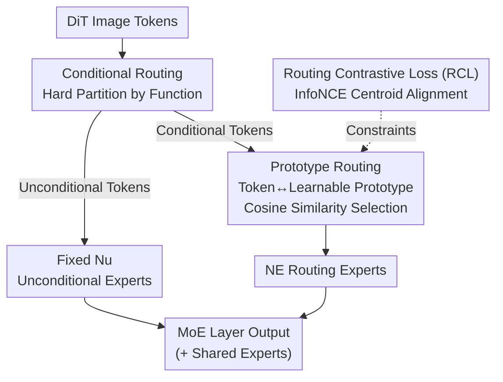

# Routing Matters in MoE: Scaling Diffusion Transformers with Explicit Routing Guidance

**Conference**: ICLR 2026  
**arXiv**: [2510.24711](https://arxiv.org/abs/2510.24711)  
**Code**: [https://github.com/ali-vilab/ProMoE](https://github.com/ali-vilab/ProMoE)  
**Area**: Diffusion Models / Mixture-of-Experts  
**Keywords**: Mixture-of-Experts, DiT, Explicit Routing Guidance, Prototype Routing, Routing Contrastive Loss

## TL;DR

ProMoE is proposed as a Mixture-of-Experts framework for Diffusion Transformers. By employing a two-step router (conditional routing + prototype routing) and a routing contrastive loss, it providing explicit semantic guidance to promote expert specialization. It significantly outperforms existing MoE and dense models on ImageNet.

## Background & Motivation

While MoE has achieved significant success in LLMs, its performance in DiT has been underwhelming:
- DiT-MoE (token-choice routing) performance is even inferior to dense models.
- EC-DiT (expert-choice routing) yields only marginal gains.
- DiffMoE (global token distribution routing) shows limited improvement.

**Analysis of Root Causes**: Fundamental differences exist between linguistic and visual tokens:

**High Spatial Redundancy**: Visual tokens are continuous, spatially coupled, and highly redundant (the inter/intra-class distance ratio is only 0.748 vs. 19.283 in LLMs), leading experts to learn homogeneous features.

**Functional Heterogeneity**: CFG introduces two types of inputs with distinct functional roles—conditional and unconditional. Naive MoE fails to treat them separately.

## Method

### Overall Architecture

ProMoE introduces a two-step router before each MoE layer in DiT. It first splits tokens into unconditional and conditional branches based on their functional roles. Learnable prototypes are then used to select experts for conditional tokens. Finally, a routing contrastive loss constrains the prototypes externally, forcing the same expert to focus on similar patterns while pushing different experts apart. This design simultaneously achieves intra-expert consistency (the same expert consistently processes similar patterns) and inter-expert diversity (different experts specialize in different tasks).

### Key Designs

**1. Conditional Routing: Separating tokens by functional role**  
CFG training results in batches containing both conditional inputs and unconditional inputs (via empty labels/text). Their functions differ drastically; naive MoE mixing them in the same softmax router causes signal contamination. ProMoE performs a hard partition in the first step: unconditional tokens $\mathbf{X}_u$ are sent to fixed $N_u$ unconditional experts, while only conditional tokens $\mathbf{X}_c$ proceed to prototype routing. The forward pass is defined as:

$$\text{MoE}(\mathbf{x}) = \underbrace{\sum_{i=1}^{N_s} E_i^S(\mathbf{x})}_{\text{Shared}} + \begin{cases}\sum_{j=1}^{N_E}\mathbf{G}_j E_j(\mathbf{x}) & \mathbf{x} \in \mathbf{X}_c \\ \sum_{k=1}^{N_u}E_k^U(\mathbf{x}) & \mathbf{x} \in \mathbf{X}_u\end{cases}$$

$N_s$ shared experts participate in both paths to handle common features. This prevents unconditional tokens from competing for routing expert capacity, allowing routing experts to focus on distinct conditional semantics.

**2. Prototype Routing: Using learnable prototypes as semantic anchors**  
Visual tokens are highly redundant, with an inter/intra-class distance ratio of only 0.748, making it difficult for linear routers to learn discriminative subspaces. ProMoE assigns a learnable prototype $\mathbf{p}_j \in \mathbb{R}^D$ to each expert. Matching is calculated via cosine similarity: $\mathbf{Z}_{i,j} = \alpha \frac{\mathbf{x}_i \mathbf{p}_j^\top}{\|\mathbf{x}_i\| \|\mathbf{p}_j\|}$. An identity mapping $\mathcal{A}(\mathbf{Z}) = \mathbf{Z}$ is intentionally chosen as the activation function over softmax or sigmoid to prevent similarity compression. Prototypes explicitly parameterize "what semantics the expert represents," providing a supervised target for routing.

**3. Routing Contrastive Loss (RCL): Enforcing semantic separation and load balancing**  
To prevent prototypes from collapsing into similar directions, RCL calculates a centroid $\mathbf{m}_i$ for all tokens assigned to expert $E_i$. It uses an InfoNCE-style loss to pull each prototype toward its own centroid while pushing it away from others:

$$\mathcal{L}_{\text{RCL}} = -\frac{1}{N_a}\sum_{i=1}^{N_a}\log\frac{\exp(\text{sim}(\mathbf{p}_i, \mathbf{m}_i)/\tau)}{\sum_{j=1}^{N_a}\exp(\text{sim}(\mathbf{p}_i, \mathbf{m}_j)/\tau)}$$

The temperature $\tau$ controls the sharpness of separation. This method is more flexible than classification-based guidance and more robust than offline K-Means. The repulsion term naturally distributes tokens across experts, eliminating the need for traditional load balancing losses.

### Loss & Training

The total objective adds the weighted RCL to the diffusion loss:

$$\mathcal{L} = \mathcal{L}_{\text{diffusion}} + \lambda_{\text{RCL}} \mathcal{L}_{\text{RCL}}$$

The framework is compatible with both DDPM and Rectified Flow training paradigms.

## Key Experimental Results

### Main Results (Rectified Flow, 500K steps)

| Model | Active Params | Total Params | FID↓ (cfg=1.0) | FID↓ (cfg=1.5) |
|------|---------|-------|---------------|---------------|
| Dense-DiT-B | 130M | 130M | 30.61 | 9.02 |
| ProMoE-B | 130M | 300M | 24.44 | 6.39 |
| Dense-DiT-L | 458M | 458M | 15.44 | 3.56 |
| ProMoE-L | 458M | 1.063B | 11.61 | 2.79 |
| Dense-DiT-XL | 675M | 675M | 13.38 | 3.23 |
| ProMoE-XL | 675M | 1.568B | 9.44 | 2.59 |

ProMoE-L outperforms Dense-DiT-XL while using fewer active parameters (458M vs 675M).

### Semantic Guidance Verification

| Method | FID↓ (cfg=1.5) | IS↑ |
|------|---------------|-----|
| Dense-DiT-B | 9.02 | 131.13 |
| DiT-MoE-B | 8.94 | 131.66 |
| DiffMoE-B | 8.22 | 137.46 |
| Class-based Routing Guidance | **5.91** | **165.45** |
| K-Means Routing Guidance | 6.24 | 159.77 |

Both explicit and implicit semantic guidance lead to significant improvements, confirming that visual MoE requires semantic guidance.

### Comparison with MoE Baselines

Ours outperforms DiT-MoE, EC-DiT, and DiffMoE across all scales and training paradigms (DDPM/RF).

### Key Findings

- The core bottleneck for visual MoE is expert homogenization (subspaces are highly similar without guidance).
- Conditional routing effectively eliminates functional heterogeneity interference.
- RCL is flexible, requiring no human labels, and is more robust than K-Means.
- The repulsion mechanism in RCL naturally replaces traditional load balancing losses.

## Highlights & Insights

- Deep analysis of the root causes behind the MoE performance gap between vision and language.
- The two-step routing + contrastive loss design is simple, effective, and generalizable to other visual MoE applications.
- Exceptional parameter efficiency: fewer active parameters outperform larger dense models.
- Validated effectiveness across both DDPM and Rectified Flow paradigms.

## Limitations & Future Work

- Evaluation is limited to class-conditioned ImageNet; performance on complex scenarios like text-to-image is not yet verified.
- Conditional routing requires CFG during inference, making it inapplicable to non-CFG scenarios.
- Computational overhead of clustering and contrastive learning is not analyzed in detail.
- Total parameter count is approximately 2.3x that of dense models.

## Related Work & Insights

- **DiT MoE**: DiT-MoE, EC-DiT, and DiffMoE represent prior attempts at visual MoE.
- **LLM MoE**: Successful applications in language, such as DeepSeek-MoE and Mixtral.
- **Diffusion Models**: DiT, SiT, and other Transformer-based diffusion architectures.

## Rating

- Novelty: ⭐⭐⭐⭐⭐ — Deep analysis combined with a novel two-step routing and RCL approach.
- Technicality: ⭐⭐⭐⭐ — Rigorous experimental design with thorough ablation.
- Experimental Thoroughness: ⭐⭐⭐⭐ — Multi-scale and multi-paradigm validation.
- Value: ⭐⭐⭐⭐⭐ — Provides a clear direction for scaling visual MoE.

<!-- RELATED:START -->

## Related Papers

- [\[ICLR 2026\] Scaling Laws for Diffusion Transformers](scaling_laws_for_diffusion_transformers.md)
- [\[CVPR 2026\] CARE-Edit: Condition-Aware Routing of Experts for Contextual Image Editing](../../CVPR2026/image_generation/care-edit_condition-aware_routing_of_experts_for_contextual_image_editing.md)
- [\[ICLR 2026\] LazyDrag: Enabling Stable Drag-Based Editing on Multi-Modal Diffusion Transformers via Explicit Correspondence](lazydrag_enabling_stable_drag-based_editing_on_multi-modal_diffusion_transformer.md)
- [\[ICLR 2026\] Guidance Matters: Rethinking the Evaluation Pitfall for Text-to-Image Generation](guidance_matters_rethinking_the_evaluation_pitfall_for_text-to-image_generation.md)
- [\[CVPR 2026\] MapRoute: Semantic Routing for Precise Concept Erasure with Mapper](../../CVPR2026/image_generation/maproute_semantic_routing_concept_erasure.md)

<!-- RELATED:END -->
