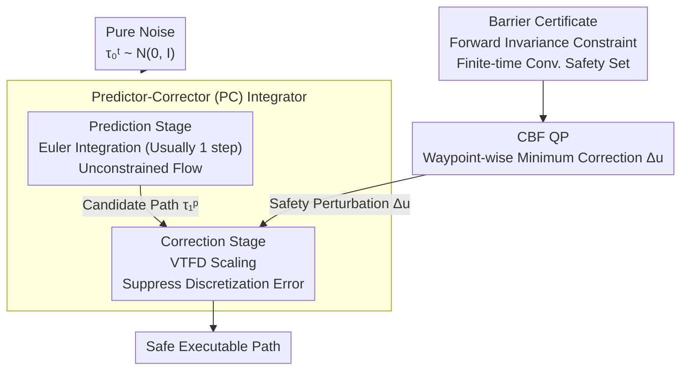

# SafeFlowMatcher: Safe and Fast Planning using Flow Matching with Control Barrier Functions

**Conference**: ICLR 2026  
**arXiv**: [2509.24243](https://arxiv.org/abs/2509.24243)  
**Code**: See project page  
**Area**: Image Generation  
**Keywords**: Flow Matching, Control Barrier Functions (CBF), Safe Planning, Predictor-Corrector Integrator, Finite-time convergence

## TL;DR

SafeFlowMatcher is proposed as a safe planning framework that combines flow matching with Control Barrier Functions (CBF). It decouples path generation from safety certification via a Predictor-Corrector (PC) integrator, maintaining the efficiency of flow matching while providing formal safety guarantees.

## Background & Motivation

**Background**: Path planning based on generative models (Diffusion / Flow Matching) has shown impressive performance recently. however, deploying these to safety-critical scenarios like robotics faces two major challenges. First is the **lack of safety**—the sampling dynamics of these models are driven by implicitly learned rules without mechanisms to ensure generated paths do not violate obstacle constraints, leading to potential collisions. Second is the **efficiency bottleneck**—diffusion models require dozens of denoising iterations to sample a single path, which is too costly for real-time planning tasks.

**Limitations of Prior Work**: To add safety to generated paths, one approach is safety guidance (e.g., classifier guidance), which uses a data-driven proxy model to push sampling toward safe regions. However, this guidance is soft and empirical, depending on the proxy model's fit quality, failing to provide formal strong safety guarantees and potentially failing in out-of-distribution obstacle layouts.

**Key Challenge**: Another approach follows certification (e.g., SafeDiffuser), imposing Control Barrier Function (CBF) constraints directly on the intermediate latent states during denoising. The issue is **semantic mismatch**—certification truly cares about the final executed path, yet constraints are applied to intermediate states that are never executed and are merely artifacts of the denoising process. This misalignment **distorts the learned flow field** and creates **local traps**, where paths become entangled near obstacle boundaries and fail to reach the goal. Resolving how to maintain flow matching efficiency while providing formal safety guarantees for the executed path is the core challenge.

## Method

### Overall Architecture

SafeFlowMatcher decomposes path generation into two decoupled stages: first, an unconstrained flow matching model quickly predicts a candidate path; second, Control Barrier Functions (CBF) are applied to this candidate path for safety certification and correction. The prediction stage starts from pure noise and uses minimal-step Euler integration to obtain the candidate path, preserving generation efficiency. The correction stage starts from the candidate path, using Variable Time-scale Flow Dynamics (VTFD) to reduce discretization errors while solving a CBF Quadratic Program (QP) waypoint-by-waypoint according to barrier certificates to apply minimal safety perturbations. This pulls and locks the path into the safe set within finite time. The key insight is that safety constraints act only on the final executable path rather than intermediate latent states, thus preserving the efficiency of few-step flow matching while providing formal safety guarantees.

### Key Designs

**1. Predictor-Corrector (PC) Integrator: Decoupling Generation and Certification**

Existing certification methods (e.g., SafeDiffuser) apply CBF to intermediate latent states during denoising, but these states are never actually executed. Constraints distort the learned flow and trap paths near obstacle boundaries. The PC integrator follows a two-step process: the prediction stage starts from pure noise $\boldsymbol{\tau}_0^p \sim \mathcal{N}(0, I)$ and uses Euler integration (typically $T^p = 1$ step) to obtain a candidate path $\boldsymbol{\tau}_1^p = \Psi_{0 \to 1}^{(T^p)}(\boldsymbol{\tau}_0^p) = \boldsymbol{\tau}_1^\star + \varepsilon$, where $\varepsilon$ is discretization error; the correction stage then refines starting from $\boldsymbol{\tau}_0^c = \boldsymbol{\tau}_1^p$. Since safety constraints are delayed to the correction stage and applied only to the path to be executed, semantic mismatch and local traps are avoided.

The correction stage performs two tasks. First, Variable Time-scale Flow Dynamics (VTFD) reduces discretization error by rewriting the vector field as $\frac{d\boldsymbol{\tau}_t^c}{dt} = \alpha(1-t) v_t(\boldsymbol{\tau}_t^c; \theta) \triangleq \tilde{v}_t(\boldsymbol{\tau}_t^c; \theta)$. The factor $(1-t)$ asymptotically suppresses the vector field as $t \to 1$, creating a contraction effect. Lemma 3 proves that error decays as $\mathbf{e}_t = O((1-t)^2) + (\varepsilon + O(1))e^{-\alpha t}$. Second, it superimposes a CBF safety perturbation $\Delta\mathbf{u}_t$ to get the constrained correction dynamics $\frac{d\boldsymbol{\tau}_t^c}{dt} = \tilde{v}_t(\boldsymbol{\tau}_t^c; \theta) + \Delta\mathbf{u}_t$, where $\Delta\mathbf{u}_t$ is the minimum perturbation to keep the flow safe while staying close to the original flow.

**2. Barrier Certificate: Locking Safety with Finite-Time Invariance**

CBF perturbations alone are insufficient; proof is needed that they lock the path in the safe zone. A robust safe set is defined as $\mathcal{C}_\delta = \{\boldsymbol{\tau}^{c,k} \in \mathcal{D} \mid b(\boldsymbol{\tau}^{c,k}) \geq \delta\}$, where $b$ is the barrier function and $\delta$ is the safety margin. Theorem 1 (Forward Invariance) provides a sufficient condition: if the control $\mathbf{u}_t^k$ for each waypoint satisfies the barrier certificate $\nabla b(\boldsymbol{\tau}_t^{c,k})^\top \mathbf{u}_t^k + \epsilon \cdot \text{sgn}(b(\boldsymbol{\tau}_t^{c,k}) - \delta)|b(\boldsymbol{\tau}_t^{c,k}) - \delta|^\rho + w_t^k r_t^k \geq 0$, the flow remains invariant, meaning once a path enters the safe set, it does not exit. Furthermore, Proposition 1 gives a convergence time upper bound $T \leq t_w + \frac{(\delta - b(\boldsymbol{\tau}_{t_w}^{c,k}))^{1-\rho}}{\epsilon(1-\rho)}$, indicating that even if the initial candidate path slightly violates boundaries, it is pulled into the safe zone within finite steps rather than asymptotically. Relaxation weights $w_t^k$ provide numerical stability during early correction.

**3. CBF Quadratic Programming: Waypoint-wise Minimum Correction**

The barrier certificate constitutes a set of inequality constraints. In implementation, a Quadratic Program is solved independently for each waypoint: $\mathbf{u}_t^{k*} = \arg\min_{\mathbf{u}_t^k} \|\mathbf{u}_t^k - \tilde{v}_t^k\|^2 \;\text{s.t. CBF constraint}$. The goal is to keep the safe control $\mathbf{u}_t^k$ as close as possible to the original vector field $\tilde{v}_t^k$, thus applying minimal correction only when approaching boundaries. Decoupled solving across waypoints ensures overhead scales linearly with path length, matching the efficiency requirements of real-time planning.

## Key Experimental Results

### Background

- Maze Navigation (Maze2D)
- Motion Control (Locomotion)
- Robot Manipulation

### Main Results

SafeFlowMatcher compared to baseline methods:
- **Faster**: Flow matching generates high-quality paths in single or few steps.
- **Smoother**: PC integrator avoids path distortion caused by intermediate state constraints.
- **Safer**: CBF provides formal safety guarantees.

### Ablation Study

Verified the contributions of the PC integrator and barrier certificates:
- Removing correction stage → Safety decreases.
- Removing VTFD → Path quality decreases.
- Constraints on intermediate states → Local trap issues.

### Key Findings

- **Applying safety constraints only on the execution path** is the critical design—avoiding distribution shift and local traps.
- The decay factor in VTFD effectively reduces prediction error.
- CBF relaxation weights $w_t^k$ provide numerical stability during the early correction stage.

## Highlights & Insights

- Perfectly combines flow matching (efficiency) with CBF (safety certification) with solid theoretical grounding.
- The decoupled design of the PC integrator fundamentally solves the local trap problem pervasive in existing methods.
- Significant theoretical contributions: Forward invariance theorem + Finite-time convergence guarantees.
- High framework versatility: Applicable to scenarios with unknown dynamics and cost maps.

## Limitations & Future Work

- Construction of CBF depends on the definition of barrier function $b$, requiring further study for complex environments.
- Computational overhead of QP solving increases with the number of waypoints and constraints.
- Assumes the flow matching model is reasonably pre-trained.
- Verified only on specific tasks, not yet involving high-dimensional state spaces.

## Related Work

- **Flow Matching Planning**: FlowPolicy, EquiBot apply FM to robot control.
- **Safe Diffusion Planning**: SafeDiffuser imposes CBF constraints on intermediate states.
- **CBF Methods**: Finite-time convergence CBF, Learned CBF, etc.

## Rating

- Novelty: ⭐⭐⭐⭐⭐ — Elegant PC integrator decoupling design solves a key problem.
- Theory: ⭐⭐⭐⭐⭐ — Complete forward invariance and convergence proofs.
- Experimental Thoroughness: ⭐⭐⭐⭐ — Multi-task validation + sufficient ablations.
- Value: ⭐⭐⭐⭐ — Direct value for safety-critical robot deployment.

<!-- RELATED:START -->

## Related Papers

- [\[ICLR 2026\] Delay Flow Matching](delay_flow_matching.md)
- [\[ICLR 2026\] Flow Straight and Fast in Hilbert Space: Functional Rectified Flow](flow_straight_and_fast_in_hilbert_space_functional_rectified_flow.md)
- [\[ICLR 2026\] Flow Matching with Semidiscrete Couplings](flow_matching_with_semidiscrete_couplings.md)
- [\[ICLR 2026\] Carré du champ Flow Matching: 用几何感知噪声改善生成模型的质量-泛化权衡](carré_du_champ_flow_matching_better_quality-generalisation_tradeoff_in_generativ.md)
- [\[ICLR 2026\] Edit-Based Flow Matching for Temporal Point Processes](edit-based_flow_matching_for_temporal_point_processes.md)

<!-- RELATED:END -->
