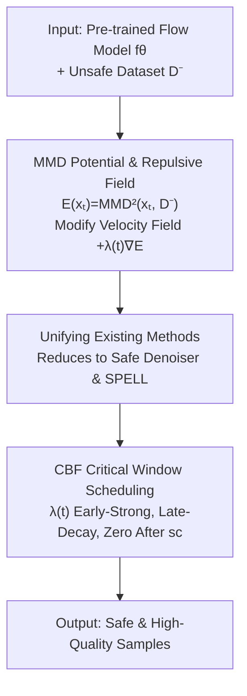

# Safety-Guided Flow (SGF): A Unified Framework for Negative Guidance in Safe Generation

**Conference**: ICLR 2026  
**OpenReview**: [https://openreview.net/forum?id=EA80Zib9UI](https://openreview.net/forum?id=EA80Zib9UI)  
**Code**: None  
**Area**: Diffusion Models / Safe Generation  
**Keywords**: Negative Guidance, MMD Potential Function, Control Barrier Function, Critical Time Window, Flow Matching

## TL;DR
This paper unifies two "negative guidance" safe generation methods (Shielded Diffusion and Safe Denoiser) under an energy framework based on the Maximum Mean Discrepancy (MMD) potential function. Leveraging Control Barrier Function (CBF) theory, it mathematically proves that applying negative guidance only within an early "critical time window" of denoising and decaying it to zero thereafter effectively ensures safety while maintaining image quality.

## Background & Motivation
**Background**: There are currently two distinct technical routes for achieving "safe generation" (e.g., avoiding nudity, preventing training data replication, maintaining diversity) in diffusion/flow matching models. One originates from robotics planning, using Control Barrier Functions (CBF) to project trajectories outside a safety set at each denoising step, which offers clear geometric constraints but is applied mandatorily at every step. The second route involves training-free "negative guidance" in image generation, represented by Shielded Diffusion (SPELL), which uses sparse radial repulsion to push predicted clean samples away from a "protected set," and Safe Denoiser, which decomposes the denoiser into safe/unsafe components and subtracts the unsafe part.

**Limitations of Prior Work**: Both routes have issues. CBF-based methods are effective for low-dimensional robot states but are not derived from a probabilistic generation perspective, failing to characterize safety as a semantic property of a distribution; furthermore, they enforce guidance at all time steps without analyzing when it is truly necessary. Negative guidance methods, while training-free and practical, rely on heuristic schedules for "repulsion radius, strength, and timing"—the radius $r$ in SPELL requires manual tuning, and Safe Denoiser hardcodes guidance only for DDPM indices 780:1000 ($t\in[0.78,1]$) without a formal reach–avoid analysis justifying this interval.

**Key Challenge**: Stronger and more persistent negative guidance seemingly increases safety but severely compromises image quality (FID, precision)—a "strong potential function active throughout the process" distorts nearby normal modes. A trade-off exists between safety and quality, yet existing methods lack both the knowledge of "when to be strong" and theoretical guarantees for "when to turn off."

**Goal**: The objective is divided into two sub-problems: (1) Can a unified probabilistic framework be developed to incorporate both SPELL and Safe Denoiser as special cases of negative guidance? (2) Can it be theoretically proven that negative guidance should be strong early and weak late, providing a mathematical basis for the critical window?

**Key Insight**: The authors observe that negative guidance is essentially "pushing the current sample away from an unsafe distribution," which corresponds to the **gradient of a distance between distributions**. Consequently, they utilize MMD from Integral Probability Metrics as a potential function. When the MMD between the current sample (viewed as a Dirac delta) and an unsafe dataset $D^-$ is small (close), the potential is low, and the gradient ascent direction naturally generates a repulsive field.

**Core Idea**: Use the gradient of the MMD potential function as a unified negative guidance field added to the flow matching velocity field. Subsequently, CBF theory is employed to prove that applying this guidance strongly within an early critical window and decaying it thereafter ensures safety without sacrificing quality.

## Method

### Overall Architecture
SGF aims to modify the velocity field of flow matching to actively keep generation trajectories away from "negative samples" (unsafe data $D^-$) without retraining the model, acting only when necessary. The pipeline operates as follows: given the velocity field $f_\theta(x_t,t)$ of a pre-trained flow model and an unsafe dataset $D^-$, an additional repulsive force $\lambda(t)\nabla_x E(x_t)$ derived from the MMD potential function $E(x_t)$ is added at each sampling step. This unified field mathematically reduces to Safe Denoiser (kernel-weighted repulsion) and Shielded Diffusion (radial repulsion). The scheduling of guidance strength $\lambda(t)$ is determined by CBF theory, which dictates it should be strong in the critical window $[0, s_c]$ and zero thereafter.

### Key Designs

**1. MMD Potential Function and Repulsive Field: Formulation as an Energy Gradient**

Existing negative guidance methods use various heuristic formulas, lacking a unified theoretical foundation. This work returns to distributional distances: using an RBF kernel $k_\sigma(x,y)=\exp(-\|x-y\|^2/(2\sigma^2))$, the (biased) squared MMD estimate between the current sample $\{x_t\}$ and the unsafe set $D^-$ is defined as the potential function:

$$E(x_t)\equiv \widehat{\mathrm{MMD}}^2_{k_\sigma}(\{x_t\}, D^-)=k(x_t,x_t)+\tfrac{1}{N^2}\sum_{i,j}k(y_i,y_j)-\tfrac{2}{N}\sum_i k(x_t,y_i).$$

The flow matching velocity field is modified to $\dot{x}_t=f_\theta(x_t,t)+\lambda(t)\nabla_x E(x_t)$, where $\lambda(t)\ge 0$. As $x_t$ moves further from $D^-$, $E$ increases, meaning the $+\nabla E$ direction acts as a repulsive force. Expanding the gradient yields:

$$\nabla_{x_t}\widehat{\mathrm{MMD}}^2_{k_\sigma}(x_t,D^-)=\frac{2}{\sigma^2}Z(x_t)\Big[x_t-\sum_{i=1}^N w_i(x_t)\,y_i\Big],$$

where $Z(x_t)=\tfrac{1}{N}\sum_i k(x_t,y_i)$ and $w_i(x_t)=k(x_t,y_i)/(N Z(x_t))$. This form is highly interpretable: weights $w_i$ are proportional to kernel similarity $k(x_t,y_i)$; the more a sample resembles an unsafe sample $y_i$, the stronger it is pushed away, effectively driving $x_t$ from its nearest unsafe neighbors.

**2. Unification of Existing Methods: Safe Denoiser and Shielded Diffusion as Special Cases**

The authors prove two propositions to support their unification claim. Proposition 1 (Safe Denoiser): evaluating the MMD gradient field $u_t(x)=\lambda(t)\nabla_x\mathrm{MMD}^2_k(x,D^-)$ at the predicted clean sample $z_t\equiv\mathbb{E}[x_0|x_t]$ with a fixed bandwidth $\sigma_{\text{KDE}}$ yields the same kernel-weighted repulsive field as Safe Denoiser (up to a scalar). Proposition 2 (Radius–Bandwidth Matching): SPELL uses a radial threshold repulsion $F_{\text{rad}}$. For the Gaussian contribution of a single $y$, there exists a bandwidth $\sigma$ such that the magnitudes are equal at a distance $d_0 \in (0, r)$. These propositions subsume both radial and kernel-weighted repulsion into a single energy framework.

**3. CBF Critical Window Scheduling: Theoretical Proof for Early-Guidance**

The core theoretical contribution answers "when" guidance should be strong. Switching to forward time $s \in [0, 1]$, the dynamics are $\frac{dx}{ds}=\tilde f(s,x)+\beta(s)\nabla_x E(x)$. Assuming a $C^1$ control barrier function $h$ defines the safety set $S=\{h\ge0\}$, Theorem 2 provides a sufficient condition: if $e^{\int_0^{s_c}L}h(x_0)+\mu\bar I_L(s_c)\ge\delta$, then $h(x_{s_c})\ge\delta$ (safety margin reached by $s_c$), where the weight $\bar w_L(u)$ in the integral $\bar I_L(s_c)$ decreases as $u$ increases. 

This decreasing weight naturally leads to the "strong early, weak late" strategy: for a fixed guidance budget $\int_0^{s_c}\beta$, shifting intensity from a later time $u_2$ to an earlier $u_1 < u_2$ strictly increases the safety lower bound. Furthermore, if the guidance-free flow $\tilde f$ is already forward-invariant on $[s_c, 1]$, setting $\beta \equiv 0$ on this interval preserves safety while improving fidelity.

### Loss & Training
SGF is **entirely training-free**. It is a plug-and-play guidance method that only modifies the velocity field or data prediction during the sampling stage. Only the kernel bandwidth $\sigma$, guidance strength $\lambda$, and the early-stop window are adjustable; model weights remain unchanged. The negative set $D^-$ is directly extracted from unsafe images (e.g., 515 images from I2P with nudity probability > 0.6).

## Key Experimental Results

### Main Results
On safe generation for nudity prompts (attack prompts from Ring-A-Bell / UnlearnDiff / MMA-Diffusion, evaluating Attack Success Rate (ASR) via NudeNet and toxicity via TR), replacing Safe Denoiser with the proposed guidance consistently improved safety with negligible quality loss:

| Method | Ring-A-Bell ASR↓ | UnlearnDiff ASR↓ | MMA ASR↓ | COCO FID↓ | CLIP↑ |
|--------|------|------|------|------|------|
| SD-v1.4 (Original) | 0.797 | 0.809 | 0.962 | 25.04 | 31.38 |
| SAFREE | 0.278 | 0.353 | 0.601 | 25.29 | 30.98 |
| SAFREE + SafeDenoiser | 0.127 | 0.207 | 0.469 | 22.55 | 30.66 |
| **SAFREE + Ours** | **0.051** | **0.164** | **0.423** | 23.73 | 30.36 |

Using SAFREE as a base, ASR dropped by 59.8% / 20.8% / 9.8% relative to Safe Denoiser across the three sets, while COCO-30K FID and CLIP scores remained stable.

### Ablation Study
Diversity tasks (ImageNet "class-to-image", $\lambda=1.0$): Full-time guidance vs. Early-stop $[1.0, 0.78]$:

| Configuration | FID↓ | CLIP↑ | Precision↑ | Description |
|------|------|------|------|------|
| SPELL Full | 51.76 | 28.14 | 0.530 | Quality collapsed |
| SPELL Early-stop | 48.50 | 28.17 | 0.521 | Slightly better, still poor |
| Ours Full | 36.81 | 30.47 | 0.811 | Significantly better than SPELL |
| **Ours Early-stop** | **31.81** | **30.78** | **0.836** | FID dropped another 5 pts |

### Key Findings
- **Early-stop is the key to quality**: Across nudity suppression, diversity, and memorization, full-time guidance raises FID. Early stopping at $t=0.78$ maintains safety while returning FID to near-baseline levels, validating the "critical window" theory.
- **Timing ablation confirms "earlier is better"**: Scanning time windows shows that guidance in early stages (e.g., $[1.0, 0.8]$) is most effective for reducing ASR; shifting the window later significantly decreases safety.
- **MMD guidance is gentler**: Under equivalent early-stop conditions, Ours achieves much higher precision than SPELL (0.836 vs. 0.521), indicating that kernel-weighted repulsion distorts normal modes less.

## Highlights & Insights
- **Theoretically Unifying Heuristics**: By using the MMD potential as a unified "distance potential," the paper frames disparate formulas (radial and kernel repulsion) as special cases of its gradient.
- **CBF-based Scheduling**: Elevates Safe Denoiser’s empirical hardcoding to a mathematical proof. It strictly demonstrates that, for a fixed budget, earlier is safer, and turning guidance off late preserves quality.
- **Transferable Design**: The "distribution-level repulsion" using MMD/kernel potential gradients can be generalized to tasks like debiasing, unlearning, and style avoidance, with a built-in "early-strong" scheduling prior.

## Limitations & Future Work
- **Strong Theoretical Assumptions**: CBF analysis assumes the base drift $\tilde f$ has minimal impact within the boundary layer, which may not hold strictly throughout all denoising phases.
- **Dependence on $D^-$**: The method relies on a representative set of unsafe samples. If $D^-$ is incomplete or biased, the repulsive force direction may be suboptimal.
- **Hyperparameter Tuning**: While the theory provides direction, $\sigma$, $\lambda$, and $s_c$ still require task-specific tuning.
- **Image-only Validation**: Experiments are limited to text-to-image generation; the framework's effectiveness in robotics (where CBF originated) remains to be explored.

## Related Work & Insights
- **vs Shielded Diffusion (SPELL)**: SPELL relies on radius thresholds and manual scheduling; this work proves it is a special case of MMD gradients and provides the missing temporal window theory.
- **vs Safe Denoiser**: Safe Denoiser subtracts unsafe components using empirical windows; this work identifies it as an MMD gradient evaluated at $z_t$ and replaces empirical intervals with CBF-derived scheduling.
- **vs Safe Flow Matching (Robotics CBF)**: Those methods enforce CBF constraints at every step without a distributional link; this work uses CBF to **justify when not to apply guidance**.

## Rating
- Novelty: ⭐⭐⭐⭐⭐ Unifying two routes via MMD and proving windows via CBF is conceptually elegant.
- Experimental Thoroughness: ⭐⭐⭐⭐ Complete across nudity, diversity, and memorization, though limited to image tasks.
- Writing Quality: ⭐⭐⭐⭐ Clear derivations and well-stated unification propositions.
- Value: ⭐⭐⭐⭐ Provides a unified theory and provable scheduling for training-free safe generation.

<!-- RELATED:START -->

## Related Papers

- [\[ICLR 2026\] SafeFlowMatcher: Safe and Fast Planning using Flow Matching with Control Barrier Functions](safeflowmatcher_safe_and_fast_planning_using_flow_matching_with_control_barrier_.md)
- [\[ICLR 2026\] VSF: Simple, Efficient, and Effective Negative Guidance in Few-Step Image Generation Models By Value Sign Flip](vsf_simple_efficient_and_effective_negative_guidance_in_few-step_image_generatio.md)
- [\[ICLR 2026\] Source-Guided Flow Matching](source-guided_flow_matching.md)
- [\[ICLR 2026\] VLM-Guided Adaptive Negative Prompting for Creative Generation](vlm-guided_adaptive_negative_prompting_for_creative_generation.md)
- [\[ICLR 2026\] PosterCraft: Rethinking High-Quality Aesthetic Poster Generation in a Unified Framework](postercraft_rethinking_high-quality_aesthetic_poster_generation_in_a_unified_fra.md)

<!-- RELATED:END -->
