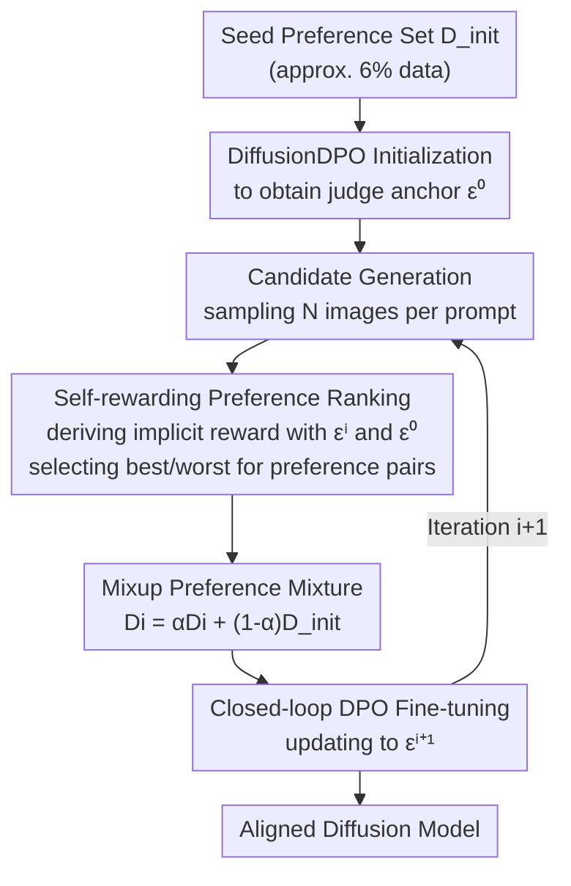

# SAIL: Self-Amplified Iterative Learning for Diffusion Model Alignment with Minimal Human Feedback

**Conference**: ICLR 2026  
**OpenReview**: [https://openreview.net/forum?id=wKdg1DDOrW](https://openreview.net/forum?id=wKdg1DDOrW)  
**Code**: None  
**Area**: Diffusion Models / Alignment RLHF  
**Keywords**: Diffusion model alignment, self-rewarding, iterative bootstrapping, DPO, preference mixup

## TL;DR
SAIL enables a diffusion model to act as its own "teacher": starting from a minimal seed of human-annotated preference data, the model generates its own samples, ranks them using an implicit reward derived from the diffusion loss, and fine-tunes itself in a closed loop. Using only approximately 6% of the preference data, it outperforms DiffusionDPO on HPSv2, Pick-a-Pic, and PartiPrompts.

## Background & Motivation

**Background**: There are two mainstream paths for aligning text-to-image diffusion models with human preferences. One is offline DPO, such as DiffusionDPO, which optimizes directly on large-scale (often millions of pairs) human-annotated preference sets. The other involves online optimization (DDPO, ReFL) using external reward models (e.g., aesthetic scorers, CLIP similarity).

**Limitations of Prior Work**: Offline DPO requires massive amounts of human annotation, which is expensive and difficult to update as preferences evolve. External reward models introduce secondary biases, are prone to reward hacking, and generalize poorly on out-of-distribution samples. Some methods like DDPO even require training four reward models simultaneously (aesthetic/compressibility/incompressibility/alignment) to characterize preferences comprehensively, as a single reward model often over-optimizes one dimension (e.g., color oversaturation due to aesthetic overfitting).

**Key Challenge**: Both paths create a hard dependency on "external supply"—either exhaustive human labels or potentially non-generalizable auxiliary models. The root of the problem lies in the default assumption that diffusion models are passive learners that must rely on external supervision to improve.

**Goal**: Can alignment capabilities be "unlocked" from the diffusion model itself using a minimal amount of human feedback without any external reward models?

**Key Insight**: The authors observe that once a diffusion model has seen even a small batch of human preferences, it possesses both generative and discriminative abilities—it can function as both a generator and a judge. The key is to mathematically derive a "relative reward" from the diffusion model's own denoising loss.

**Core Idea**: Construct a closed-loop DPO framework with implicit self-rewarding. The model generates candidates, ranks them into preference pairs using its derived rewards, and iteratively fine-tunes itself on data mixed with human seeds, effectively amplifying human priors through bootstrapping.

## Method

### Overall Architecture

SAIL begins with a seed preference set $D_{init}=\{(x_w,x_l,y)_n\}_{n=1}^N$ and a pre-trained diffusion model (SD1.5 or SDXL). In step 0, DiffusionDPO is used to fine-tune on the seed set to obtain a "judge anchor" $\epsilon^0_\theta$ with preliminary human preference. Subsequently, a closed-loop process begins: in each iteration $i$, the model from the previous round samples candidate images for new prompts. Implicit rewards derived from the diffusion loss are used to rank these candidates, selecting the best and worst to form preference pairs. These self-generated data are mixed with the human seed data according to a specific ratio and used for another round of DPO fine-tuning to obtain $\epsilon^{i+1}_\theta$. This entire process requires no external reward models, relying solely on the initial human seeds as a "compass."

### Key Designs

**1. Self-rewarding preference ranking: Reading "relative rewards" from denoising loss**

Instead of expensive external models, the model scores itself. DPO reparameterizes the reward as the log-ratio of the policy and the reference policy: $r(y,x)=\beta\log\frac{p_\theta(x_0|y,t,q_t(x_0))}{p_{ref}(x_0|y,t,q_t(x_0))}+\beta\log Z(y,t,q_t(x_0))$, where $q_t(x_0)=\sqrt{\alpha_t}x_0+\sqrt{1-\alpha_t}\epsilon$. Using the approximation $p_\theta(x_0|\cdot)\approx \exp(-\frac{\delta^2_t+1}{2\delta^2_t}\|\epsilon-\epsilon_\theta\|^2)$, the normalization term $Z$ cancels out for a fixed prompt. Thus, the reward for a single image can be expressed as the difference in noise prediction residuals:

$$r(y,x_A)\approx-\frac{\beta}{2}\big(\|\epsilon_A-\epsilon_\theta(x^A_t,y,t)\|^2_2-\|\epsilon_A-\epsilon_{ref}(x^A_t,y,t)\|^2_2\big)$$

Intuitively, if the current model $\epsilon_\theta$ has a smaller denoising error on an image than the reference model $\epsilon_{ref}$, it "prefers" that image, leading to a higher reward. Substituting two candidate images into the sigmoid function yields the relative preference probability $p_\theta(x_A>x_B|y)$ (Eq. 9), and labels $(x_w,x_l)$ are assigned based on $p>0.5$. To reduce noise, the authors average over 10 random samples of $(t,q_t(x_0))$. This derivation allows the model to act as both generator and judge under fixed reference parameters, eliminating the need for external reward networks.

**2. Closed-loop bootstrap iteration: Amplifying human priors via "generate-label-retrain"**

With self-rewarding, the model improves beyond static datasets. In each round, $N=8$ candidates are sampled for a new prompt set $Y_i$ (disjoint across rounds). The previous model $\epsilon^i_\theta$ and the initial anchor $\epsilon^0_\theta$ calculate relative rewards to select the "best-worst" pairs for $D_i$. DPO training is then performed with $\epsilon^i_\theta$ as both the initial and reference policy to obtain $\epsilon^{i+1}_\theta$. This loop propagates and amplifies the human preference prior from $D_{init}$ through the model's own capabilities—essentially a bootstrap where effective supervision grows despite the small seed. Ablations show best-worst selection is more effective than random selection (ImageReward 0.1137 vs 0.1055) due to clearer preference signals in extreme pairs.

**3. Mixup ranking preference mixture: Countering distribution collapse and forgetting**

Pure self-training carries a fatal risk: the model may overfit to its own high-confidence samples, leading to distribution collapse. Borrowing from experience replay in RL, the authors mix self-generated data and human seeds: $D_i=\alpha D_i+(1-\alpha)D_{init}$, with $\alpha=0.25$ (25% self-generated + 75% human seed). This allows the exploration of subtle preference patterns while remaining anchored by human priors. Ablations reveal two downsides of not mixing: first, **overfitting to high-confidence pairs**, where images from different seeds become identical and rewards become inflated (exceeding 90%), causing diversity to collapse; second, **catastrophic forgetting**, where the model's discriminative ability degrades, leading to inaccurate self-annotation and a vicious cycle. The mixup strategy is crucial for stable multi-round iterations.

### Loss & Training

The training objective follows the DiffusionDPO loss: $L_{DPO}=\mathbb{E}_{(y,x_w,x_l)}[-\log p_\theta(x_w>x_l|y)]$. Bases are SD1.5 and SDXL. SD1.5 uses AdamW; SDXL uses Adafactor for memory efficiency. Effective batch size is 128 pairs, $\beta=5000$. SD1.5 runs for 3 rounds, SDXL for 2 rounds. Prompt counts per round are 10K/20K/20K with $N=8$. Sampling uses 50-step DDPM for SD1.5 and 20-step DDIM for SDXL, with inference CFGs of 7.5 and 5, respectively. In total, approximately 50K human preference data (Pick-a-Pic v2) are used, which is only ~6% of the 0.8M used by DiffusionDPO.

## Key Experimental Results

### Main Results

Comparing SAIL against DiffusionDPO, DiffusionSPO, and MaPO on SD1.5 and SDXL. SAIL uses only 0.05M preference data while competitors use 0.8M, yet it improves steadily across iterations to outperform them:

| Model | Method | Data Vol. | PickScore | ImageReward | Aesthetics | HPSv2 |
|------|------|--------|-----------|-------------|------------|-------|
| SD1.5 | Base | - | 20.62 | -0.0130 | 5.38 | 26.21 |
| SD1.5 | DiffusionDPO | 0.8M | 21.07 | 0.2056 | 5.48 | 26.57 |
| SD1.5 | **SAIL (Iter3)** | 0.05M | 21.00 | **0.2329** | 5.49 | 26.75 |
| SDXL | Base | - | 22.13 | 0.6891 | 6.04 | 26.80 |
| SDXL | DiffusionDPO | 0.8M | 22.59 | 0.9336 | 6.02 | 27.27 |
| SDXL | **SAIL (Iter2)** | 0.05M | 22.51 | **0.9844** | 6.16 | 27.32 |

Compared to the base, SAIL on SDXL achieves gains of PickScore +0.38, ImageReward +0.2953, Aesthetics +0.12, and HPSv2 +0.52. It improves across all four HPSv2 subcategories (Anime, Concept Art, Painting, Photo). Consistent improvements are also observed on PartiPrompts (SD1.5).

### Ablation Study

| Config | PickScore | ImageReward | HPSv2 | Description |
|------|-----------|-------------|-------|------|
| SAIL (Iter1) | 20.89 | 0.1137 | 26.49 | Best-worst selection |
| Random Pairs | 20.44* | 0.1055 | 26.40 | Random selection, performance drops |
| SAIL (Iter2) | 20.95 | 0.1729 | 26.65 | With mixup |
| Iter2 w/o mix | 20.86 | 0.1564 | 26.55 | No mixup, significant drop in Round 2 |

> *The PickScore for random pairs is not explicitly listed in some parts of the original text; values provided match the source data.

SAIL was also compared with Online DPO. While OnlineDPO-Aes (single aesthetic reward) is slightly higher in aesthetics (+0.07), it lags behind SAIL in ImageReward (0.0936 vs 0.1137) and HPSv2 (26.35 vs 26.49) and is prone to oversaturation. Furthermore, applying SAIL on top of the full DiffusionDPO (SAIL*) yields further gains (ImageReward 0.4303), indicating the framework benefits even strong bases.

### Key Findings
- **Mixup is essential for multi-round stability**: Removing it causes performance drops by Round 2 due to the vicious cycle of overfitting and discriminative degradation.
- **High data efficiency**: Outperforming the full DiffusionDPO with only 6% of the data validates the hypothesis that alignment capabilities are inherent in the diffusion model.
- **Best-worst selection > Random**: Selecting extreme pairs provides cleaner preference signals.
- **Self-reward vs. single external reward**: While single-objective rewards over-optimize specific dimensions, SAIL's implicit rewards are more balanced across human preference, aesthetics, and alignment.

## Highlights & Insights
- **Embedding rewards in diffusion loss**: The most ingenious step is simplifying the DPO log-ratio into the difference of noise prediction residuals (Eq. 8), allowing scoring without additional networks. This derivation is transferable to other implicit reward scenarios.
- **Bootstrapping + Experience Replay**: Instead of complex regularization, a simple 0.25 mixup ratio anchors the model to human seeds, effectively balancing exploration and stability.
- **"Small Seed Amplification" Paradigm**: Surpassing full-scale data with 6% suggests the bottleneck in alignment may not be data quantity, but the activation of existing priors, which is highly attractive for budget-constrained deployments.

## Limitations & Future Work
- Self-reward quality is bounded by the initial seed and the base model's discriminative power; biased seeds or poor judgment can contaminate self-labels.
- The number of iterations is limited (3 for SD1.5, 2 for SDXL). SD1.5's ImageReward showed a slight rollback in Iter 4, leaving long-term stability and saturation points unclear.
- The mixup ratio $\alpha=0.25$ is empirical; sensitivity analysis across different datasets or bases was not provided.
- Effectiveness is primarily verified on aesthetics and text-alignment; performance on complex semantic or safety alignment remains unknown.

## Related Work & Insights
- **vs. DiffusionDPO**: DiffusionDPO optimizes offline on large static sets; SAIL uses it for Iter0 and then amplifies it via self-rewarding, turning the model into a "self-teacher."
- **vs. DDPO / OnlineDPO (External Rewards)**: These rely on external models and are prone to hacking; SAIL uses internal rewards for more balanced metrics.
- **vs. DiffusionSPO / MaPO**: These introduce step-wise optimization or preference margins; SAIL achieves comparable or superior results without any extra reward networks.
- **vs. Self-Rewarding LM (LLMs)**: Similar philosophy (iterative DPO with self-judging), but SAIL adapts this to diffusion models by providing a mathematical quantification of rewards in the diffusion context.

## Rating
- Novelty: ⭐⭐⭐⭐ First implicit self-rewarding closed-loop alignment framework for diffusion, with clean reward derivation.
- Experimental Thoroughness: ⭐⭐⭐⭐ Multiple bases, benchmarks, and ablations, though sensitivity analysis on hyperparameters is limited.
- Writing Quality: ⭐⭐⭐ Clear logic, though the original text contains some minor notation irregularities.
- Value: ⭐⭐⭐⭐ Significant practical implications for low-budget preference alignment.

<!-- RELATED:START -->

## Related Papers

- [\[CVPR 2026\] PromptLoop: Plug-and-Play Prompt Refinement via Latent Feedback for Diffusion Model Alignment](../../CVPR2026/image_generation/promptloop_plug-and-play_prompt_refinement_via_latent_feedback_for_diffusion_mod.md)
- [\[ICLR 2026\] Improved Object-Centric Diffusion Learning with Registers and Contrastive Alignment (CODA)](improved_object-centric_diffusion_learning_with_registers_and_contrastive_alignm.md)
- [\[ICLR 2026\] Test-Time Iterative Error Correction for Efficient Diffusion Models](test-time_iterative_error_correction_for_efficient_diffusion_models.md)
- [\[ICLR 2026\] Towards Sequence Modeling Alignment Between Tokenizer and Autoregressive Model](towards_sequence_modeling_alignment_between_tokenizer_and_autoregressive_model.md)
- [\[ICLR 2026\] Diffusion & Adversarial Schrödinger Bridges via Iterative Proportional Markovian Fitting](diffusion_adversarial_schrödinger_bridges_via_iterative_proportional_markovian_f.md)

<!-- RELATED:END -->
