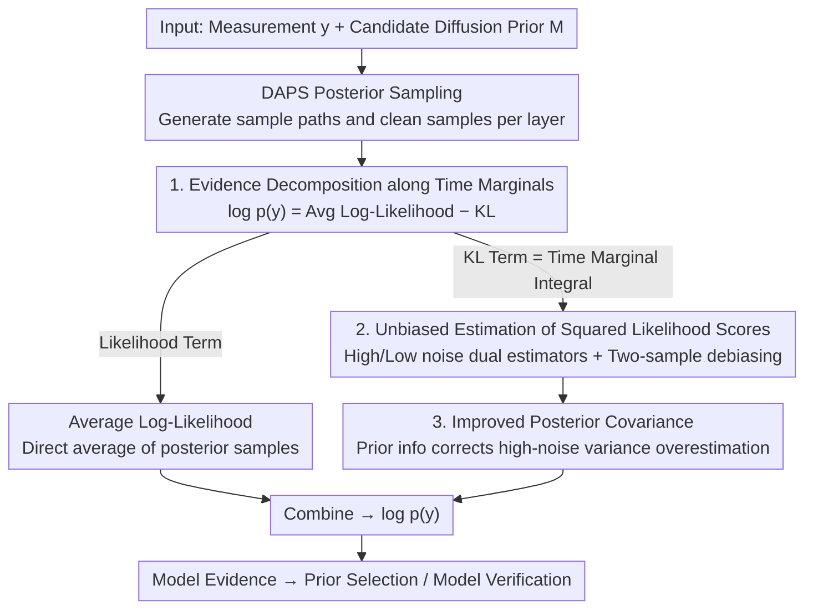

# Sample-Efficient Evidence Estimation of Score-Based Priors for Model Selection

**Conference**: ICLR 2026  
**arXiv**: [2602.20549](https://arxiv.org/abs/2602.20549)  
**Code**: —  
**Area**: Bayesian Inference / Diffusion Models  
**Keywords**: Model Evidence, Diffusion Prior, Posterior Sampling, Model Selection, Black Hole Imaging

## TL;DR

Proposes DiME, a model evidence estimator integrated along the time marginals of the diffusion posterior. It requires no prior scores or density evaluations and accurately estimates model evidence under diffusion priors using only a small number of posterior samples (e.g., 20) for prior selection and model validation.

## Background & Motivation

In Bayesian inverse problems, the prior distribution $p(\boldsymbol{x})$ has a decisive influence on the posterior $p(\boldsymbol{x}|\boldsymbol{y})$. Selecting an inappropriate prior leads to severe bias in reconstruction results. Ideally, different prior models should be evaluated through the model evidence $p(\boldsymbol{y}|M)$.

However, directly computing model evidence for diffusion model priors is infeasible:
- It requires integrating over the full prior $\log p(\boldsymbol{y}|M) = \log \int p(\boldsymbol{y}|\boldsymbol{x}) p(\boldsymbol{x}|M) d\boldsymbol{x}$.
- Existing methods (SMC, AIS, nested sampling) require clean prior scores $\nabla_{\boldsymbol{x}} \log p(\boldsymbol{x})$ or unnormalized densities.
- Diffusion models learn scores of intermediate noisy priors; the clean prior score is inaccurate.
- Density estimation methods exhibit high variance, requiring thousands of posterior samples.

## Method

### Overall Architecture

DiME addresses the challenge of using model evidence $p(\boldsymbol{y}|M)$ to compare different diffusion priors in Bayesian inverse problems, where $\log p(\boldsymbol{y}) = \log \int p(\boldsymbol{y}|\boldsymbol{x})p(\boldsymbol{x})d\boldsymbol{x}$ is not directly computable. Traditional estimators (SMC, AIS, nested sampling) require "clean prior scores or densities," but diffusion models only learn intermediate scores at various noise levels, making clean prior scores inaccurate and ill-posed. DiME's breakthrough lies in bypassing prior scores: it decomposes the log-evidence into two terms—the average log-likelihood under the posterior and the KL divergence from posterior to prior. The KL term is then integrated along the time marginals of reverse diffusion and rewritten as an integral of "time-step-wise squared likelihood scores." Consequently, evidence estimation only requires posterior samples, which are naturally generated by the DAPS posterior sampler during inference. By reusing these trajectories, DiME adds almost no extra computation, and approximately 20 sample paths are sufficient.

The workflow is: given a measurement $\boldsymbol{y}$ and a candidate diffusion prior, DAPS is first used to generate posterior sample paths $\{\boldsymbol{x}_{t_i}\}$ and clean samples $\tilde{\boldsymbol{x}}_0$ at each noise level. Then, the two terms of the evidence decomposition are estimated (the average likelihood term via direct averaging and the KL term via time-marginal integration). Finally, these are combined to obtain $\log p(\boldsymbol{y})$ for prior selection or model validation across multiple candidates.

### Key Designs

**1. Evidence Decomposition along Time Marginals: Decomposing evidence into terms dependent only on posterior samples**

$\log p(\boldsymbol{y})$ is difficult to compute because it involves integration over the entire prior, where diffusion model densities/scores are unreliable. DiME provides an identity decomposition: $\log p(\boldsymbol{y}) = \mathbb{E}_{\boldsymbol{x}_0 \sim p(\boldsymbol{x}_0|\boldsymbol{y})}[\log p(\boldsymbol{y}|\boldsymbol{x}_0)] - D_{\text{KL}}(p(\boldsymbol{x}_0|\boldsymbol{y}) \| p(\boldsymbol{x}_0))$. The first term is the average log-likelihood under the posterior, easily obtained by averaging posterior samples. The second is the KL divergence from posterior to prior. The key observation is that this KL term can be integrated along time marginals of reverse diffusion and rewritten as a form containing only **likelihood scores**:

$$D_{\text{KL}}(p(\boldsymbol{x}_0|\boldsymbol{y}) \| p(\boldsymbol{x}_0)) \approx \sum_{i=1}^N c_{t_i} \Delta t_i\, \mathbb{E}_{\boldsymbol{x}_{t_i} \sim p(\boldsymbol{x}_{t_i}|\boldsymbol{y})} \|\nabla_{\boldsymbol{x}_{t_i}} \log p(\boldsymbol{y}|\boldsymbol{x}_{t_i})\|^2$$

where the coefficient $c_{t_i} = \sigma_{t_i}' \sigma_{t_i} - \sigma_{t_i}^2 \frac{a_{t_i}'}{a_{t_i}}$ depends only on the diffusion schedule and $\Delta t_i = t_i - t_{i-1}$. This replaces the "integration over prior" with an "integration of squared likelihood scores along time steps," requiring only the known forward model $p(\boldsymbol{y}|\boldsymbol{x}_t)$. Intuitively, this term measures how far the posterior samples $\boldsymbol{x}_0$ are from the prior—out-of-distribution measurements result in larger KL and lower evidence.

**2. Unbiased Estimation of Squared Likelihood Scores: Dual high/low noise estimators with two-sample debiasing**

$\nabla_{\boldsymbol{x}_t} \log p(\boldsymbol{y}|\boldsymbol{x}_t)$ still cannot be directly evaluated, but only its **unbiased estimate** is needed for the integral. Using unconditional samples for $\boldsymbol{x}_0|\boldsymbol{x}_t$ results in unstable scores and exploding variance. DiME instead uses clean posterior samples $\tilde{\boldsymbol{x}}_0 \sim p(\boldsymbol{x}_0|\boldsymbol{x}_t, \boldsymbol{y})$ naturally sampled by DAPS at each noise level to construct two complementary unbiased estimators: $\Theta_{\text{high}}(\tilde{\boldsymbol{x}}_0) = \frac{a_t}{\sigma_t^2}(\tilde{\boldsymbol{x}}_0 - \mathbb{E}[\boldsymbol{x}_0|\boldsymbol{x}_t])$ (based on distance to the posterior mean) for high-noise regimes, and $\Theta_{\text{low}}(\tilde{\boldsymbol{x}}_0) = \frac{a_t}{\sigma_t^2}\boldsymbol{\Sigma}_{\boldsymbol{x}_0|\boldsymbol{x}_t} \nabla_{\tilde{\boldsymbol{x}}_0} \log p(\boldsymbol{y}|\tilde{\boldsymbol{x}}_0)$ (based on the likelihood score at $\tilde{\boldsymbol{x}}_0$) for low-noise regimes. The estimator with lower variance is selected at each step. To address the bias introduced by the **square** in the integral ($\mathbb{E}\|\Theta\|^2 = \|\mathbb{E}\Theta\|^2 + \text{Tr}(\text{Cov}(\Theta))$), DiME independently samples two instances $\tilde{\boldsymbol{x}}_0^{(1)}, \tilde{\boldsymbol{x}}_0^{(2)}$ for each $\boldsymbol{x}_t$ and uses the inner product $\Theta(\tilde{\boldsymbol{x}}_0^{(1)})^T\Theta(\tilde{\boldsymbol{x}}_0^{(2)})$ to achieve an unbiased estimate of the squared score.

**3. Improved Posterior Covariance: Using prior information to correct high-noise variance overestimation**

The low-noise estimator and DAPS's Gaussian approximation both rely on the conditional covariance $\boldsymbol{\Sigma}_{\boldsymbol{x}_0|\boldsymbol{x}_t}$. DAPS originally used a heuristic $\sigma_t^2$, which only considers $p(\boldsymbol{x}_t|\boldsymbol{x}_0)$ and ignores the prior $p(\boldsymbol{x}_0)$. This significantly overestimates variance at high noise—where at $t=T$, $\text{Cov}(\boldsymbol{x}_0|\boldsymbol{x}_T)\approx\text{Cov}(\boldsymbol{x}_0)$, yet the heuristic gives $\sigma_T^2 \gg \text{Cov}(\boldsymbol{x}_0)$, pushing samples toward incorrect modes. DiME approximates the prior as a Gaussian $\mathcal{N}(\boldsymbol{\mu}_0, \boldsymbol{\Sigma}_0)$ (with $\boldsymbol{\Sigma}_0$ estimated empirically from training data) to obtain a tightened covariance:

$$\boldsymbol{\Sigma}_{\boldsymbol{x}_0|\boldsymbol{x}_t} = \left[\boldsymbol{\Sigma}_0^{-1} + \frac{a_t^2}{\sigma_t^2}\mathbf{I}\right]^{-1}$$

This pulls the overly wide covariance back to the prior scale at high noise, significantly reducing bias without requiring additional samples. Since DAPS resamples at each annealing step, these Gaussian approximation errors do not accumulate.

## Key Experimental Results

### Gaussian Mixture Prior Benchmark

| Method | In-distribution $\boldsymbol{x}^*$ Rel. Error↓ | Out-of-distribution Rel. Error↓ | Saddle point Rel. Error↓ |
|------|------|------|------|
| Naive MC (1000) | 2451% | 2357% | 2299% |
| Original DAPS Heuristic | 146% | 3.3% | 7.3% |
| TI | 3.2% | 5.6% | 1.2% |
| SMC | 2.6% | 1.2% | **0.7%** |
| **DiME** | **1.5%** | **0.6%** | 0.8% |

DiME achieves accuracy comparable to SMC without using prior scores.

### MNIST Model Selection

Given a single noisy measurement, the correct prior is selected from 10 diffusion models. DiME consistently selects the correct digit class, while baseline methods fail.

### M87* Black Hole Imaging

- DiME demonstrates that the GRMHD prior has higher likelihood than RIAF, spatial images, human faces, and MNIST priors.
- Prior predictive checks indicate that M87* observations are statistically compatible with the GRMHD prior.

### Key Findings

- Accurate estimates are obtained with only 20 posterior samples.
- The automatic switching strategy between high/low noise estimators effectively reduces variance.
- Improved covariance approximation significantly reduces bias at high noise.
- DiME generalizes to model evidence estimation under any annealing path.

## Highlights & Insights

- First evidence estimator for diffusion models that does not rely on prior scores or densities.
- Extremely high sample efficiency (20 samples vs. thousands for baselines).
- Elegant theoretical derivation leveraging intermediate samples naturally produced during diffusion sampling.
- Practical utility validated in real scientific applications (black hole imaging).

## Limitations & Future Work

- Reliance on Gaussian approximation $p(\boldsymbol{x}_0|\boldsymbol{x}_t) \approx \mathcal{N}$ may be inaccurate for highly multimodal priors.
- Coupled with a specific posterior sampling method (DAPS); generalization to other methods requires further derivation.
- Diagonal covariance approximation may have limited precision in complex high-dimensional problems.
- Estimator variance may increase with problem dimensionality.

## Related Work & Insights

- **Evidence Estimation**: SMC, AIS, Nested Sampling, Harmonic Mean Estimators, etc.
- **Diffusion Posterior Sampling**: DAPS, DPS, PnP-DM, etc.
- **Model Selection**: Bayesian factors, cross-validation, and alternative frameworks.

## Rating

- Novelty: ⭐⭐⭐⭐⭐ — Completely new paradigm for diffusion evidence estimation.
- Theory: ⭐⭐⭐⭐⭐ — Rigorous derivation supported by multiple lemmas.
- Experimental Thoroughness: ⭐⭐⭐⭐ — Comprehensive validation from toy problems to real scientific applications.
- Value: ⭐⭐⭐⭐ — Immediate value for scientific imaging and model selection.

<!-- RELATED:START -->

## Related Papers

- [\[ICLR 2026\] Measurement Score-based Diffusion Model (MSM)](measurement_score-based_diffusion_model.md)
- [\[AAAI 2026\] Diffusion Reconstruction-Based Data Likelihood Estimation for Core-Set Selection](../../AAAI2026/image_generation/diffusion_reconstruction-based_data_likelihood_estimation_for_core-set_selection.md)
- [\[ICML 2026\] DiScoFormer: Plug-In Density and Score Estimation with Transformers](../../ICML2026/image_generation/discoformer_plug-in_density_and_score_estimation_with_transformers.md)
- [\[ICLR 2026\] Sample Reward Soups: Query-efficient Multi-Reward Guidance for Text-to-Image Diffusion Models](sample_reward_soups_query-efficient_multi-reward_guidance_for_text-to-image_diff.md)
- [\[ICLR 2026\] Monocular Normal Estimation via Shading Sequence Estimation](monocular_normal_estimation_via_shading_sequence_estimation.md)

<!-- RELATED:END -->
