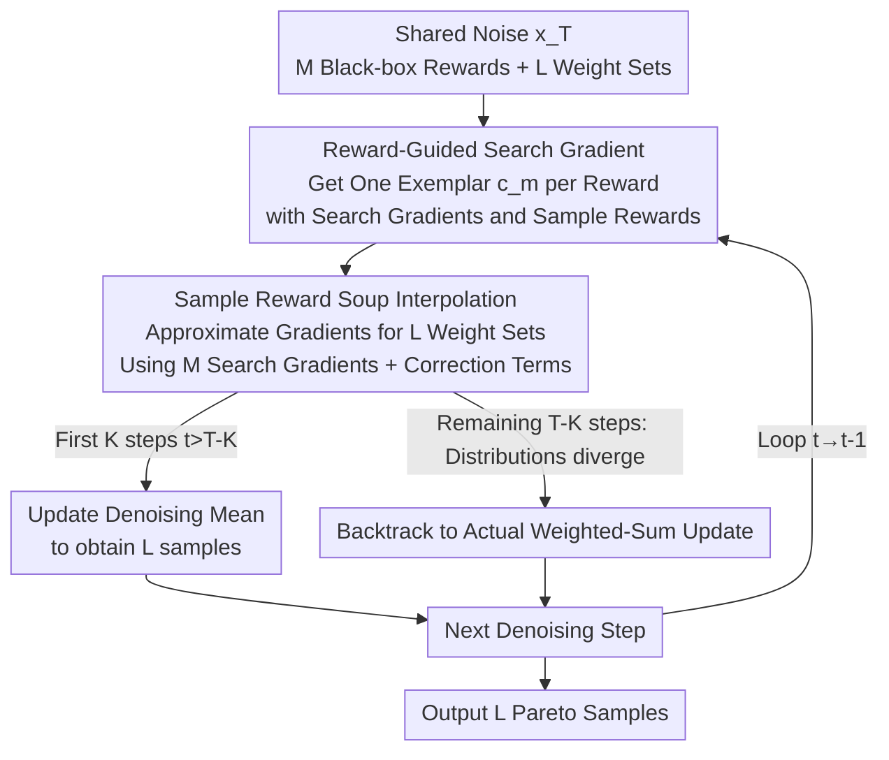

# Sample Reward Soups: Query-efficient Multi-Reward Guidance for Text-to-Image Diffusion Models

**Conference**: ICLR 2026  
**OpenReview**: [https://openreview.net/forum?id=MNVxrgRcJV](https://openreview.net/forum?id=MNVxrgRcJV)  
**Code**: https://github.com/EvaFlower/Sample-Reward-Soups-ICLR26  
**Area**: Diffusion Models / Text-to-Image Generation / Inference-time Alignment  
**Keywords**: Multi-reward Alignment, Inference-time Guidance, Black-box Rewards, Search Gradients, Pareto Optimality

## TL;DR
Without training the diffusion model, this paper replaces "querying black-box rewards for every weight combination" with "interpolated search gradients." This allows text-to-image models to align with multiple black-box rewards simultaneously during inference, significantly reducing reward queries in the early denoising stages (up to 2.7×) while avoiding the reward over-optimization common in fine-tuning methods.

## Background & Motivation

**Background**: Aligning Text-to-Image (T2I) diffusion models with human preferences (aesthetics, compression rate, HPSv2, PickScore, etc.) typically follows two paths: first, **fine-tuning** models using RL, differentiable rewards, or DPO; second, adding reward gradients into the denoising process via **inference-time** guidance. The latter has been shown to be more resistant to "reward over-optimization" and requires no training.

**Limitations of Prior Work**: Real-world scenarios often require satisfying **multiple** black-box rewards, and different users have varying preference weights. To characterize the entire Pareto front, a large number of weight combinations must be traversed. Both fine-tuning and inference-time guidance, in their most naive forms, must calculate the weighted reward $\sum_i w_i f_i$ separately for each set of weights $w_{1:M}$. Inference-time guidance requires sampling and querying rewards at every step; as the number of weight combinations $L$ increases, the number of black-box reward queries explodes. The original paper notes that the weighted-sum strategy requires $NTM(L-M+1)$ queries per prompt. When rewards are expensive (e.g., querying an LLM for scoring), this overhead becomes unbearable.

**Key Challenge**: To cover the preference space, many weight combinations are needed; querying black-box rewards for each combination leads to a multiplicative growth in query counts with rewards and combinations. Rewarded Soups in the fine-tuning domain uses "model weight interpolation" to reduce costs to linear, but fine-tuning itself introduces over-optimization and poor generalization to unseen prompts. Inference-time guidance lacks an equivalent "query-saving" mechanism despite having no over-optimization issues.

**Goal**: Achieve (1) Pareto-optimal sampling covering the preference space and (2) a significant reduction in query counts for multi-reward alignment under a **completely training-free** inference-time setting.

**Key Insight**: The authors observed a critical phenomenon—when optimizing denoising distributions from the **same noise point** under different reward weights, these distributions **overlap significantly in the early denoising stages** (Figure 2: complete overlap initially, partial overlap early on, diverging only later). Distribution overlap implies that samples from one distribution are "statistically indistinguishable" from another, allowing reward samples to be **shared across weights**.

**Core Idea**: Port "interpolated model weights" from the fine-tuning Rewarded Soups to the **sample level** at inference time. For each step, calculate only $M$ "search gradients" for each single reward, then **linearly interpolate** these search gradients to approximate the search gradient for any weighted sum, thereby eliminating the overhead of querying rewards for $L-M$ weight combinations.

## Method

### Overall Architecture

SRSoup addresses the "query efficiency of inference-time multi-reward alignment." The overall process: Starting from a shared noise $x_T\sim\mathcal{N}(0,I)$, at each denoising step $t$, first execute **reward-guided search gradients** for each of the $M$ reward functions (black-box, no differentiable reward required) to obtain $M$ "exemplar" distributions along with their search gradients and sample rewards. Then, for the $L$ weight combinations to be characterized, use these $M$ search gradients with a **correction-item linear interpolation** to approximate the gradient for each combination, directly updating the denoising mean **without querying black-box rewards for these $L-M$ combinations again**. Since distribution overlap only holds in early stages, a **hybrid schedule** is used: the first $K$ steps ($t>T-K$) use SRSoup interpolation, and the remaining $T-K$ steps revert to the actual weighted-sum update. Finally, it outputs $L$ samples aligned with different weights, approximating the complete Pareto front.

### Key Designs

**1. Reward-Guided Search Gradient: Guiding Denoising with Black-box Rewards**

To guide denoising with rewards at inference time, classic classifier guidance requires rewards to be **differentiable**, but many rewards like compression rate are non-differentiable black boxes. This paper borrows from black-box optimization (NES philosophy), **optimizing only the mean** $\mu_{t-1}$ of the denoising Gaussian distribution at each step, defining the objective as the expected reward $F(\mu_{t-1})=\mathbb{E}_{\mathcal{N}(x_{t-1};\mu_{t-1},\beta_t I)}[f(x_{t-1})]$. Its gradient can be estimated via sampling using the Gaussian smoothing trick (Theorem 1):

$$\nabla_{\mu_{t-1}}F(\mu_{t-1})=\frac{1}{\sqrt{\beta_t}}\mathbb{E}_{\mathcal{N}(z;0,I)}\big[f(\mu_{t-1}+\sqrt{\beta_t}z)\,z\big].$$

In practice, Monte Carlo approximation is used: sample $N$ noises $z_n$, construct $x_{t-1}^n=\mu_{t-1}+\sqrt{\beta_t}z_n$, query rewards $f(x_{t-1}^n)$, and estimate the gradient as $\frac{1}{\sqrt{\beta_t}N}\sum_n f(x_{t-1}^n)z_n$. Then, perform a gradient ascent step $\bar\mu_{t-1}=\mu_{t-1}+\tau_t\nabla F$, setting the step size $\tau_t$ to $\beta_t$ for compatibility with the original sampling schedule, and use deterministic DDIM updates ($\bar x_{t-1}=\bar\mu_{t-1}$) to avoid extra noise interference (Algorithm 1). This step is the "atomic operation" for the later "soups": running it for each reward independently yields an exemplar aligned solely with that reward.

**2. Sample Reward Soups: Interpolating Search Gradients Instead of Querying per Combination**

This is the core contribution. While fine-tuning Rewarded Soups interpolates **model parameters**, this work ports it to the **sample/gradient level** at inference time. Define $M$ exemplars $\{c^m_{t-1}\}$, each guided by a single reward (one-hot weight $e_m$). For the true gradient $\nabla_{\mu_{t-1}}F(\mu_{t-1},w_{1:M})$ corresponding to any weight combination $w_{1:M}$, Proposition 3 uses Taylor expansion to express it as a weighted sum of exemplar gradients plus a second-order term. Since the second-order term is too expensive, Proposition 4 provides a **correction term requiring no second-order derivatives**: when the distance between two Gaussian means $\|c^m_{t-1}-\mu_{t-1}\|\le\varepsilon$, the Total Variation distance between product distributions of $N$ independent samples satisfies $\mathrm{TV}\le \frac{N\varepsilon}{\sqrt{4\beta_t}}$. If distributions overlap sufficiently, their samples are statistically indistinguishable. Accordingly, each component is approximated as:

$$\nabla_{\mu_{t-1}}F(\mu_{t-1},e_m)\approx\nabla_{c^m_{t-1}}F(c^m_{t-1},e_m)+\frac{1}{\sqrt{\beta_t}N}\sum_{n=1}^N f(x^{m,n}_{t-1})\,(c^m_{t-1}-\mu_{t-1}),$$

where the second term is the correction term. Thus, the gradient for any weight combination $\nabla_{\mu^l_{t-1}}F=\sum_m w^l_m[\nabla_{c^m_{t-1}}F(c^m_{t-1},e_m)+\frac{1}{\sqrt{\beta_t}N}\sum_n f_m(x^{m,n}_{t-1})(c^m_{t-1}-\mu^l_{t-1})]$ **completely reuses the search gradients and sample rewards already calculated on the $M$ exemplars**, avoiding extra black-box reward queries for these $L-M$ combinations. This is the source of the "query savings": only the $M$ one-hot exemplars incur $N$ queries each, while all other combinations are "free" via interpolation.

**3. Hybrid Schedule + Overlap Enhancement: Ensuring the Validity of "Reward Sharing"**

Sample reward sharing is only valid when distributions overlap. As $\beta_t$ decreases during denoising, distributions diverge (Figure 2). The authors use a **hybrid schedule**: define $K$ soup steps where the first $K$ steps ($t>T-K$, with overlapping distributions) use SRSoup interpolation, and the remaining steps ($t\le T-K$) revert to true weighted-sum updates—capturing early query savings without using distorted approximations later. To further guarantee early overlap, two **overlap enhancement techniques** are added: first, all weight combinations are initialized from the **same noise** $x_T$, ensuring $\mu_{T-1}=c^1_{T-1}=\dots=c^M_{T-1}$ at $t=T$; second, the **same set of noises** $\{z_n\}$ is reused when querying the $M$ rewards to minimize divergence between exemplars. The paper also notes that denoising distributions are isotropic, allowing overlap to be considered dimension-wise to avoid the curse of dimensionality.

## Key Experimental Results

### Main Results

The backbone is Stable Diffusion 1.5 (default $T=50$, $N=30$ queries per reward/step, $K=20$ soup steps). Rewards include compression rate, LAION Aesthetics, HPSv2, and PickScore. Baselines include DDPO(soup), TDPO(soup), and AlignProp(soup). Pareto front and Hypervolume (HV) are used as metrics.

| Setting | Comparison | Conclusion |
|------|----------|------|
| Dual-objective (Aesthetics + Comp/HPSv2/PickScore) | DDPO/TDPO/AlignProp(soup) | SRSoup consistently yields better Pareto fronts without diversity collapse caused by over-optimization. |
| Tri-objective (Aesthetics + HPSv2 + PickScore) | Same as above | Still leads in harder scenarios; TDPO severely over-optimizes aesthetics, leading to prompt misalignment. |
| vs Weighted-sum Guidance (fixed budget) | WeightedSum | Performance is comparable but much more query-efficient: 1.8× saved in the first two scenarios, approx. 2.7× in the third. |
| SDXL backbone | — | Image quality improves further on a stronger backbone, validating generality. |

### Ablation Study

| Configuration | Key Phenomenon | Explanation |
|------|---------|------|
| Varying soup steps $K$ ($N=30$) | $K=50$ (All SRSoup, no weighted sum) still yields reasonable trade-offs. | Early interpolated gradients are sufficiently effective. |
| $K\le 20$ | Saves up to 40% queries with almost no performance loss. | Early sharing saves queries; late true rewards correct bias. |
| Varying query count $N$ ($K=30$) | Performance improves with larger $N$. | More samples → more accurate search gradient estimation. |
| SRS replaced with unconditional sampling | Pareto front degrades significantly. | Proves "soups" provide informative guidance rather than just random sampling. |

### Key Findings
- **The sweet spot for query saving is $K\le20$**: Sharing reward samples across weights when distributions overlap in early denoising saves up to 40% queries with negligible performance loss. Hybrid scheduling is the key switch between efficiency and accuracy.
- **Avoiding over-optimization without fine-tuning**: Fine-tuning baselines show over-optimization (converged backgrounds, prompt misalignment) when optimizing for aesthetics, while SRSoup naturally avoids this.
- **Sample reward sharing $\neq$ Model parameter sharing**: Ablations showing that removing the "soup" degrades performance to unconditional sampling levels prove that gains come from the interpolated search gradient mechanism.

## Highlights & Insights
- **Downscaling "Model Soups" to "Sample Soups"**: While Rewarded Soups interpolates trained model weights, this paper identifies that "search gradients" at every inference step can also be interpolated, supported by TV distance upper bounds—a sleek translation of a training-side trick to the inference side.
- **Replacing Point Proximity with Distribution Overlap**: Proposition 4 relaxes "points being close enough" to "distributions overlapping enough," combined with isotropic properties to bypass the curse of dimensionality. This makes the approximation robust in high-dimensional diffusion spaces.
- **Zero-cost Correction Term**: The correction term uses already computed exemplar rewards $f_m(x^{m,n}_{t-1})$ and mean differences without requiring second-order derivatives, serving as the engineering pivot for efficiency without sacrificing accuracy.

## Limitations & Future Work
- **Dependency on Early Overlap Assumption**: Query savings are concentrated in early denoising; if rewards are highly conflicting and distributions diverge rapidly, $K$ must be reduced, diminishing gains.
- **Queries Still Scale Linearly with the Number of Rewards**: While $L-M$ combinations are saved, the $M$ one-hot exemplars still require $N$ queries each per step. Base overhead remains significant for very large $M$.
- **Mean-only Optimization / Single-step Ascent**: Updating only the mean and using a single step may underfit in complex reward landscapes; $K$ and $N$ are hyperparameters needing scenario-specific tuning.
- **Evaluation Limited to Classic Backbones/Rewards**: Performance on more modern flow-based T2I models (e.g., GRPO-style) remains to be verified.

## Related Work & Insights
- **vs Rewarded Soups (Rame et al., 2023)**: They fine-tune individual models and interpolate **model weights**; this work is training-free and interpolates **search gradients** (sample level), avoiding both fine-tuning costs and over-optimization.
- **vs Weighted-Sum Guidance (Kim et al., 2025)**: Also inference-time guidance, but weighted-sum queries black-box rewards for every combination independently. SRSoup reuses exemplar queries via interpolation, saving 1.8×–2.7× queries for similar performance.
- **vs Supervised Multi-reward Fine-tuning**: These methods construct Pareto sets for RL/SFT, requiring massive data and risking over-optimization. SRSoup requires no training data.

## Rating
- Novelty: ⭐⭐⭐⭐⭐ First inference-time "soup" strategy, translating model parameter interpolation to sample-level search gradient interpolation with theoretical support.
- Experimental Thoroughness: ⭐⭐⭐⭐ Solid dual/tri-objective tests, multi-reward setups, and ablations on $K/N$, though backbones are slightly dated.
- Writing Quality: ⭐⭐⭐⭐ Clear chain from motivation to insight to theory. Algorithms and propositions are well-presented.
- Value: ⭐⭐⭐⭐⭐ Addresses the genuine pain point of expensive multi-reward queries. Training-free, query-efficient, and practical.

<!-- RELATED:START -->

## Related Papers

- [\[ICLR 2026\] GLASS Flows: Efficient Inference for Reward Alignment of Flow and Diffusion Models](glass_flows_reward_alignment_diffusion.md)
- [\[ICML 2026\] Pareto-Guided Optimal Transport for Multi-Reward Alignment](../../ICML2026/image_generation/pareto-guided_optimal_transport_for_multi-reward_alignment.md)
- [\[ICLR 2026\] Training-Free Reward-Guided Image Editing via Trajectory Optimal Control](training-free_reward-guided_image_editing_via_trajectory_optimal_control.md)
- [\[ICLR 2026\] EditReward: A Human-Aligned Reward Model for Instruction-Guided Image Editing](editreward_a_human-aligned_reward_model_for_instruction-guided_image_editing.md)
- [\[ICLR 2026\] Sample-Efficient Evidence Estimation of Score-Based Priors for Model Selection](sample-efficient_evidence_estimation_of_score_based_priors_for_model_selection.md)

<!-- RELATED:END -->
