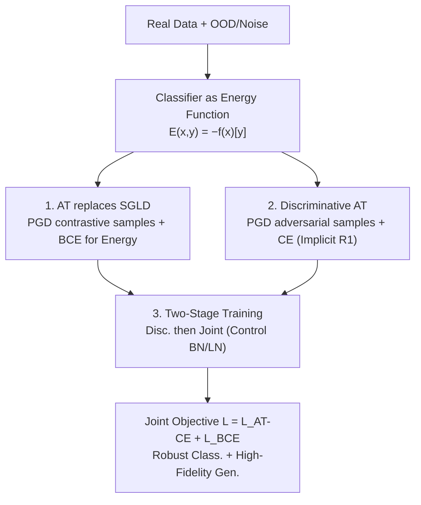

# Scalable Energy-Based Models via Adversarial Training: Unifying Discrimination and Generation

**Conference**: ICLR 2026  
**OpenReview**: [https://openreview.net/forum?id=I9iai932rK](https://openreview.net/forum?id=I9iai932rK)  
**Code**: https://github.com/xuwangyin/DAT (Available)  
**Area**: Diffusion Models / Energy-Based Models / Image Generation / Adversarial Robustness  
**Keywords**: Energy-Based Model (EBM), Adversarial Training, JEM, Discriminative-Generative Unification, Counterfactual Explanation

## TL;DR
This paper proposes Dual Adversarial Training (DAT), which replaces the unstable SGLD sampling in JEM with adversarial training (PGD for contrastive samples + BCE loss) to learn the energy function. Combined with adversarial training for the discriminative branch and a two-stage training strategy, it scales energy-based discriminative-generative hybrid models to ImageNet 256×256 for the first time, achieving SOTA-level robust classification and generation quality (FID 3.29, comparable to the autoregressive VAR-d16 and surpassing ADM-G/LDM-4-G).

## Background & Motivation

**Background**: Discriminative models excel at classification but do not model data distributions, while generative models can sample but often perform weakly in downstream classification. Unifying both into a single network through "hybrid modeling" is a long-standing problem. Energy-Based Models (EBMs) are attractive as they connect both paradigms. The representative work JEM (Grathwohl et al., 2019) found that the logits of a standard classifier can be reinterpreted as an energy function over the joint distribution $p(x,y)$, allowing a single network to perform both classification and generation.

**Limitations of Prior Work**: The generative branches of JEM-like methods rely on MCMC sampling—specifically Stochastic Gradient Langevin Dynamics (SGLD). SGLD training is extremely unstable, computationally expensive, and yields poor sampling quality, restricting these hybrid models to low-resolution scales like CIFAR (32×32) with FID scores typically above 30, failing to scale to ImageNet. Subsequent improvements such as JEM++, Robust-JEM, and SADA-JEM improved stability but remained within the SGLD framework, leaving the root problem unsolved.

**Key Challenge**: To achieve both "discriminative robustness" and "high-fidelity generation," one must stably optimize the energy function. However, SGLD is slow and hard to converge, and standard EBM gradients (Eq. 5) allow energy values to grow unbounded, leading to numerical explosion. Another line of work (e.g., AT-EBM, Yin et al., 2022) uses PGD instead of SGLD to achieve stability but is limited to unconditional generation and requires explicit R1 gradient penalties that constrain model expressivity.

**Goal**: Within the JEM joint architecture, the objective is to eliminate training instability in the generative branch, ensure true robustness in the discriminative branch, and scale the method to high resolutions across various architectures (BN in ResNet, LN in ConvNeXt).

**Key Insight**: There is a profound connection between Adversarial Training (AT) and energy modeling—AT implicitly "flattens" the energy landscape near real data, and adversarial samples generated by PGD naturally serve as negative samples for EBMs. Thus, AT can be applied dually: using it in the generative branch to learn energy and in the discriminative branch to ensure robustness.

**Core Idea**: Replace SGLD with Dual AT. The generative branch utilizes PGD contrastive samples + BCE loss to stably shape the energy landscape, while the discriminative branch employs standard AT to provide both robustness and implicit gradient regularization required for energy training.

## Method

### Overall Architecture

DAT is built upon JEM: a standard classifier producing logits $f_\theta(x)\in\mathbb{R}^K$ is reinterpreted as an EBM over the joint distribution. The joint energy is defined as $E_\theta(x,y) = -f_\theta(x)[y]$, and marginalizing over labels $y$ yields the marginal energy on data $E_\theta(x) = -\log\sum_y \exp(f_\theta(x)[y])$. Consequently, the same set of weights provides the classification probability $p_\theta(y|x)$ and defines the density $p_\theta(x)$.

The overall objective of DAT is to decompose the joint log-likelihood $\log p_\theta(x,y) = \log p_\theta(y|x) + \log p_\theta(x)$ into two terms optimized via adversarial training: the discriminative term uses the robust classification loss $L_{\text{AT-CE}}$, and the generative term uses an AT-style $L_{\text{BCE}}$. The "negative samples" required for generation are produced via normalized gradient descent using PGD on the energy function—pushing OOD images (or pure noise) toward the data distribution during training. The same mechanism allows for sampling or counterfactual generation during inference. Finally, a two-stage training strategy is used to stabilize the process on modern architectures with normalization layers.

### Key Designs

**1. Replacing SGLD with AT: Stable Energy Learning via BCE Contrastive Loss**

This is the most critical modification, addressing the explosion and poor sampling quality of SGLD. The standard EBM gradient (Eq. 5) is $\mathbb{E}_{x\sim p_{data}}[-\nabla_\theta E_\theta(x)] - \mathbb{E}_{x\sim p_\theta}[-\nabla_\theta E_\theta(x)]$. It is unbounded, allowing $-E_\theta(x)$ to grow infinitely. DAT multiplies each term by a data-dependent scaling factor, rewriting the gradient as:

$$\mathbb{E}_{x\sim p_{data}}\big[-\alpha(x)\nabla_\theta E_\theta(x)\big] - \mathbb{E}_{x\sim p_\theta}\big[-\beta(x)\nabla_\theta E_\theta(x)\big]$$

where $\alpha(x) = 1-\sigma(-E_\theta(x))$ and $\beta(x) = \sigma(-E_\theta(x))$, with $\sigma$ as the logistic sigmoid. When $-E_\theta(x)$ reaches extreme values, the sigmoid saturates, and the scaling factor approaches 0, automatically decaying the gradient contribution and preventing overflow/underflow. This gradient corresponds exactly to the gradient of the following Binary Cross Entropy (BCE) loss:

$$L_{\text{BCE}}(\theta) = -\mathbb{E}_{x\sim p_{data}}\big[\log\sigma(-E_\theta(x))\big] - \mathbb{E}_{x\sim p_\theta}\big[\log(1-\sigma(-E_\theta(x)))\big]$$

Intuitively: real data is treated as the positive class and contrastive samples as the negative class, training the energy function to "distinguish real data from PGD-pushed samples." The trade-off is that this models the support of $p_{data}$ rather than the full density—the authors show that the optimal solution satisfies $f_\theta^*(x)[y] = \log p_{data}(y|x)$ and $E_\theta^*(x)=0$ on the support. Contrastive samples are generated via $T$ steps of normalized gradient descent: $x_{t+1} = x_t - \eta\,\nabla_x E_\theta(x_t)/\lVert\nabla_x E_\theta(x_t)\rVert_2$, initialized from auxiliary OOD datasets or random noise.

**2. Discriminative Adversarial Training: Robustness and Implicit R1 Regularization**

Modifying only the generative branch leaves the discriminative branch weaker than standard AT classifiers. DAT applies AT to the discriminative term $p_\theta(y|x)$ as well: within an $\epsilon$-ball $B(x,\epsilon)$ for each sample, PGD finds the adversarial sample $x_{adv} = \arg\max_{x'\in B(x,\epsilon)} L_{\text{CE}}(\theta;x',y)$, then minimizes $L_{\text{AT-CE}}(\theta) = \mathbb{E}_{(x,y)\sim p_{data}}[-\log p_\theta(y|x_{adv})]$.

A key insight here is that AT serves two purposes. While prior work like AT-EBM required explicit R1 gradient penalties for stability, DAT leverages the proof by Roth et al. (2020) that adversarial training implicitly bounds the R1 penalty. Empirical results (Figure 2) show that AT maintains the R1 gradient within a bounded range throughout training. Thus, discriminative AT provides robust accuracy while removing the need for explicit regularization, simplifying the pipeline without constraining model expressivity. The full objective is $L(\theta) = L_{\text{AT-CE}}(\theta) + L_{\text{BCE}}(\theta)$.

**3. Two-Stage Training: Resolving Normalization and Energy Training Conflicts**

Direct joint training fails due to normalization layers—specifically, Batch Normalization (BN) has been noted to be harmful to EBM training. DAT observes that enabling BN causes $L_{\text{BCE}}$ to oscillate. However, normalization is crucial for discriminative convergence. DAT solves this with two stages:

- **Stage 1 (Discriminative Training)**: Maintain original normalization and optimize only $L_{\text{AT-CE}}$. This is equivalent to standard AT and utilizes normalization for fast convergence. Critically, if a pre-trained robust classifier exists, this stage can be skipped.
- **Stage 2 (Joint Training)**: Starting from the Stage 1 model, modify normalization behavior and train with the full objective $L(\theta)$. For BN architectures (ResNet), BN modules are set to `eval` mode, freezing Stage 1 statistics. For LN architectures (ConvNeXt), they are kept as is.

This strategy avoids BN-EBM incompatibility and leverages pre-trained robust classifiers to save computation (only 1.05–1.56× overhead relative to standard AT), allowing scaling to modern architectures like ConvNeXt and ViT.

### Loss & Training
The final objective is $L(\theta) = L_{\text{AT-CE}}(\theta) + L_{\text{BCE}}(\theta)$. Different augmentations are used: strong augmentations for $L_{\text{AT-CE}}$ to ensure robustness, and basic transformations for $L_{\text{BCE}}$ to avoid distorting the data distribution. The PGD iteration steps $T$ is a critical hyperparameter controlling the trade-off between discrimination and generation.

## Key Experimental Results

### Main Results

On CIFAR-10, DAT achieves the best "Robust Accuracy" and "FID" among hybrid models:

| Method | Acc%↑ | Robust Acc%↑ | IS↑ | FID↓ |
|------|-------|--------------|-----|------|
| JEM | 92.9 | 40.5 | 8.76 | 38.4 |
| SADA-JEM | 95.5 | 31.93 | 8.77 | 9.41 |
| RATIO | 92.23 | 76.25 | 9.61 | 21.96 |
| Standard AT | 92.43 | 75.73 | 9.58 | 28.41 |
| **DAT (T=40)** | 91.92 | **75.75** | 9.92 | **9.12** |
| DAT (T=50) | 90.72 | 74.65 | 9.86 | 7.57 |

DAT's robust accuracy (75.75%) matches standard AT (75.73%), while its FID (9.12) significantly outperforms JEM (38.4) and RATIO (21.96).

ImageNet 256×256 represents the major breakthrough—the first EBM hybrid scaled to this size:

| Method | Acc%↑ | Robust Acc%↑ | FID↓ | IS↑ | Params |
|------|-------|--------------|------|-----|------|
| EGC (Diffusion-Hybrid) | 78.90 | 13.56 | 6.05 | 231.3 | 543M |
| Standard AT (ConvNeXt-L) | 78.25 | 33.38 | 44.46 | 27.32 | 198M |
| VAR-d16 (Autoregressive) | – | – | 3.30 | – | 310M |
| ADM-G (Diffusion) | – | – | 4.59 | – | 608M |
| LDM-4-G (Diffusion) | – | – | 3.60 | – | 400M |
| **DAT (ConvNeXt-L, T=110)** | 75.78 | **56.40** | **3.29** | 310.2 | 198M |

DAT achieves an FID of 3.29 with fewer parameters (198M), comparable to VAR-d16 (3.30), while providing a robust accuracy of 56.40% (vs. EGC's 13.56%). Inference throughput is 5–29× faster than diffusion models.

### Ablation Study

| Configuration | Key Metrics | Explanation |
|------|---------|------|
| DAT T=40 (CIFAR-10) | FID 9.12 | Preference for discrimination |
| DAT T=50 (CIFAR-10) | FID 7.57 | Better generation but lower accuracy |
| Noise Initialization (No OOD) | Accuracy stable | Trainable without auxiliary datasets |
| ResNet-50→WRN-50-4 | Gain in Acc/FID | Benefit from larger capacity |
| WRN-50-4→ConvNeXt-L | Superior with fewer params | Architecture design > Pure scaling |

### Key Findings
- **Generation-Discrimination Trade-off**: The PGD step $T$ acts as a knob; increasing $T$ from 40 to 50 on CIFAR-10 drops FID from 9.12 to 7.57 but sacrifices clean/robust accuracy.
- **Independence from Auxiliary Data**: When initializing PGD from pure noise, metrics remain stable, removing reliance on datasets like 80M Tiny Images.
- **Architecture Matters**: ConvNeXt-L outperforms WRN-50-4 despite having fewer parameters, indicating modern architectural Gains are significant.
- **Stability**: Zero training divergence across all runs; two-stage training adds minimal overhead (1.05–1.56×) over standard AT.

## Highlights & Insights
- **Adversarial Training as "Glue"**: The same PGD mechanism serves both goals—robustness for in-distribution samples and contrastive sample generation for OOD/noise.
- **Implicit Regularization**: Using sigmoid scaling factors for EBM gradients eliminates the need for explicit R1 penalties, which is the key source of stability.
- **Unified Decision/Energy Function**: Since classification and generation share the same energy function, PGD can produce counterfactual images that are both visually realistic and semantically loyal to the target class.
- **Two-Stage Strategy**: Bypassing BN-EBM incompatibility by freezing statistics allows the method to leverage pre-trained models and scale to ImageNet.

## Limitations & Future Work
- The model learns the support of $p_{data}$ rather than the full density ($E_\theta^*(x)=0$ on support), which is theoretically weaker than true density estimation.
- There is a structural trade-off between generation and discrimination; the two cannot be maximized simultaneously.
- ImageNet OOD data is custom-built (350k images from Open Images), which may impact reproducibility/comparisons.
- Generation still relies on PGD iterations (36 steps on ImageNet), which is slower than single-step methods.

## Related Work & Insights
- **vs JEM / SADA-JEM**: Inherits the JEM framework but replaces SGLD with AT+BCE, enabling ImageNet scaling and superior FID (9.12 vs 38.4).
- **vs AT-EBM**: Extends PGD contrastive learning to **conditional** generation within JEM and utilizes discriminative AT for **implicit R1 regularization**, removing the need for explicit penalties.
- **vs RATIO**: RATIO targets OOD detection by pushing OOD samples toward uniform distributions, while DAT targets high-quality generation via energy landscape shaping.
- **vs EGC**: EGC achieves good generation but poor robustness (13.56%); DAT achieves both (56.40% robustness, 3.29 FID).

## Rating
- Novelty: ⭐⭐⭐⭐ Dual AT within JEM and sigmoid-based stability are clever, though components are partially based on prior work.
- Experimental Thoroughness: ⭐⭐⭐⭐⭐ Comprehensive testing on CIFAR and ImageNet; first EBM hybrid to scale successfully.
- Writing Quality: ⭐⭐⭐⭐ Clear motivation and derivations; clear mapping of innovations.
- Value: ⭐⭐⭐⭐⭐ Breaks the CIFAR ceiling for EBM hybrid models, offering robustness, generation, and counterfactuals in one package.

<!-- RELATED:START -->

## Related Papers

- [\[ICLR 2026\] Bridging Degradation Discrimination and Generation for Universal Image Restoration](bridging_degradation_discrimination_and_generation_for_universal_image_restorati.md)
- [\[ICLR 2026\] RNE: plug-and-play diffusion inference-time control and energy-based training](rne_plug-and-play_diffusion_inference-time_control_and_energy-based_training.md)
- [\[ICLR 2026\] Scalable Training for Vector-Quantized Networks with 100% Codebook Utilization](scalable_training_for_vector-quantized_networks_with_100_codebook_utilization.md)
- [\[ICLR 2026\] TwinFlow: Realizing One-step Generation on Large Models with Self-adversarial Flows](twinflow_realizing_one-step_generation_on_large_models_with_self-adversarial_flo.md)
- [\[ICLR 2026\] SERUM: Simple, Efficient, Robust, and Unifying Marking for Diffusion-based Image Generation](serum_simple_efficient_robust_and_unifying_marking_for_diffusion-based_image_gen.md)

<!-- RELATED:END -->
