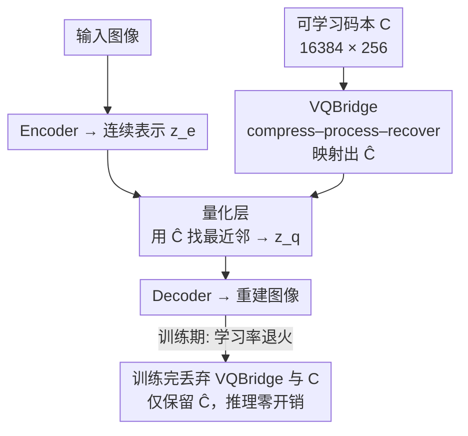

# Scalable Training for Vector-Quantized Networks with 100% Codebook Utilization

**Conference**: ICLR 2026  
**OpenReview**: [https://openreview.net/forum?id=juM14y0caI](https://openreview.net/forum?id=juM14y0caI)  
**Code**: https://github.com/yfChang-cv/FVQ  
**Area**: Diffusion Models / Image Generation / Discrete Image Tokenizers  
**Keywords**: Vector Quantization, Codebook Utilization, Discrete Tokenizer, Autoregressive Image Generation, VQBridge

## TL;DR
This paper addresses the long-standing issues of training instability and low codebook utilization in Vector Quantized (VQ) tokenizers. It proposes VQBridge (a compress–process–recover projector), which is used only during training and discarded at inference. Combined with learning rate annealing, this approach achieves **100% codebook utilization** across various configurations from 16k to 262k entries, reaching an rFID of 0.88. When integrated with LlamaGen for image generation, it outperforms VAR and DiT in terms of FID.

## Background & Motivation
**Background**: Autoregressive (AR) image generation (e.g., LlamaGen, VAR) relies on a discrete tokenizer that compresses continuous images into discrete tokens via vector quantization, allowing AR models to predict the next image token similar to word prediction. The reconstruction performance of the tokenizer essentially sets the ceiling for the generative model, making the design of discrete tokenizers crucial. Intuitively, increasing the codebook size should reduce information loss during quantization.

**Limitations of Prior Work**: Previous studies have repeatedly found that simply increasing the codebook size or code vector dimension often triggers **codebook collapse**, where only a small fraction of code vectors are actually utilized, causing utilization to drop sharply and undermining downstream generation capability. The comparisons in the paper are striking: when LlamaGen uses a $16,384 \times 256$ codebook, utilization is only 0.29% and rFID is as high as 9.21. Even with various mitigation techniques, reaching full utilization when scaling to a 262k codebook remains challenging.

**Key Challenge**: The root cause lies in the fact that VQ uses the **Straight-Through Estimator (STE)** to bypass the non-differentiable arg min operation, leading to three cascading issues: ① **Straight-through estimation bias**: $\delta = z_q - z_e$ directly contaminates the decoder and indirectly contaminates the encoder via commitment loss; ② **One-step-behind updates**: The commitment loss aligns the model with historical representations rather than current ones, as the codebook is updated via $z_q^{(t+1)} \leftarrow (1-\eta) z_q^{(t)} + \eta z_e^{(t)}$, while the decoder learns from old codebook outputs, causing encoder-decoder misalignment; ③ **Sparse codebook gradients**: Only the selected code vectors receive gradients, while unselected ones are never updated and effectively abandoned, which is the primary cause of collapse.

**Goal**: To maintain high codebook utilization even under the dual pressure of "learning rate annealing + codebook expansion," without introducing any inference overhead.

**Key Insight**: The authors follow the "linear reparameterization" idea—mapping the codebook set $C_z$ through a mapping function $f(\cdot)$ to a new set $\hat C_z = f(C_z)$ and optimizing them jointly, changing the objective to minimizing the distance $D(P_z, \hat C_z)$ between the encoded distribution $P_z$ and the mapped codebook $\hat C_z$. However, they made a critical observation: **linear projectors are too weak**. They are extremely sensitive to learning rates, with utilization dropping sharply during annealing. Even a 5-layer MLP cannot save the situation when scaling to large codebooks (Figure 3).

**Core Idea**: Replace the linear layer with a **strong, scalable, and training-only** projector that allows the codebook distribution to align rapidly with the encoding distribution in early training and maintain full utilization long-term. This projector is VQBridge.

## Method

### Overall Architecture
FVQ (FullVQ) = Standard VQN (Encoder + Quantization Layer + Decoder) + VQBridge (training-only) + Learning Rate Annealing. An input image is processed by the encoder to obtain the continuous representation $z_e$. In parallel, a learnable raw codebook $C$ (e.g., $16384 \times 256$) is fed into VQBridge and mapped to $\hat C = f(C)$. The quantization layer uses $\hat C$ instead of $C$ to find the nearest neighbor code vector for $z_e$, yielding $z_q$. The decoder reconstructs the image from $z_q$. The entire training process utilizes learning rate annealing (decaying to 1% of the initial value after warmup) to suppress the one-step-behind effect. **Key advantage**: After training, VQBridge and the raw codebook $C$ are discarded, and only the mapped codebook $\hat C$ is retained. Consequently, at inference, the model reverts exactly to a standard VQN with zero extra parameters and zero extra computation.

### Key Designs

**1. VQBridge Projector: Global interaction via compress–process–recover**

Linear projectors are weak because they perform affine transformations on each code vector independently, lacking expressivity and global information flow, making them unable to withstand learning rate annealing or large codebooks. VQBridge borrows from the DiT philosophy, designing $f(\cdot)$ as a "compress-process-recover" pipeline to ensure sufficient **mutual interaction** among all code vectors. Specifically, given a codebook $C$ with $K$ vectors, it first performs **1D patchify**: dividing the codebook into $p$ groups, each with $K/p$ vectors. Each group is compressed into a single vector via a shared linear projection $W_{comp}$ and processed by LayerNorm, resulting in $h_g = \mathrm{LN}(C_g W_{comp})$. Next, $N$ **ViT blocks** perform global attention interaction on the compressed sequence $H=[h_1,\dots,h_p]$ to establish complex relationships between code vectors: $H' = \mathrm{ViT}_N(H)$. Finally, **1D unpatchify** is performed: after LayerNorm, a shared projection $W_{exp}$ expands each vector back to $Kd/p$ dimensions, reshaped back to $\hat C \in \mathbb{R}^{K\times d}$. This compression step is the key to scalability—compressing $K$ vectors into $p$ groups before the ViT allows for global interaction on massive codebooks like 262k at a controllable cost. In the paper's toy experiments, standard STE causes $z_e$ and $z_q$ to follow spiral trajectories (reflecting quantization bias and update lag), while VQBridge ensures $z_q$ follows $z_e$ closely with piecewise linear trajectories, reducing distribution distance early on and pulling utilization from 3%/53% directly to 100%.

**2. Learning Rate Annealing: Suppressing the "one-step-behind update"**

A strong projector alone is insufficient. The authors theoretically derive an upper bound for the impact of "one-step-behind updates" and point out that **a smaller learning rate directly reduces this lag bias and improves encoder-decoder alignment** (Observation 2). Thus, FVQ adopts learning rate annealing: after 4 epochs of warmup, the learning rate decays to 1% of its initial value. This step and VQBridge are complementary rather than interchangeable—Figure 3 shows that while linear layers might briefly reach 100% on a 16k codebook, **utilization collapses as soon as annealing is applied**, whereas VQBridge consistently reaches and maintains 100% across all combinations of "16k / 262k × with/without annealing." Ablation data also confirms that annealing contributes significantly to reconstruction: removing annealing from FVQ increases rFID from 1.30 to 2.61.

**3. Co-scaling Patch Size and Codebook Scale: Making VQBridge truly "scalable"**

For VQBridge to be effective across scales from 16k to 262k, key hyperparameters cannot remain fixed. Through ablation, the authors found a clear scaling law: **patch size $p$ should scale with codebook size $K$ at a pace of $4^n$**—the optimal $p=4$ for $K=4k$, and $p=16$ for $K=16k$. Every time the codebook size increases by $4\times$, the patch size should also increase by $4\times$. This essentially balances "compression pressure in the patchify stage" against the "computational burden of ViT blocks": larger codebooks require more vectors per group, needing a coarser grouping to distribute the load. Two other conclusions are: the latent dimension $d'$ works best when equal to the code vector channel count (default 256; 512 leads to performance drops due to over-parameterization); a ViT depth of $N=2$ is optimal ($N=1$ underfits, $N=4$ degrades due to optimization difficulty). This co-scaling strategy allows FVQ to gain steady benefits across "larger codebooks / wider channels / longer training" without collapse.

### Loss & Training
The standard VQ objective is maintained: Task reconstruction loss + commitment loss $L_{cmt}(z_e, z_q) = d(z_q, \mathrm{sg}[z_e]) + \beta\, d(z_e, \mathrm{sg}[z_q])$, with STE used in the quantization layer $z_q = z_e + \mathrm{sg}[z_q - z_e]$ to bypass arg min. The only differences are: the codebook used for quantization is the mapped $\hat C$ from VQBridge, and the training includes learning rate annealing. Reconstruction experiments default to a $16,384 \times 256$ codebook, with VQBridge configured with a latent dimension of 256, depth 2, patch size 16, and trained for 40 epochs (base lr 1e-4, batch 128, Adam $\beta_1=0.9, \beta_2=0.95$). Extending to 120 epochs yields further improvements.

## Key Experimental Results

### Main Results
ImageNet $256 \times 256$ Reconstruction (comparing identical Encoder/Decoder; lower rFID is better):

| Method | Codebook Size | Code Dimension | rFID↓ | Utilization↑ |
|------|---------|-----------|-------|------------|
| VQGAN | 16,384 | 256 | 4.98 | 5.9% |
| LlamaGen | 16,384 | 256 | 9.21 | 0.29% |
| VQGAN-LC | 100,000 | 8 | 2.62 | 99% |
| IBQ (330 ep) | 16,384 | 256 | 1.55 | 97% |
| **Ours (40 ep)** | 16,384 | 256 | **1.30** | **100%** |
| **Ours (120 ep)** | 16,384 | 256 | **1.17** | **100%** |

Class-conditional Image Generation (paired with LlamaGen; lower FID is better):

| Type | Model | Parameters | FID↓ | IS↑ |
|------|------|-------|------|-----|
| Diffusion | DiT-XL/2 | 675M | 2.27 | 278.2 |
| VAR | VAR-d20 | 600M | 2.57 | 302.6 |
| AR | LlamaGen-XL | 775M | 3.39 | 227.1 |
| AR | **Ours-L** (LlamaGen-L) | 343M | **2.39** | 276.6 |
| AR | **Ours-XL** (LlamaGen-XL) | 775M | **2.07** | 287.0 |

FVQ-L (343M) outperforms the 600M VAR-d20 (2.39 vs 2.57), and FVQ-XL surpasses DiT-XL/2 (2.07 vs 2.27), suggesting that a simple AR framework can beat VAR and diffusion models if equipped with a high-quality tokenizer.

### Ablation Study

| Config | rFID(IN1k)↓ | Utilization | Description |
|------|------------|-----------|------|
| VQGAN, 16k×256 | 9.21 | 0.29% | Severe collapse at high dimension |
| Ours − Annealing, 16k×256 | 2.61 | 100% | Without LR annealing |
| Ours, 16k×256, 40ep | 1.30 | 100% | Default config |
| Ours, 65k×512, 120ep | 1.00 | 100% | Increased codebook/dim/epochs |
| Ours, 262k×256, 120ep | **0.88** | 100% | Largest codebook, SOTA reconstruction |
| Ours, 8× compression, 16k×256 | **0.39** | 100% | Lower compression ratio |

Generalization to multi-code representations (Table 4): FVQ(RQ-VAE) trained for 10 epochs achieves an rFID of 2.98, surpassing RQ-VAE trained for 50 epochs (3.20); FVQ(VAR) reduces rFID from 1.00 to 0.80.

### Key Findings
- **Sparse gradients are the primary cause of collapse**: Toy t-SNE experiments show pure STE uses only 3% of the codebook; adding a linear layer increases it to 53% (still insufficient), whereas VQBridge's dense cross-code interactions push it to 100%.
- **Annealing and strong projectors are both indispensable**: Linear layers collapse with annealing, and 5-layer MLPs fail on 262k codebooks; only VQBridge maintains full utilization across all settings. Annealing itself improves rFID from 2.61 to 1.30.
- **Predictable scaling**: Steady gains are achieved across codebook size (16k→262k, rFID 1.30→0.95), channels (4→256), and training duration (40→120 epochs) while maintaining 100% utilization—a feat VQGAN cannot achieve (utilization drops to 0.29% at high dimensions).
- **Hyperparameter sensitivity**: $d'$ should match code vector channels, ViT depth 2 is optimal, and patch size should co-scale with the codebook at a $4\times$ ratio.

## Highlights & Insights
- The **"training scaffold, inference zero-cost"** design is ingenious: VQBridge helps align distributions during training and is discarded along with the raw codebook afterward, retaining only the mapped $\hat C$. It leaves the original VQN inference process and cost untouched, making it "plug-and-play" with zero migration cost for existing VQ variants.
- **"Codebook utilization" as a more reliable diagnostic signal than estimation error**: The authors point out that low estimation error might be a facade caused by a few active code vectors, whereas high utilization truly indicates that more vectors are contributing—a criterion worth adopting for any study on quantization collapse.
- The **compress–process–recover paradigm** (compress for efficiency, then global interaction, then recover) can be transferred to any scenario requiring global modeling of a large set of vectors without exploding computational costs, such as large-scale retrieval codebooks or joint optimization of expert routing tables.
- **Repositioning AR generation**: The experiments demonstrate that the bottleneck often lies in the tokenizer rather than the generator itself. Using a high-quality FVQ tokenizer allows a simple AR model to surpass VAR/DiT, providing guidance on where to invest research resources.

## Limitations & Future Work
- Experiments focused on class-conditional generation and reconstruction on ImageNet/COCO; generalization to more complex scenarios like text-to-image has not been verified.
- While VQBridge has zero inference overhead, it introduces extra ViT computation and memory during training; cost details for ultra-large codebooks (262k) are not fully quantified.
- The co-scaling law (patch size $4\times$ with codebook) is an empirical observation; the theoretical explanation remains at the level of balancing "compression pressure vs ViT burden" and lacks rigorous characterization.
- The authors mention that high-dimensional code vectors (256) pave the way for semantic tokenizers (e.g., CLIP 512-dim), but this remains a future prospect without actual integration experiments.

## Related Work & Insights
- **vs. Linear Reparameterization / VQGAN-LC**: Both optimize the codebook via a mapping function $f(\cdot)$, but the former uses independent linear/MLP transformations for each vector, which are sensitive to annealing and fail on large codebooks. FVQ uses the VQBridge with global attention to introduce cross-vector interactions, maintaining 100% utilization under these conditions.
- **vs. IBQ / Direct Scaling Methods**: These rely on various regularizations or initializations to mitigate collapse, but still fail to reach full utilization when scaling to 262k entries (and require 330 epochs). FVQ achieves 100% utilization and an rFID of 0.88 at 262k in only 40 epochs.
- **vs. VAR / DiT (Generation Side)**: While these methods focus on generative architectures, FVQ argues the bottleneck lies in the tokenizer. A standard LlamaGen with an FVQ tokenizer outperforms both, shifting the focus from the generator back to the tokenizer design.

## Rating
- Novelty: ⭐⭐⭐⭐ The approach of using a training-only compress–process–recover ViT as a discardable projector is clean and effective.
- Experimental Thoroughness: ⭐⭐⭐⭐⭐ Comprehensive coverage across reconstruction, generation, scaling, generalization, and ablation, spanning 16k to 262k codebook sizes.
- Writing Quality: ⭐⭐⭐⭐ Clear dissection of the three main challenges; toy experiments and t-SNE provide intuitive clarity.
- Value: ⭐⭐⭐⭐⭐ 100% utilization + SOTA reconstruction + plug-and-play design offers high utility for discrete tokenizers and AR generation.

<!-- RELATED:START -->

## Related Papers

- [\[ICLR 2026\] Purrception: Variational Flow Matching for Vector-Quantized Image Generation](purrception_variational_flow_matching_for_vector-quantized_image_generation.md)
- [\[ICLR 2026\] Scalable Energy-Based Models via Adversarial Training: Unifying Discrimination and Generation](scalable_energy-based_models_via_adversarial_training_unifying_discrimination_an.md)
- [\[ICLR 2026\] Amortising Inference and Meta-Learning Priors in Neural Networks (BNNP)](amortising_inference_and_meta-learning_priors_in_neural_networks.md)
- [\[ICLR 2026\] QVGen: Pushing the Limit of Quantized Video Generative Models](qvgen_pushing_the_limit_of_quantized_video_generative_models.md)
- [\[ICLR 2026\] Flow Map Learning via Non-Gradient Vector Flow](flow_map_learning_via_non-gradient_vector_flow.md)

<!-- RELATED:END -->
