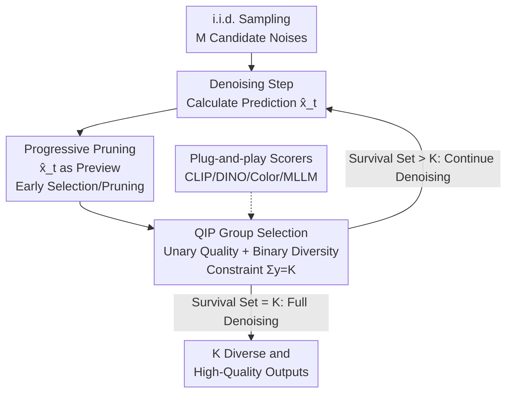

# Scaling Group Inference for Diverse and High-Quality Generation

**Conference**: ICLR 2026  
**OpenReview**: [https://openreview.net/forum?id=IyTNxjTuWT](https://openreview.net/forum?id=IyTNxjTuWT)  
**Code**: None (Anonymous code included in supplementary materials)  
**Area**: Diffusion Models / Image Generation / Inference-time Scaling  
**Keywords**: Group Inference, Diversity, Quadratic Integer Programming, Progressive Pruning, Inference-time Scaling

## TL;DR
Addressing the pain point where "users view a set of images (4-8) but i.i.d. sampling produces highly redundant results," this paper reformulates "generating a set of images for a prompt" as a **Quadratic Integer Programming (QIP) selection problem**. It selects a subset from a large candidate pool to simultaneously maximize individual quality (unary term) and intra-group diversity (binary term). By observing that "intermediate predictions serve as reliable previews of final images," the authors introduce **Progressive Pruning**, reducing complexity from $O(MT)$ to $O(M+KT)$. This approach consistently outperforms baselines like CFG, Interval Guidance, and Particle Guidance on the quality-diversity Pareto frontier.

## Background & Motivation

**Background**: Inference-time techniques for diffusion models (CFG, various guidance, and recent inference-time scaling) almost exclusively focus on **optimizing the quality of a single image**—enhancing text alignment, aesthetics, or fine-grained control.

**Limitations of Prior Work**: In real-world products (e.g., Midjourney, Adobe Firefly), users are typically presented with a grid of 4-8 images. The value of a set lies in providing **diverse choices in layout, lighting, and style** to inspire further modification. however, **independent and identically distributed (i.i.d.) sampling** for the same prompt often generates highly similar results (e.g., four red roses with nearly identical poses), wasting candidate slots and limiting exploration. Beyond creative tasks, downstream scenarios like synthetic data generation and design selection also require "good and diverse" output sets.

**Key Challenge**: There is a fundamental trade-off between quality and diversity. Conventional methods to improve quality—such as strong CFG, fine-tuning on high-quality low-diversity data, or distillation—**all sacrifice diversity**. Conversely, simply lowering CFG to increase diversity leads to degraded image quality and poor text alignment. More fundamentally, existing methods **optimize each image as an isolated sample**, failing to treat the "group" as a collective to be jointly optimized.

**Goal**: Improve both the **individual quality** and **intra-group diversity** of a set of $K$ images under the **same computational budget**, while remaining scalable to large candidate sets and various tasks (T2I, depth-conditioned, image customization).

**Key Insight**: Instead of optimizing each sampling trajectory individually (which, like Particle Guidance, might push samples off the data manifold and hurt quality), one should **sample extensively first and then select**. This converts the problem into a combinatorial "subset selection" optimization. A matching observation is that **intermediate predictions $\hat{x}_t$ in the denoising chain closely resemble the final image $x_0$**. Their quality/diversity scores correlate highly with the final scores, allowing for early ranking and pruning before full denoising.

**Core Idea**: Reformulate "generating multiple images" from **independent sampling** to **Group Inference**. This utilizes QIP to select $K$ candidates from $M$ pool members to maximize "quality + diversity," made scalable via progressive pruning of intermediate predictions.

## Method

### Overall Architecture

The method, titled **Scalable Group Inference**, is essentially a **test-time selection framework**. It requires no model changes or retraining, operating solely during inference to pick a "high-quality and diverse" subset from a large candidate pool. It addresses "how to jointly optimize a group of outputs" through two layers: a **Scoring Objective + QIP Selection** (deciding "what to pick") and **Progressive Pruning** (making the "picking" computationally feasible).

Specifically, given a generative model $G_\theta(z,c)$, $M$ candidate noises are first obtained via i.i.d. sampling. At each step of the denoising process, two types of scores are calculated for currently surviving candidates: **Unary scores $u_i$** (single image quality, e.g., CLIP similarity) and **Binary scores $b_{ij}$** (pairwise diversity, e.g., $1-\cos$ of DINOv2 features). A QIP is solved to select the current optimal subset as the survival set for the next step, and denoising is halted for discarded candidates. This layer-by-layer shrinkage $S_T \supset S_{T-1} \supset \cdots \supset S_0$ continues until the set size reaches the target $K$. These $K$ samples are then fully denoised to produce the final output group.

### Key Designs

**1. Quadratic Integer Programming (QIP) for Group Selection: Formulating "Good and Diverse" Sets**

Traditional i.i.d. sampling ignores inter-image relationships. The authors treat each candidate as a graph node and introduce binary selection variables $y_i\in\{0,1\}$ ($y_i=1$ if selected). The objective function contains both unary and binary terms:

$$\max_{y\in\{0,1\}^M}\ \sum_{i\in I} u_i\, y_i \;+\; \lambda \sum_{i<j} b_{ij}\, y_i y_j \quad \text{s.t.}\ \sum_{i\in I} y_i = K.$$

The unary score $u_i=f_{\text{CLIP}}(x^{(i)},c)$ measures individual image quality, while the binary score $b_{ij}=1-\cos\big(f_{\text{DINO}}(x^{(i)}),f_{\text{DINO}}(x^{(j)})\big)$ measures pairwise dissimilarity. $\lambda$ adjusts the weight between quality and diversity. The first term rewards "strong individual" samples, and the second term (the pairwise product $y_iy_j$ being the "quadratic" source) rewards "mutually different" pairs. This is solved using off-the-shelf solvers (e.g., Gurobi). Unlike previous methods, this formulation explicitly optimizes "group diversity" without modifying trajectories, ensuring selected images remain on the model's original data manifold.

**2. Progressive Pruning with Intermediate Predictions: Making QIP Scalable**

While the QIP formulation is elegant, naive selection requires denoising all $M$ candidates fully, resulting in $O(MT)$ complexity. The key observation is that **intermediate reconstructed predictions $\hat{x}_t = x_t + t\cdot\epsilon_\theta(x_t,t,c)$ roughly encode the final image's appearance**. The Spearman correlation of unary/binary scores between $\hat{x}_t$ and $x_0$ quickly approaches 1 (e.g., $r>0.7$ after 5 steps in multi-step models). Since intermediate predictions are reliable proxies, candidates can be ranked and pruned early.

A shrinking survival set is maintained: each step denoises only surviving candidates, calculates scores using $\hat{x}_t$, and solves the QIP to select a smaller subset. Specifically, if pruned by a constant ratio $\rho$ each step, the total model evaluations drop significantly. For $M=64, K=4, \rho=0.5, T=20$, this saves ~85% of compute compared to the naive approach, reducing complexity to $O(M+KT)$.

**3. Plug-and-play Scoring Functions and Diversity Definitions**

Since the QIP depends only on unary and binary scalar scores, the framework is **model-agnostic and does not require differentiability**. This is a significant departure from Particle Guidance (which requires backpropagating gradients of binary potentials). Unary terms can be swapped for CLIP (T2I) or DINOv2 (Image Customization), and binary terms can be tailored to specific "diversity definitions": using **color**-based differences to produce neon roses in various colors, or **DINO semantic** features for structural diversity in poses. It even supports non-differentiable scores from Multimodal LLMs.

### Loss & Training

This is a **training-free, fine-tuning-free** inference-time algorithm. Core hyperparameters include the weight $\lambda$, initial candidate size $M$, target group size $K$, and pruning ratio $\rho$. Scoring utilizes pre-trained CLIP and DINOv2 models, and QIP is solved via Gurobi.

## Key Experimental Results

The method was evaluated across three tasks (T2I, depth-conditioned generation, encoder-based image customization) using five base models (FLUX.1 Schnell/Dev, SD3-Medium, FLUX.1 Depth, SynCD).

### Main Results

On the quality-diversity Pareto frontier, the proposed **Group Inference** **dominates** all baselines across all five models—offering higher diversity at a given quality level, and vice versa. User preference studies (e.g., on FLUX.1 Dev) further validate this:

| Comparison (FLUX.1 Dev) | Diversity Preference (Ours vs Base) | Quality Preference (Ours vs Base) |
|--------|------|------|
| vs Low-CFG | 88.3% / 11.7% | 85.6% / 14.4% |
| vs Interval Guidance | 53.4% / 46.6% | 58.4% / 41.6% |
| vs Particle Guidance | 81.2% / 18.8% | 79.4% / 20.6% |

The preference gaps are even larger on SD3-M. Baselines tend to fail by either degrading quality (Low-CFG), ignoring prompt instructions (Interval Guidance), or introducing artifacts by pushing samples off-manifold (Particle Guidance).

### Ablation Study

| Configuration | Key Conclusion |
|------|---------|
| Full (Progressive Pruning) | Significantly faster with comparable group scores. |
| w/o Pruning (Select after full denoising) | Runtime increases by 49% (FLUX.1 Dev) to 73% (Schnell). |
| Inference Diffusion Scaling (Ma et al.) | Group objectives show almost no improvement (lacks pairwise terms). |
| Merely increasing denoising steps | Group scores saturate quickly with diminishing returns. |

### Key Findings
- **Progressive Pruning is efficient**: It saves 49%-73% in runtime without increasing peak VRAM.
- **Reliability of intermediate predictions**: High score correlation ($r>0.7$) allows for early pruning; distilled models can even determine rankings in the first step.
- **Inference scaling direction**: Investing budget in "increasing initial candidates $M$" is more effective than increasing denoising steps or independent seed searches.
- **Customizable diversity**: Changing the binary term allows for direct user control over whether they want color diversity, structural diversity, etc.

## Highlights & Insights
- **Generative problem as a selection problem**: Instead of modifying sampling trajectories (which harms quality), the "sample + select" approach bypasses the quality-diversity trade-off.
- **Intermediate predictions as previews**: The empirical fact that $\hat{x}_t$ correlates with $x_0$ is used to compress $O(MT)$ into $O(M+KT)$. This "verify-then-prune" logic is transferable to any iterative refinement process.
- **Non-differentiable scoring**: By solving QIP rather than backpropagating, the system can integrate MLLM-based scores, offering scalability far beyond Particle Guidance.

## Limitations & Future Work
- The method **depends on the quality of base models and scorers**: If the base model lacks inherent diversity or the scorers are inaccurate, the selection ceiling is limited.
- Scoring functions must be **computationally efficient**, as scoring the survival set at each step could otherwise offset the gains from pruning.
- The use of commercial solvers (Gurobi) and the scalability of integer programming for extremely large $M$ might pose deployment barriers.
- Hyperparameters like $\lambda$ and $\rho$ are currently set empirically, and a systemic automated tuning scheme is missing.

## Related Work & Insights
- **vs Particle Guidance**: Particle Guidance (1) often hurts quality, (2) is VRAM-intensive due to pairwise gradients, and (3) cannot use non-differentiable scores. Ours outperforms it on all counts.
- **vs CFG / Interval Guidance**: These sacrifice quality or prompt faithfulness to gain diversity. Ours maintains both by staying on the original manifold.
- **vs Inference Diffusion Scaling (Ma et al.)**: Prior work focuses on single-image scores via independent seed searches. This framework is the first to optimize the "group objective."

## Rating
- Novelty: ⭐⭐⭐⭐⭐ Formulating multi-image generation as a joint quality-diversity QIP and enabling scalability via intermediate prediction pruning is highly original.
- Experimental Thoroughness: ⭐⭐⭐⭐⭐ Comprehensive coverage across three tasks, five models, Pareto frontiers, and user studies.
- Writing Quality: ⭐⭐⭐⭐⭐ Clear motivation with solid complexity analysis and empirical evidence.
- Value: ⭐⭐⭐⭐⭐ Directly addresses a real pain point in image generation products with a training-free, plug-and-play solution.

<!-- RELATED:START -->

## Related Papers

- [\[ICLR 2026\] PosterCraft: Rethinking High-Quality Aesthetic Poster Generation in a Unified Framework](postercraft_rethinking_high-quality_aesthetic_poster_generation_in_a_unified_fra.md)
- [\[ICLR 2026\] Inference-Time Scaling of Diffusion Models Through Classical Search](inference-time_scaling_of_diffusion_models_through_classical_search.md)
- [\[ICLR 2026\] Diverse Text-to-Image Generation via Contrastive Noise Optimization](diverse_text-to-image_generation_via_contrastive_noise_optimization.md)
- [\[ICLR 2026\] Compositional Visual Planning via Inference-Time Diffusion Scaling](compositional_visual_planning_via_inference-time_diffusion_scaling.md)
- [\[ICLR 2026\] PQGAN: Product-Quantised Image Representation for High-Quality Image Synthesis](pqgan_product-quantised_image_representation_for_high-quality_image_synthesis.md)

<!-- RELATED:END -->
