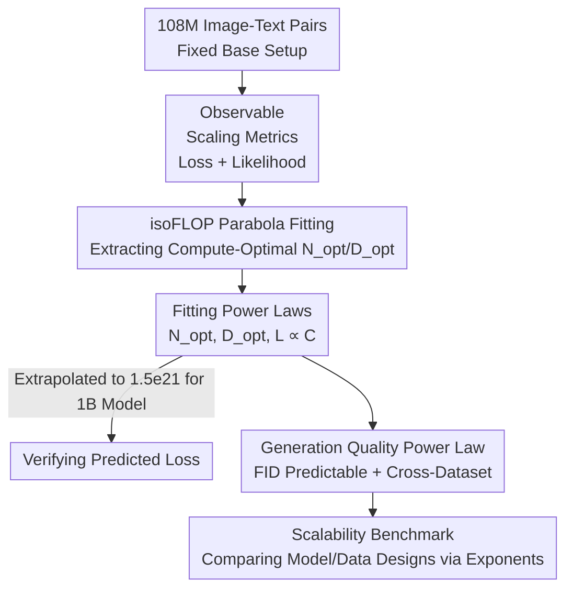

# Scaling Laws for Diffusion Transformers

**Conference**: ICLR 2026  
**OpenReview**: [https://openreview.net/forum?id=T985gm4sDA](https://openreview.net/forum?id=T985gm4sDA)  
**Code**: None  
**Area**: Diffusion Models / Text-to-Image Generation / Scaling Law  
**Keywords**: Diffusion Transformer, Scaling Law, Compute-optimal, isoFLOP, FID Prediction

## TL;DR
This paper systematically trains Diffusion Transformers (DiT) within a compute budget range of 1e17 to 6e18 FLOPs, fitting the first explicit scaling laws for DiT—where pre-training loss follows a power law relationship with compute. This enables precise prediction of optimal model size, data volume, and final generation quality (FID) for a given compute budget, and demonstrates that these power laws can extrapolate to 1.5e21 FLOPs and transfer across datasets.

## Background & Motivation
**Background**: In Large Language Models (LLMs), scaling laws (Kaplan, Hoffmann/Chinchilla, etc.) have been repeatedly validated—pre-training performance decreases as a power law of compute $C$, where $C \approx 6ND$ ($N$ is parameter count, $D$ is data volume). With these laws, one can calculate whether to spend a budget on larger models or more data, achieving optimal resource allocation.

**Limitations of Prior Work**: Although the scalability of Diffusion Transformers (DiT) has been observed (Mei, Li, et al. noted that "larger models yield better visual quality and alignment"), this scaling has only been "observed" rather than "precisely predicted." In other words, while it is known that increasing compute is beneficial, no formula exists to tell researchers the optimal model size, data volume, and resulting loss for a given budget.

**Key Challenge**: The lack of explicit scaling laws makes the mapping from compute budget to model scale/data volume/loss a "black box." In practice, this leads to heuristic-based searching of configurations, which is expensive and fails to guarantee an optimal balance.

**Goal**: The goal of this work is to establish the scaling law framework for DiT text-to-image pre-training by: (1) confirming a loss-compute power law; (2) linking pre-training loss to generation quality metrics (e.g., FID); and (3) using these laws as a low-cost "scalability benchmark" to evaluate model and data designs.

**Key Insight**: The authors observe that while diffusion models do not directly optimize likelihood, the training loss under rectified flow (velocity field matching error) and various likelihood proxy metrics consistently decrease as power laws relative to compute. Therefore, the training loss is a sufficient observable metric for scaling.

**Core Idea**: Use isoFLOP (equal compute) experiments at multiple small budget points to find "compute-optimal" configurations, then fit these points to power law formulas. This converts the chain of "Compute $\rightarrow$ Optimal Model/Data $\rightarrow$ Loss $\rightarrow$ Generation Quality" into a predictable closed-form relationship.

## Method

### Overall Architecture
Ours does not propose a new model but rather an **empirical measurement + power law fitting** research pipeline. The pipeline involves: fixing a base training setup (Rectified Flow + v-prediction + standard In-Context Transformer); training multiple models of varying sizes (1M to 1B parameters) at discrete compute budgets $[1e17, 3e17, 6e17, 1e18, 3e18, 6e18]$; fitting a parabola (isoFLOP) to the "model scale vs. loss" curve for each budget to find the compute-optimal point $(N_{opt}, D_{opt})$; fitting power laws to these points on log-log coordinates to obtain closed-form expressions for $N_{opt}$, $D_{opt}$, and $L$ relative to $C$; and finally extrapolating to 1.5e21 FLOPs to train a ~1B model and verifying that generation quality (FID) and cross-dataset performance (COCO) follow the same power laws.

### Key Designs

**1. Selection of Observable Scaling Metrics: Replacing Likelihood with Velocity Field Matching Loss**

LLMs optimize next-token likelihood, making loss a natural scaling metric. Diffusion models, however, match a time-conditional velocity field. Ours utilizes the Rectified Flow formulation where velocity is defined as $v(x_t, t) = \alpha'_t x_0 + \beta'_t \epsilon$. With $\alpha_t = 1-t$ and $\beta_t = t$, this simplifies to $v(x_t, t) = -x_0 + \epsilon$. The training objective is:

$$L(\theta) = \mathbb{E}_{x_0, t, \epsilon}\big[\lVert v_\theta(x_t, t) + x_0 - \epsilon \rVert^2\big].$$

Since this loss is estimated via Monte Carlo sampling (time steps and noise) and has high variance, the authors use a large batch size of 1024 and apply EMA smoothing ($\alpha_{\text{EMA}}=0.9$) to the loss values. The authors observe that training loss, validation loss, VLB-approximated likelihood, and exact likelihood (calculated via Neural ODE) all follow consistent power laws. Thus, training loss serves as a direct and efficient primary metric.

**2. isoFLOP Parabola Fitting: Extracting Compute-Optimal Configurations**

To derive the scaling laws, the authors follow the Chinchilla (Hoffmann et al.) Approach 2: fix a compute budget $C$, train a series of models with different parameter counts $N$, and plot the "model scale vs. loss" curve. By fitting a parabola, the minimum point (optimal $(N_{opt}, D_{opt})$) is identified. Plotting these optima on log-log coordinates reveals that $\log N_{opt}$ and $\log D_{opt}$ vary linearly with $\log C$, following $N_{opt}\propto C^a$ and $D_{opt}\propto C^b$. The fitted results are:

$$N_{opt} = 0.0009 \cdot C^{0.5681}, \qquad D_{opt} = 186.8535 \cdot C^{0.4319}.$$

The sum of exponents is approximately 1 (consistent with $C=6ND$), and the model exponent (0.5681) is slightly larger than the data exponent (0.4319), suggesting that as compute increases, the model size should grow slightly faster than the data volume.

**3. Incorporating Generation Quality: Predicting FID via Compute**

Generation quality metrics also follow power laws. The relationship between FID and training budget is fitted as:

$$\text{FID} = 2.2566 \times 10^6 \cdot C^{-0.234}.$$

(FID is calculated using CLIP ViT-L/14 features). This allows predicting visual quality directly from the budget. Furthermore, this predictability extends to out-of-distribution (OOD) sets like COCO 2014, where all metrics follow consistent trends despite a vertical offset caused by the domain gap.

**4. Scaling Laws as a Scalability Benchmark: Comparing Designs via Exponents**

Ours treats the scaling law as a low-cost evaluation tool. By running isoFLOP experiments on small budgets, one can determine if an architecture or data pipeline is "more scalable" without large-scale training. For a fixed data pipeline, a more efficient model should have a **smaller model exponent + larger data exponent** (indicating better data utilization). For any design change, a better pipeline corresponds to a **smaller (more negative) loss/FID exponent**.

## Key Experimental Results

### Main Results
Experiments were conducted on 108M image-text pairs randomly sampled from Laion-Aesthetic and re-captioned with LLaVA-1.5. Most experiments follow a "data-infinite" setting (one epoch).

| Relationship | Fitted Formula | Meaning |
|------|----------|------|
| Optimal Model Scale | $N_{opt}=0.0009\cdot C^{0.5681}$ | Optimal parameters grow as a power law of compute |
| Optimal Data Volume | $D_{opt}=186.8535\cdot C^{0.4319}$ | Data scales with models, but slightly slower |
| Training loss | $L=2.3943\cdot C^{-0.0273}$ | Loss follows a power law decay |
| Generation FID | $\text{FID}=2.2566\times10^6\cdot C^{-0.234}$ | Quality is predictable based on compute |

**Extrapolation Validation**: Following the formula, a compute-optimal model for 1.5e21 FLOPs requires ~958.3M parameters. Ours trained a ~1B model at this budget, and its actual loss and FID matched the predictions almost perfectly, proving reliable extrapolation across three orders of magnitude.

### Ablation Study
Using the "scalability exponent comparison" to evaluate two condition injection architectures:

| Model | Model Exponent | Data Exponent | Loss Exponent |
|------|---------|---------|-----------|
| Vanilla In-Context | 0.56 | 0.43 | −0.0273 |
| Cross-Attention | 0.54 | 0.46 | −0.0385 |

The Cross-Attention variant has a larger absolute loss exponent (faster decline) and a smaller model exponent, indicating it is more scalable within this specific configuration.

### Key Findings
- **Trend vs. Coefficient Decoupling**: Training tricks and architectural details primarily affect the scaling law coefficients, not the "power law" trend itself.
- **Multi-Metric Consistency**: Training loss serves as a reliable proxy for likelihood and generation quality (FID).
- **Cross-Domain Transferability**: Scaling behavior remains predictable on OOD datasets like COCO, despite constant offsets.
- **Model vs. Data Scaling**: In this setting, scaling the model size is slightly more compute-efficient than scaling data volume (0.57 vs 0.43).

## Highlights & Insights
- **Bypassing the Likelihood Constraint**: By validating that RF training loss scales consistently with likelihood proxies, the authors enable scaling law research for diffusion without expensive likelihood evaluations.
- **Scaling Laws as a "Cheap Microscope"**: Small-budget isoFLOP fitting allows researchers to judge the scalability of designs early, avoiding the cost of large-scale failures.
- **Predictable Generation Quality**: Establishing a closed-form mapping from compute to FID/human preference metrics allows for pre-calculating the return on investment for compute.

## Limitations & Future Work
- **Compute Range**: Scaling was primarily fitted up to 6e18 FLOPs. While extrapolation to 1.5e21 worked, stability at industrial scales (e.g., 1e25) remains to be seen.
- **Setting Dependency**: Coefficients depend on resolution, VAE, and data pipelines; they must be re-fitted if these base components change significantly.
- **OOD FID Gap**: The FID offset between datasets can grow with compute, meaning trend prediction is more reliable than absolute value prediction across domains.
- **Inference/Distillation**: The study focuses on pre-training and does not cover scaling behaviors for sampling acceleration or distilled models.

## Related Work & Insights
- **vs. Kaplan / Hoffmann (LLM Scaling Laws)**: Ours adapts the Chinchilla methodology to Diffusion Transformers, solving the lack of direct likelihood in diffusion by using RF loss.
- **vs. Mei et al. / Li et al. (Empirical Scaling)**: While prior work observed that DiT scales well, Ours provides the first explicit formulas to "predict" that scaling.
- **vs. Esser et al. (SD3 / MMDiT)**: SD3 noted that DiT loss predicts quality; Ours formalizes this into a scalability benchmark and provides precise exponents for architectural comparisons.

## Rating
- Novelty: ⭐⭐⭐⭐
- Experimental Thoroughness: ⭐⭐⭐⭐
- Writing Quality: ⭐⭐⭐⭐
- Value: ⭐⭐⭐⭐⭐

<!-- RELATED:START -->

## Related Papers

- [\[ICLR 2026\] Routing Matters in MoE: Scaling Diffusion Transformers with Explicit Routing Guidance](routing_matters_in_moe_scaling_diffusion_transformers_with_explicit_routing_guid.md)
- [\[NeurIPS 2025\] Scaling Diffusion Transformers Efficiently via μP](../../NeurIPS2025/image_generation/scaling_diffusion_transformers_efficiently_via_μp.md)
- [\[ICLR 2026\] Rethinking Global Text Conditioning in Diffusion Transformers](rethinking_global_text_conditioning_in_diffusion_transformers.md)
- [\[ICLR 2026\] Dual-Path Condition Alignment for Diffusion Transformers](dual-path_condition_alignment_for_diffusion_transformers.md)
- [\[ICLR 2026\] A Hidden Semantic Bottleneck in Conditional Embeddings of Diffusion Transformers](a_hidden_semantic_bottleneck_in_conditional_embeddings_of_diffusion_transformers.md)

<!-- RELATED:END -->
