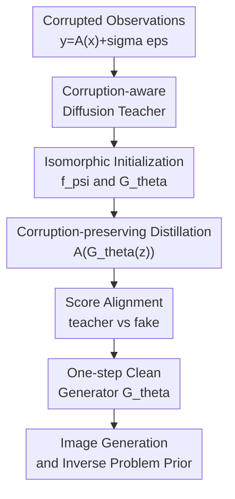

# Score Distillation Beyond Acceleration: Generative Modeling from Corrupted Data

**Conference**: ICLR2026  
**OpenReview**: [https://openreview.net/forum?id=ROGCckKICU](https://openreview.net/forum?id=ROGCckKICU)  
**Code**: Yes, TianyuCodings/RSD  
**Area**: Image Generation / Diffusion Models  
**Keywords**: Generative modeling from corrupted data, Score Distillation, Diffusion Models, Image Restoration, MRI  

## TL;DR
This paper proposes Restoration Score Distillation (RSD), which distills a diffusion teacher trained only on corrupted observations into a one-step generator. It discovers that in corrupted data scenarios, distillation not only accelerates sampling but also significantly shifts the generated distribution closer to the clean image distribution.

## Background & Motivation
**Background**: Diffusion models are among the most popular generative priors for high-quality image generation and inverse problems. However, standard training assumes access to clean samples $x \sim p_X$. In real-world scientific imaging and engineering, this assumption often fails: MRI captures only undersampled k-space, astronomical observations are limited by instruments and noise, and image restoration tasks may only provide blurred, occluded, downsampled, or noisy versions.

**Limitations of Prior Work**: Methods like Ambient Diffusion, Ambient Tweedie, and Fourier-space Ambient Diffusion allow diffusion models to learn from corrupted data $y=A(x)+\sigma\epsilon$, but they typically rely on multi-step reverse processes. More critically, even with corruption-aware objectives, the diffusion teacher often learns a "diffuse" observation distribution or an approximate clean distribution. Due to the need to cover vast regions induced by noise and non-invertible operators, the generation quality may not closely match the true clean distribution.

**Key Challenge**: Training generative models from corrupted data involves two major issues. First, the training data represents the observation distribution $p_Y$ (induced by $A$ and noise) rather than the target distribution $p_X$. Second, the likelihood or score matching training of the diffusion teacher tends to cover all plausible modes, which can spread the probability mass too thinly when noise is high or information is missing. While traditional score distillation is seen as a compression tool, the authors investigate whether distillation can rectify this distributional bias.

**Goal**: The objective is to train a clean image generator directly from corrupted observations without any clean images. This generator should handle various corruptions: additive noise, Gaussian blur, random inpainting, super-resolution downsampling, and Fourier undersampled MRI, ideally producing high-quality samples in a single step.

**Key Insight**: The optimization of score distillation is computed over the distribution of samples produced by the student generator rather than the entire region covered by the teacher. This mechanism of "aligning the teacher score only where the student samples" naturally discards low-density diffuse regions in corrupted data scenarios. Consequently, the student might not just replicate the teacher but actually move closer to the clean distribution than the teacher itself.

**Core Idea**: First, a diffusion teacher that understands corrupted observations is trained. Then, it is distilled into a one-step generator via score distillation that preserves the same corruption pipeline. This allows the distillation process to simultaneously compress sampling steps and "purify" the clean generative prior from the corrupted distribution.

## Method

### Overall Architecture
RSD takes a batch of corrupted observations $\{y^{(i)}\}_{i=1}^N$ as input, where $y=A(x)+\sigma\epsilon$ and $A$ can be identity, blur, mask, downsampling, or Fourier acquisition. The method consists of two stages: Phase I uses a corruption-aware diffusion objective tailored to $A$ to train teacher $f_\phi$. Phase II distills the teacher into a one-step generator $G_\theta$, processing the generator output through the same corruption pipeline so that the fake diffusion $f_\psi$ and the teacher are aligned under the same observational semantics.

Importantly, RSD does not explicitly restore every training image first to train a generative model. Instead, it bridges "information visible in the measurement space" and the "teacher score field." The teacher learns available scores from corrupted observations, and the student generator is pushed toward high-density regions supported by the teacher score during distillation, ultimately outputting clean-looking samples.

### Key Designs
**1. Unified Corrupted Observation Modeling: Integrating denoising, restoration, and scientific imaging**

The paper formulates training data as $y=A(x)+\sigma\epsilon$. When $A=I$, it reduces to noisy image generation/denoising; when $A$ represents blur, mask, downsampling, or a Fourier mask, it covers image restoration and MRI. This formulation allows RSD to treat various corruptions through replaceable objectives rather than task-specific algorithms.

In Phase I, different teacher objectives are chosen based on the scenario. Standard diffusion learns $p_Y$ for noise-free corruptions; a noisy corruption objective is used for additive noise; an Ambient Diffusion-style objective with masks is used for random inpainting; and a Fourier-space masked objective is used for MRI. This makes RSD a general framework.

**2. Corruption-preserving Distillation: Student outputs must pass through the same measurement pipeline**

Standard score distillation typically has the generator produce $x_\theta=G_\theta(z)$, followed by aligning teacher and fake scores on noisy $x_t$. The critical modification in RSD is that the generator output cannot be used directly to train the fake diffusion. Instead, the same corruption as the real data must be applied: $\tilde y=A(\mathrm{stopgrad}(G_\theta(z)))+\sigma\epsilon$. The fake diffusion $f_\psi$ is trained on these synthetic corrupted samples, while the teacher $f_\phi$ is derived from real corrupted samples.

This design ensures semantic alignment. If the real teacher observes $A(x)+\sigma\epsilon$ but the fake model observes uncorrupted $G_\theta(z)$, the alignment space for the score fields is inconsistent. Forcing the fake side through the same corruption pipeline ensures the student learns that its samples, when measured, should resemble real observations.

**3. Consistent Objectives Across Teacher and Fake Diffusion: Avoiding distillation target drift**

A practical constraint in Algorithm 1 is that the objectives used for the teacher in Phase I and the fake diffusion in Phase II must be consistent. For example, if the teacher uses a noisy corruption objective, the fake diffusion must also use a denoising-aware objective. The authors note that mixing objectives can lead to training instability or divergence.

This ensures RSD aligns within the same family of distributions. If the teacher's score describes a time-dependent denoising field for corrupted observations while the fake diffusion uses a different objective, the distillation loss endpoints will have different biases, rendering the student's update direction unreliable.

**4. Distillation as More Than Acceleration: Distribution matching for quality enhancement**

The paper utilizes SiD-style Fisher divergence distillation, which aligns the teacher $f_\phi$ and fake diffusion $f_\psi$ near samples induced by the generator:

$$
L_{distill}(\theta)=\mathbb{E}_{\sigma_t,z,x_\theta=G_\theta(z)}\left[\|f_\phi(x_t,t)-f_\psi(x_t,t)\|_2^2\right].
$$

The expectation is taken over the student generator's distribution rather than the corrupted dataset or the teacher's full support. Consequently, low-density regions that the teacher maintains to cover noisy observations are not necessarily sampled by the student. Intuitively, the teacher provides the score field for "what looks like data," and the student places its probability mass on high-quality regions. This explains why RSD can outperform the teacher on corrupted data.

### Loss & Training
RSD training is split into teacher pretraining and distillation. Teacher pretraining loss is determined by the corruption type: standard diffusion loss $L_{SD}$ for noise-free data, noisy corruption loss $L_N$ for known noise levels $\sigma$, random inpainting loss $L_{RI}$ for masked regions, and a Fourier-space objective for measurement consistency in the frequency domain.

The distillation phase uses SiD as the default loss. Both $f_\psi$ and $G_\theta$ are initialized from the teacher and share similar network architectures to stabilize training. Algorithm 1 specifies that additional random corruption noise should not be injected when updating $\theta$; the generator update uses $y_\theta=A(G_\theta(z))$ for the distillation loss, while the fake diffusion is trained on stop-gradient samples $\tilde y$.

The paper also proposes Proximal FID as a model selection metric when no clean validation set is available. It involves generating 50k clean samples, applying the same $A$ and $\sigma$ to make them corrupted, and calculating the FID against the corrupted training set. Experiments show it tracks true FID well enough to select near-optimal checkpoints.

## Key Experimental Results

### Main Results
Experiments cover denoising, general image corruption, and MRI. In the zero-shot corrupted-data setting (no clean images), RSD consistently outperforms the teacher diffusion and several few-shot baselines.

| Task / Dataset | Metric | Ours | Prev. SOTA / Baseline | Gain |
| :--- | :--- | :--- | :--- | :--- |
| CIFAR-10 denoising, $\sigma=0.2$ | FID↓ | 4.77 | Teacher-Truncated 12.21 / Teacher-Consistency 11.93 | Significantly beats teacher; close to clean DDPM (4.04) |
| CelebA-HQ denoising, $\sigma=0.2$ | FID↓ | 6.48 | Teacher-Truncated 13.90 / Teacher-Consistency 12.97 | ~50% FID reduction |
| FFHQ denoising, $\sigma=0.2$ | FID↓ | 6.29 | Teacher-Truncated 14.67 | Significant quality boost |
| AFHQ-v2 denoising, $\sigma=0.2$ | FID↓ | 5.42 | Teacher-Truncated 9.82 | Quality/coverage balance |
| CelebA-HQ super-resolution ×2, $\sigma=0.0$ | FID↓ | 12.99 | Teacher Diffusion 23.28 | Effective on restoration tasks |
| Multi-coil MRI, R=4 | FID↓ | 10.71 | Teacher Diffusion 32.31 / L1-EDM 27.64 | Larger gain in scientific imaging |

### Ablation Study
| Configuration | Key Metric | Description |
| :--- | :--- | :--- |
| CIFAR-10 $\sigma=0.1$ RSD | FID 3.98, IS 9.346 | Approaches clean-data baseline with high recall |
| CIFAR-10 $\sigma=0.4$ RSD | FID 21.63 | Performance drops at high noise but still beats teacher (124.28) |
| CelebA-HQ 10% data | RSD FID 10.53 vs Teacher-Truncated 14.36 | Gains persist with limited corrupted data |
| CelebA-HQ 100% data | RSD FID 6.48 vs Teacher-Truncated 13.90 | More data leads to greater RSD benefits |
| Distillation loss: SDS | FID > 200 | Unstable in corrupted regime with default hyperparameters |
| Distillation loss: DMD | CIFAR-10 $\sigma=0.2$ FID 7.48 | Functional but weaker than SiD |
| Distillation loss: SiD | CIFAR-10 $\sigma=0.2$ FID 4.77 | Default choice with best robustness |

### Key Findings
- In denoising, RSD is not just faster than the teacher; it produces better quality than the full teacher, truncated teacher, or consistency teacher.
- RSD is effective for both noise-free and noisy corruptions, though severe noisy restoration is challenging.
- MRI experiments demonstrate compatibility with Fourier-space corruption-aware teachers for complex-valued scientific data.
- Proximal FID effectively performs checkpoint selection without clean validation data. In FFHQ, Proximal FID chose a checkpoint with true FID 6.12 (oracle best was 6.08).
- Efficiency gains are substantial: CIFAR-10 $\sigma=0.2$ sampling for 50k images dropped from ~10 minutes (teacher) to ~20 seconds (RSD), a 30x speedup.

## Highlights & Insights
- The most valuable contribution is the reinterpretation of score distillation from "compressing sampler steps" to a "quality correction mechanism" for corrupted data scenarios.
- The framework is highly general; different corruptions only require substituting the Phase I objective while keeping the distillation core consistent.
- Corruption-preserving distillation is a transferable trick. It can theoretically be applied to any measurement process (CT projections, interferometry) as long as $A$ can be applied forward.
- Proximal FID provides a practical solution to the common lack of ground truth in corrupted-data generation.
- Linear Gaussian examples provide theoretical support, suggesting the distillation global optimum can be closer to the clean distribution than the noisy distribution.

## Limitations & Future Work
- RSD assumes knowledge of the corruption operator $A$. Estimating unknown complex operators remains an open problem.
- Phase I teacher pretraining remains a computational bottleneck even if Phase II is efficient.
- While results in images and MRI are strong, more complex forward models like dynamic CT or seismic imaging haven't been verified.
- The choice of distillation loss is empirical. While SiD performs best, other losses like SDS or DMD might require specific tuning for corrupted regimes.
- Conditional inverse problem applications currently use simple methods like latent optimization; more stable conditional sampling with one-step priors is needed.

## Related Work & Insights
- **vs Ambient Diffusion**: Ambient Diffusion learns clean distributions from corrupted data. RSD uses such models as teachers and further improves quality and speed via distillation.
- **vs Ambient Tweedie / Noisy Corruption Diffusion**: These focus on better denoising objectives for additive noise; RSD incorporates these as teacher objectives.
- **vs EM-Diffusion**: EM-Diffusion uses E-step reconstruction and M-step updates, often requiring clean image initialization. RSD is zero-shot Regarding clean images and uses score distillation rather than explicit reconstruction.
- **vs SiD / DMD / SDS**: These distill clean-data teachers. RSD uniquely applies distillation to corrupted data and demonstrates that the student can significantly outperform the teacher.

## Rating
- Novelty: ⭐⭐⭐⭐☆
- Experimental Thoroughness: ⭐⭐⭐⭐⭐
- Writing Quality: ⭐⭐⭐⭐☆
- Value: ⭐⭐⭐⭐⭐

<!-- RELATED:START -->

<!-- RELATED:END -->

## Related Papers

- [\[ICML 2026\] Compositional Generative Modeling from Decentralized Data](../../ICML2026/image_generation/compositional_generative_modeling_from_decentralized_data.md)
- [\[ICLR 2026\] Gauge Flow Matching: Efficient Constrained Generative Modeling over General Convex Set and Beyond](gauge_flow_matching_efficient_constrained_generative_modeling_over_general_conve.md)
- [\[ICLR 2026\] Large Scale Diffusion Distillation via Score-Regularized Continuous-Time Consistency](large_scale_diffusion_distillation_via_score-regularized_continuous-time_consist.md)
- [\[ICLR 2026\] Partition Generative Modeling: Masked Modeling Without Masks](partition_generative_modeling_masked_modeling_without_masks.md)
- [\[ICLR 2026\] Continuously Augmented Discrete Diffusion model for Categorical Generative Modeling](continuously_augmented_discrete_diffusion_model_for_categorical_generative_model.md)

<!-- RELATED:END -->
