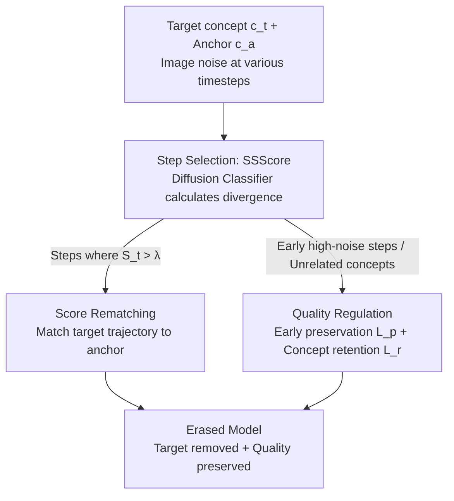

# SDErasure: Concept-Specific Trajectory Shifting for Concept Erasure via Adaptive Diffusion Classifier

**Conference**: ICLR 2026  
**OpenReview**: [https://openreview.net/forum?id=EWM9JQ6gX7](https://openreview.net/forum?id=EWM9JQ6gX7)  
**Area**: Diffusion Models / Concept Erasure  
**Keywords**: Concept Erasure, Text-to-Image Diffusion, Denoising Trajectory, Diffusion Classifier, Timestep Selection

## TL;DR
SDErasure identifies that "the generation of each concept depends only on a small segment of critical denoising timesteps." It utilizes a Diffusion Classifier to adaptively select these critical steps for each concept to be erased. By performing trajectory shifting fine-tuning only on these steps and incorporating dual-path quality regulation losses, the method achieves thorough concept erasure while reducing MSCOCO FID from 9.51 to 6.74.

## Background & Motivation

**Background**: Text-to-image diffusion models tend to memorize and reproduce undesirable content from training sets, such as NSFW, copyrighted works, and faces of public figures. Concept erasure aims to remove these "prohibited concepts" from the model so that relevant prompts no longer generate corresponding images. Mainstream training-based methods (ESD, FMN, UCE, MACE, etc.) achieve thorough erasure through weight fine-tuning.

**Limitations of Prior Work**: Training-based methods cause excessive perturbation to the parameter distribution of the original model, leading to "over-invasiveness" in two dimensions: (1) images generated under erased concepts become perceptually distorted (poor related-concept quality); (2) image quality under unrelated concepts significantly degrades (poor unrelated-concept fidelity). In other words, erasing a "cat" may damage the model's overall generative capability.

**Key Challenge**: The authors attribute the root cause to "applying a unified strategy to erase all concepts, ignoring the individual generation mechanism of each concept." Existing methods apply erasure uniformly across **all timesteps**, which indiscriminately disrupts the entire denoising trajectory.

**Key Insight**: By observing denoising trajectories, a key fact was discovered—different concepts emerge at different critical timesteps: structural concepts (airplanes, churches) are determined during the high-noise phase (early steps), while fine-grained semantics (facial identity, artist style) surface during the low-noise phase (late steps). Figure 1 demonstrates with "cat": erasing only in the middle steps removes the cat while preserving the overall structure; early/full phase erasure distorts the structure, while late-phase erasure fails to erase cleanly. Furthermore, the optimal timing varies by concept—"Airplane" requires early intervention, while "Elon Musk" requires late intervention.

**Core Idea**: Instead of a "one-size-fits-all" approach across all steps, the method **adaptively locates the critical timesteps where each concept truly emerges and performs trajectory shifting only there**, achieving precise erasure with minimal invasiveness. Since manual selection is impractical, an automatic selection algorithm is needed—which SDErasure implements via a Diffusion Classifier.

## Method

### Overall Architecture

SDErasure addresses three issues: where to erase, how to erase, and how to preserve quality after erasure. The workflow is: given a target concept $c_t$ and an anchor concept $c_a$ (a substitute to steer the model away; defaults to anchor-free if empty), image noise is added at various timesteps. A frozen original model predicts noise under "target" and "anchor" text conditions to calculate the **Step Separability Score (SSScore)** via a Diffusion Classifier. Steps with high SSScore indicate where target and anchor denoising trajectories diverge most, marking them as critical steps. **Score Rematching** loss is applied only on these critical steps ($S_t > \lambda$) to "rematch" the target trajectory to the anchor. Simultaneously, **Quality Regulation** ($L_p$ for early preservation + $L_r$ for concept retention) provides dual safeguards: original predictions are maintained during early high-noise steps to preserve structure, and for unrelated concepts to maintain other content. Training is self-contrastive, with the frozen original model supervising the fine-tuned model.

### Key Designs

**1. Step Selection and SSScore: Automatic Localization via Diffusion Classifier**

This directly addresses the pain point that optimal timing varies and manual specification is impractical. The core insight is that diffusion models can serve as classifiers: approximating log-likelihood with noise prediction error, $\log p(x_t\mid c)\approx -L_t^{(c)}+C$, where $L_t^{(c)}=\lVert \epsilon_\theta(x_t,t,c_t)-\epsilon\rVert_2^2$ is the error under the target condition and $L_t^{(a)}$ is for the anchor. Divergence is characterized from two perspectives: Geometrically, since noise prediction is proportional to the score function ($\nabla_{x_t}\log p_\theta(x_t\mid c)\approx -\frac{1}{\sqrt{1-\bar\alpha_t}}\epsilon_\theta(x_t,t,c)$), a larger difference between $L_t^{(a)}$ and $L_t^{(c)}$ indicates that the vector fields point in different directions, signifying a trajectory split. Probabilistically, these errors are normalized via Bayes' rule into an instantaneous posterior probability, the SSScore:

$$S_t = \frac{p(c_t\mid x_t)}{p(c_t\mid x_t)+p(c_a\mid x_t)} \approx \frac{\exp(-L_t^{(c)})}{\exp(-L_t^{(c)})+\exp(-L_t^{(a)})}.$$

A high $S_t$ means the model can distinguish target and anchor with high confidence at that step, indicating the target trajectory has decoupled from the anchor—the optimal point for precise intervention. Steps meeting $S_t > \lambda$ are selected for erasure. Crucially, SSScore is computed once as pre-processing, adding no overhead to training or inference, while converting "where to erase" from manual experience to an automated, concept-adaptive decision.

**2. Score Rematching: Shifting the Trajectory**

Once steps are selected, the actual "erasure" occurs. The primary objective is to align noise predictions under the target concept with those under the anchor: $L_a=\lVert \epsilon_\theta(x_t,c_t,t)-\epsilon_{\theta^*}(x_t,c_a,t)\rVert_2^2$. To enhance erasure strength, a negative guidance term is introduced: $\sigma(x_t,c_t,c_a,t)=\epsilon_{\theta^*}(x_t,c_t,t)-\epsilon_{\theta^*}(x_t,c_a,t)$, representing the trajectory shift direction from target to anchor in the original model. The final Score Rematching loss is:

$$L_e = \lVert \epsilon_\theta(x_t,c_t,t) - [\epsilon_{\theta^*}(x_t,c_a,t) - \eta\,\sigma(x_t,c_t,c_a,t)]\rVert_2^2.$$

This design unifies two modes: anchor-free "erasure" (making concepts disappear into semantically irrelevant content) when $c_a$ is empty, and anchor-based "replacement" when a specific anchor is provided. Erasure strength is controlled by $\eta$. By shifting trajectories only on critical steps, indiscriminate destruction of other data manifolds is avoided.

**3. Quality Regulation: Dual Safeguards**

Erasing only critical steps is insufficient; two losses protect the quality dimensions. First, the early-preserve loss $L_p$: observations show that at very early steps (e.g., $45 < t < 50$), different concepts converge as diffusion mainly directs samples toward the "natural image manifold." Intervening here breaks the general trajectory and produces OOD artifacts. Thus, $L_p=\lVert \epsilon_\theta(x_{t^*},c_t,t^*)-\epsilon_{\theta^*}(x_{t^*},c_t,t^*)\rVert_2^2$ (for early steps $t^*$) ensures consistency with the original model, delaying erasure until detail emerges. Second, the concept-retain loss $L_r=\lVert \epsilon_\theta(x_t,c_r,t)-\epsilon_{\theta^*}(x_t,c_r,t)\rVert_2^2$ forces consistency for unrelated concepts $c_r$. Both use the original model $\theta^*$ as supervision.

### Loss & Training

The total objective combines erasure and quality regularization:

$$L_o = L_e + \beta_1 L_r + \beta_2 L_p,$$

where $\beta_1, \beta_2$ balance quality protection and erasure. Training samples three sets of noisy latents: those at $S_t > \lambda$ for $L_e$; early high-noise steps for $L_p$; and unrelated concepts for $L_r$. The frozen original model provides supervision throughout.

## Key Experimental Results

Evaluated on SD v1.4 across four tasks: Object erasure (CIFAR-10), Celebrity erasure, Artistic style erasure, and NSFW content erasure, compared against SOTA models like ESD, FMN, UCE, MACE, etc. Metrics focus on efficacy (CLIP Score), specificity (FID/LPIPS), and generality.

### Main Results

| Task | Metric | SDErasure | Prev. SOTA | Note |
|--------|------|------|----------|------|
| Celebrity (Elon Musk) | MSCOCO FID↓ | **7.60** | 12.56 (ANT) | Quality protection far superior |
| Celebrity (Taylor Swift) | MSCOCO FID↓ | **6.49** | 11.85 (UCE) | FID significantly ahead |
| Adjacent Concept | LPIPS↓ | **0.239~0.357** | 0.42+ (Majority) | Minimal impact on similar identities |
| CIFAR-10 Objects | Harmonic Mean $H_0$↑ | **95.33** | 92.78 (MACE) | Highest $H_0$ in most categories |
| Style (Van Gogh) | MSCOCO FID↓ | **7.02** | 7.49 (SPEED) | Better trade-off |
| NSFW Erasure | i2p Detections↓ / FID↓ | 49 / **16.92** | ANT 23 but FID 41.25 | Second lowest detection with high quality |

In celebrity erasure, SDErasure consistently achieves the lowest FID and LPIPS for adjacent concepts, proving it leaves other identities untouched. For NSFW, while ANT has fewer detections (23), its FID is poor (41.25); SDErasure reconciles "safety" and "quality" with 49 detections and a 16.92 FID.

### Ablation Study

| Configuration | CLIP↓ | MSCOCO FID↓ | Note |
|------|------|------|------|
| Baseline (No reg) | 10.27 | 8.05 | Erasure loss only |
| + $L_p$ | 10.83 | 7.39 | FID drops by 0.66 |
| + $L_r$ | 10.47 | 7.06 | FID drops by 0.99 |
| Ours (+ $L_p$ + $L_r$) | 10.91 | **6.65** | FID drops from 8.05 to 6.65 |

Ablation on threshold $\lambda$: $\lambda=0$ (uniform sampling) results in worse erasure and quality. $\lambda=1$ (single highest step) is also suboptimal. $\lambda \in [0.5, 0.8]$ achieves the best trade-off, with $\lambda=0.8$ being optimal. Randomly selecting 5 steps leads to significantly higher FID, validating the value of SSScore-guided selection.

### Key Findings
- **Quality regulation paths are complementary**: Adding $L_p$ or $L_r$ individually reduces FID, and combined they drop FID from 8.05 to 6.65, key to making erasure "non-destructive."
- **Step selection is the core gain**: $\lambda=0$ and random selection are markedly worse, proving "which steps to erase" is more important than "how many"; SSScore automates this.
- **Erasure intensity vs. Quality**: SDErasure's CLIP score for target concepts is not the absolute lowest (not the "hardest" erasure), but because it preserves low-frequency attributes like pose, it achieves the best overall trade-off.

## Highlights & Insights
- **"Concepts reside in specific steps"**: Reformulating concept erasure from "indiscriminate trajectory disruption" to "targeted trajectory shifting" is the foundation of the method's effectiveness.
- **Zero-cost selection via Diffusion Classifier**: Using noise prediction errors as log-likelihood proxies to calculate instantaneous posterior for step localization is clever and cost-effective.
- **Unified loss for erasure and replacement**: Score Rematching handles both modes seamlessly via anchor selection.
- **Early steps are untouchable**: The high-noise phase ($45 < t < 50$) corresponds to the "natural image manifold convergence zone"; disruption here leads to OOD artifacts.

## Limitations & Future Work
- Dependency on a reasonable anchor concept; although heuristic rules exist, it remains a manual design element.
- SSScore selection for highly entangled concepts or those without clear anchors remains to be verified.
- Primarily validated on SD v1.4 (UNet); generalization to flow-based transformers (SD3, FLUX) is unknown.
- Numerous hyperparameters ($\lambda, \eta, \beta_1, \beta_2$) require more data to determine cross-task stability.

## Related Work & Insights
- **vs ESD**: ESD erases across **all timesteps**, leading to quality degradation. SDErasure restricts fine-tuning to critical steps.
- **vs UCE**: UCE uses closed-form editing of cross-attention; while erasure is strong, fidelity drops. SDErasure maintains lower FID via dual quality regulation.
- **vs ANT**: ANT also targets specific phases (mid-to-late) but uses a fixed range for all concepts. SDErasure introduces **concept-adaptive step selection**, explaining its superior FID performance in NSFW tasks.

## Rating
- Novelty: ⭐⭐⭐⭐⭐ 
- Experimental Thoroughness: ⭐⭐⭐⭐ 
- Writing Quality: ⭐⭐⭐⭐ 
- Value: ⭐⭐⭐⭐⭐ 

<!-- RELATED:START -->

## Related Papers

- [\[ICLR 2026\] SPEED: Scalable, Precise, and Efficient Concept Erasure for Diffusion Models](speed_scalable_precise_and_efficient_concept_erasure_for_diffusion_models.md)
- [\[AAAI 2026\] Mass Concept Erasure in Diffusion Models with Concept Hierarchy](../../AAAI2026/image_generation/mass_concept_erasure_in_diffusion_models_with_concept_hierarchy.md)
- [\[ICLR 2026\] Localized Concept Erasure in Text-to-Image Diffusion Models via High-Level Representation Misdirection](localized_concept_erasure_in_text-to-image_diffusion_models_via_high-level_repre.md)
- [\[ICLR 2026\] AEGIS: Adversarial Target-Guided Retention-Data-Free Robust Concept Erasure from Diffusion Models](aegis_adversarial_target-guided_retention-data-free_robust_concept_erasure_from_.md)
- [\[ICML 2026\] Orthogonal Concept Erasure for Diffusion Models](../../ICML2026/image_generation/orthogonal_concept_erasure_for_diffusion_models.md)

<!-- RELATED:END -->
