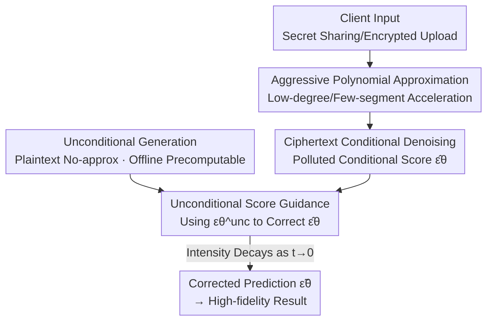

# Secure Inference for Diffusion Models via Unconditional Scores

**Conference**: ICLR 2026  
**OpenReview**: [https://openreview.net/forum?id=6t9YPOZH0w](https://openreview.net/forum?id=6t9YPOZH0w)  
**Code**: None  
**Area**: Diffusion Models / Privacy-Preserving Inference  
**Keywords**: Secure Inference, Diffusion Models, Polynomial Approximation, Score Guidance, Unconditional Generation

## TL;DR
To address the slow inference of diffusion models under Secure Multi-Party Computation (MPC), this paper employs aggressive low-degree polynomial approximations to accelerate non-linear operators. It then utilizes "unconditional scores," computed without error in plaintext, to correct the conditional scores polluted by approximation errors, significantly recovering image quality with almost no additional overhead.

## Background & Motivation
**Background**: Diffusion models (e.g., Stable Diffusion, DALL·E) are increasingly applied in privacy-sensitive scenarios such as healthcare and content creation. However, due to high generation costs, inputs must be sent to remote servers, exposing user data (e.g., medical images, prompts) and outputs to the model provider. To protect both user data and model weights, the industry utilizes Fully Homomorphic Encryption (FHE) and Secure Multi-Party Computation (MPC) for privacy-preserving inference.

**Limitations of Prior Work**: The bottlenecks in FHE/MPC are non-linear operators (e.g., SiLU, GeLU, and exp in softmax), which are extremely slow in the ciphertext domain. CipherDM first introduced MPC to diffusion models by using polynomials to approximate these functions; while this reduced latency, image quality dropped significantly, and latency remained much higher than plaintext execution.

**Key Challenge**: A direct trade-off exists between acceleration and image quality. Faster inference requires more aggressive approximation (lower polynomial degrees, fewer segments), but approximation errors accumulate over 50 denoising steps. This pushes the score further from the true distribution, resulting in blurred or structurally distorted images (e.g., sheep with extra legs, or a toy bear generated instead of a female infant).

**Goal**: To prevent image quality collapse while employing "more aggressive approximation" for additional acceleration. This involves two sub-problems: (1) determining how much latency can be saved by reducing polynomial degrees/segments; (2) correcting the score pollution caused by approximation during inference.

**Key Insight**: The authors observe that **unconditional generation can be executed entirely in plaintext without any approximation**, providing an error-free, high-fidelity score direction. Since the conditional branch is encrypted due to the prompt $y$ and must be computed using approximations in ciphertext (becoming polluted), the clean unconditional score from the plaintext domain can serve as a "correction compass" to pull the polluted conditional score back on track.

**Core Idea**: Instead of reducing the approximation error itself, "plaintext unconditional scores" are used as guiding signals to correct the conditional scores polluted by aggressive approximation during inference (score-correction guidance).

## Method

### Overall Architecture
The method addresses the issue where "aggressive approximation accelerates ciphertext inference but collapses quality due to polluted conditional scores." The overall approach is to continue running expensive ciphertext conditional denoising with aggressive approximation (tolerating errors) while simultaneously running a cheap unconditional denoising in plaintext (zero approximation, pre-computable offline). At each step, the unconditional score is used to debias the polluted conditional score.

The client securely sends inputs to the server via secret sharing or homomorphic encryption. The server performs denoising in the ciphertext domain, where non-linear functions are accelerated by aggressive low-degree polynomial approximations, yielding a polluted conditional $\epsilon$-prediction $\hat{\epsilon}_\theta$. In parallel, clean $\epsilon^{unc}_\theta$ is obtained from the unconditional generation in plaintext. Finally, a "score guidance" term combines the two to produce a corrected prediction $\tilde{\epsilon}_\theta$ for the denoising step, with guidance intensity decaying over time.

### Key Designs

**1. Aggressive Polynomial Approximation: Reaching the Acceleration Limit**

Previous works (e.g., BumbleBee) used higher-degree, multi-segment "precise approximations" for SiLU/GeLU/exp to maintain quality, which kept ciphertext latency high. This paper identifies how much acceleration can be gained by lowering degrees/segments. In a 2PC setting, they reduce SiLU and GeLU segments from 4 to 3, lower the GeLU polynomial from degree 6 to 4, and use a degree-4 polynomial for the second segment of exp in softmax. For SiLU, while precise approximation divides the domain into four segments ($[-8,-4)$ with degree 2, $[-4,4)$ with degree 6, and constant/linear tails), the `Loose-SiLU` simplifies this into three segments, using a single degree-8 polynomial for $[-5.4,4)$:

$$\text{Loose-SiLU}(x)=\begin{cases}0, & x<-5.4\\ c_8x^8+\cdots+c_1x+c_0, & -5.4\le x<4\\ x, & x\ge 4\end{cases}$$

This reduces operator-level latency by 14.05–35.60% and communication by 13.51–33.33% in 2PC. The cost is a 2.55–26.25× increase in approximation error, which significantly degrades quality if used alone.

**2. Unconditional Score Guidance: Using Clean Plaintext Scores to Restore Distribution**

This core design corrects the "conditional score polluted by approximation error." The authors aim to align the conditional score with the latent distribution corresponding to "no-approximation generation." Formally, an implicit discriminator is introduced to determine if a sample comes from "no-approximation generation" (label $o$) or "approximated generation" (label $\hat{o}$): $D_{im}(z_t)=p(o|z_t)/p(\hat{o}|z_t)$. By maximizing the likelihood of being judged as no-approximation generation, taking the gradient, and expanding via Bayes' rule and the Tweedie formula, the corrected $\epsilon$ is derived:

$$\tilde{\epsilon}_\theta(z_t,t)=\epsilon_\theta(z_t,t)+\gamma_t\big(\epsilon_\theta(z_t,t)-\hat{\epsilon}_\theta(z_t,t)\big)$$

Here, $\epsilon_\theta$ is the no-approximation prediction and $\hat{\epsilon}_\theta$ is the approximated prediction. Their difference is the "approximation error direction," which offsets the pollution when added back with scale $\gamma_t$. However, since the prompt $y$ is encrypted in the conditional branch, $\epsilon_\theta(z_t,y,t)$ cannot be computed without approximation in ciphertext. **Key Substitution**: The inaccessible clean conditional score is replaced by the unconditional score $\epsilon^{unc}_\theta(z^{unc}_t,t)$, combined with classifier-free guidance:

$$\tilde{\epsilon}_\theta(z_t,z^{unc}_t,y,t)=\hat{\epsilon}^{cfg}_\theta(z_t,y,t)+\gamma_t\big(\epsilon^{unc}_\theta(z^{unc}_t,t)-\hat{\epsilon}_\theta(z_t,y,t)\big)$$

This is feasible because unconditional generation does not depend on the encrypted $y$ and can run entirely in plaintext or even be precomputed and cached. The additional overhead for guidance is just one subtraction, one addition, and one scalar multiplication per step—essentially negligible.

**3. Decaying Guidance Intensity: Maintaining Prompt Alignment**

Unconditional scores do not carry prompt information; constant strong guidance could weaken text alignment. As denoising approaches $t=0$, the signal-to-noise ratio increases, and unconditional pulling becomes harmful. Thus, the authors decay the guidance intensity as $t\to0$, setting $\gamma_t=\eta w_t$ where $w_t=\sigma_t/\bar{\alpha}_t$, with $\eta=0.1$ fixed for all experiments. This allows more correction in early stages (high noise, fluid semantics) and lets the conditional branch dominate in later stages (detail formation), preserving CLIP-Score while correcting score drift.

### Loss & Training
This method is a **test-time** guidance strategy that requires no fine-tuning or retraining. It directly uses pre-trained Stable Diffusion v1.5 / CipherDM with a DDIM sampler (50 steps) and CFG scale 7.5. For large diffusion models, "approximating then fine-tuning" on hundreds of millions of images is prohibitively expensive; this test-time correction bypasses that cost.

## Key Experimental Results

### Main Results
On MSCOCO (Stable Diffusion, 2PC), Loose-Approx saves 16.04% latency and 16.86% communication compared to Precise-Approx, but FID/alignment degrades. Adding Ours recovers the quality loss significantly with almost no increase in latency/communication.

| Method | FID (↓) | CLIP-Score (↑) | Latency (s,↓) | Communication (GB,↓) |
|------|---------|----------------|-----------|------------|
| Vanilla | 13.25 | 0.3254 | 0.15 | - |
| Precise-Approx | 13.28 | 0.3264 | 3696.45 | 1122.51 |
| Loose-Approx | 15.52 | 0.3240 | 3103.32 | 933.22 |
| Precise-Approx + Ours | 12.45 | 0.3274 | 3698.13 | 1122.51 |
| **Loose-Approx + Ours** | **14.20** | **0.3259** | 3105.38 | 933.22 |

The FID gap between precise and loose approximation narrowed from 2.24 to 0.98 (**Quality degradation reduced by 56.25%**, and up to 74.17% on Flickr8k). Even for Precise-Approx models, adding guidance slightly outperforms Vanilla.

On binary MNIST (CipherDM, SPU full MPC), the effect is more dramatic: CipherDM generated mostly noise (FID 316.56, F1 only 0.0820). Adding Ours improved FID by 70+ and pulled F1 from 0.0820 to 0.6000, demonstrating the ability to recover even when underlying approximation errors are extreme.

| Method | FID (↓) | F1-Score (↑) | Latency (s,↓) |
|------|---------|--------------|-----------|
| Vanilla | 117.13 | 0.8575 | 14.12 |
| CipherDM | 316.56 | 0.0820 | 430.59 |
| **CipherDM + Ours** | **242.65** | **0.6000** | 442.23 |

### Ablation Study
Sensitivity of learning rate $\eta$ (MSCOCO, Loose-Approx): Larger $\eta$ improves quality without decreasing CLIP-Score, confirming that the "intensity decay" design allows stronger guidance without hurting alignment.

| Configuration | FID (↓) | CLIP-Score (↑) | Description |
|------|---------|----------------|------|
| Loose-Approx | 23.25 | 0.3347 | Baseline without guidance |
| + Ours ($\eta$=0.05) | 21.85 | 0.3367 | Weak guidance is effective |
| + Ours ($\eta$=0.10) | 21.47 | 0.3372 | Default configuration |
| + Ours ($\eta$=0.20) | 21.25 | 0.3376 | Stronger guidance, better FID, alignment maintained |

### Key Findings
- **Unconditional score guidance is the primary contributor**: It recovers 56%–74% of the FID degradation caused by aggressive approximation at the cost of only one addition/subtraction/multiplication per step.
- **Intensity decay resolves alignment risks**: Concerns that unconditional scores would lower text alignment were mitigated; CLIP-Score remained stable or slightly increased across various $\eta$ values due to decay at high signal-to-noise ratios.
- **Outperforms other test-time methods**: Compared to PAG (FID 36.72, worse) and FKS (24.42), Ours (21.47) is significantly better. PAG/FKS rely on models polluted by approximation, whereas Ours leverages error-free unconditional generation.
- **Applicable to few-step sampling**: Combined with Phased Consistency Model, Ours showed ~17 FID improvement at 4 steps and ~9 FID improvement at 8 steps.

## Highlights & Insights
- **Perspective shift to "correcting score" rather than "reducing error"**: While others focus on more accurate polynomial fits, this work allows coarser approximations and corrects the resulting bias during inference, unlocking more room for acceleration.
- **Leveraging error-free plaintext branches as calibration**: Unconditional generation doesn't require encrypted prompts, allowing it to run in plaintext with zero overhead via precomputation. This turns the "unobtainable clean conditional score" problem into a "substitution with clean unconditional score" solution.
- **Transferability**: The idea of using an unpolluted cheap branch to correct a polluted expensive branch can be extended to other constrained scenarios, such as quantized diffusion or edge-device few-step sampling.

## Limitations & Future Work
- **Absolute latency remains high**: Even with acceleration, single-inference latency remains in the range of 3000+ seconds for MSCOCO, which is far from real-time secure inference.
- **Dependence on unconditional distribution**: The method assumes unconditional generation can run in plaintext. If the task is heavily condition-dependent or the unconditional and conditional distributions differ vastly, the correction direction might be inaccurate.
- **Partial recovery**: On CipherDM/MNIST, F1 improved from 0.08 to 0.60 but remained below Vanilla's 0.86, suggesting the method is a partial fix rather than a universal cure for extreme errors.
- **Future Directions**: Combining unconditional guidance with fine-grained layer/channel-wise approximation scheduling or adaptive guidance intensity based on pollution levels.

## Related Work & Insights
- **vs CipherDM**: CipherDM introduced MPC and polynomial approximation but suffered severe quality loss. This work uses more aggressive approximation for speed and recovers quality using unconditional scores.
- **vs HE-Diffusion**: HE-Diffusion uses FHE but keeps prompts unencrypted, leading to privacy leakage. This work solves the score-attainment problem while keeping prompts encrypted.
- **vs PAG / FKS**: These rely on generating degraded samples or using multi-particle verifiers. In secure inference, these auxiliary models are also polluted by approximation; this work bypasses this by using error-free unconditional generation.

## Rating
- Novelty: ⭐⭐⭐⭐⭐ The perspective of "correcting polluted scores vs. reducing error" combined with plaintext calibration is highly original.
- Experimental Thoroughness: ⭐⭐⭐⭐ Covers SD/CipherDM/PCM with multiple baselines, though datasets are relatively small (MNIST/Flickr8k/MSCOCO) and lack high-resolution/complex scenes.
- Writing Quality: ⭐⭐⭐⭐ Clear motivation and complete derivations (Bayesian + Tweedie).
- Value: ⭐⭐⭐⭐ Provides a near-zero-cost quality remedy for privacy-preserving diffusion, though absolute latency remains a bottleneck for deployment.

<!-- RELATED:START -->

## Related Papers

- [\[ICLR 2026\] Inference-Time Scaling of Diffusion Models Through Classical Search](inference-time_scaling_of_diffusion_models_through_classical_search.md)
- [\[ICLR 2026\] SONA: Learning Conditional, Unconditional, and Matching-Aware Discriminator](sona_learning_conditional_unconditional_and_matching-aware_discriminator.md)
- [\[ICLR 2026\] Diffusion Blend: Inference-Time Multi-Preference Alignment for Diffusion Models](diffusion_blend_inference-time_multi-preference_alignment_for_diffusion_models.md)
- [\[ICLR 2026\] When Scores Learn Geometry: Rate Separations under the Manifold Hypothesis](when_scores_learn_geometry_rate_separations_under_the_manifold_hypothesis.md)
- [\[ICLR 2026\] GLASS Flows: Efficient Inference for Reward Alignment of Flow and Diffusion Models](glass_flows_reward_alignment_diffusion.md)

<!-- RELATED:END -->
