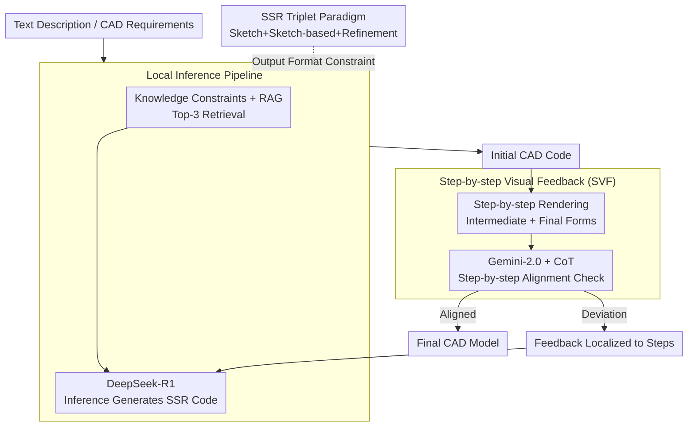

# Seek-CAD: A Self-Refined Generative Modeling for 3D Parametric CAD Using Local Inference via DeepSeek

**Conference**: ICLR 2026  
**arXiv**: [2505.17702](https://arxiv.org/abs/2505.17702)  
**Code**: [https://github.com/Sunny-Hack/Seek-CAD](https://github.com/Sunny-Hack/Seek-CAD)  
**Area**: CAD Generation / LLM Inference  
**Keywords**: CAD Parametric Modeling, DeepSeek-R1, Training-free, Chain-of-Thought, Self-refinement, SSR Design Paradigm

## TL;DR

Ours proposes Seek-CAD, the first training-free CAD parametric model generation framework based on locally deployed reasoning LLMs (DeepSeek-R1). It achieves self-refinement through step-by-step visual feedback and Chain-of-Thought (CoT) synergy, and designs a new SSR triplet design paradigm to support complex CAD model generation.

## Background & Motivation

The automatic generation of CAD parametric models is crucial for industrial manufacturing automation. Existing methods are divided into two categories:

**Fine-tuning methods** (e.g., CAD-Llama): Require significant computational resources.

**Training-free methods** (e.g., 3D-PreMise, CADCodeVerify): Use GPT-4 but lack a mechanism to utilize Chain-of-Thought (CoT).

Furthermore, existing datasets are primarily based on the simple SE (Sketch-Extrude) paradigm, which only supports basic operations like sketching and extrusion and cannot generate complex CAD models (e.g., features with chamfers, fillets, thin walls) required for industrial needs.

## Method

### Overall Architecture

Seek-CAD aims to address the following: generating compilable 3D parametric CAD code that supports industrial-grade features using a reasoning LLM on a single consumer-grade local GPU without fine-tuning. It decomposes the process into a "generation, then refinement" closed loop. First, the "language" of generation is determined—all code is organized according to the SSR triplet paradigm (Sketch + Sketch-based feature + optional Refinement feature) to express complex features such as chamfers, fillets, and shells. Next, system prompts with SSR constraints along with reference examples retrieved via RAG are fed into the locally deployed DeepSeek-R1 to infer the initial CAD code. Finally, the code is rendered into **Step-by-step Visual Feedback (SVF)** and provided to Gemini-2.0, which performs step-by-step alignment checks in conjunction with the model's own Chain-of-Thought (CoT): if aligned, it outputs the final model; if deviations are detected, it generates feedback localized to specific steps and returns it to DeepSeek-R1 for rewriting. The entire process requires no training and can be completed on a single RTX 3090 using DeepSeek-R1:32B-Q4.

### Key Designs

**1. SSR Triplet Design Paradigm: Expanding Modeling Language from Sketch-Extrude to Industrial Features**

The traditional SE (Sketch-Extrude) paradigm only supports sketches and extrusions, failing to create common industrial features like chamfers, fillets, and shells, which limits the complexity of generated models. SSR defines an individual modeling unit as a triplet $S = (s, f, \langle r_1, r_2, \dots, r_k \rangle \text{ or } \varnothing)$, where $s$ is a 2D sketch, $f \in \mathcal{F}$ is a sketch-based feature (extrusion, revolution, etc.), and $\langle r_1, \dots, r_k \rangle$ is an optional sequence of refinement features (chamfer, fillet, shell, etc.). The complete model is constructed by concatenating multiple triplets via Boolean operations $\mathcal{M} = \langle \mathcal{S}_1, \text{op}_1, \mathcal{S}_2, \text{op}_2, \dots, \mathcal{S}_n \rangle$. To ensure refinement features accurately point to the correct geometric faces, SSR includes a CapType referencing mechanism that uses START/END/SWEPT types to track topological primitives, ensuring operations like fillets occur on intended edges or faces. By expanding the "language" to this level, generated code can express industrial features, serving as the output format constraint for the entire pipeline.

**2. Local Inference Pipeline: Stabilizing Training-free Reasoning LLMs for Compilable SSR Code**

Directly asking an LLM to generate CAD code often results in incorrect assembly due to a lack of domain constraints and reference examples. Seek-CAD injects knowledge constraints $Cons = (\Phi, \mathcal{D}, \mathcal{E})$ into the system prompt, forcing DeepSeek-R1 to organize outputs according to the SSR paradigm. Simultaneously, Retrieval-Augmented Generation (RAG) is performed on a local corpus of 10,000 CAD models, using hybrid retrieval to fuse vector similarity and full-text matching: $g_i^{\text{final}} = \lambda \cdot g_i^{\text{vec}} + (1-\lambda) \cdot g_i^{\text{full}}$ ($\lambda = 0.3$). The Top-3 candidates are appended to the input to trigger initial code generation. Ablation studies show that the model fails to generate compilable code without the corpus, and Pass@1 drops from 0.68 to 0.44 without knowledge constraints.

**3. Step-by-step Visual Feedback (SVF): Error Localization via Intermediate Build States**

Feeding only the final product image back to the evaluator makes it impossible to determine which modeling step failed, leading to imprecise feedback. SVF preserves the intermediate states of the entire construction chain: intermediate state images $M_I = [R(S_1), R(\bar{S_1} \oplus S_2), \cdots, R(\bar{S_1} \oplus \cdots \oplus S_n)]$ are incrementally rendered, while the final state image $M_U = R(S_1 \oplus S_2 \oplus \cdots \oplus S_n)$ provides the overall appearance. Gemini-2.0 determines if the step-by-step images are consistent with the CoT description provided by DeepSeek-R1, sampling feedback via $F_{\text{call}} \sim P(F_{\text{call}} | G, M, CoT)$. Upon misalignment, feedback localized to the specific step is sent back to DeepSeek-R1. Because the CoT clarifies the design intent of each step, the VLM can compare "what was intended" against "what was actually rendered," yielding significantly higher feedback accuracy than final-image-only methods.

## Key Experimental Results

### Main Results (500 CAD Models)

| Strategy | Method | CD↓ | HD↓ | IoGT↑ | G-Score↑ | Novel↑ |
|----------|--------|-----|-----|-------|----------|--------|
| Fine-tuning | CAD-Llama | 0.2147 | 0.5864 | 0.7023 | 3.3385 | 77.64% |
| Training-free | 3D-PreMise | 0.2203 | 0.6137 | 0.6315 | 3.2022 | 49.57% |
| Training-free | CADCodeVerify | 0.2164 | 0.5917 | 0.6562 | 3.3927 | 55.38% |
| Training-free | **Seek-CAD** | **0.1979** | **0.5566** | **0.7226** | **3.5185** | 64.04% |

### Ablation Study on Refinement Rounds

| Rounds | Pass@2↑ | CD↓ | IoGT↑ | G-Score↑ |
|--------|---------|-----|-------|----------|
| 0 | 0.77 | 0.2275 | 0.6183 | 3.1401 |
| 1 | 0.72 | 0.1979 | 0.7226 | 3.5185 |
| 2 | 0.55 | 0.1966 | 0.7347 | 3.5314 |

One round of refinement is highly effective; the second round shows diminishing marginal gains and an increased compilation failure rate.

### Ablation Study

- Removing the local CAD corpus → Complete failure to generate compilable code.
- Removing knowledge constraints → Pass@1 drops from 0.68 to 0.44.
- Removing CoT from SVF → Feedback quality decreases.
- Removing intermediate images → Feedbacks become incomplete.

### Key Findings

- CoT effectively conveys design logic, assisting the VLM in understanding the construction process.
- The SSR paradigm supports more diverse and complex CAD models (including chamfers, fillets, shells, etc.).
- The training-free framework competes with fine-tuning methods (CAD-Llama) in geometric accuracy.
- Hybrid search in RAG outperforms single-mode search.

## Highlights & Insights

- First work exploring locally deployed reasoning LLMs (DeepSeek-R1) for CAD generation.
- Novel refinement strategy design using step-by-step visual feedback + CoT alignment.
- The SSR triplet paradigm significantly extends the scope of generatable CAD operations.
- Completely training-free and executable on a single RTX 3090.

## Limitations & Future Work

- Accuracy for complex models is limited by the reasoning capabilities of DeepSeek-R1:32B-Q4.
- Each refinement round carries a risk of compilation failure, limiting iteration cycles.
- The CapType mechanism only covers three reference types: START/END/SWEPT.
- Dependence on the Gemini-2.0 API for visual evaluation adds external dependencies.
- The dataset consists of only 40K samples, covering limited CAD operations.

## Related Work & Insights

- **CAD Generation**: Sequence-based methods such as DeepCAD, SkexGen, and Mamba-CAD.
- **LLM for CAD**: Text2CAD, CAD-MLLM, CAD-assistant, etc.
- **Training-free Methods**: 3D-PreMise and CADCodeVerify using GPT-4.

## Rating

- Novelty: ⭐⭐⭐⭐ — First to utilize reasoning LLM + CoT feedback for CAD generation.
- Practicality: ⭐⭐⭐⭐ — Training-free + local deployment, low barrier to entry.
- Value: ⭐⭐⭐⭐ — SSR paradigm and 40K dataset provide meaningful contributions.
- Experimental Thoroughness: ⭐⭐⭐ — Evaluation on 500 test models is moderate; ablation is comprehensive.

<!-- RELATED:START -->

## Related Papers

- [\[ICCV 2025\] MamTiff-CAD: Multi-Scale Latent Diffusion with Mamba+ for Complex Parametric Sequence](../../ICCV2025/image_generation/mamtiff-cad_multi-scale_latent_diffusion_with_mamba_for_complex_parametric_seque.md)
- [\[NeurIPS 2025\] CADMorph: Geometry-Driven Parametric CAD Editing via a Plan-Generate-Verify Loop](../../NeurIPS2025/image_generation/cadmorph_geometry-driven_parametric_cad_editing_via_a_plan-generate-verify_loop.md)
- [\[ICLR 2026\] Partition Generative Modeling: Masked Modeling Without Masks](partition_generative_modeling_masked_modeling_without_masks.md)
- [\[AAAI 2026\] CAD-VAE: Leveraging Correlation-Aware Latents for Comprehensive Fair Disentanglement](../../AAAI2026/image_generation/cad-vae_leveraging_correlation-aware_latents_for_comprehensive_fair_disentanglem.md)
- [\[ICLR 2026\] GenCP: Towards Generative Modeling Paradigm of Coupled Physics](gencp_towards_generative_modeling_paradigm_of_coupled_physics.md)

<!-- RELATED:END -->
