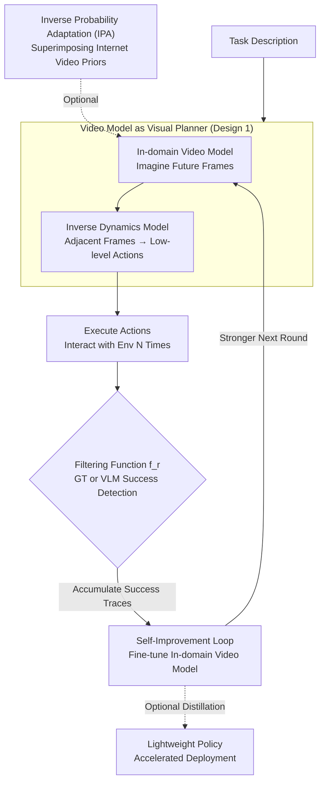

# Self-Improving Loops for Visual Robotic Planning

**Conference**: ICLR 2026  
**arXiv**: [2506.06658](https://arxiv.org/abs/2506.06658)  
**Code**: [https://diffusion-supervision.github.io/silvr/](https://diffusion-supervision.github.io/silvr/)  
**Area**: Image Generation  
**Keywords**: Visual Planning, Self-Improvement, Video Generation Models, Inverse Dynamics Model, Online Experience

## TL;DR

The SILVR framework is proposed, which achieves continuous self-improvement of visual robotic planners on unseen tasks by iteratively fine-tuning an in-domain video generation model on self-collected online trajectories, reaching up to 285% performance gains in MetaWorld and on real robots.

## Background & Motivation

**Background**: Video generation models, acting as text-conditioned visual planners, have demonstrated strong robotic task planning capabilities—given a task description, the model "imagines" the future as a sequence of frames, which are then translated into actions by an inverse dynamics model.

**Limitations of Prior Work**: Generalization to unseen tasks remains a challenge. Existing methods primarily rely on offline data (pre-collected demonstrations or internet videos). Once deployed, the planner stops improving and fails on out-of-distribution tasks, lacking the ability to learn continuously from online self-collected behaviors.

**Core Idea**: Can an online self-improving visual planning agent be designed? By allowing the planner to fine-tune the video model using its own successful trajectories, the success rate on unseen tasks can be iteratively increased.

## Method

### Overall Architecture

SILVR transforms the visual planner into an agent that continuously improves from its own experience. The core is a **closed-loop self-improvement** mechanism: a text-conditioned in-domain video model first imagines a future frame sequence (visual planning), and an inverse dynamics model translates the visual changes between adjacent frames into executable low-level actions. The agent executes these actions in the environment, uses a filtering function to select and accumulate successful trajectories, and fine-tunes the video model. In the next iteration, the model generates more reliable plans. During the sampling phase, an internet video prior can optionally be integrated (Inverse Probability Adaptation), superimposing language generalization and motion priors from general video models onto the in-domain model to maintain improvement trends in the real world.

### Key Designs

**1. Video Model as Visual Planner: Decoupling "Imagination" and "Execution"**

Learning an end-to-end state-to-action policy directly on unseen tasks is difficult because visual dynamics and action mapping represent different levels of complexity. SILVR follows the UniPi approach by decoupling them: the text-to-video model $\epsilon_\theta$ receives a task description and predicts a sequence of future frames as a "visual plan," describing how the environment should evolve. The Inverse Dynamics Model (IDM) performs a simpler task—regressing low-level actions based on the visual differences between adjacent frames. Since the planning layer focuses on "visual change" and the action layer focuses on "visual transition," the learning objectives are cleaner, facilitating transfer to new tasks. The in-domain video model is based on AVDC, injecting task descriptions via text cross-attention.

**2. Inverse Probability Adaptation (IPA): Leveraging Internet Video Priors for Generalization**

In-domain models trained only on robotic data possess environment-specific knowledge but lack language generalization and motion common sense, often failing on unseen object colors or novel instructions. SILVR combines the in-domain model $\epsilon_\theta$ with an internet-pretrained general video model (AnimateDiff, ~2B parameters) $\epsilon_{\text{general}}$ via score composition during sampling:

$$\tilde{\epsilon}_{\text{inv}} = \epsilon_{\text{general}}(\tau_t, t) + \alpha\big(\epsilon_{\text{general}}(\tau_t, t\,|\,\text{text}) + \gamma\,\epsilon_\theta(\tau_t, t\,|\,\text{text}) - \epsilon_{\text{general}}(\tau_t, t)\big)$$

Where $\gamma$ controls the strength of the in-domain prior and $\alpha$ is the text guidance scale. The general model contributes text generalization and natural motion priors, while the in-domain model provides environment-specific visual knowledge. The combined plan is both instruction-aware and physically grounded. Real-world experiments show this component is essential to maintain the self-improvement trend.

**3. Self-Improvement Loop: Refined by Success**

Planners trained on offline data stop improving once deployed. SILVR enables an online "snowball" effect (Algorithm 1): In each round, IPA is optionally used to enhance generation quality. The current model then performs $N$ interactions. A filtering function $f_r$ (based on Ground Truth or VLM judgments, such as Gemini-2.5-Pro) identifies successful trajectories. These successful samples are accumulated to fine-tune the video model, leading to more accurate plans and more successful samples in subsequent rounds, forming a positive feedback loop. Finally, the mature video planner can be distilled into a lightweight policy for faster inference.

## Key Experimental Results

### Main Results in MetaWorld (12 Unseen Tasks, Average Success Rate)

| Method | Iter 0 | Iter 1 | Iter 2 | Iter 3 | Iter 4 |
|------|--------|--------|--------|--------|--------|
| DSRL (GT Filter) | 9.4 | 8.3 | 7.4 | 7.5 | 7.7 |
| BCIL (GT Filter) | 5.6 | 12.3 | 20.9 | 23.3 | 23.2 |
| **Ours (GT Filter)** | **14.7** | **27.7** | **33.5** | **43.5** | **44.2** |
| Ours (VLM Filter) | 17.0 | 24.4 | 28.7 | 34.4 | 38.4 |

Ours reaches a success rate of 44.2% after Iteration 4, significantly outperforming BCIL (23.2%) and DSRL (7.7%).

### Real-world Experiments

- **Cup Pushing**: Continuous improvement on unseen colors.
- **Drawer Opening**: SILVR + Internet Video Prior successfully guides self-improvement.
- Without the internet video prior, the improvement trend stagnates or degrades in real-world settings.

### Distillation

The final SILVR video planner is distilled into a Diffusion Policy, further improving performance slightly (44.2% → 49.2%).

### Ablation Study

| Setting | Conclusion |
|------|------|
| No Data Filtering | Slow improvement in MetaWorld; still improves in real world. |
| VLM instead of GT Filter | Gemini-2.5-Pro performs best and still enables self-improvement. |
| Suboptimal Initial Data | SILVR still achieves continuous improvement. |
| 10 Iterations | Performance tends to saturate after the 5th round. |

### Key Findings

- Decoupled visual planning (dynamics modeling vs. action prediction) facilitates generalization.
- Internet video priors are critical for real-world experiments.
- Even without filtering, suboptimal experience can transfer useful information via score composition.
- SILVR is more sample-efficient than RL fine-tuning methods.

## Highlights & Insights

- First systematic self-improvement framework for visual planning.
- Organically combines offline data with online experience.
- Introduction of internet video priors elegantly solves real-world generalization issues.
- Robust to various filtering signals (GT, VLM, or No Filter).
- Distillation scheme balances planning quality and inference speed.

## Limitations & Future Work

- Assumes the initial model has a reasonable base success rate (cold start problem).
- Trade-offs between efficiency and quality in choosing large-scale pretrained video models.
- Saturation after 10 rounds suggests potential convergence to local optima.
- Video generation inference speed remains a deployment bottleneck.
- Exploration mechanisms to break unimodal behaviors have not been investigated.

## Related Work & Insights

- **Video Planning**: UniPi, AVDC, and other video models for decision-making.
- **Self-Improving Models**: Self-improvement in LLMs, VideoAgent, etc.
- **RL Fine-tuning BC Policies**: DPPO, DSRL, ResIP, etc.

## Rating

- Novelty: ⭐⭐⭐⭐ — Novel combination of visual planning and self-improvement loops.
- Experimental Thoroughness: ⭐⭐⭐⭐⭐ — Comprehensive evaluation across simulation and real-world, multiple ablations, and baselines.
- Value: ⭐⭐⭐⭐ — Real-world robot validation and distillation for deployment.
- Writing Quality: ⭐⭐⭐⭐ — Clear ablation of design decisions.

<!-- RELATED:START -->

## Related Papers

- [\[ICLR 2026\] Compositional Visual Planning via Inference-Time Diffusion Scaling](compositional_visual_planning_via_inference-time_diffusion_scaling.md)
- [\[ICLR 2026\] SafeFlowMatcher: Safe and Fast Planning using Flow Matching with Control Barrier Functions](safeflowmatcher_safe_and_fast_planning_using_flow_matching_with_control_barrier_.md)
- [\[CVPR 2026\] SOLACE: Improving Text-to-Image Generation with Intrinsic Self-Confidence Rewards](../../CVPR2026/image_generation/solace_self_confidence_rewards_t2i.md)
- [\[ICLR 2026\] LayerSync: Self-aligning Intermediate Layers](layersync_self-aligning_intermediate_layers.md)
- [\[CVPR 2026\] OSPO: Object-Centric Self-Improving Preference Optimization for Text-to-Image Generation](../../CVPR2026/image_generation/ospo_object-centric_self-improving_preference_optimization_for_text-to-image_gen.md)

<!-- RELATED:END -->
