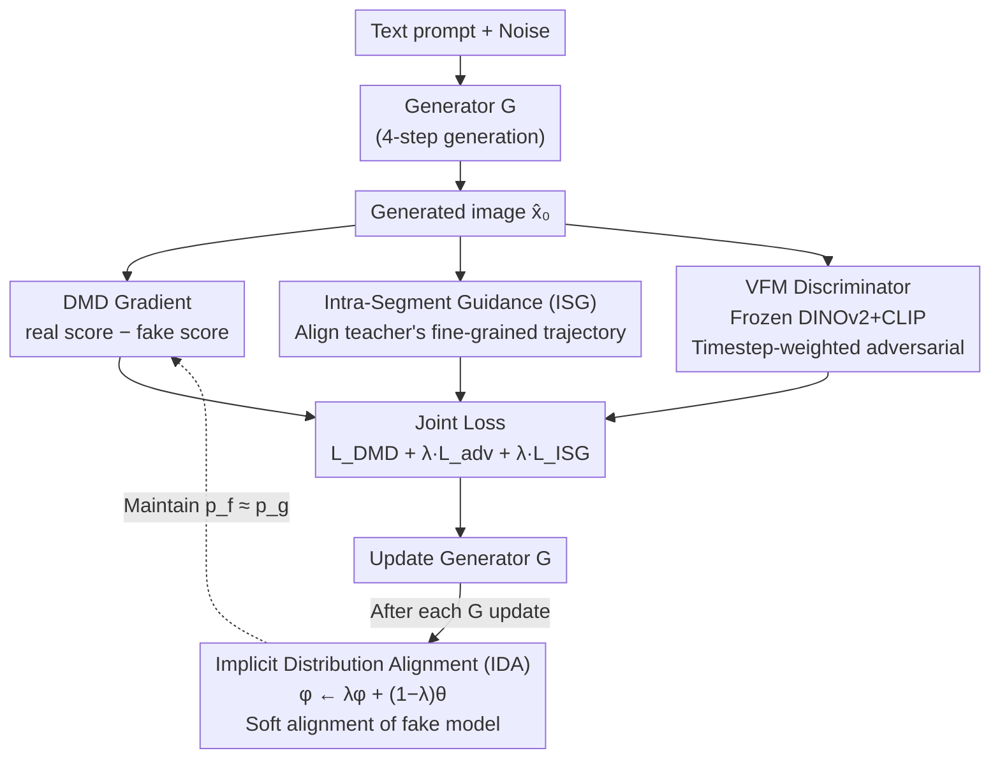

# SenseFlow: Scaling Distribution Matching for Flow-based Text-to-Image Distillation

**Conference**: ICLR 2026  
**arXiv**: [2506.00523](https://arxiv.org/abs/2506.00523)  
**Code**: [GitHub](https://github.com/XingtongGe/SenseFlow)  
**Area**: Image Generation / Diffusion Model Distillation  
**Keywords**: distribution matching distillation, flow matching, text-to-image, few-step generation, FLUX

## TL;DR

Proposes SenseFlow, which scales Distribution Matching Distillation (DMD) to large-scale flow-based text-to-image models (SD 3.5 Large 8B / FLUX.1 dev 12B) via Implicit Distribution Alignment (IDA) and Intra-Segment Guidance (ISG), achieving high-quality 4-step image generation.

## Background & Motivation

**Background**: DMD2 has demonstrated excellent distillation performance on small models (SD 1.5, SDXL), distilling multi-step diffusion models into few-step generators. However, large-scale flow-based text-to-image models (e.g., SD 3.5 Large 8B, FLUX.1 dev 12B) are becoming mainstream, and their distillation remains an open problem.

**Limitations of Prior Work**: The original DMD2 faces three key issues on large models: (1) **Convergence difficulty**—stable training cannot be achieved even with TTUR (Two-Time-scale Update Rule); (2) **Suboptimal timestep sampling**—uniform or manually selected coarse timesteps do not account for differences in denoising importance across teacher model timesteps; (3) **Lack of universal discriminator**—naive discriminators struggle to adapt to models of different scales and architectures.

**Key Challenge**: The min-max game framework of DMD requires the fake distribution to accurately track the generator distribution (internal optimal response). This condition is extremely difficult to satisfy in large models, leading to training oscillations and lack of convergence.

**Goal**: How to reliably scale the DMD framework to flow-based text-to-image models with 8B-12B parameters?

**Key Insight**: Starting from an analysis of DMD's min-max optimization, it is found that the internal optimal response requires $p_f = p_g$. A proximal update (IDA) is designed to approximately maintain this condition. ISG is used to reconfigure the denoising importance of timesteps, and a stronger discriminator based on VFM is introduced.

**Core Idea**: Maintain consistency between the fake model and the generator through implicit distribution alignment, combined with intra-segment guidance to redistribute timestep importance, enabling stable convergence of DMD on large flow models.

## Method

### Overall Architecture

SenseFlow addresses how to reliably transplant DMD from small models like SD 1.5/SDXL to large flow models like SD 3.5 Large (8B) and FLUX.1 dev (12B) for 4-step generation. It follows the min-max distillation backbone of DMD2: the generator $G$ takes text prompts and noise to directly generate images $\hat{x}_0$, which are optimized by three joint supervisory signals: the DMD gradient (real score from teacher minus fake score from fake model), adversarial loss from a VFM discriminator, and intra-segment guidance loss. These weighted signals update $G$. After each update of $G$, a cheap parameter interpolation is used to "softly pull" the fake model back into alignment with the new generator, ensuring the DMD gradient direction remains reliable. The cooperation of "IDA for stability + ISG for fine-grained details + VFM discriminator for stable adversarial training" allows the training, which originally diverged on large models, to stabilize (complete process in Algorithm 1).

### Key Designs

**1. Implicit Distribution Alignment (IDA): Keeping the fake model in sync with the generator**

The min-max framework of DMD has an implicit prerequisite—the inner fake model must provide the optimal response, i.e., satisfy $p_f(X_t) = p_g(X_t)$ for all timesteps; otherwise, the difference between real/fake scores no longer points in the correct gradient direction. On small models, TTUR (updating the fake model multiple times) can barely maintain this, but on 8B models like SD 3.5 Large, even a 20:1 TTUR ratio results in severe oscillation. IDA uses a simple approach: after each update of generator $\theta$, an EMA-style proximal interpolation is performed on fake model parameters $\phi$: $\phi \leftarrow \lambda\phi + (1-\lambda)\theta$, where $\lambda$ is close to 1. This "softly pulls" the fake model towards the generator, maintaining the $\epsilon$-best response condition $\mathbb{E}_t D_{KL}(p_g(X_t) \,\|\, p_f(X_t)) \leq \varepsilon$ at the cost of a single parameter interpolation. This step enables DMD to converge stably on SD 3.5 Large for the first time with only a 5:1 TTUR ratio.

**2. Intra-Segment Guidance (ISG): Enhancing coarse generators with teacher's fine-grained denoising**

4-step generation means only a few coarse timestep anchors are used. However, the teacher model's normalized reconstruction error $\xi(t)$ is not monotonic and contains local oscillations; uniformly selecting timesteps wastes a large amount of denoising information within each segment $(\tau_{i-1}, \tau_i]$. ISG inserts an intermediate point within each coarse step "segment": for anchor $\tau_i$, it samples $t_{mid} \in (\tau_{i-1}, \tau_i)$, lets the teacher denoise from $\tau_i$ to $t_{mid}$ to obtain $x_{t_{mid}}$, and then lets the generator take over to reach $\tau_{i-1}$ to obtain target $x_{tar}$. Simultaneously, the generator is asked to jump directly from $\tau_i$ to $\tau_{i-1}$, and an L2 loss aligns this "direct" trajectory with the "guided" trajectory passing through the midpoint. This re-positions and aggregates fine-grained transition information onto the coarse anchors. Ablations show this is an additional necessary condition for FLUX.1 dev (12B) to converge.

**3. VFM-based Discriminator: Stabilizing adversarial signals with semantic priors from Vision Foundation Models**

Naive discriminators struggle to adapt to various teachers ranging from 2.6B to 12B with different architectures. SenseFlow uses a frozen Vision Foundation Model (VFM, backbone is DINOv2 + CLIP) to extract multi-layer semantic features $z = f_{VFM}(\hat{x}_0)$. Using VFM features of real images as reference, only lightweight head blocks $h$ are trained to predict real/fake logits $D(x,c,r) = h(f_{VFM}(x), c, r)$, optimized with standard hinge loss. The adversarial loss for the generator is weighted by the timestep signal power $\omega(t) = (1-\sigma_t)^2 = \alpha_t^2$ (forward process is $x_t = \alpha_t x_0 + \sigma_t \epsilon$): at high-noise steps, $\hat{x}_0$ predictions are unreliable, so weight is low and dependence on DMD gradients is high; at low-noise steps, the signal is clean and weight is high, favoring GAN feedback. The VFM priors help capture image quality and fine structures, while timestep weighting balances the two supervisory signals.

### Loss & Training

The total generator loss is a weighted sum: $\mathcal{L}_G = \mathcal{L}_{DMD} + \lambda_G \cdot \mathcal{L}_{adv} + \lambda_{ISG} \cdot \mathcal{L}_{ISG}$, where $\mathcal{L}_{DMD}$ is the difference between fake and real scores, $\mathcal{L}_{adv}$ is the VFM discriminator loss (weighted by $\omega(t)$), and $\mathcal{L}_{ISG}$ is the L2 loss for intra-segment guidance. Training uses a high aesthetic score subset of LAION. A 5:1 TTUR ratio combined with IDA ensures stability. Inputs switch between backward simulation (from noise) and forward diffusion (from real data) at coarse timesteps $\tau_i$. The generator is updated every $f$ iterations, followed immediately by IDA to soft-anchor the fake model, after which the fake model and discriminator are updated.

## Key Experimental Results

### Main Results

**COCO-5K 4-step Generation Results**

| Model | Patch FID-T↓ | CLIP↑ | HPSv2↑ | PickScore↑ | ImageReward↑ | GenEval↑ |
|-------|--------------|-------|--------|------------|--------------|----------|
| SDXL Teacher (80 steps) | — | 0.3293 | 0.2930 | 22.67 | 0.8719 | 0.5461 |
| DMD2-SDXL (4 steps) | 21.35 | 0.3231 | 0.2896 | 22.49 | 0.7076 | — |
| **SenseFlow-SDXL (Ours, 4 steps)** | **17.xx** | **Best** | **Best** | **Best** | **Best** | **Best** |
| SD 3.5 Teacher (80 steps) | — | — | — | — | — | 0.7140 |
| SD 3.5 Turbo (4 steps) | baseline | — | — | — | — | — |
| **SenseFlow-SD3.5 (Ours, 4 steps)** | **Best** | **Best** | **Surpasses Teacher** | **Surpasses Teacher** | **Surpasses Teacher** | 0.7098 |
| FLUX.1 schnell (4 steps) | baseline | — | — | — | — | — |
| **SenseFlow-FLUX (Ours, 4 steps)** | **Best** | **Best** | **Surpasses Teacher** | **Surpasses Teacher** | **Surpasses Teacher** | — |

SenseFlow achieves SOTA 4-step distillation across all three teacher models (SDXL, SD 3.5 Large, FLUX.1 dev).

### Ablation Study

| Component | SD 3.5 FID Convergence | FLUX Convergence |
|-----------|------------------------|------------------|
| Original DMD2 | No | No |
| + IDA | Yes ✓ | No |
| + IDA + ISG | Yes ✓ | Yes ✓ |
| + IDA + ISG + VFM Disc | Best ✓ | Best ✓ |

IDA is critical for SD 3.5 convergence; ISG is an additional necessary condition for FLUX convergence.

### Key Findings

1. **IDA is key to DMD convergence on large models**: IDA alone allows SD 3.5 Large to converge stably with a small TTUR ratio.
2. **ISG further improves FLUX distillation**: The teacher's timestep reconstruction error is non-monotonic; ISG significantly helps by redistributing timestep importance.
3. **4-step surpasses teacher**: On human preference metrics like HPSv2, PickScore, and ImageReward, SenseFlow (4 steps) even exceeds the 80-step teacher model.
4. **Strong Versatility**: The same framework is effective across SDXL (2.6B), SD 3.5 (8B), and FLUX (12B), despite different architectures and parameter scales.

## Highlights & Insights

- **First to scale DMD to the 12B parameter FLUX model**: Solves the convergence difficulty of distilling large-scale flow models.
- **Elegance of IDA**: A single line of parameter interpolation code solves the fake-generator distribution tracking problem with theoretical grounding ($\epsilon$-best response).
- **Ingenuity of ISG**: The idea of redistributing teacher timestep importance is novel, utilizing fine-grained teacher capabilities to enhance the coarse generator.
- **Surpassing the Teacher in 4 steps**: The fact that 4-step distilled models can exceed 80-step teachers suggests distillation can "extract the essence while discarding the dross."
- **Timestep-weighted VFM Discriminator**: Emphasizing GAN signals at low noise and DMD signals at high noise provides a rational division of labor across noise levels.

## Limitations & Future Work

1. **Computational Cost**: High VRAM overhead as it requires maintaining the generator, fake model, teacher model, and discriminator simultaneously.
2. **Selection of $\lambda$ for IDA**: While $\lambda$ close to 1 is usually sufficient, the optimal value may vary by model.
3. **ISG Midpoint Sampling Strategy**: Currently using uniform sampling; adaptive selection of more informative midpoints could be considered.
4. **Evaluation limited to 4 steps**: Performance of 1-step or 2-step distillation is unknown.
5. **Training Data Dependency**: Requires high-quality LAION subsets; the impact of data quality on distillation performance hasn't been deeply analyzed.

## Related Work & Insights

- A direct extension and breakthrough for **DMD/DMD2**: Proves that the core bottleneck of the DMD framework lies in fake-generator distribution tracking.
- Connection to **RayFlow**: Both focus on timestep importance, but ISG's solution is more elegant.
- Inspiration for the distillation field: The IDA concept (proximal alignment of internal distributions) may be applicable to other min-max distillation frameworks.
- Comparison with **Consistency Models**: These are orthogonal distillation routes; the DMD series shows more advantages on large-scale models.

## Rating

- **Novelty**: ⭐⭐⭐⭐ — IDA and ISG have clear theoretical motivation and practical value, though the overall work is an incremental improvement over DMD2.
- **Experimental Thoroughness**: ⭐⭐⭐⭐⭐ — Three models of different scales/architectures, multiple benchmarks (COCO-5K/GenEval/T2I-CompBench), and thorough ablations.
- **Writing Quality**: ⭐⭐⭐⭐ — Clear problem analysis, though the method description involves many mathematical symbols.
- **Value**: ⭐⭐⭐⭐⭐ — Solves practical bottlenecks in distilling large-scale flow models, providing a direct boost for industrial applications.

<!-- RELATED:START -->

## Related Papers

- [\[ICLR 2026\] Delay Flow Matching](delay_flow_matching.md)
- [\[ICLR 2026\] Source-Guided Flow Matching](source-guided_flow_matching.md)
- [\[ICLR 2026\] Flow Matching with Semidiscrete Couplings](flow_matching_with_semidiscrete_couplings.md)
- [\[ICLR 2026\] Discrete Guidance Matching: Exact Guidance for Discrete Flow Matching](discrete_guidance_matching_exact_guidance_for_discrete_flow_matching.md)
- [\[ICLR 2026\] Decoupled DMD: CFG Augmentation as the Spear, Distribution Matching as the Shield](decoupled_dmd_cfg_augmentation_as_the_spear_distribution_matching_as_the_shield.md)

<!-- RELATED:END -->
