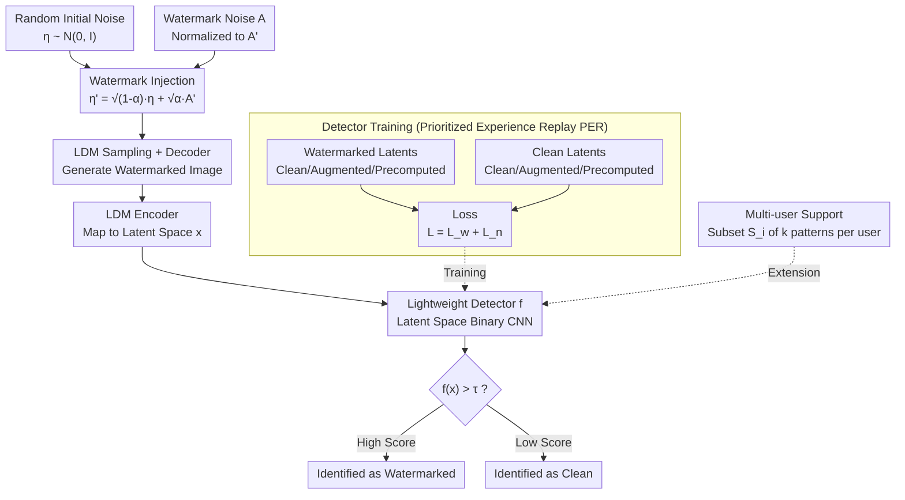

# SERUM: Simple, Efficient, Robust, and Unifying Marking for Diffusion-based Image Generation

**Conference**: ICLR 2026  
**arXiv**: [2603.13396](https://arxiv.org/abs/2603.13396)  
**Code**: [GitHub](https://github.com/Hubizon/SERUM)  
**Area**: Image Generation  
**Keywords**: Diffusion model watermarking, lightweight detector, noise injection, robustness, multi-user

## TL;DR
The SERUM watermarking method is proposed, adding unique watermark noise to the initial noise of diffusion models and training a lightweight detector to identify watermarks directly from generated images (bypassing expensive DDIM inversion). It achieves the highest detection rates under various attacks with extremely fast injection and detection, supporting multi-user scenarios.

## Background & Motivation

**Background**: Diffusion models can generate highly realistic images, necessitating watermarking to distinguish generated content from real content. Existing methods fall into two categories: tuning-based (e.g., Stable Signature, which fine-tunes the decoder) and tuning-free (e.g., Tree-Ring, GaussMarker, which add watermarks to the initial noise).

**Limitations of Prior Work**: Stable Signature requires intensive training and is not robust against advanced attacks. Tuning-free methods like Tree-Ring and GaussMarker are robust, but their detection relies on expensive DDIM inversion ($O(T)$ steps). There is a trade-off—methods are either fast but weak, or strong but slow.

**Key Challenge**: Watermark detection requires DDIM inversion to recover initial noise, which is computationally expensive and unsuitable for large-scale deployment.

**Key Insight**: Instead of performing DDIM inversion, a lightweight external detector is trained to recognize the signature of the watermark noise directly from the generated images. This combines the robustness of noise injection with near-instant detection, unifying the "strength" of tuning-free methods with the "speed" of tuning-based methods.

## Method

### Overall Architecture

SERUM aims to solve the problem where "robust watermark detection requires expensive DDIM inversion." The pipeline consists of three stages. The first stage is **offline detector training**: a lightweight CNN binary classifier is trained using watermarked latents (clean, augmented, or precomputed) and clean latents. The second stage is **injection and generation**: before diffusion starts, a fixed watermark noise is mixed into the random initial noise according to a specific weight; sampling and decoding then proceed normally. The third stage is **online detection**: the image to be tested is mapped back to the latent space using an LDM encoder and fed directly into the trained detector to output a 0–1 score, completely bypassing DDIM inversion. This ensures both generation and detection require only one forward pass, maintaining the robustness of noise injection while compressing detection time from $O(T)$ steps to real-time. For multi-user scenarios, the same detector can be reused by assigning each user a specific combination of noise patterns.

### Key Designs

**1. Watermark Injection: Mixing normalized watermark noise into initial noise to leave a fingerprint without damaging image quality**

Tuning-free methods often increase the deviation from the standard normal distribution when injecting watermarks into initial noise, thereby harming image quality. The injection formula for SERUM is $\eta' = \sqrt{1-\alpha}\,\eta + \sqrt{\alpha}\,A'$, which weights the random noise $\eta$ and watermark noise $A'$, where $\alpha$ controls the watermark strength. Crucially, the watermark noise is first normalized as $A' = (A - \text{mean}(A))/\text{std}(A)$, ensuring $\eta'$ remains close to a standard normal distribution. The authors prove that SERUM achieves a lower KL divergence than GaussMarker, meaning the deviation from the real noise distribution is smaller, resulting in minimal image quality loss.

**2. Lightweight Detector: Training a binary CNN in the latent space with Prioritized Experience Replay for difficult samples**

This is the core design for bypassing DDIM inversion. The detector is a binary classification CNN that operates in the LDM latent space rather than the pixel space, significantly reducing dimensions and accelerating both training and inference. The training set consists of watermarked latents and clean latents. The loss is defined as $\mathcal{L} = \mathcal{L}_w + \mathcal{L}_n$, where each term includes clean, augmented, and precomputed parts. To ensure robustness against various attacks, the authors adopt Prioritized Experience Replay (PER) from reinforcement learning to prioritize sampling the most difficult perturbed samples, forcing the detector to focus on its weaknesses without manual selection of augmentation strategies.

**3. Multi-user Support: Assigning a subset of noise patterns to each user and calculating detection scores via subset products**

Training a separate detector for every user is impractical for large-scale applications. SERUM assigns each user $i$ a combination $S_i$ consisting of $k$ noise patterns. The detection score for a single user is defined as the product of the detection scores of each pattern: $D_i(x) = \prod_{p \in S_i} d_p(x)$. This allows the system to train only basic noise pattern detectors and support a massive number of users through combinations, reducing training scale from $O(n)$ to $O(n^{1/k})$ while keeping inter-user interference negligible.

## Key Experimental Results

### Main Results

| Method | TPR@1%FPR (Std Attack) | TPR@1%FPR (Removal) | Injection Speed | Detection Speed |
|------|------------------|------------------|---------|---------|
| Stable Signature | Medium | Poor | Fast | Fast |
| Tree-Ring | Good | Good | Fast | **Extremely Slow** (DDIM) |
| GaussMarker | Good | Good | Fast | **Extremely Slow** (DDIM) |
| **Ours (SERUM)** | **Best** | **Best** | **Extremely Fast** | **Extremely Fast** |

### Ablation Study

| Method | FID↓ | CLIP Score↑ | Description |
|------|------|-------------|------|
| No Watermark | Baseline | Baseline | Reference |
| **Ours (SERUM)** | **Near Baseline** | **Near Baseline** | Almost no quality loss |

### Key Findings
- SERUM achieves the highest TPR across almost all 8 types of perturbations and 7 types of removal attacks.
- Detection requires no DDIM inversion, making it dozens of times faster than Tree-Ring or GaussMarker.
- The watermark is "radioactive"—it remains detectable even if the model is fine-tuned on watermarked images.
- In multi-user scenarios, the interference between users is negligible.

## Highlights & Insights
- **Unified Paradigms**: Noise injection (robustness of tuning-free methods) + external detector (speed of tuning-based methods) = an optimal combination. This intuitive idea was previously unexplored.
- **KL Divergence Guarantee**: Theoretical proof that normalized watermark noise provides lower KL divergence than GaussMarker, establishing a mathematical foundation for better image quality.
- **Prioritized Experience Replay Training**: Borrowing PER from RL to sample "difficult" augmentations allows the detector to focus on weaknesses automatically, eliminating the need for manual augmentation strategy selection.

## Limitations & Future Work
- Requires access to the LDM encoder for detection—pure pixel-level detection remains unexplored.
- The choice of $\alpha$ must balance detection rate and image diversity.
- Combinatorial limits in multi-user scenarios may cap the maximum number of users.
- Validated only on the SD series; effectiveness on other diffusion models (e.g., DALL-E, Imagen) is unknown.

## Rating
- Novelty: ⭐⭐⭐⭐ The combination of noise injection and an external detector is simple yet effective and previously untried.
- Experimental Thoroughness: ⭐⭐⭐⭐⭐ 8 perturbations + 7 attacks + 3 SD versions + multi-user + radioactivity analysis.
- Writing Quality: ⭐⭐⭐⭐ Clear methodology with solid theoretical guarantees.
- Value: ⭐⭐⭐⭐⭐ Directly applicable value for real-world deployment of AIGC detection.

<!-- RELATED:START -->

## Related Papers

- [\[ICLR 2026\] FARI: Robust One-Step Inversion for Watermarking in Diffusion Models](fari_robust_one-step_inversion_for_watermarking_in_diffusion_models.md)
- [\[ICLR 2026\] Scalable Energy-Based Models via Adversarial Training: Unifying Discrimination and Generation](scalable_energy-based_models_via_adversarial_training_unifying_discrimination_an.md)
- [\[ICCV 2025\] LiT: Delving into a Simple Linear Diffusion Transformer for Image Generation](../../ICCV2025/image_generation/lit_delving_into_a_simple_linear_diffusion_transformer_for_image_generation.md)
- [\[ICLR 2026\] Diffusion Negative Preference Optimization Made Simple](diffusion_negative_preference_optimization_made_simple.md)
- [\[CVPR 2026\] SimplePoster: A Simple Baseline for Product Poster Generation](../../CVPR2026/image_generation/simpleposter_a_simple_baseline_for_product_poster_generation.md)

<!-- RELATED:END -->
