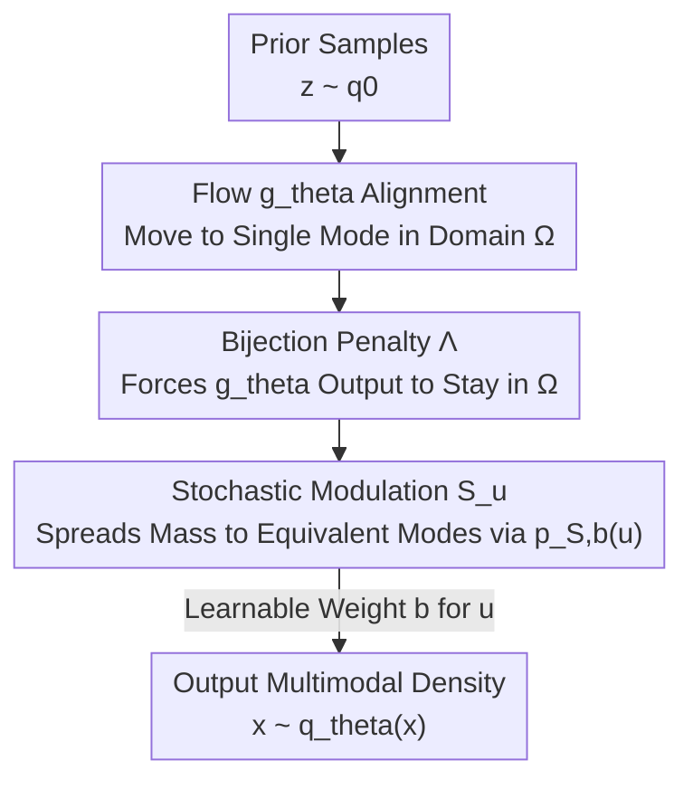

# SESaMo: Symmetry-Enforcing Stochastic Modulation for Normalizing Flows

**Conference**: ICLR 2026  
**OpenReview**: [https://openreview.net/forum?id=5rHZCmYdNp](https://openreview.net/forum?id=5rHZCmYdNp)  
**Code**: https://github.com/fifi-research/sesamo  
**Area**: Generative Models / Normalizing Flows / Scientific Computing  
**Keywords**: Normalizing Flows, Symmetry, Boltzmann Sampling, Mode Collapse, Lattice Field Theory

## TL;DR
SESaMo proposes a "stochastic modulation" mechanism, allowing Normalizing Flows to first map the prior distribution into a single mode of the target distribution, then use a stochastic variable-controlled symmetry transformation to spread probability mass across all equivalent modes based on learned weights. This enables precise enforcement of symmetries in data-free variational inference and, for the first time, learns "broken symmetry," achieving an Effective Sample Size (ESS) close to 1 on the 8-Gaussian mixture, complex $\phi^4$ theory, and Hubbard model.

## Background & Motivation

**Background**: In fields like physics, chemistry, and economics, many tasks involve sampling from an unnormalized Boltzmann distribution $p(x)=\exp(-f[x])/Z$, where the action $f[\cdot]$ is known but the partition function $Z$ is an intractable high-dimensional integral. Traditional MCMC methods suffer from extremely slow convergence due to high energy barriers and autocorrelation. Recently, "Boltzmann Generators"—which use deep generative models (especially Normalizing Flows (NF) and autoregressive networks that provide closed-form likelihoods) for variational inference—have become mainstream: learning a variational density $q_\theta\approx p$ using only reverse KL divergence without needing samples from the target distribution.

**Limitations of Prior Work**: Physical/chemical systems are often rich in symmetry. Embedding these symmetries as inductive biases into networks can significantly accelerate and stabilize convergence. However, existing "equivariant normalizing flows" either directly construct equivariant networks (hard for many groups) or use **canonicalization**: a fixed mapping $C_{T,z}$ maps prior samples into a "fundamental domain $\Omega$," where the flow transforms within the domain before an inverse mapping $C_{T,z}^{-1}$ maps them back.

**Key Challenge**: Canonicalization has two hard constraints—the prior $q_0$ must be invariant under symmetry transformations $q_0(z)=q_0(T_i z)$, and it assumes that each mode's probability mass is **exactly equal** (exact symmetry). In reality, many distributions exhibit **broken symmetry**, where multiple modes are geometrically symmetric but have unequal masses (e.g., an external field breaking $Z_N$ symmetry). Naive canonicalization fails to capture such distributions, while standard flows tend to suffer from **mode collapse** due to reverse KL properties, concentrating only on the highest peaks.

**Goal**: To create a general framework that embeds any continuous or discrete symmetry (exact or broken) into NF training and mitigates mode collapse in data-free settings where it is most severe.

**Key Insight**: The authors recognize that the bottleneck of canonicalization lies in using a "deterministic mapping to move samples into the fundamental domain at once"—this requires prior invariance and locks the mass ratio between modes. If changed to "the flow aligns to a single mode, while distribution across modes is handled by a **stochastic operator with learnable weights**," the constraints are relaxed.

**Core Idea**: Replace the fixed inverse canonicalization mapping with a stochastic symmetry transformation $S_u$ controlled by a random variable $u$. The flow concentrates mass into one mode, and $S_u$ then "stochastically" copies and spreads mass to other equivalent modes based on learned probabilities $p_{S,b}(u)$—weights are equal for exact symmetry, while $b$ is learnable for broken symmetry.

## Method

### Overall Architecture

SESaMo aims to train a normalizing flow that precisely respects symmetry and learns broken symmetry using only unnormalized $f[x]$ without samples. It decomposes the process into "alignment + modulation": prior $z\sim q_0$ first passes through flow $g_\theta$, forced by a penalty term $\Lambda$ to map into the fundamental domain $\Omega$ and align with **one** mode of the target distribution, yielding $\tilde x\sim\tilde q_\theta$. Then, the stochastic modulation operator $S_u$, conditioned on $u\sim p_{S,b}$, stochastically moves samples from this mode to all symmetric equivalent regions, recovering the full multimodal $x\sim q_\theta(x)$.

The key difference from canonicalization is that canonicalization uses $z \xrightarrow{C_{T,z}} \text{Domain} \xrightarrow{g_\theta} \xrightarrow{C_{T,z}^{-1}} x$, where the transport is **deterministic** and requires an invariant prior. SESaMo uses $z \xrightarrow{g_\theta} \text{Single Mode} \xrightarrow{S_u} x$, which is **stochastic** with learnable weights, eliminating the requirement for $q_0$ symmetry and broadening applicability. The full path remains bijective, and the likelihood can be calculated exactly via the change-of-variable formula.

### Key Designs

**1. Stochastic Modulation: Expanding "Single-Mode Alignment" to "Full-Mode Coverage"**

This step addresses the fundamental constraint of canonicalization—deterministic mappings lock the mass ratio and require prior invariance. SESaMo lets $g_\theta$ perform the easier task of "aligning samples to one mode" and delegates "copying to other symmetric modes" to an operator $S_u$ conditioned on $u$. For a set of $M$ symmetry transformations $\{T_i\}$, modulation is defined as:

$$S_{T,u}: x \mapsto \begin{cases} x, & u=0 \\ T_1 x, & u=1 \\ \;\vdots & \\ T_M x, & u=M \end{cases}, \quad u\sim p_{S,b}$$

It requires $T_i x\notin\Omega$ and $T_i\neq T_j$ to ensure branches map to non-overlapping regions, maintaining global bijectivity. The composite mapping $\tilde g_{\theta,u}(z)=S_u(g_\theta(z))$ yields a Jacobian determinant that decomposes via the chain rule as $\det\frac{\partial \tilde g_{\theta,u}}{\partial z}=\det\frac{\partial S_u}{\partial g_\theta}\det\frac{\partial g_\theta}{\partial z}$. When sampling $u$ instead of marginalizing, the log-likelihood is:

$$\ln q_\theta(\tilde g_{\theta,u}(z)) = \ln p_{S,b}(u) + \ln q_0(z) - \ln\left|\det\tfrac{\partial S_u}{\partial g_\theta}\right| - \ln\left|\det\tfrac{\partial g_\theta}{\partial z}\right|$$

Because alignment and spreading are decoupled, the prior $q_0$ does not need to be invariant. This allows SESaMo to mitigate mode collapse in reverse KL training—each mode is explicitly guaranteed coverage by $S_u$.

**2. Learnable Broken Symmetry Weights + REINFORCE: Learning "Uneven Mode Mass"**

Under exact symmetry, mode masses are equal, but in broken symmetry, they differ. Fixed weights cannot capture this. SESaMo defines $p_{S,b}(u)$ using learnable parameters $b$. For $Z_2$ symmetry, exact symmetry implies $u\in\{0,1\}$ following $\mathcal{B}(e^b)$ with $b=\ln 0.5$ (equal split). For broken symmetry:

$$p_{S,b} = \begin{cases} 1-e^b, & u=0 \\ e^b, & u=1 \end{cases}, \quad b\in\mathbb{R}^-$$

Optimizing $b$ during training lets the model learn the true mass ratio. Since $u$ is discrete and $b$ affects sampling probability, gradients cannot backpropagate normally; thus, a **REINFORCE estimator** is used:

$$\frac{\partial}{\partial b}\mathbb{E}_{u\sim p_{S,b}}\big[\,\cdot\,\big] = \mathbb{E}_{u\sim p_{S,b}}\Big[(\ln q_\theta + f[\tilde g_{\theta,u}(z)])\cdot \tfrac{\partial}{\partial b}\ln p_{S,b}(u)\Big]$$

In experiments, the learned $b$ perfectly matches analytical predictions. This formula generalizes to continuous symmetries ($u$ as a continuous variable).

**3. Bijection Penalty: Soft Constraints for Domain Control**

Stochastic modulation requires flow $g_\theta$ to move samples into $\Omega$ without "overflowing" (otherwise, branch regions overlap, breaking bijectivity). Rather than hard-coding networks, the authors add a regularization term to the reverse KL loss:

$$\Lambda(\tilde z_c) = A\cdot\sigma\big(B\cdot\lambda(\tilde z_c)\big)\cdot\Theta\big(\lambda(\tilde z_c)\big)$$

The penalty function $\lambda$ is zero at the domain boundary $\partial\Omega$, negative inside, and positive outside. The Heaviside step $\Theta(\cdot)$ ensures zero penalty for internal samples, while the sigmoid $\sigma(\cdot)$ provides gradients directing external samples back to the domain. Hyperparameter $A$ matches the loss magnitude, and $B$ is small enough to avoid vanishing gradients outside the domain.

### Loss & Training

Training utilizes reverse KL divergence plus the penalty term:

$$\widetilde{\mathrm{KL}}(q_\theta\|p) = \mathbb{E}_{z\sim q_0}\mathbb{E}_{u\sim p_{S,b}}\big[\ln q_\theta(\tilde g_{\theta,u}(z)) + f[\tilde g_{\theta,u}(z)] + \Lambda(g_\theta(z))\big]$$

Flow parameters $\theta$ are updated via standard backpropagation, while modulation parameters $b$ are updated via REINFORCE. The backbone uses RealNVP affine coupling flows, trained entirely without target samples.

## Key Experimental Results

Comparison of four methods: FAB (Flow Annealed Importance Sampling Bootstrap), RealNVP+VMoNF (Variational Mixture of NFs), RealNVP+Canonicalization, and RealNVP+SESaMo (**Ours**). Metrics include Effective Sample Size (ESS, closer to 1 is better) and KL divergence (smaller is better).

### Main Results

| Task | Volume | Symmetry | FAB | VMoNF | Canonicalization | SESaMo |
|------|------|--------|-----|-------|--------|--------|
| GMM (ESS) | 2×1 | Exact $Z_8$ | 0.78(3) | 0.61(1) | 0.91(8) | **0.9986(2)** |
| GMM (ESS) | 2×1 | Broken $Z_8$ | 0.81(1) | 0.83(11) | 0.747(2) | **0.9947(3)** |
| $\phi^4$ (ESS) | 8×8 | Exact $U(1)$ | 0.26(3) | 0.22(2) | – | **0.9472(8)** |
| $\phi^4$ (ESS) | 8×8 | Broken $U(1)$ | 0.28(5) | 0.23(1) | – | **0.941(2)** |
| Hubbard (ESS) | 2×1 | Broken $Z_4$ | 0.946(9) | 0.37(12) | 0.839(5) | **0.996(1)** |
| Hubbard (ESS) | 18×100 | Broken $(Z_2)^{18}$ | 0.06(5) | – | 0.024(1) | **0.74(1)** |

In complex $\phi^4$ field theory, complex fields cannot use standard canonicalization ("–"). SESaMo improves ESS from 0.2~0.3 to over 0.94. For Hubbard $18\times100$, where FAB is infeasible and canonicalization fails (0.024), SESaMo maintains 0.74, establishing a new SOTA.

### KL Divergence Comparison

| Task | Volume | Symmetry | FAB | VMoNF | Canonicalization | SESaMo |
|------|------|--------|-----|-------|--------|--------|
| GMM | 2×1 | Exact $Z_8$ | 1.19(37) | 0.79(11) | 0.013(2) | **0.0008(1)** |
| GMM | 2×1 | Broken $Z_8$ | 0.84(26) | 1.02(14) | 0.189(3) | **0.0024(2)** |
| Hubbard | 2×1 | Broken $Z_4$ | 0.28(8) | 0.74(9) | 0.112(7) | **0.0013(8)** |

### Key Findings
- **VMoNF still collapses**: Despite using multiple flows for different regions, VMoNF collapses to the highest modes in broken $Z_8$ GMM. Authors emphasize this is an inherent issue with reverse KL, not the architecture; SESaMo guarantees coverage through its symmetry-enforced structure.
- **Accurate Broken Symmetry**: The online-optimized broken parameter $b$ aligns perfectly with analytical predictions, directly proving the model's ability to learn broken symmetry.
- **Scalability**: Compared to previous canonicalization limited to $V=2\times2$, SESaMo scales to $V=18\times100$ with $(Z_2)^{18}$ broken symmetry, offering faster and more stable convergence.

## Highlights & Insights
- **"Decoupling Alignment and Spreading"**: Splitting "hard multimodal learning" into "flow learns single mode + operator spreads to multiple" simplifies the flow's task and bypasses mode collapse via architecture.
- **Stochasticity for Generality**: Using random variable $u$ instead of deterministic mappings removes the "symmetric invariant prior" constraint, which is crucial for handling complex-valued fields.
- **Natural Application of REINFORCE**: Discrete mode assignment is naturally stochastic. Using REINFORCE to learn mass ratios transforms "broken symmetry" into an optimizable scalar.
- **Soft Penalty vs. Hard Construction**: Avoids the difficulty of constructing equivariant networks by using boundary penalties to turn constraints into training objectives.

## Limitations & Future Work
- Symmetry sectors (which $T_i$, how many modes) must be **known a priori**—though usually known in physics/chemistry, this limits use on general distributions with unknown symmetry.
- Soft penalties only approximately maintain bijectivity: if the target has non-zero probability at the boundary $\partial\Omega$ (e.g., small radius $R$ in GMM), ESS may drop. High-dimensional physics modes often increase in distance, mitigating this.
- Current validation is on affine RealNVP + small/medium volumes. Scaling to complex continuous symmetries and large-scale molecular systems remains for future work. REINFORCE variance may become a bottleneck with many modes.

## Related Work & Insights
- **vs. Canonicalization**: Canonicalization uses deterministic $C_{T,z}$ and requires invariant $q_0$ and equal mode mass. SESaMo uses stochastic modulation, handles broken symmetry, and applies to complex-valued fields.
- **vs. Equivariant Normalizing Flows**: Equivariant flows require constructing equivariant diffeomorphisms, which is difficult for many groups. SESaMo places symmetry in the "modulation operator + soft penalty," bypassing structural complexity.
- **vs. VMoNF**: VMoNF uses mixtures but still suffers from mode collapse; SESaMo ensures full coverage via its symmetry-enforcing structure.

## Rating
- Novelty: ⭐⭐⭐⭐⭐ Stochastic modulation + learnable broken symmetry is a substantial breakthrough in equivariant flows.
- Experimental Thoroughness: ⭐⭐⭐⭐ Covers toys to lattice field theory (large volume SOTA), though backbone/symmetry types are still specific.
- Writing Quality: ⭐⭐⭐⭐ Clear contrast with canonicalization, complete formulas; has a slight threshold for physics background.
- Value: ⭐⭐⭐⭐⭐ Provides a universal, scalable tool for symmetric Boltzmann distributions in scientific sampling.

<!-- RELATED:START -->

## Related Papers

- [\[ICML 2026\] The Coupling Within: Flow Matching via Distilled Normalizing Flows](../../ICML2026/image_generation/the_coupling_within_flow_matching_via_distilled_normalizing_flows.md)
- [\[ICLR 2026\] Latent Stochastic Interpolants](latent_stochastic_interpolants.md)
- [\[ICML 2025\] Normalizing Flows are Capable Generative Models](../../ICML2025/image_generation/normalizing_flows_are_capable_generative_models.md)
- [\[AAAI 2026\] Flowing Backwards: Improving Normalizing Flows via Reverse Representation Alignment](../../AAAI2026/image_generation/flowing_backwards_improving_normalizing_flows_via_reverse_representation_alignme.md)
- [\[ICLR 2026\] TAVAE: A VAE with Adaptable Priors Explains Contextual Modulation in the Visual Cortex](tavae_a_vae_with_adaptable_priors_explains_contextual_modulation_in_the_visual_c.md)

<!-- RELATED:END -->
