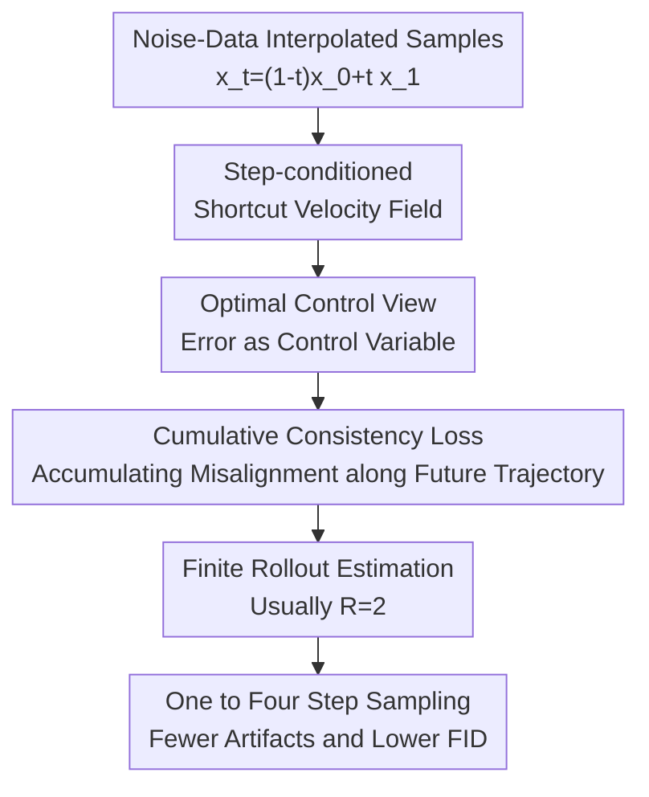

# Shortcut Diffusion Training with Cumulative Consistency Loss: An Optimal Control View

**Conference**: ICLR2026  
**OpenReview**: [https://openreview.net/forum?id=cZqAk87Lu4](https://openreview.net/forum?id=cZqAk87Lu4)  
**Code**: https://github.com/paribeshregmi/Shortcut-CSL  
**Area**: Diffusion Models / Image Generation  
**Keywords**: Few-step Generation, Shortcut Model, Flow Matching, Cumulative Consistency Loss, Optimal Control  

## TL;DR
This paper interprets the few-step generation training of shortcut diffusion as a controlled flow-matching process. It points out that the original self-consistency loss only penalizes the current step error and proposes the Cumulative Self-Consistency Loss, which accumulates future misalignments along the trajectory. This significantly improves image generation quality for one to four steps with almost the same training budget.

## Background & Motivation
**Background**: Diffusion models and flow matching models typically push random noise towards the data distribution step-by-step. While generation quality is strong, sampling requires dozens to hundreds of network forward passes. To make these models usable in low-latency scenarios, recent work has focused on one-step or few-step generation: either distilling a strong base model into a few-step student or learning both standard small-step and large-step "jump" flow fields simultaneously in a single-stage training (like consistency models and shortcut models).

**Limitations of Prior Work**: Two-stage distillation is usually costly, and some methods require training separate models for different step counts. The advantage of shortcut models is simplicity: a single network is additionally conditioned on step size $d$. When $d=0$, it acts like a base flow-matching model; when $d$ is large, it performs one-step or few-step generation directly. However, the original self-consistency loss only requires that "taking one step of $2d$" aligns with "taking two steps of $d$" at the current state. This local constraint does not guarantee that the state reached after a large step is conducive to subsequent generation.

**Key Challenge**: Errors in few-step generation are not one-time local errors but cumulative errors that propagate along the ODE trajectory. If the direction of a current step deviates slightly from the base trajectory, it might align well with the local bootstrap target but push the sample to a next state that makes alignment harder in subsequent steps, leading to artifacts, shape distortion, and FID degradation in one-step or two-step generation.

**Goal**: The authors aim to answer two questions: first, whether there is a more principled theoretical explanation for the self-consistency loss in shortcut models; second, whether few-step model training can explicitly consider subsequent trajectory errors to narrow the quality gap with base flow-matching models without changing architecture or introducing expensive two-stage distillation.

**Key Insight**: The paper views the few-step shortcut model as a controlled dynamical system where an implicit control error $u_\theta$ is applied to the base generative process. Here, "control" does not guide generation toward an external reward but represents the deviation of the shortcut velocity field from the base velocity. This perspective naturally distinguishes "current error" from "future error": if the objective function resembles a value function in optimal control accumulating from the current time to the end, it should not look only at the present misalignment.

**Core Idea**: Replace the local self-consistency loss with a trajectory-level Cumulative Self-Consistency Loss. This ensures the large-step direction of the shortcut model not only aligns with the base model at the current state but also pushes the sample toward states that allow subsequent large steps to maintain alignment.

## Method

### Overall Architecture
This paper does not invent a new generative network backbone but modifies the training objective of Shortcut models. The process can be understood as follows: first, use flow matching to train the network to predict base velocity at $d=0$; then, use the step-conditioned shortcut branch to predict large-step directions. The difference is that while the original shortcut only performs bootstrap consistency at a single time point, Shortcut-CSL rolls out several future shortcut steps and incorporates the misalignment at each future state into the loss.

Specifically, the training batch contains two types of supervision. The first is standard flow-matching targets: for a pair of noise and real samples $(x_0, x_1)$, the network is supervised to predict velocity $x_1 - x_0$ at the interpolation point $x_t = (1-t)x_0 + tx_1$. The second is bootstrap targets: given a step size $d$, a target for a large step $2d$ is constructed using two small-step shortcut directions. Shortcut-CSL retains this structure but, instead of calculating error once at the first state, allows the model to continue along its own $2d$ step and calculates misalignment with corresponding targets at subsequent states.

### Key Designs
**1. Optimal Control Perspective: Viewing Shortcut Deviations as Propagating Control Errors**

The authors first write the base flow-matching process as a continuous dynamical system and then view the shortcut model output as an additional error term $u_\theta(X_t^u, t)$ relative to the base drift. If the shortcut perfectly reproduces the base trajectory, then $u_\theta = 0$ at all time points. Conversely, if a shortcut direction deviates at any moment, the subsequent state $X_t^u$ is pushed onto a different trajectory, changing future errors.

Under this setting, the natural objective is not to minimize error at a single time point, but the cumulative cost from current time $s$ to the end $1$: $J(u_\theta; x_s, s) = \int_s^1 f(u_\theta(X_t^u, t), t) dt$. The paper sets the intermediate state cost $g$ and terminal cost $h$ to zero, focusing only on whether the shortcut trajectory stays close to the base trajectory. This formulation explains the core failure mode of few-step generation: the current action has immediate error and affects future errors by changing the subsequent state.

**2. SL as a Degenerate Case: Ignoring Downstream Costs**

The original self-consistency loss (SL) can be written as $\|S_\theta(x_t, t, 2d) - S_{target}\|^2$, where $S_{target} = \frac{1}{2}S_\theta(x_t, t, d) + \frac{1}{2}S_\theta(x_{t+d}, t+d, d)$. It supervises the "one-step $2d$" direction to equal the average of the "two-steps $d$" direction.

By embedding this objective into the optimal control form using a Dirac delta: if $f(u, t) = \|u\|^2 \delta(s-t)$, the cumulative objective degenerates to $J_{SL} = \|u_\theta(x_s, s)\|^2$. This shows SL is "short-sighted": it only looks at immediate cost without considering where the large step takes the sample or whether future misalignment increases. The authors also propose Uniform Self-Consistency Loss (USL) as a baseline, $J_{USL} = (1-s)\|u_\theta(x_s, s)\|^2$, which covers the future interval but assumes error remains constant over time.

**3. CSL: Accumulating Real Misalignment for Future Accountability**

Cumulative Self-Consistency Loss (CSL) removes the delta and uniform assumptions, directly summing errors along the future trajectory: $J_{CSL}(u_\theta; x_s, s) = \int_s^1 \|u_\theta(X_t^u, t)\|^2 dt$. Discretized with step size $d$, it becomes $J_{CSL}(u_\theta; x_{nd}, nd) = \sum_{k=n}^{R'} \|u_\theta(x_{dk}, dk, d)\|^2$, where $R' = 1/d$ is the remaining steps. This objective emphasizes whether the entire few-step trajectory stays close to the base model.

The gradient of CSL includes both the immediate gradient $2u_\theta$ and the cumulative gradient from the derivative of future costs with respect to the state $\nabla_x J_{CSL}$. Intuitively, the model receives signals from second and third-step misalignments back-propagated to the first large step, favoring directions that lead to states that are "easier to align" later.

**4. Finite Rollout Estimation: Trajectory-level Signals with Little Overhead**

To manage training overhead, the paper estimates CSL using $R$ terms. During training, $R$ targets are generated for $K/R$ bootstrap samples. In each round, a stop-gradient target for an $2d$ step is constructed from two $d$ steps, and the current state advances along the model's predicted large step. Misalignment $\|S_\theta(x'_r, s, 2d) - S_{target}[r]\|^2$ is calculated for each state $r=1 \ldots R$.

Crucially, because an later state depends on the previous shortcut step, the gradient of the second loss back-propagates through the "state update" to the first shortcut step. The authors found $R=2$ is highly effective: for two-step models, it covers the full trajectory; for four-step models, it covers about half. Actual training time increases by only 6% to 10% while significantly reducing few-step FID. $R=4$ offers further improvements but increases time by about 30%.

### Loss & Training
The training objective consists of a flow-matching term and a CSL bootstrap term. The flow-matching term supervises the base velocity at $d=0$: $L_{FM} = \mathbb{E}\|S_\theta(x_t, t, 0) - (x_1 - x_0)\|^2$. The shortcut term supervises large-step alignment when $d > 0$, expanded from a single point ($R=1$) to $R$ consistency losses along the trajectory.

To ensure fair comparison, the number of flow-matching targets $B$ and bootstrap targets $K$ per batch remains consistent. Since CSL produces two bootstrap targets per sample at $R=2$, it uses $K/2$ samples for the bootstrap portion. Main experiments use DiT-B-2 as the backbone. On CelebA-256 and CIFAR-10, $B=64, K=16, R=2$. On ImageNet-256, $B=128, K=32, R=2$. The base flow-matching sampling uses 128 steps, using AdamW optimizer with learning rate $10^{-4}$ and EMA 0.9999.

The paper notes a natural correspondence between CSL and Reinforcement Learning: noisy samples are states, model directions are actions, and negative misalignment is the reward. $J_{CSL}$ resembles a value function.

## Key Experimental Results

### Main Results
The authors compared two-stage distillation, single-stage flow matching, consistency training, original Shortcut (ST), and the proposed ST-CSL. Metrics are FID-50K (lower is better).

| Dataset | Method | Four-Step FID ↓ | Two-Step FID ↓ | One-Step FID ↓ | Note |
|--------|------|-----------------|----------------|----------------|------|
| CelebA-256 | ST | 9.36 | 12.56 | 20.46 | Original shortcut baseline |
| CelebA-256 | ST-USL | 9.18 | 12.00 | 19.41 | Uniform weighting, limited gain |
| CelebA-256 | ST-CSL (Ours) | 8.98 | 10.96 | 18.37 | Best across few-step budgets |
| CIFAR-10 | ST | 9.15 | 11.79 | 19.80 | Original shortcut baseline |
| CIFAR-10 | ST-USL | 9.35 | 11.65 | 19.57 | Four-step actually slightly worse |
| CIFAR-10 | ST-CSL (Ours) | 8.10 | 9.24 | 17.76 | Significantly outperforms ST/ST-USL |

On class-conditional ImageNet-256 (30 classes), the gap is larger. Base 128-step FID is 15.21. ST-CSL at four steps nearly matches the base quality and reduces artifacts in one-step generation.

| Method | Four-Step FID ↓ | Two-Step FID ↓ | One-Step FID ↓ | Four-Step F1 ↑ | Two-Step F1 ↑ | One-Step F1 ↑ |
|------|-----------------|----------------|----------------|----------------|---------------|---------------|
| Meanflow (5%) | 34.09 | 36.61 | 45.12 | 0.58 | 0.57 | 0.56 |
| ST (1:1) | 24.17 | 32.22 | 51.78 | 0.63 | 0.59 | 0.51 |
| ST-CSL (1:1, Ours) | 15.71 | 17.35 | 31.66 | 0.64 | 0.63 | 0.56 |

### Ablation Study
The paper analyzed future misalignment, backbone scale, bootstrap target ratio $B:K$, and rollout terms $R$.

| Setting | Metric | Note |
|----------|----------|------|
| CIFAR-10 2-step, ST at $t=0.5$ | $u_\theta^2=0.5\times10^{-3}$ | Immediate error similar to ST-CSL |
| CIFAR-10 2-step, ST-CSL at $t=0.5$ | $u_\theta^2=0.5\times10^{-3}$ | Current step not sacrificed for CSL |
| CIFAR-10 2-step, ST at $t=1.0$ | $u_\theta^2=2.5\times10^{-3}$ | Large future misalignment |
| CIFAR-10 2-step, ST-CSL at $t=1.0$ | $u_\theta^2=1.4\times10^{-3}$ | CSL reduces subsequent error |

| CIFAR-10, $R$ | Four-Step FID ↓ | Two-Step FID ↓ | One-Step FID ↓ | Note |
|----------------|-----------------|----------------|----------------|------|
| 1 | 8.17 | 10.54 | 16.43 | Equivalent to original SL |
| 2 | 6.95 | 7.94 | 13.96 | Default CSL, high gain/low cost |
| 4 | 6.66 | 7.11 | 13.10 | Further gain, but ~30% more time |

### Key Findings
- CSL gains are not from simple reweighting. ST-USL shows minimal improvement compared to ST-CSL, proving real future error is more important than weighting current error.
- CSL is stable across model scales (DiT-S-2, B-2, L-2).
- Increasing the bootstrap target ratio generally improves few-step generation; ST-CSL outperforms ST across all $B:K$ ratios ($4:1, 2:1, 1:1$).
- ImageNet-256 highlights the method's value: ST-CSL significantly reduces artifacts that appear in ST's one-step and two-step samples.

## Highlights & Insights
- **Theoretical explanation addresses shortcut's core issue**: By placing SL within an optimal control objective, the authors show it effectively applies a Dirac delta penalty only at the current moment. This explain why original shortcut models align locally but fail globally.
- **Simple yet effective implementation**: Using $R=2$ rollout back-propagates future loss to the current step, performing trajectory-level credit assignment with minimal extra forward passes. No teacher model or new sampling interface is required.
- **RL analogy is insightful**: Treating denoising as a control problem enables potential future use of actor-critic or TD learning to refine few-step training.

## Limitations & Future Work
- CSL still relies on the base flow-matching/shortcut framework and aims to mimic the base trajectory rather than directly optimizing perceptual quality or human preference.
- Terminal cost $h(X_1^u)$ is set to zero for simplicity; incorporating image quality or safety constraints into the cost function is a future direction.
- Higher $R$ values improve FID but increase training time. Efficient value approximation could replace long rollouts.
- ImageNet-256 experiments used a subset (30 classes). Full-scale evaluation and cross-modal (video, audio) verification remain as future work.

## Related Work & Insights
- **vs Shortcut Models**: ST-CSL maintains the same interface but solves the "short-sightedness" of SL, leading to more stable few-step generation.
- **vs Consistency Models**: ST-CSL is a simpler single-stage alternative with a clearer objective based on rollout estimation.
- **vs Progressive Distillation**: ST-CSL avoids the need for a separate teacher and handles multiple sampling budgets (1, 2, 4, 128 steps) within a single model.
- **Insights for Future Work**: Few-step training should consider what conditions the current step leaves for future states. This mindset can be applied to video diffusion and reward-guided flow matching.

## Rating
- Novelty: ⭐⭐⭐⭐☆ Natural but insightful derivation from optimal control.
- Experimental Thoroughness: ⭐⭐⭐⭐☆ Covers multiple datasets and scales, though full ImageNet is missing.
- Writing Quality: ⭐⭐⭐⭐☆ Clear theoretical derivation; algorithm details are easy to follow.
- Value: ⭐⭐⭐⭐⭐ Highly practical for few-step diffusion/flow matching.

<!-- RELATED:START -->

## Related Papers

- [\[ICLR 2026\] Diagnosing and Improving Diffusion Models by Estimating the Optimal Loss Value](diagnosing_and_improving_diffusion_models_by_estimating_the_optimal_loss_value.md)
- [\[ICLR 2026\] Training-Free Reward-Guided Image Editing via Trajectory Optimal Control](training-free_reward-guided_image_editing_via_trajectory_optimal_control.md)
- [\[NeurIPS 2025\] Improved Training Technique for Shortcut Models (iSM)](../../NeurIPS2025/image_generation/improved_training_technique_for_shortcut_models.md)
- [\[ICLR 2026\] FACM: Flow-Anchored Consistency Models](facm_flow-anchored_consistency_models.md)
- [\[ICLR 2026\] RNE: plug-and-play diffusion inference-time control and energy-based training](rne_plug-and-play_diffusion_inference-time_control_and_energy-based_training.md)

<!-- RELATED:END -->
