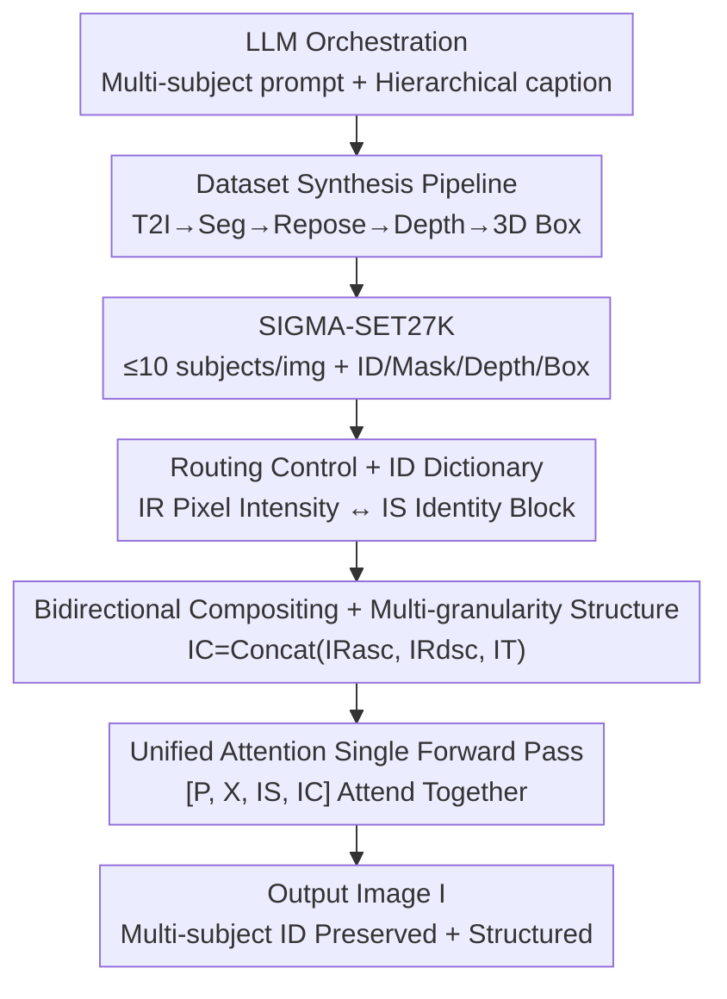

# SIGMA-GEN: Structure and Identity Guided Multi-Subject Assembly for Image Generation

**Conference**: ICLR 2026  
**OpenReview**: [https://openreview.net/forum?id=x2DWTywZ1i](https://openreview.net/forum?id=x2DWTywZ1i)  
**Code**: https://oindrilasaha.github.io/SIGMA-Gen/ (Available)  
**Area**: Diffusion Models / Controllable Image Generation  
**Keywords**: Multi-subject generation, Identity preservation, Structural control, Synthetic dataset, Diffusion Transformer

## TL;DR
SIGMA-GEN unifies "what each subject looks like (identity)" and "where each subject is placed, its orientation, and occlusion (structure)" into two control maps. This enables a Diffusion Transformer to incorporate up to 10 identity-preserving subjects in a **single forward pass**. The authors curate a synthetic dataset, SIGMA-SET27K, with identity/mask/depth/2D/3D box annotations. SIGMA-GEN outperforms iterative baselines that insert subjects one-by-one in terms of identity fidelity, image quality, and inference speed.

## Background & Motivation

**Background**: Text-to-image diffusion models generate high-quality images. Research has progressed along two lines: structural control (ControlNet, T2I-Adapter, layout boxes, 3D priors) which allows users to specify edges/depth/position, and subject personalization (DreamBooth, Textual Inversion, various in-context methods) which allows users to specify a particular object or person.

**Limitations of Prior Work**: These two lines rarely intersect. Structural control methods lack mechanisms to control subject identity. Personalization methods either require per-subject weight optimization or fail when presented with multiple subjects due to the lack of multi-subject training data. Subject insertion methods (AnyDoor, Insert Anything) can only insert one subject at a time. Methods like MS-Diffusion that support spatial control struggle with "multi-identity + multi-subject" scenarios. Existing approaches generate "multiple specified subjects in a specific layout" by **iteratively inserting them one-by-one**, which causes running time to scale linearly with the number of subjects and leads to quality degradation as later insertions destroy earlier content.

**Key Challenge**: There is a lack of a unified framework capable of jointly processing "structure (position/orientation/occlusion) + identity (multiple distinct subject appearances)" in the **same diffusion process**. A deeper bottleneck is data: almost no datasets exist with multiple subjects per image and aligned identity maps, masks, depth, and boxes.

**Goal**: (1) Construct a multi-subject dataset with complete structural and identity supervision signals. (2) Design a lightweight representation to feed multi-granularity spatial control (2D boxes/masks/3D boxes/pixel-wise depth) and multi-subject identities into a single model. (3) Generate images with multiple subjects, preserved identities, and structured layouts in a single forward pass.

**Key Insight**: The authors propose using **single-view RGB images** as identity descriptors (fitting the workflow of "reference-based generation") and **3D object representations with rendered depth** as layout proxies (depth naturally encodes position, orientation, and occlusion). The model accepts structural inputs ranging from coarse (2D boxes) to fine (pixel-wise depth).

**Core Idea**: Decouple "where to place" (Routing Control) and "what each subject looks like" (Identity Dictionary) into two control images matched to the generation resolution. Pixel intensities are used to map routing regions to identity blocks. Using unified attention, the noise latent, text, identity, and structure tokens attend to each other in a single forward pass to generate all subjects at once.

## Method

### Overall Architecture
SIGMA-GEN aims to generate an image $I$ containing $n$ identity-preserved subjects arranged according to $C$, given text $P$, a multi-subject identity control map $I_S$, and a spatial control map $I_C$. The pipeline consists of two parts: **Offline**, an automated synthesis pipeline creates SIGMA-SET27K (up to 10 subjects per image with aligned masks/depth/boxes/captions) for supervision; **Online**, $I_S$ and $I_C$ are encoded via the Diffusion Transformer's VAE and concatenated with noise latent $X$ and text $P$ as $[P, X, I_S, I_C]$ for unified attention. The model (Flux.1 Kontext[dev]) is fine-tuned via three-stage LoRA to map each pixel to a specific identity and structural position.

### Key Designs

**1. SIGMA-SET27K: Automated Pipeline for Multi-Subject + Multimodal Alignment**

The lack of data hinders multi-subject controllable generation. Existing personalization datasets are either single-subject or contain at most two identities. The authors built an automated pipeline: (1) LLMs write prompts for "multi-subject + diverse backgrounds" with individual subject captions. (2) A T2I model generates the target image. (3) Grounded segmentation tools isolate masks. (4) Depth estimation models predict target depth. (5) **Key step**: Flux-Kontext is used to **repose/relight** the isolated subjects to create identity maps with different poses from the target image. This forces the model to learn "semantic identity" rather than "copy-pasting." (6) 2D and 3D bounding boxes are fitted to support coarse control. The result is 27k images, >100k identities, up to 10 subjects per image, with all modalities aligned.

**2. Routing Control + Identity Dictionary: Pixel Intensity Mapping**

Spatial control $C$ is split into Routing Control $R$ (where each subject is placed) and Structural Control $T$ (scene properties like depth). A mapping $f: S \to M$ assigns a **unique pixel intensity** $m_i$ to each subject $s_i$ (e.g., increments of 10, background as 0). Thus, $I_R(x)=f(s_i)\mathbf{1}[x\in R_i]$ encodes layout. To link intensity to identity, an Identity Condition map $I_S$ is constructed by concatenating subject reference images $I_{s_i}\in\mathbb{R}^{H'\times W'\times 3}$ **vertically**, resulting in $I_S\in\mathbb{R}^{(N\cdot H')\times W'\times 3}$. The $i$-th block in $I_S$ corresponds directly to the routing region $R_i$. This visual dictionary allows each pixel in the routing map to query its appearance unambiguously.

**3. Bidirectional Compositing + Multi-granularity Control: Handling Occlusion**

While precise masks are ideal, coarse controls like 2D/3D boxes cause **overlap**. In crowded scenes, one subject might be entirely obscured in the layout map, losing its placement. The authors propose **bidirectional compositing**: constructing two routing maps, $I_{R_{asc}}$ and $I_{R_{dsc}}$, by pasting masks in **ascending** and **descending** order of their appearance in $I_S$. If a subject is obscured in the ascending map, it is likely visible in the descending one. These are concatenated along the channel dimension with structural control $I_T$ (depth or 3D box depth) to form $I_C=\text{Concat}(I_{R_{asc}}, I_{R_{dsc}}, I_T)\in\mathbb{R}^{H\times W\times 3}$. This unified representation handles everything from precise masks to coarse boxes.

**4. Unified Attention Single Forward Pass: Synchronized Subject Placement**

$I_S$ and $I_C$ are encoded using the DiT's existing VAE (no extra encoders). Following OminiControl, the noise latent $X$ and conditions $P, I_S, I_C$ are concatenated into $[P, X, I_S, I_C]$ for **unified attention**. Every modality can attend to all others: text constrains semantics, the identity dictionary provides appearance, and the spatial map provides placement. Spatial control uses the same RoPE embeddings as the noise latent; identity control uses the same RoPE but sets the first dimension to 1 (vs 0) to distinguish it. Solving for all identities and positions in one pass avoids the speed bottleneck and quality degradation of iterative methods.

### Loss & Training
The base model is Flux.1 Kontext[dev] with LoRA (rank/alpha=128), Prodigy optimizer, 8×A100 nodes, and total batch size 8. Training follows a three-stage curriculum: Stage 1 (30k steps on ≤4 subjects), Stage 2 (20k steps on ≥3 subjects), and Stage 3 (20k steps on >4 subjects). Samples randomly use one of three structure inputs: (i) precise mask + depth, (ii) 3D box mask + depth, or (iii) 2D box. Augmentations like mask dilation and 1% box aspect ratio jittering are used. Prompts alternate between "Place these subjects in \<bg prompt\>" and "Place these subjects to compose: \<full prompt\>".

## Key Experimental Results

### Main Results
The evaluation set includes 710 cases (200 single-subject, 510 multi-subject). Metrics include Identity Preservation (DINO-I, SigLIP-I), Text Alignment (SigLIP-T), Depth Alignment (MSE in subject regions), and Quality (CLIP-IQA, MUSIQ).

| Setting | Method | Control | DINO-I↑ | SigLIP-I↑ | SigLIP-T↑ | MSE↓ | CLIP-IQA↑ | MUSIQ↑ |
|------|------|------|---------|-----------|-----------|------|-----------|--------|
| Multi-subject | Insert Anything* | Mask,Depth | 72.72 | 75.58 | 17.66 | 203.4 | 44.41 | 48.86 |
| Multi-subject | **Ours (SIGMA-GEN)** | Mask,Depth | **74.54** | **77.82** | **17.73** | **26.35** | **72.64** | **73.21** |
| Multi-subject | MSDiffusion | Bbox | 63.28 | 69.06 | 11.20 | - | 61.99 | 69.05 |
| Multi-subject | **Ours (SIGMA-GEN)** | Bbox | **71.90** | **73.15** | **17.21** | - | **68.83** | **70.96** |

The advantage in multi-subject scenarios is significant. Compared to iterative Insert Anything*, CLIP-IQA jumped from 44.41 to 72.64 and Depth MSE dropped from 203.4 to 26.35. For ≥5 subjects with mask/depth control, SIGMA-GEN improves overall fidelity by +31 points, identity by +2 points, and is 4× faster.

### Ablation Study

| Configuration | DINO-I | SigLIP-T | MSE↓ | CLIP-IQA | Description |
|------|--------|----------|------|----------|------|
| Mask + depth (BG prompt) | 74.54 | 17.73 | 26.35 | 72.64 | Default (BG only) |
| Mask + depth (FULL) | 74.82 | 18.26 | 25.17 | 73.36 | Full scene prompt is better |

| Depth Injection | DINO-I | SigLIP-T | MSE↓ | Description |
|------|--------|----------|------|------|
| Subject Depth (token) | 74.54 | 17.73 | 26.35 | Default; avoids background depth |
| Full Depth (ControlNet) | 74.10 | 17.56 | 24.42 | Identity/Text alignment drops |

### Key Findings
- **Multi-subject Scalability**: As the number of subjects increases (2→7), iterative baselines show a sharp drop in CLIP-IQA/MUSIQ and a spike in inference time. SIGMA-GEN maintains stable quality and depth MSE.
- **Depth Benefit**: Removing depth (mask only) degrades all metrics, specifically worsening MSE from 26.35 to 40.10. Injecting depth via an external ControlNet harms identity consistency compared to internal tokens.
- **Background Depth**: Providing only subject-region depth is nearly as effective as full-scene depth, simplifying inference.
- **Emergent Abilities**: Despite being trained for generation, the model generalizes to zero-shot multi-subject insertion (with blended diffusion) and reposing.

## Highlights & Insights
- **Pixel Intensity as "Primary Key"**: Mapping 10/20/30 intensity to vertically stacked dictionary blocks is a lightweight way to resolve multi-subject ambiguity without extra positional encodings or text placeholders.
- **Bidirectional Compositing**: A simple data-side trick to handle occlusion in coarse layouts without architectural changes.
- **Data is the Method**: The "repose" step in the synthetic pipeline ensures the model learns semantic identity rather than pixel-level copying.
- **Single Forward vs. Iterative**: Solving for "multi-subject" in a single attention interaction prevents the quality degradation and time scaling issues inherent in serial insertion.

## Limitations & Future Work
- Identity preservation slowly declines as subject count increases, likely due to the long-tail distribution of high-subject-count samples in the synthetic dataset.
- The pipeline relies on multiple pre-trained models (LLM, T2I, segmentation, depth, Flux-Kontext), so dataset quality is bounded by these models.
- The identity dictionary $I_S$ grows tall with many subjects, increasing token count and VRAM usage.
- Future work could explore more compact identity encodings and richer 3D semantic controls.

## Related Work & Insights
- **vs ControlNet / T2I-Adapter**: These provide structural control but lack identity mechanisms. SIGMA-GEN unifies both into a single control map.
- **vs DreamBooth / Textual Inversion**: These require per-subject fine-tuning. SIGMA-GEN is an in-context, optimization-free, multi-subject approach.
- **vs AnyDoor / Insert Anything**: These are mask-guided but iterative or single-subject. SIGMA-GEN is faster (4×) and higher quality in multi-subject scenes.
- **vs MS-Diffusion / OminiControl**: These support some spatial control but are limited to single subjects or suffer from identity leakage. SIGMA-GEN scales these ideas to "multi-subject + multi-granularity" via the routing/dictionary representation and the SIGMA-SET27K dataset.

## Rating
- Novelty: ⭐⭐⭐⭐⭐ First unified framework for joint identity and multi-granularity structural control in a single pass.
- Experimental Thoroughness: ⭐⭐⭐⭐ Extensive ablations and comparisons, though evaluation is primarily on synthetic and DreamBooth-like sets.
- Writing Quality: ⭐⭐⭐⭐ Clear methodological explanation and helpful diagrams.
- Value: ⭐⭐⭐⭐⭐ Crucial for multi-subject creative workflows; 4× speedup and open-sourced data provide significant utility.

<!-- RELATED:START -->

## Related Papers

- [\[CVPR 2026\] MultiCrafter: High-Fidelity Multi-Subject Generation via Disentangled Attention and Identity-Aware Preference Alignment](../../CVPR2026/image_generation/multicrafter_high-fidelity_multi-subject_generation_via_disentangled_attention_a.md)
- [\[ICLR 2026\] MOSAIC: Multi-Subject Personalized Generation via Correspondence-Aware Alignment and Disentanglement](mosaic_multi-subject_personalized_generation_via_correspondence-aware_alignment_.md)
- [\[CVPR 2026\] SIGMA: Selective-Interleaved Generation with Multi-Attribute Tokens](../../CVPR2026/image_generation/sigma_selective-interleaved_generation_with_multi-attribute_tokens.md)
- [\[CVPR 2026\] Identity-Preserving Image-to-Video Generation via Reward-Guided Optimization](../../CVPR2026/image_generation/identity-preserving_image-to-video_generation_via_reward-guided_optimization.md)
- [\[ICLR 2026\] ContextGen: Contextual Layout Anchoring for Identity-Consistent Multi-Instance Generation](contextgen_contextual_layout_anchoring_for_identity-consistent_multi-instance_ge.md)

<!-- RELATED:END -->
