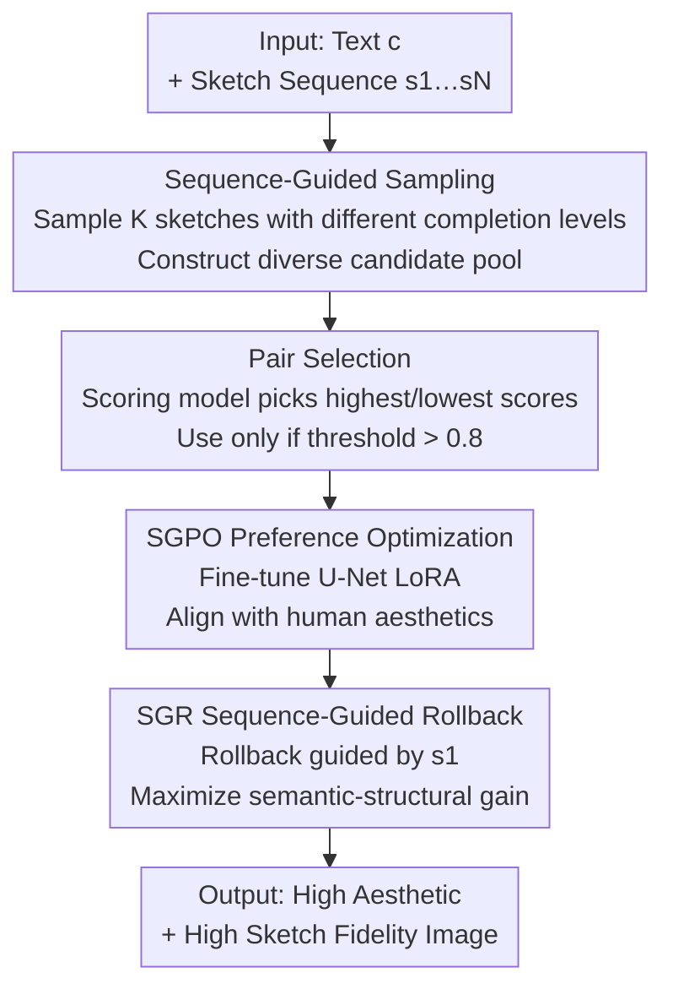

# SketchEvo: Enhancing Sketch-Guided Image Generation with Dynamic Drawing Processes

**Conference**: ICLR 2026  
**OpenReview**: [https://openreview.net/forum?id=Tsfxd4jDwJ](https://openreview.net/forum?id=Tsfxd4jDwJ)  
**Code**: GitHub page (The paper states it will be released)  
**Area**: Diffusion Models / Image Generation  
**Keywords**: Sketch-guided generation, Human preference alignment, Drawing sequences, Diffusion models, Rollback mechanism

## TL;DR
SketchEvo treats the dynamic sequence of drawing—from the first stroke to completion—as a source of diversity for preference optimization. During training, sketches with different completion levels are used as conditions to construct significantly distinct positive and negative pairs for aligning with human aesthetics. During inference, an initial sketch stroke-guided rollback mechanism is employed to strengthen semantic gain, thereby significantly improving the aesthetic quality of generated images while maintaining sketch fidelity.

## Background & Motivation

**Background**: Controllable generation guided by sketches (such as ControlNet, T2I-Adapter, VersaGen) can already utilize sketches as spatial structure priors, overlaid with text prompts to generate images. This allows users to express creative intent through the intuitive method of "drawing."

**Limitations of Prior Work**: Existing methods treat the **completed sketch as a static spatial constraint**, focusing only on the final appearance of the image while ignoring the implicit human preference information accumulated stroke-by-stroke during the drawing process. When faced with rough or disproportionate sketches from amateur users, models often produce results that are "technically correct but aesthetically disastrous"—strictly adhering to (poor) structural constraints while failing to capture the intended aesthetic beauty.

**Key Challenge**: The authors identify the bottleneck in the preference alignment step. Preference optimization methods like DPO, D3PO, and SPO work by "comparing generated variants and adjusting toward preferred directions," but they generate these variants solely by **adding random Gaussian noise to latent variables**. Under the **dual constraints** of sketch and text, noise perturbations only produce candidate samples with minimal differences. Positive and negative samples become nearly identical, causing the gradient signal $\Delta r \to 1$ to degenerate into directionless noise, making it impossible to learn meaningful aesthetic improvements. Consequently, the model is forced into a pseudo-dilemma: either faithfully replicate flawed amateur sketches or generate beautiful images that do not match the sketches.

**Key Insight**: The authors observe that the **drawing sequence $\{s_1, s_2, \dots, s_N\}$ itself is a natural source of diversity**. Intermediate sketches at different stages represent various levels of abstraction and detail (with massive differences between the first stroke $s_1$ and the final draft $s_N$). They possess significant structural and semantic differences yet are all linked to the same creative intent of the user.

**Core Idea**: Use "sketches of varying completion as conditions" instead of "pure noise" to create candidate samples. This ensures sufficiently large differences and rich gradient information in positive-negative pairs even under dual constraints. The aesthetic preferences learned during training are then fully released during the inference stage through a sequence-guided rollback mechanism.

## Method

### Overall Architecture

SketchEvo is fine-tuned based on ControlNetXL and consists of two complementary modules spanning the "training-inference" lifecycle. In the training phase, **SGPO (Sequence-Guided Preference Optimization)** generates significantly different positive and negative pairs to fine-tune LoRA within the U-Net for human aesthetic alignment. In the inference phase, the **SGR (Sequence-Guided Rollback)** mechanism uses the sketch sequence and text conditions to guide denoising rollback, fully releasing the learned aesthetic preferences into the final image while maintaining structural fidelity to the user's intent.

The overall data flow is: given text $c$ and an entire sketch sequence, during training, $K$ sketches with different completion levels are randomly sampled from the sequence at each denoising step as conditions to construct a candidate pool. A scoring model selects the highest and lowest scoring samples to form positive-negative pairs (used only if they exceed a threshold) to update the LoRA. During inference, the initial abstract sketch $s_1$ guides the rollback to maximize semantic-structural information gain for the final image generation.

### Key Designs

**1. Sequence-Guided Sampling: Using completion levels instead of noise to create diverse samples**

This design directly addresses the pain point where noise perturbations fail to produce distinct samples under dual constraints. Traditional SPO relies on adding random Gaussian noise to generated samples $x_t^k = \mu_\theta(x_{t+1}, c, t+1) + z,\ z \sim \mathcal{N}(0, I)$, where differences are dominated by noise $z$—which is negligible under dual constraints. SGPO randomly selects $K$ sketches from the drawing sequence at each sampling step as conditions, modifying the candidate pool construction to $x_t^k = \mu_\theta(x_{t+1}, c, c_{s_n}^k, t+1) + z$, where $c_{s_n}^k$ is the sketch condition for the $k$-th sample. Since sketches at different stages undergo substantial structural and detail evolution ($s_1, s_n, s_N$ differ significantly), the diversity of candidates is driven by the semantic dimension of "sketch completion" rather than just noise, yielding truly diverse samples.

**2. Pair Selection: Reviving degenerated preference gradients via sample diversity**

With a diverse candidate pool, the next step is transforming it into effective training signals. At each diffusion timestep $t$, a pre-trained scoring model evaluates all samples in the pool. The highest and lowest scoring samples are selected as the positive $x_t^w$ and negative $x_t^l$ samples, respectively. **Only pairs with differences exceeding a preset threshold are used for training** (the threshold is 0.8 in experiments, much higher than SPO's 0.4). The effectiveness of the gradient in SGPO depends directly on the difference between $x_t^w$ and $x_t^l$:

$$\nabla_\theta L_{\text{Ours}} = -\beta \mathbb{E}\big[\sigma(-\beta\Delta r)\,(\nabla_\theta \log p_\theta(x_t^w | c_{s_w}, \cdots) - \nabla_\theta \log p_\theta(x_t^l | c_{s_l}, \cdots))\big]$$

When diversity is insufficient, the difference shrinks, $\Delta r \to 1$, and the gradient degenerates into a useless signal without direction. Because SGPO's candidate pool diversity is significantly higher than SPO's, the differences in positive-negative pairs are more pronounced, providing rich gradients that "point toward beauty" and reviving the otherwise degenerated preference optimization.

**3. Sequence-Guided Rollback (SGR): Fully releasing learned preferences during inference**

Aligning preferences during training is not enough; directly applying existing text rollback mechanisms to sketch tasks encounters bottlenecks because those objectives are designed for single-modality text conditions and do not model the structural priors inherent in sketch conditions. SGR **jointly** uses the sketch sequence and text conditions to guide the rollback:

$$\epsilon_\theta^t(x_t) = (1+\gamma_1)u_\theta(x_t, c, c_{s_N}, t) - \gamma_1 u_\theta(x_t, \varnothing, c_{s_N}, t)$$
$$\epsilon_\theta^t(\tilde{x}_t) = (1+\gamma_2)u_\theta(\tilde{x}_t, c, c_{s_n}, t) - \gamma_2 u_\theta(\tilde{x}_t, \varnothing, c_{s_n}, t)$$

The information gain includes the semantics of text $c$, structural details from the sketch sequence $s_n$, and the human preferences learned by the model parameters $\theta$. When the sketch sequence is fixed, rollback is simplified to a text-like generation approach, with $\gamma_1, \gamma_2$ configured to maximize semantic gain. The paper further derives that the cumulative information gain $\delta_{Z\text{-Sampling}} \propto \sum_t (u_\theta(x_t, c, c_{s_n}, t))^2$ (proven in Appendix D; ⚠️ subject to the original text). **The larger the divergence between the text condition $c$ and the sketch condition $c_{s_n}$, the greater the cumulative information gain.** This explains why using the most abstract initial sketch $s_1$ (which differs most from the text) for rollback yields the best results: it amplifies both semantic-structural information and model preference information to the maximum while better preserving the structural features of the sketch.

### Loss & Training

Training follows the SPO preference optimization framework $L_{\text{SPO}} = -\mathbb{E}[\log\sigma(\beta\Delta r)]$, where $\beta$ is a regularization hyperparameter and $\Delta r$ is the preference ratio of positive-negative samples relative to a reference model $p_{\text{ref}}$. The model is fine-tuned based on ControlNetXL, training only the LoRA within the U-Net. Training was conducted entirely on the Sketchy dataset using A100 GPUs.

## Key Experimental Results

### Main Results (Sketchy Dataset)

| Method | Image Reward ↑ | HPS v2 ↑ | Pick Score ↑ | LPIPS-sketch ↓ | CLIP-Score ↑ |
|------|------|------|------|------|------|
| ControlNet | 0.004 | 24.08 | 20.03 | **0.11** | 23.70 |
| VersaGen | 0.08 | 24.68 | 20.79 | 0.14 | 23.77 |
| AnimateDiff | 0.23 | 23.68 | 20.42 | 0.14 | 23.56 |
| ControlNet-DPO | 0.47 | 25.02 | 20.86 | 0.16 | 23.35 |
| ControlNet-SPO | 0.61 | 27.69 | 22.04 | 0.17 | 23.65 |
| SGPO (No Rollback) | 1.03 | 28.87 | 21.94 | 0.20 | 23.86 |
| **Ours (SGPO+SGR)** | **1.18** | **30.08** | **22.41** | 0.15 | **24.15** |

Ours leads across all three human preference metrics (Image Reward / HPS v2 / Pick Score), with Image Reward nearly doubling from SPO's 0.61 to 1.18. Semantic fidelity (CLIP-Score) is the highest. Sketch similarity (LPIPS-sketch) is not the lowest because ControlNet/T2I-Adapter strictly adhere to sketches—though the authors emphasize that this "faithful replication of flawed sketches" is not an advantage. SGR further pushes all metrics higher than SGPO alone, validating the gain from the rollback mechanism.

### Generalization (Trained on Sketchy, tested across datasets)

| Dataset | Method | Image Reward ↑ | HPS v2 ↑ | PickScore ↑ | CLIP-Score ↑ |
|------|------|------|------|------|------|
| QuickDraw (Abstract) | ControlNet-SPO | 0.40 | 27.05 | 21.38 | 24.01 |
| QuickDraw | **Ours** | **0.86** | **30.22** | **21.67** | **24.28** |
| AnimeDiffusion (Pro) | ControlNet-SPO | 0.27 | 23.28 | 19.67 | 23.99 |
| AnimeDiffusion | **Ours** | **1.32** | **31.57** | **23.68** | **24.96** |
| FSCOCO (Complex) | ControlNet-SPO | 0.52 | 27.51 | 19.09 | 24.39 |
| FSCOCO | **Ours** | **0.96** | **30.31** | **21.78** | **24.77** |

The model **automatically balances aesthetics and sketch similarity based on abstraction levels without manual weight tuning**: it achieves the highest aesthetic scores on both abstract QuickDraw and professional AnimeDiffusion. More professional sketches (QuickDraw→Sketchy→FSCOCO→AnimeDiffusion) result in higher image-sketch similarity without sacrificing aesthetic quality.

### Ablation Study

| Configuration | Key Findings |
|------|---------|
| SGPO Candidate Diversity | Across all denoising stages, the image score gap between positive and negative samples is significantly higher than ControlNet-SPO, supporting a higher filtering threshold (0.8 vs 0.4). |
| SGR using $s_1$ guidance | Optimal overall evaluation; generation results are stable and better preserve sketch structure. |
| SGR using $s_{N-1}$ guidance | Worst performance—minimal difference from text, weakest information gain. |
| SGR using $s_{0.2N}$ to $s_{0.8N}$ | As strokes increase, divergence from text decreases, and consistency gradually drops. |

### Key Findings
- Candidate pool diversity is the lifeblood of the method: sequence-guided sampling widens the gap between positive and negative samples, directly determining if the preference gradient has direction. This is why SGPO alone can lift the Image Reward from 0.61 to 1.03.
- The counter-intuitive conclusion that rollback is better with more abstract sketches aligns with the derivation of Eq. 8: greater divergence between sketch and text conditions leads to higher cumulative information gain, making $s_1$ optimal.
- In complex scenes (FSCOCO), overall similarity is generally low (even ControlNet only reaches 0.41), confirming that strictly aligning multi-element sketches is difficult. However, this method still achieves a win-win on both key metrics under this difficulty.

## Highlights & Insights
- **Redefining the "Drawing Process" as diversity fuel for preference optimization**: While previous sketch-guided generation focused only on final drafts, this paper recognizes that the abstraction level differences in intermediate sketches provide the scarce "sample diversity" needed under dual constraints, bypassing the failure of noise perturbations. This idea of "using task-intrinsic structure rather than exogenous noise to create diversity" is transferable to any multimodal generation task under strong constraints.
- **Closed-loop of theory and experiment**: The paper derives the "need for greater sample diversity" from gradient degeneration $\Delta r \to 1$, and "divergence makes gain" from cumulative gain $\propto \sum (u_\theta)^2$. The ablation of $s_1$ vs $s_{N-1}$ perfectly validates this logical chain.
- **Adaptive balance without parameter tuning**: The model automatically weighs aesthetics against fidelity based on sketch professionalism, handling both amateur and professional sketches effectively. This is highly practical for interactive real-time creative drawing.

## Limitations & Future Work
- Training used only the Sketchy dataset. Although it demonstrates cross-domain generalization, the bias of the preference scoring model itself will directly impact alignment results. "Human preference" is proxied by a pre-trained scoring model, which may deviate from true diverse human aesthetics.
- Sketch similarity (LPIPS-sketch) is not optimal, making it potentially unsuitable for scenarios requiring strict stroke-for-stroke fidelity (e.g., engineering drawings); the paper positions its value in "aesthetics-first."
- SGR requires access to complete or partial drawing sequences. For inputs consisting of only final static sketches without process data, the source of diversity for sequence-guided sampling is limited; the paper does not fully discuss degradation behavior in such cases.
- Hyperparameter details such as the specific configuration of $\gamma_1, \gamma_2$ and the sensitivity of the 0.8 threshold are in the appendix and not expanded upon in the main text.

## Related Work & Insights
- **vs ControlNet / T2I-Adapter / VersaGen**: These treat sketches as static spatial constraints for strict alignment. This paper treats sketch sequences as dynamic preference signals. The former has higher sketch similarity but "faithfully replicates defects" in amateur sketches, whereas this paper sacrifices minor similarity for significant aesthetic gains.
- **vs DPO / SPO**: These rely on random Gaussian noise to create candidates, resulting in insufficient sample diversity and gradient degeneration under text+sketch constraints. This paper uses varying completion levels as conditions to create diverse samples, solving the root cause of weak preference optimization signals.
- **vs Text Rollback (Z-Sampling variants)**: Existing rollback mechanisms are designed for single-modality text and ignore sketch structural priors. SGR jointly uses sketch sequences and text for rollback and theoretically demonstrates that the most abstract sketch provides maximum information gain.

## Rating
- Novelty: ⭐⭐⭐⭐⭐ Transforming the dynamic drawing sequence into a source of diversity for preference optimization is a highly insightful new perspective.
- Experimental Thoroughness: ⭐⭐⭐⭐ Main experiment + three-dataset generalization + ablation is comprehensive, but lacks robustness analysis for inputs without sequences.
- Writing Quality: ⭐⭐⭐⭐ The loop of motivation-theory-experiment is clear, though some formula details require checking the appendix.
- Value: ⭐⭐⭐⭐ Provides both practical and methodological value for interactive sketch creation and preference alignment under strong constraints.

<!-- RELATED:START -->

## Related Papers

- [\[ICLR 2026\] Improving Classifier-Free Guidance in Masked Diffusion: Low-Dim Theoretical Insights with High-Dim Impact](improving_classifier-free_guidance_in_masked_diffusion_low-dim_theoretical_insig.md)
- [\[ICLR 2026\] Generalization of Diffusion Models Arises with a Balanced Representation Space](generalization_of_diffusion_models_arises_with_a_balanced_representation_space.md)
- [\[ICLR 2026\] CMT: Mid-Training for Efficient Learning of Consistency, Mean Flow, and Flow Map Models](cmt_mid-training_for_efficient_learning_of_consistency_mean_flow_and_flow_map_mo.md)
- [\[ICLR 2026\] PCPO: Proportionate Credit Policy Optimization for Aligning Image Generation Models](pcpo_proportionate_credit_policy_optimization_for_aligning_image_generation_mode.md)
- [\[ICLR 2026\] PI-Light: Physics-Inspired Diffusion for Full-Image Relighting](pi-light_physics-inspired_diffusion_for_full-image_relighting.md)

<!-- RELATED:END -->
