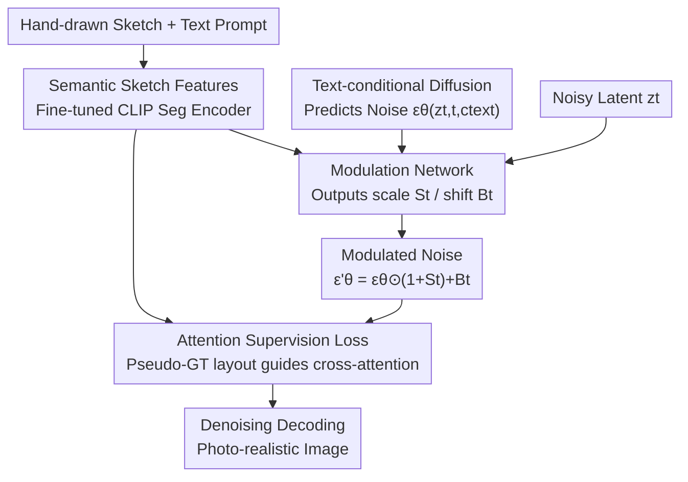

# SketchingReality: From Hand-Drawn Scene Sketches to Photo-Realistic Images

**Conference**: ICLR 2026  
**OpenReview**: [https://openreview.net/forum?id=g5QqkCLbog](https://openreview.net/forum?id=g5QqkCLbog)  
**Code**: Provided on project page (repository URL not in paper)  
**Area**: Diffusion Models / Image Generation  
**Keywords**: Hand-drawn sketches, Sketch-to-image, Noise modulation, Attention supervision, Latent space diffusion

## TL;DR
This paper proposes SketchingReality, a "semantic modulation + attention supervision" scheme that transforms abstract and distorted **hand-drawn** scene sketches (rather than neat edge maps) into images that are both faithful to sketch semantics and photo-realistic. It also introduces a training loss that does not require pixel-aligned ground truth images.

## Background & Motivation
**Background**: As diffusion models grow more powerful, researchers are exploring conditional signals beyond text—such as depth maps, edge maps, camera parameters, and reference images—to achieve finer controllable generation. Sketches, being one of the oldest human forms of expression, can convey complex visual concepts in a few strokes, making them a natural human-centric control condition.

**Limitations of Prior Work**: Existing "sketch-conditional" methods (e.g., ControlNet, T2I-Adapter) actually process **pixel-aligned edge maps**, which are inaccurately called "sketches." True hand-drawn sketches involve significant abstraction and deformation: grass might be a row of vertical lines, a forest denoted by a few representative trees, and relative sizes may be distorted. Applying these methods directly to hand-drawn sketches results in either ignored sketch details or sacrificed realism.

**Key Challenge**: Hand-drawn sketches lack a "unique correct pixel alignment"—a single sketch can correspond to countless reasonable real images. Consequently, the "pixel-aligned ground truth" required by standard denoising objectives does not exist for hand-drawn scenes. Using stylized, non-aligned reference images like those in FS-COCO for supervision introduces ambiguity. The root problem is: **the focus should be on understanding sketch semantics rather than rigid alignment with every stroke's position.**

**Goal**: To generate images that simultaneously (i) extract meaningful semantic representations from highly abstract sketches and (ii) produce realistic results that respect the sketch layout.

**Key Insight**: The authors observe that the VAE encoders used by ControlNet lack semantic understanding of sketches, while the convolutional encoders in Adapters lack expressive power. Instead of pixel-level matching, it is better to reuse a CLIP-style encoder originally trained for sketch semantic segmentation to inject semantic signals of "what and where" into the generation process.

**Core Idea**: Use semantic sketch features to **modulate** (scale/shift) the diffusion noise prediction, and supervise cross-attention during training using "pseudo-ground truth attention maps" derived from the sketch encoder, thereby eliminating dependency on pixel-aligned ground truth.

## Method

### Overall Architecture
SketchingReality is built upon Latent Diffusion Models (LDM). It takes a hand-drawn scene sketch and a text prompt as input to output a photo-realistic image. The process consists of three sequential steps: first, a **semantic sketch encoder** encodes the abstract sketch into semantic features; second, a **modulation network** uses these features to adjust the noise predicted by the text-conditional diffusion (generating pixel-wise scale maps $S_t$ and shift maps $B_t$); third, an **attention supervision loss** utilizes pseudo-GT attention maps derived from the sketch encoder to constrain cross-attention, ensuring the generated image follows the sketch layout—all without requiring pixel-aligned ground truth.

### Key Designs

**1. Semantic Sketch Features: Understanding Abstract Sketches via Segmentation-trained CLIP**

To address the "VAE/CNN encoders fail to understand sketch semantics" issue, the authors reuse a pre-trained CLIP-style sketch encoder (Bourouis et al., 2024). This encoder was originally trained on FS-COCO hand-drawn sketches for open-vocabulary semantic segmentation, naturally capturing spatial semantics of "which pixels belong to which object." Since direct use of segmentation features lacks fine-grained detail, the authors **fine-tune its last three layers**. This maintains a semantically separable latent space while recovering enough visual detail to significantly improve alignment between the generated image and input sketch. This serves as the "semantic source" for both modulation and attention supervision.

**2. Modulation Network: Noise Modulation via Scale/Shift instead of Rigid Alignment**

To resolve the contradiction where "forced pixel alignment destroys realism," the authors extend the noise modulation approach of Ham et al. (2023). They design a modulation network specifically for semantic sketch features. It receives semantic sketch features, the noisy latent $z_t$, and the text-conditioned noise prediction $\epsilon_\theta(\cdot)$, then outputs pixel-wise scale maps $S_t \in \mathbb{R}^{H\times W\times 4}$ and shift maps $B_t$. The noise is modulated as:

$$\epsilon'_\theta(z_t, t, c_\text{text}, c_\text{sketch}) = \epsilon_\theta \odot (1 + S_t) + B_t$$

The network is an encoder-decoder CNN: each modality (semantic features, $z_t$, $\epsilon_\theta$) is projected into an embedding space via independent downsampling branches, concatenated, passed through timestamp-conditioned convolutions, and upsampled. Ablations show that **independent downsampling branches** are superior to simple concatenation as they better utilize sketch information. Because modulation "softly" scales and shifts noise rather than treating strokes as hard constraints, it respects sketch semantics while preserving the inherent realism of the diffusion model.

**3. Attention Supervision Loss: Training Without Pixel-Aligned Ground Truth**

This is the core loss proposed to solve the lack of pixel-aligned ground truth. Leveraging the spatial signals from the semantic encoder, the authors calculate pseudo-ground truth attention maps $M_\text{grth}$ (binary masks derived from feature-text similarity thresholds for hand-drawn sketches; raw MS-COCO masks for synthetic sketches). During training, the denoised latent $\hat z_0$ is estimated from the modulated noise $\epsilon'_\theta$, and multiple cross-attention maps $M$ are extracted to be supervised by $M_\text{grth}$:

$$L_\text{attn} = \sum_{\gamma\in\Gamma}\sum_{i\in I}\sum_{b_i\in B}\left[\left(1-\frac{\sum_{p\sim b_i} M^{(\gamma)}_{pi}}{\sum_p M^{(\gamma)}_{pi}}\right)^2 - \lambda_\text{reg}\sum_{p\sim b_i} M^{(\gamma)}_{pi}\right]$$

Intuitively, the first term encourages the attention of the $i$-th text token to concentrate within the sketch-specified region $b_i$, while the second term (weighted by $\lambda_\text{reg}$) prevents attention leakage. This approach requires only the semantic layout of the sketch, bypassing the fundamental difficulty of hand-drawn sketch alignment.

### Loss & Training
The total objective is a weighted sum of four terms:

$$L_\text{total} = \lambda_0 L_\text{noise} + \lambda_1 L_\text{attn} + \lambda_2\left(L^\text{scale}_1 + L^\text{shift}_1 + L_\text{var}\right)$$

where $L_\text{noise}$ is the standard denoising loss; $L^\text{scale}_1=\|S_t\|_1$ and $L^\text{shift}_1=\|B_t\|_1$ are L1 regularizations on the modulation maps; $L_\text{var}=-(\sigma(S_t)+\sigma(B_t))$ encourages expressive modulation by penalizing low variance. Weights are set to $\lambda_0,\lambda_1=1.0$ and $\lambda_2=0.1$.

Training data comprises FS-COCO (9,525 training / 475 testing), supplemented by synthetic sketches generated via Su et al. (2023). Batches mix 50% hand-drawn and 50% synthetic sketches. For hand-drawn sketches, $\lambda_0=0.0$ (no denoising loss, relying solely on attention supervision). Training and inference modulation occur only during the **first 10% of timesteps** (the highest noise levels), which control the global semantic structure. The backbone is SD2.1, trained on a single A100.

## Key Experimental Results

### Main Results
Evaluated on 475 hand-drawn test sketches from FS-COCO using FID, CLIP sketch-image similarity, and LPIPS. Ours leads across all baselines (including ControlNet, T2I-Adapter, ControlNext, SG, and FreeControl).

| Method | Setting | FID↓ | CLIP↑ | LPIPS↓ |
|------|------|------|-------|--------|
| ControlNet SD2.1 | Zero-shot | 135.595 | 1.136 | 0.773 |
| ControlNet SD2.1 | $L_\text{noise}+L_\text{attn}$ | 135.891 | 1.196 | 0.768 |
| T2I-Adapter ($s{=}0.8,\tau{=}0.4$) | $L_\text{noise}+L_\text{attn}$ | 139.568 | 0.454 | 0.778 |
| ControlNext SDXL | Zero-shot | 134.094 | 0.909 | 0.774 |
| SG | Zero-shot | 137.381 | 1.043 | 0.782 |
| FreeControl | Training-free | 141.632 | 1.089 | 0.793 |
| **Ours** | **Full** | **121.973** | **1.291** | **0.739** |

Key Observation: Naive fine-tuning of ControlNet/T2I on hand-drawn sketches degrades performance due to lack of alignment. However, **adding the proposed attention loss and training with mixed synthetic+hand-drawn sketches** significantly improves CLIP similarity and LPIPS without harming FID.

### Ablation Study
Ablations on sketch representation in the modulation network:

| Sketch Representation | Performance |
|--------------|------|
| VAE Encoder (Shared branch, like ControlNet) | FID increases significantly, CLIP drops; worse than standard ControlNet |
| Raw sketch to single-branch U-Net (like Ham et al.) | Poorest performance; fails to leverage sketch info |
| **Semantic features + independent downsampling (Ours)** | **Best**; proves semantic features and independent branch design are both essential |

Ablations regarding the "first 10% of timesteps" (Appendix D.3) confirm that the high-noise phase dominates the global semantic structure.

## Highlights & Insights
The core contribution of SketchingReality lies in shifting the research focus from "neat edge maps" to true **abstract hand-drawn scene sketches**. It provides three key solutions: reusing a segmentation CLIP encoder for semantic features, employing soft noise modulation (scale/shift) instead of rigid alignment, and an attention supervision loss that bypasses pixel-aligned ground truth. Together, these allow the model to set new SOTA results on FS-COCO for both realism (FID) and sketch alignment (CLIP, LPIPS) without extra inference overhead. Limitations include a continued reliance on text to disambiguate sketches and training restricted to the FS-COCO dataset, leaving generalization across diverse sketch styles for future work.

<!-- RELATED:START -->

## Related Papers

- [\[CVPR 2026\] Refracting Reality: Generating Images with Realistic Transparent Objects](../../CVPR2026/image_generation/refracting_reality_generating_images_with_realistic_transparent_objects.md)
- [\[ICLR 2026\] PICABench: How Far are We from Physically Realistic Image Editing?](picabench_how_far_are_we_from_physical_realistic_image_editing.md)
- [\[CVPR 2026\] A Self-Conditioned Representation Guided Diffusion Model for Realistic Text-to-LiDAR Scene Generation](../../CVPR2026/image_generation/a_self-conditioned_representation_guided_diffusion_model_for_realistic_text-to-l.md)
- [\[ICLR 2026\] Generate Any Scene: Scene Graph Driven Data Synthesis for Visual Generation Training](generate_any_scene_scene_graph_driven_data_synthesis_for_visual_generation_train.md)
- [\[ICLR 2026\] Generating Metamers of Human Scene Understanding](generating_metamers_of_human_scene_understanding.md)

<!-- RELATED:END -->
