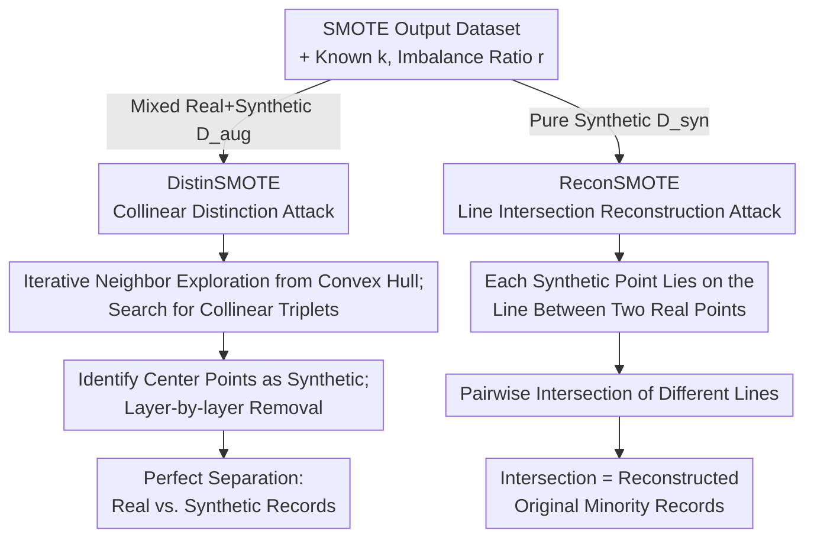

# SMOTE and Mirrors: Exposing Privacy Leakage from Synthetic Minority Oversampling

**Conference**: ICLR 2026  
**arXiv**: [2510.15083](https://arxiv.org/abs/2510.15083)  
**Code**: Not provided  
**Area**: Image Generation  
**Keywords**: SMOTE, Privacy Leakage, Reconstruction Attack, Distinction Attack, Minority Oversampling

## TL;DR

This work provides the first systematic study of privacy leakage in SMOTE, proposing two attacks, DistinSMOTE and ReconSMOTE. It demonstrates that SMOTE is inherently non-privacy-preserving and excessively exposes minority class records.

## Background & Motivation

**Background**: SMOTE (Synthetic Minority Over-sampling Technique) is one of the most widely used methods for addressing class imbalance and generating synthetic data (the original paper has nearly 40,000 citations and built-in support in Azure). By performing linear interpolation between minority samples to generate synthetic ones, it is used both as data augmentation to improve classifier performance (e.g., medical diagnosis, fraud detection) and as a baseline for complex generative models like GANs and VAEs.

**Limitations of Prior Work**: Despite its widespread use in privacy-sensitive scenarios, the privacy implications of SMOTE remain almost unstudied. More critically, some diffusion model papers claim privacy protection solely by showing "better DCR metrics than SMOTE." This evaluation paradigm, which treats SMOTE as a privacy baseline, is fundamentally flawed: if SMOTE itself severely leaks privacy, all conclusions based on it as a reference are invalid. This paper aims to thoroughly expose the privacy vulnerabilities of SMOTE.

## Method

### Overall Architecture

The study identifies the linear interpolation mechanism of SMOTE as the vulnerability for attacks. Given a SMOTE-produced dataset, the knowledge that SMOTE was used, the number of neighbors $k$, and the imbalance ratio $r$, an attacker can reverse-engineer private data using geometric regularities without auxiliary data, shadow models, or repeated queries. Under this minimal threat model of "output-only, parameter-known," two complementary routes are proposed: **DistinSMOTE** separates real and synthetic records from a mixed augmented dataset $D_{aug}$, while **ReconSMOTE** directly reconstructs original minority records from a pure synthetic dataset $D_{syn}$. Both leverage the fact that synthetic points lie strictly on the line segment between two real points—one utilizing "collinearity of center points" for distinction and the other using "line intersection" for reconstruction.

### Key Designs

**1. DistinSMOTE: Identifying Synthetic Points via Collinearity**

When real and synthetic records are mixed in $D_{aug}$, naive methods (e.g., comparing nearest neighbor distances) fail to detect leakage, leading to the false impression that SMOTE is "safe." DistinSMOTE exploits a hard geometric fact: synthetic points are generated via strict linear interpolation between two real points. Consequently, in any collinear triplet, the middle point must be synthetic—as real points are extremely unlikely to be perfectly collinear in high-dimensional continuous feature spaces. The attack starts from the convex hull of minority records and iteratively explores neighbors. Once a collinear triplet is found, the center point is marked as synthetic and removed, and its neighbors are queued for checking. This process removes synthetic points layer by layer. The authors prove that under three mild assumptions—continuous features, global non-collinearity, and $k \geq 3$—DistinSMOTE achieves perfect precision and recall. This invalidates the assumption that synthetic points remain hidden when mixed with real data.

**2. ReconSMOTE: Exposing Real Records via Line Intersections**

More dangerous than distinction is direct reconstruction: even if no real records exist in the dataset, a pure synthetic $D_{syn}$ still leaks original data. Each synthetic point lies on the line segment connecting two real points. By finding enough synthetic points that lie on different lines connected to the same real point and intersecting these lines pairwise, the intersection points reveal the real records themselves. The ability to recover a specific record depends on whether synthetic points surrounding it are dense enough to form multiple intersecting lines. Thus, recall increases exponentially at a rate of approximately $r/k$ as the imbalance ratio $r$ grows (as each real point is used more frequently for interpolation), reaching 1.0 when $k=5, r \geq 20$. The precision remains perfect (1.0) because any reconstructed intersection point is a genuine original record rather than a hallucination.

Both attacks have a time complexity of $O(n^2 d + n(kr)^2)$, requiring only minutes to run on all 8 experimental datasets, demonstrating their low cost and practical feasibility.

## Key Experimental Results

### Main Results

| Attack Method | Augmented Data Precision | Synthetic Data Precision |
| :--- | :--- | :--- |
| Naive Distinction (Current Practice) | 0.01 ± 0.01 | — |
| Naive Metric (DCR) | — | 0.16 ± 0.10 |
| MIA (Membership Inference) | 0.68 ± 0.07 | 0.93 ± 0.02 |
| DistinSMOTE | **1.00 ± 0.00** | — |
| ReconSMOTE | — | **1.00 ± 0.00** |

### Key Findings

1.  **Failure of Existing Evaluations**: Naive distinction and DCR metrics fail to detect any leakage.
2.  **First MIA Application to SMOTE**: Achieves high AUC for 100 vulnerable targets.
3.  **Perfect Distinction by DistinSMOTE**: Successfully separates real vs. synthetic records in augmented datasets.
4.  **Perfect Precision by ReconSMOTE**: Reconstructs original minority records with an average recall of 0.85, reaching 1.0 when $r \geq 20$.

### Ablation Study

| Parameter | Impact on ReconSMOTE |
| :--- | :--- |
| Increasing Imbalance Ratio $r$ | Exponential growth in recall |
| Increasing Number of Neighbors $k$ | Reduction in recall |
| Feature Dimension $d$ | Non-collinearity assumption becomes easier to satisfy |

## Highlights & Insights

1.  **Systematic Exposure of SMOTE Privacy Risks**: Theoretically and experimentally proves that SMOTE is inherently non-privacy-preserving.
2.  **Near-Perfect Attacks with Minimal Assumptions**: Requires no auxiliary data or model access.
3.  **Fundamental Flaws in Evaluation Methods**: Demonstrates that DCR metrics and naive distinction methods are completely unreliable.
4.  **Warning to the Research Community**: Challenges a large number of generative model papers that use SMOTE+DCR to evaluate privacy.

## Limitations & Future Work

1.  The attack assumes the attacker knows SMOTE was used along with its parameters.
2.  Primarily targets standard SMOTE; variants (e.g., Borderline-SMOTE, ADASYN) are not fully explored.
3.  The non-collinearity assumption may not hold in extremely low-dimensional or discrete feature scenarios.
4.  Specific defense mechanisms are not provided.

## Related Work & Insights

*   **SMOTE Variants**: Improvements like Borderline-SMOTE and SMOTE-ENN.
*   **Privacy Attacks**: MIA (Shokri 2017), Reconstruction attacks (Carlini 2021).
*   **Synthetic Data Privacy**: DCR metrics (Zhao 2021), Differentially Private generative models.
*   **Questioned Papers**: Multiple diffusion model papers published in top conferences that use SMOTE+DCR to claim privacy protection.

## Rating

*   **Novelty**: ⭐⭐⭐⭐⭐ — First to reveal fundamental privacy flaws in a widely used method.
*   **Value**: ⭐⭐⭐⭐⭐ — Direct impact on real-world deployment scenarios.
*   **Experimental Thoroughness**: ⭐⭐⭐⭐ — Comparison of multiple attacks across 8 datasets.
*   **Writing Quality**: ⭐⭐⭐⭐⭐ — Clear motivation and rigorous theoretical analysis.

<!-- RELATED:START -->

## Related Papers

- [\[ICML 2025\] Privacy Amplification Through Synthetic Data: Insights from Linear Regression](../../ICML2025/image_generation/privacy_amplification_through_synthetic_data_insights_from_linear_regression.md)
- [\[AAAI 2026\] Exposing DeepFakes via Hyperspectral Domain Mapping](../../AAAI2026/image_generation/exposing_deepfakes_via_hyperspectral_domain_mapping.md)
- [\[ICLR 2026\] DeLeaker: Dynamic Inference-Time Reweighting For Semantic Leakage Mitigation in Text-to-Image Models](deleaker_dynamic_inference-time_reweighting_for_semantic_leakage_mitigation_in_t.md)
- [\[ICML 2026\] Beyond Generative Priors: Minority Sampling with JEPA-Guided Diffusion](../../ICML2026/image_generation/beyond_generative_priors_minority_sampling_with_jepa-guided_diffusion.md)
- [\[ICLR 2026\] Do We Need All the Synthetic Data? Targeted Image Augmentation via Diffusion Models](do_we_need_all_the_synthetic_data_targeted_image_augmentation_via_diffusion_mode.md)

<!-- RELATED:END -->
