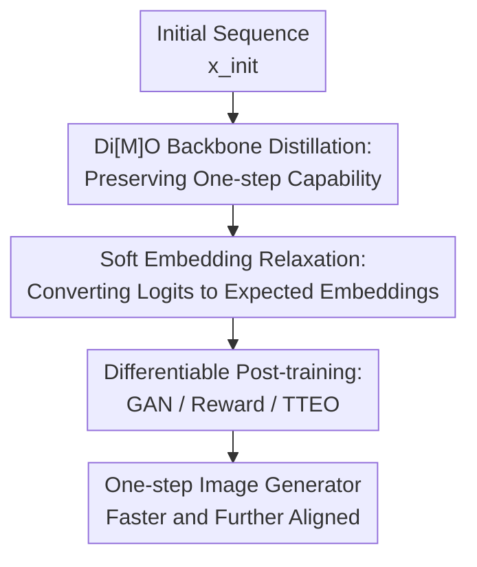

# Soft-Di[M]O: Improving One-Step Discrete Image Generation with Soft Embeddings

**Conference**: ICLR2026  
**OpenReview**: [https://openreview.net/forum?id=83pHDDmkXt](https://openreview.net/forum?id=83pHDDmkXt)  
**Code**: To be released  
**Area**: Image Generation / Discrete Image Generation  
**Keywords**: One-step generation, discrete diffusion, masked diffusion model, soft embedding, reward fine-tuning  

## TL;DR
Soft-Di[M]O relaxes the token distribution of one-step discrete image generators into differentiable expected embeddings. This allows the Di[M]O-distilled Masked Diffusion Model to integrate with GAN training, differentiable reward fine-tuning, and test-time embedding optimization, pushing the one-step FID to 1.56 on ImageNet-256 and outperforming teacher models in GenEval and HPS metrics for text-to-image tasks.

## Background & Motivation

**Background**: Masked Diffusion Models (MDMs) generate images by iteratively filling mask tokens with discrete visual tokens. Models like MaskGit, MaskBit, Meissonic, and MaskGen have achieved strong results in class-to-image and text-to-image generation. However, they require multiple sampling iterations, making them significantly slower than one-step GANs or distilled continuous diffusion models. Methods like Di[M]O attempt to distill multi-step MDMs into one-step generators that output all discrete tokens in a single forward pass.

**Limitations of Prior Work**: While one-step discrete students are fast, they face two major hurdles. First, data-free distillation inherently follows the teacher model, inheriting modeling errors, poor preference alignment, and prompt-specific weaknesses. Second, the student outputs discrete tokens; applying sampling or argmax breaks the gradient flow, making it difficult to apply post-training techniques like GANs, reward fine-tuning, or test-time optimization commonly used in continuous diffusion distillation.

**Key Challenge**: The core issue is the contradiction between the utility of discrete representations and their non-differentiable nature. Discrete visual tokens are natural for MDMs and tokenizer decoders, but once logits are sampled into tokens, gradients from downstream discriminators or reward models (CLIP, ImageReward, HPS) cannot flow back to the generator. While REINFORCE can estimate gradients for discrete sampling, it suffers from high variance in high-dimensional sequences. Gumbel-Softmax ST introduces forward/backward mismatch and noise, which is particularly unsuitable for the unstable training dynamics of GANs or reward models.

**Goal**: The objective is not to train a new MDM from scratch or replace the discrete tokenizer with a continuous VAE. Instead, the goal is to make existing one-step discrete generators differentiable with minimal modifications while maintaining compatibility with the teacher backbone and tokenizer decoder. Specifically, the aim is to use GANs to bridge distribution gaps in class-to-image generation and differentiable rewards to improve prompt following and aesthetics in text-to-image generation, while enabling test-time optimization (TTEO) of input embeddings.

**Key Insight**: A critical observation is that the output logits of one-step discrete generators (like Di[M]O or ReDi) are typically very sharp, with probability mass concentrated on a few candidate tokens. Since the distribution is nearly one-hot, using the "probability-weighted average of token embeddings" as a continuous surrogate results in a vector very close to the sampled token's embedding while preserving the gradients from downstream targets back to the logits.

**Core Idea**: Soft-Di[M]O uses soft embeddings as a post-training interface instead of hard discrete tokens. By making the path $z_\theta \rightarrow p_\theta \rightarrow \tilde e_\theta$ differentiable, it unlocks GAN training, reward fine-tuning, and TTEO without breaking the underlying Di[M]O distillation framework.

## Method

### Overall Architecture

Soft-Di[M]O uses Di[M]O's one-step MDM distillation as its backbone. The student model performs a single forward pass from an initial sequence $x_{init}$ to output logits $z_\theta$ for all positions. A discrete path continues to sample tokens $x_\theta$ for the Di[M]O loss to align with teacher/auxiliary distributions. Simultaneously, a continuous path converts logits into soft embeddings, allowing external supervision to update the student directly. This ensures the discrete path follows the MDM teacher while the continuous path injects external feedback.

Implementation-wise, the student's output logits serve two objectives. The Di[M]O loss still samples tokens from $p_\theta(x_0|x_{init})=\mathrm{softmax}(z_\theta)$, applies forward masking to get $\tilde x_t$, and minimizes the distribution difference between the teacher $\phi$ and auxiliary model $\psi$. The soft embedding path bypasses sampling, multiplying the probability distribution by the embedding matrix to produce a sequence of continuous vectors. This sequence is then passed to a frozen teacher backbone for discrimination or to a tokenizer decoder to generate a differentiable image for reward scoring.

### Key Designs

**1. Di[M]O Backbone Distillation: Preserving One-step Capability**

Soft-Di[M]O retains the original Di[M]O objective because training a one-step model solely with GANs or rewards often leads to deviation from the teacher distribution, reward hacking, or mode collapse. The student performs on-policy distillation: after generating tokens $x_\theta$ from $x_{init}$, these tokens are re-masked into $\tilde x_t$ to ensure the teacher $\phi$ and auxiliary model $\psi$ produce consistent distributions at that state. This loss regularizes the generator to remain within the teacher's reasonable image manifold while other objectives improve fidelity or preference scores.

**2. Soft Embedding Relaxation: Converting Logits to Expected Embeddings**

The core modification is straightforward: for each token position $i$, the student outputs logits $z^i_\theta$, computes the distribution $p_\theta(x^i_0|x_{init})$ via softmax, and calculates the expectation using the teacher's or tokenizer's embedding matrix $E\in\mathbb{R}^{|V|\times d}$: $\tilde e^i_\theta=E^\top p_\theta(x^i_0|x_{init})=\sum_j p_\theta(x^i_0=j|x_{init})E_j$. This approach does not require learning a new projection or a continuous tokenizer; it operates directly in the existing model’s embedding space.

The effectiveness of this method stems from the concentrated logits of one-step generators. Using a second-order Taylor analysis, the paper proves that the bias between the soft surrogate $f(\tilde e)$ and the discrete expectation $\mathbb{E}_{j\sim p_\theta}[f(e_j)]$ is bounded by the embedding covariance: $|f(\tilde e)-\mathbb{E}[f(e_j)]|\le \frac{L}{2}\|\Sigma\|$. For sharp logits, $\|\Sigma\|=O(\epsilon)$, leading to minimal bias. Unlike Gumbel-Softmax ST, which has first-order bias and stochastic noise, soft embeddings provide more stable gradients for GAN/reward training.

**3. Differentiable Post-training: GAN / Reward / TTEO**

The value of soft embeddings lies in reconnecting generators to non-differentiable downstream tasks. In class-to-image generation, $\mathrm{Emb}_\phi(z_\theta)$ is fed into a frozen teacher backbone with lightweight discriminator heads attached to transformer layers to distinguish real token embeddings from soft embeddings. To match the teacher's training distribution (masked sequences), real or generated embeddings are randomly replaced with mask embeddings using a mask ratio $r$.

In text-to-image generation, the tokenizer decoder's embedding layer $\mathrm{Emb}_{Dec}$ converts logits into continuous embeddings for decoding a differentiable image. This image is scored by reward models to form $L_{reward}(\theta)=-\sum_i\lambda_i R_i(\mathrm{Dec}(\mathrm{Emb}_{Dec}(z_\theta),c))$. The total objective is $L_{gen}=L_{\mathrm{Di[M]O}}+w_{GAN}L_{GAN}+w_{reward}L_{reward}$. During inference, TTEO optimizes the input embedding $e_{in}$ to maximize reward scores without modifying model weights.

### Mechanism

For a prompt like "a red cube on the left of a blue sphere," a MaskGen-L teacher would typically require multiple steps to recover visual tokens. The Di[M]O student compresses this into one step, outputting logits $z_\theta$ for all positions. In the discrete path, tokens are sampled and decoded. Simultaneously, in the soft path, the continuous sequence $\tilde e^i_\theta=\sum_jp^i_jE_j$ is decoded into an image. If a reward model identifies incorrect colors or positioning, gradients flow from the reward loss back through the decoder, the embedding expectation, and the softmax probabilities to the generator logits. The Di[M]O loss ensures this optimization does not push the image into over-saturated or non-manifold regions.

### Loss & Training

The training objective combines the base distillation term with task-specific post-training terms. Class-to-image experiments primarily use $L_{\mathrm{Di[M]O}}+w_{GAN}L_{GAN}$ to improve FID (distribution matching). Text-to-image experiments use $L_{\mathrm{Di[M]O}}+w_{reward}L_{reward}$ to maximize GenEval, HPS, and CLIP scores for prompt adherence.

The authors conducted experiments on MaskGit, MaskBit, Meissonic, and MaskGen teachers. Training uses Adam with bf16 and EMA. For MaskBit’s long-training version, the learning rate is reduced to $5\times10^{-7}$ and the GAN loss weight is increased to 200. TTEO utilizes SGD with a learning rate of 0.2, selecting the best result based on a composite score of CLIP, ImageReward, HPS, and PickScore.

## Key Experimental Results

### Main Results

Evaluations on ImageNet-256 show significant gains. Using a MaskBit teacher, Di[M]O (one-step) achieves an FID of 2.89. Soft-Di[M]O with GAN training reduces this to 1.96, and extended training reaches **1.56**, outperforming the 64-step teacher (FID 1.66).

| Setting | Method | Steps | FID↓ | IS↑ | Precision↑ | Recall↑ |
|------|------|-------|------|-----|------------|---------|
| MaskBit teacher | MaskBit | 64 | 1.66 | 320.0 | 0.81 | 0.60 |
| MaskBit teacher | Di[M]O-MaskBit | 1 | 2.89 | 310.1 | 0.87 | 0.49 |
| MaskBit teacher | Soft-Di[M]O-MaskBit | 1 | 1.96 | 281.4 | 0.84 | 0.55 |
| MaskBit teacher | Soft-Di[M]O-MaskBit + long | 1 | **1.56** | 273.2 | 0.81 | 0.60 |

For text-to-image, Soft-Di[M]O significantly improves Meissonic and MaskGen-L. On Meissonic, reward fine-tuning increases the GenEval overall score from 0.43 to 0.53 and HPS from 28.59 to 32.35. For MaskGen-L, combining reward fine-tuning and TTEO improves GenEval from 0.42 to 0.63.

| Method | Steps | FID↓ | CLIP↑ | GenEval Overall↑ | HPS Avg↑ |
|------|-------|------|-------|------------------|----------|
| Meissonic teacher | 32 | 50.13 | 0.318 | 0.46 | 29.63 |
| Di[M]O-Meissonic | 1 | 38.45 | 0.322 | 0.43 | 28.59 |
| Soft-Di[M]O-Meissonic | 1 | 28.33 | 0.319 | 0.53 | 32.35 |
| Soft-Di[M]O-MaskGen-L + TTEO | 1 | - | - | **0.63** | 31.95 |

### Ablation Study

Ablations confirm that soft embeddings outperform Gumbel-ST in terms of training stability and FID. Using GAN loss alone without Di[M]O leads to mode collapse in certain settings. Additionally, a wide range for the GAN mask ratio ($r \in [0, 0.95]$) acts as effective data augmentation, preventing discriminator overfitting and yielding the best gains.

| Configuration | Observation | Conclusion |
|------|----------|------|
| Gumbel-Softmax ST | 5k FID curve | Higher instability and worse FID compared to soft embeddings. |
| Soft embedding | 5k FID curve | Stable training with low variance and zero mismatch. |
| GAN only | FID / qualitative | Risk of mode collapse; lacks teacher manifold regularization. |
| GAN + Di[M]O | 5k FID curve | Optimal balance of distribution refinement and stability. |
| Large mask range | Performance | Provides necessary augmentation for the discriminator. |

### Key Findings

- Soft embedding gains do not come from extra parameters but from a suitable differentiable interface that unlocks GAN, reward, and TTEO for discrete generators.
- The Di[M]O loss is essential for post-training stability, acting as a regularizer against distribution drift and reward hacking.
- Teacher quality determines the performance ceiling. The strong performance on ImageNet-256 is largely attributed to the robust MaskBit teacher.
- TTEO demonstrates that soft embeddings are useful for inference-time scaling, optimizing quality without increasing the number of sampling steps.

## Highlights & Insights

- Soft-Di[M]O is a "minimally invasive" bridge. By simply adding an expectation operator between logits and existing embeddings, it integrates seamlessly into discrete diffusion pipelines.
- The paper addresses the non-differentiable nature of discrete generation with practical observations, leveraging the concentrated logit distributions of one-step MDMs to justify the use of soft embeddings over generic relaxations.
- Reusing the frozen teacher backbone for the GAN discriminator is a clever design. It avoids training a heavy discriminator from scratch while utilizing the teacher’s pre-trained understanding of masked visual sequences.
- This work establishes a post-training paradigm for discrete generative models, enabling them to benefit from adversarial training and reward alignment strategies that were previously exclusive to continuous diffusion models.

## Limitations & Future Work

- Performance remains capped by the teacher and tokenizer. Discrete tokenizers typically have a higher reconstruction FID than continuous ones, limiting the ultimate image quality.
- Improvement in text-to-image is highly dependent on reward model design. Over-optimization of reward metrics (CLIP, HPS) can lead to oversaturation or "reward-hacking" artifacts.
- The study focuses on class-to-image and text-to-image tasks. Extending this to multimodal models (e.g., Show-o) or language MDMs remains future work.
- TTEO increases inference computation. Future evaluations should weigh the quality gains against the increased latency in real-time generation scenarios.

## Related Work & Insights

- **vs Di[M]O**: While Di[M]O distills multi-step MDMs to one-step, Soft-Di[M]O adds a differentiable interface, allowing the model to exceed the teacher's capabilities via external feedback.
- **vs Gumbel-Softmax ST**: Soft embeddings use a deterministic expectation, which reduces the first-order bias and noise inherent in straight-through estimators.
- **vs Continuous Distillation (DMD/LCM)**: These models are naturally differentiable. Soft-Di[M]O successfully ports their post-training advantages to the discrete visual token domain.
- **vs ReNO**: While ReNO optimizes initial noise in continuous models, Soft-Di[M]O's TTEO optimizes input embeddings for discrete models, showing that gradient-based search for better initializations is viable in both domains.

## Rating

- Novelty: ⭐⭐⭐⭐ Systematic application of soft embeddings to unlock post-training for one-step MDMs.
- Experimental Thoroughness: ⭐⭐⭐⭐⭐ Comprehensive evaluation across four teacher architectures and multiple tasks.
- Writing Quality: ⭐⭐⭐⭐ Clear methodology and pipeline descriptions, though some appendix details are complex.
- Value: ⭐⭐⭐⭐⭐ Highly influential for discrete visual generation research.

<!-- RELATED:START -->

- **Di[M]O**: One-Step Masked Diffusion Models via On-Policy Distillation (ArXiv 2024)
- **MaskBit**: Embedding-free Binary Quantization for Image Generation (CVPR 2024)
- **Meissonic**: Revitalizing Masked Generative Transformers for Efficient High-Resolution Text-to-Image Synthesis (2024)

<!-- RELATED:END -->

## Related Papers

- [\[ICLR 2026\] Diffusion Fine-Tuning via Reparameterized Policy Gradient of the Soft Q-Function](diffusion_fine-tuning_via_reparameterized_policy_gradient_of_the_soft_q-function.md)
- [\[ECCV 2024\] Soft Prompt Generation for Domain Generalization](../../ECCV2024/image_generation/soft_prompt_generation_for_domain_generalization.md)
- [\[ICLR 2026\] Beyond Text-to-Image: Liberating Generation with a Unified Discrete Diffusion Model](beyond_text-to-image_liberating_generation_with_a_unified_discrete_diffusion_mod.md)
- [\[ICLR 2026\] AlignFlow: Improving Flow-based Generative Models with Semi-Discrete Optimal Transport](alignflow_improving_flow-based_generative_models_with_semi-discrete_optimal_tran.md)
- [\[ICLR 2026\] Improving Discrete Diffusion Unmasking Policies Beyond Explicit Reference Policies (UPO)](improving_discrete_diffusion_unmasking_policies_beyond_explicit_reference_polici.md)

<!-- RELATED:END -->
