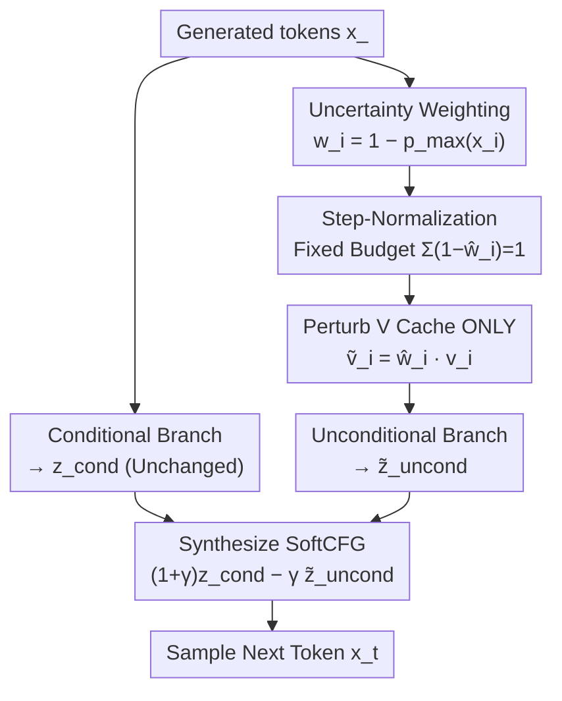

# SoftCFG: Uncertainty-guided Stable Guidance for Visual Autoregressive Model

**Conference**: ICLR 2026  
**OpenReview**: [https://openreview.net/forum?id=G7tqQ5Upcs](https://openreview.net/forum?id=G7tqQ5Upcs)  
**Code**: Available (The paper states core code is open-sourced)  
**Area**: Diffusion Models / Image Generation / Visual Autoregression  
**Keywords**: Visual Autoregression, Classifier-Free Guidance, Uncertainty, Inference Guidance, Training-free

## TL;DR
To address the "guidance diminishing" and "over-guidance" issues in Visual Autoregressive (AR) models using CFG, SoftCFG applies weighted perturbations to the value cache of the unconditional branch based on the confidence of each generated token and constrains cumulative perturbations with "Step-Normalization." This training-free and architecture-agnostic approach improves the FID of AR models on ImageNet 256×256 from 1.37 to 1.27, setting a new SOTA for AR models.

## Background & Motivation
**Background**: Visual autoregressive models represent images as sequences of discrete visual tokens and utilize decoder-only Transformers for "next-token prediction," sharing the same architecture and scalability as Large Language Models. To improve conditional generation quality, the community has adopted Classifier-Free Guidance (CFG) from diffusion models—calculating a conditional branch $z_t^{\text{cond}}$ and an unconditional branch $z_t^{\text{uncond}}$ (replacing the class token with a null token) in parallel at each step, then extrapolating: $z_t^{\text{CFG}}=z_t^{\text{uncond}}+\gamma(z_t^{\text{cond}}-z_t^{\text{uncond}})$.

**Limitations of Prior Work**: CFG was originally designed for diffusion and faces two issues when applied to AR models. First, **guidance diminishing**: while diffusion re-injects guidance at every denoising step, AR conditional information is often compressed into a few tokens at the start of the sequence. As decoding progresses, these tokens become increasingly distant from the current local context, causing the gap between branches to vanish rapidly (Fig.3 uses normalized entropy to show this signal approaching zero even in short sequences). Second, **over-guidance**: guidance depends solely on external conditions (class/text). Increasing the guidance scale $\gamma$ causes the model to over-emphasize certain semantic tokens while conflicting with the generated visual context, leading to structural flaws like extra limbs or semantic errors (e.g., drawing "banana" as elephant tusks).

**Key Challenge**: These problems stem from unresolved issues regarding "where guidance should originate" and "how intensity should be allocated." CFG relies entirely on fixed external condition tokens—failing to provide a continuous signal during decoding and ignoring visual coherence. The authors compare this to **gradient vanishing and exploding** in neural network training: one prevents signal propagation, while the other causes signal instability, typically addressed via normalization and regularization.

**Goal**: To find a guidance signal that persists throughout decoding and naturally harmonizes the conflict between "textual semantics vs. visual context," while remaining training-free, and architecture-agnostic without significant inference overhead.

**Key Insight**: The authors observe that **already generated visual content itself is a guidance signal**. High-confidence tokens often correspond to clear semantic structures (Fig.5 shows high-confidence regions concentrated on object parts). Since class tokens can guide subsequent tokens, reliable generated tokens can do the same.

**Core Idea**: Each generated token contributes a "confidence-weighted" guidance by using predicted confidence to **perturb the value cache of the unconditional branch**. This suppresses the context contribution of reliable tokens, distributing the guidance signal across the entire sequence, while Step-Normalization keeps cumulative perturbations within a fixed budget.

## Method

### Overall Architecture
SoftCFG is a plug-and-play module that **operates only during inference**. It does not modify the conditional branch; instead, at each decoding step, it applies a soft perturbation to the unconditional branch's value cache based on token confidence. Like CFG, it then extrapolates between the two branches to obtain guided logits. Intuitively, it shifts "guidance" from "relying only on the initial class token" to "relying on reliable tokens across the whole sequence," turning the unconditional branch into a **context-aware regularization term**.

The following diagram illustrates the data flow for a single decoding step:

### Key Designs

**1. Uncertainty-weighted Context Perturbation: Turning Generated Content into Guidance**

This design treats the root cause of "guidance diminishing" and "over-guidance." SoftCFG allows each generated token $i<t$ to participate in guidance according to its confidence. Defining confidence as the maximum probability of the conditional distribution, the weight is $w_i = 1 - p_{\max}(x_i)$, where $p_{\max}(x_i)=\max_v p_\theta^{\text{cond}}(\cdot\mid x_{<i}, c)$. Tokens with higher confidence receive smaller $w_i$. The value vectors of these tokens in the unconditional branch are then scaled:

$$\tilde v_i^{\text{uncond,pert}} = w_i\, v_i^{\text{uncond}}$$

The unconditional logits $\tilde z_t^{\text{uncond,pert}}$ are recomputed using the perturbed value cache. The final guidance is $z_t^{\text{SoftCFG}} = z_t^{\text{cond}} + \gamma(z_t^{\text{cond}} - \tilde z_t^{\text{uncond,pert}})$. 

**Key Insight**: The value cache is chosen as the injection point because values represent past tokens and are repeatedly attended to throughout the sequence. Highly confident tokens are suppressed more in the unconditional context (small $w_i$), forcing subsequent tokens to align with the "most semantically reliable content so far."

**2. Step-Normalization: Fixed Budget for Cumulative Perturbations**

Without constraints, the cumulative bias $\sum_{i<t}(1-w_i)$ would grow with sequence length, potentially leading to "guidance explosion" (Fig.7). Step-Normalization rescales weights at **each step** to maintain a constant sum:

$$\hat w_i = 1 - \frac{1-w_i}{\sum_{j<t}(1-w_j)}\quad\text{s.t.}\quad \sum_{i<t}(1-\hat w_i)=1$$

This allocates a "unit perturbation budget" across the context, ensuring the perturbation magnitude does not explode linearly with sequence length.

**3. Perturbing V, not K: Preserving Attention Routing**

Ablations (Table 3) show that perturbing the key cache (K) disrupts the "routing"—i.e., which tokens should be attended to—thus disturbing the established context structure. In contrast, perturbing the value cache (V) only modifies the "intensity of the attended content," making it more robust.

### Mechanism Example
When predicting the $t$-th token, the conditional probabilities $p_{\max}$ of previous tokens $x_1, \dots, x_{t-1}$ are obtained. If $p_{\max}=\{0.9, 0.5, 0.99, \dots\}$, then original weights are $w_i=\{0.1, 0.5, 0.01,\dots\}$. Extremely confident tokens (like the 3rd one) have negligible $w_i$. Step-normalization rescales these weights to sum to a budget. Only the $v_i$ in the unconditional branch is multiplied by $\hat w_i$. The unconditional branch is recomputed, and combined with the untouched conditional branch to sample $x_t$. The overhead is minimal as the perturbation is a simple scalar scaling of the cached V-values.

## Key Experimental Results

### Main Results
On ImageNet-1K 256×256 class-conditional generation (ADM evaluation, 50k samples), SoftCFG was applied to the strong AliTok baseline:

| Model | Parameters | FID↓ | IS↑ | sFID↓ | Recall↑ |
|------|--------|------|-----|-------|---------|
| AliTok-B (Baseline) | 177M | 1.50 | 305.9 | - | 0.64 |
| AliTok-B + SoftCFG | 177M | **1.40** | 271.0 | 5.95 | 0.66 |
| AliTok-L (Baseline) | 318M | 1.42 | 326.6 | - | 0.65 |
| AliTok-L + SoftCFG | 318M | **1.39** | 272.3 | 6.00 | 0.66 |
| AliTok-XL* (Baseline) | 662M | 1.35 | 317.1 | 6.96 | 0.64 |
| AliTok-XL* + SoftCFG | 662M | **1.27** | 302.4 | 6.76 | 0.65 |

AliTok-XL + SoftCFG achieves an FID of 1.27, a new SOTA for AR models on this benchmark, approaching top-tier diffusion models.

### Ablation Study
Breakdown on AliTok-XL ($\gamma=13, k=1.4$):

| Configuration | FID↓ | IS↑ | sFID↓ | Description |
|------|------|-----|-------|------|
| Baseline | 1.76 | 221.2 | 5.55 | No guidance |
| + CFG + Opt. | 1.35 | 317.1 | 6.96 | Standard CFG with optimized $(\gamma,k)$ |
| + SoftCFG | 1.32 | 288.1 | 7.62 | Better FID but unstable IS/sFID |
| + SoftCFG + StepNorm | 1.32 | 302.0 | 7.16 | Step-Norm stabilizes IS and sFID |
| + SoftCFG + StepNorm + Opt. | **1.27** | 302.4 | 6.70 | Full method |

### Key Findings
- **Step-Normalization is vital for stability**: It prevents "guidance explosion" by normalizing the perturbation budget.
- **Perturb V instead of K**: Perturbing K messes with attention routing, leading to worse FID and recall.
- **Wider hyperparameter range**: SoftCFG improves FID across a larger range of $\gamma$ compared to standard CFG, which breaks down at high intensities.
- **Mixed outcomes in Text-to-Image**: While SoftCFG improves attribute and color consistency on DPG-Bench, spatial/positional alignment sometimes regresses, likely because it prioritizes visual coherence over strict rule-based alignment.

## Highlights & Insights
- **Leveraging generated content as a guidance source**: The core insight is that reliable generated tokens act as internal anchors for guidance.
- **Gradient vanishing/exploding analogy**: The conceptual framework links guidance issues to established optimization problems, making the normalization/regularization solution intuitive.
- **V-cache as the injection point**: This engineering choice enables training-free modification while ensuring robustness by avoiding disruption of attention patterns.

## Limitations & Future Work
- **Spatial alignment in T2I**: Regressions in positional prompts suggest that SoftCFG enhances visual quality rather than strict spatial text-image alignment.
- **Heuristic confidence**: Using $p_{\max}$ as a proxy for reliability might be inaccurate in certain contexts.
- **Parameter tuning**: While more robust, optimal $\gamma/k$ still requires tuning.

## Related Work & Insights
- **vs. Standard CFG (Ho & Salimans)**: Standard CFG relies on a fixed hard offset from external conditions. SoftCFG introduces a soft, context-aware regularization.
- **vs. Condition Injection (VAR/RAR/AdaLN)**: While injection methods mitigate diminishing signals at the prediction head, they don't address semantic-visual conflict. SoftCFG introduces internal generated tokens as a secondary guidance source.

## Rating
- Novelty: ⭐⭐⭐⭐ (Using generated content and V-cache perturbations is a fresh perspective).
- Experimental Thoroughness: ⭐⭐⭐⭐ (Strong SOTA results, though T2I evaluations are fewer).
- Writing Quality: ⭐⭐⭐⭐ (Clear definitions and illustrative figures).
- Value: ⭐⭐⭐⭐ (High practical value; training-free and easy to implement).

<!-- RELATED:START -->

## Related Papers

- [\[ICLR 2026\] Visual Autoregressive Modeling for Instruction-Guided Image Editing](visual_autoregressive_modeling_for_instruction-guided_image_editing.md)
- [\[ICLR 2026\] From Broad Exploration to Stable Synthesis: Entropy-Guided Optimization for Autoregressive Image Generation](from_broad_exploration_to_stable_synthesis_entropy-guided_optimization_for_autor.md)
- [\[ICLR 2026\] SSG: Scaled Spatial Guidance for Multi-Scale Visual Autoregressive Generation](ssg_scaled_spatial_guidance_for_multi-scale_visual_autoregressive_generation.md)
- [\[ICLR 2026\] MVAR: Visual Autoregressive Modeling with Scale and Spatial Markovian Conditioning](mvar_visual_autoregressive_modeling_with_scale_and_spatial_markovian_conditionin.md)
- [\[ICLR 2026\] Deconstructing Guidance: A Semantic Hierarchy for Precise Diffusion Model Editing](deconstructing_guidance_a_semantic_hierarchy_for_precise_diffusion_model_editing.md)

<!-- RELATED:END -->
