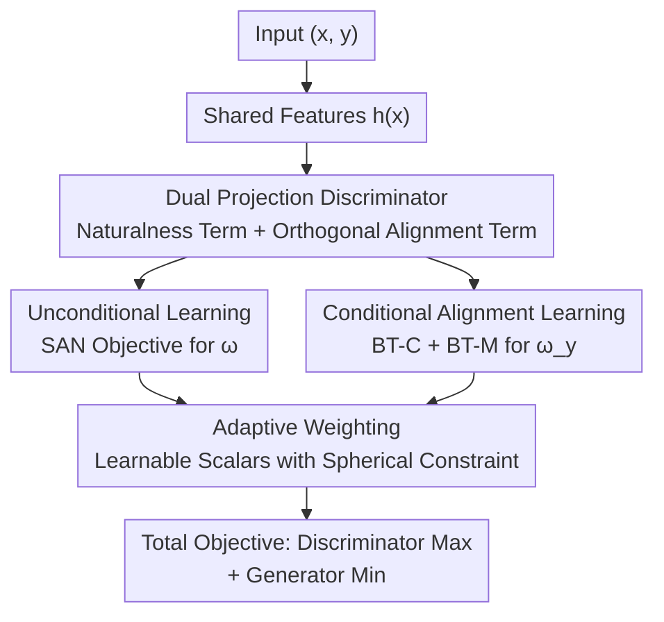

# SONA: Learning Conditional, Unconditional, and Matching-Aware Discriminator

**Conference**: ICLR 2026  
**OpenReview**: [https://openreview.net/forum?id=lymykMnKBS](https://openreview.net/forum?id=lymykMnKBS)  
**Code**: None  
**Area**: Image Generation / Conditional GAN / Discriminator Design  
**Keywords**: Conditional GAN, Discriminator, matching-aware, adaptive weighting, orthogonal projection

## TL;DR
SONA decomposes the conditional GAN discriminator into two mutually orthogonal projection terms: "naturalness" and "alignment." These are trained respectively using SAN loss and two types of Bradley–Terry losses, balanced by a constrained adaptive weighting mechanism. This achieves higher sample quality and better conditional alignment in both class-conditional and text-to-image tasks.

## Background & Motivation

**Background**: Research in conditional GANs has historically centered on discriminator design. Based on the likelihood decomposition $p(x,y)=p(y|x)p(x)$, the task of a conditional discriminator is naturally split into two sub-problems: distinguishing real from fake samples (unconditional discrimination) and evaluating conditional alignment. Two mainstream routes exist: the classifier route (starting from AC-GAN, using an auxiliary classification head for both real/fake and class classification) and the projection route (the projection discriminator proposed by Miyato & Koyama, which formulates the discriminator as $f(x,y)=\langle w_y,h(x)\rangle+\langle w,h(x)\rangle+b$ without an extra classifier, becoming the de facto standard for modern cGANs).

**Limitations of Prior Work**: Neither route effectively balances the dual objectives of "unconditional discrimination + conditional alignment." The classifier route requires meticulous tuning of weight coefficients. While the projection route is elegant, the authors point out that it **does not truly utilize unconditional discrimination**—because $\langle w_y,h\rangle+\langle w,h\rangle$ can be combined into $\langle \tilde w_y,h\rangle$ (where $\tilde w_y=w_y+w$). The generator optimization only perceives a **$y$-dependent projection direction**, rendering the unconditional term practically redundant. Furthermore, the projection route lacks a matching-aware mechanism (it doesn't use "real but mismatched" negative samples to strengthen alignment sensitivity).

**Key Challenge**: The discriminator must judge both authenticity and alignment, but these objectives are entangled within shared features. The projection route sacrifices unconditional discrimination and matching-awareness for simplicity, while the classifier route introduces difficult-to-tune hyperparameters for capacity.

**Goal**: Design a discriminator that satisfies three desiderata: (i) unconditional discrimination independent of condition $y$, (ii) matching-aware alignment discrimination (using mismatched negatives), and (iii) adaptive weighting to dynamically balance the three objectives without manually tuned hyperparameters.

**Key Insight**: The authors hypothesize that "judging naturalness" and "judging alignment" are **orthogonal tasks**. Optimizing the generator for alignment should not interfere with its progress in improving naturalness. Incorporating this inductive bias into the discriminator architecture allows the two components to be managed independently.

**Core Idea**: Discriminator = Naturalness projection term + **Alignment projection term orthogonal to naturalness** (SONA = Sum of Naturalness and Alignment). Naturalness is learned via SAN objectives, alignment via Bradley–Terry pairwise comparisons, and the three losses are balanced by an adaptive weighting mechanism with a normalization constraint.

## Method

### Overall Architecture

SONA takes a sample $x$ and a condition $y$ as input and outputs a scalar score. It first extracts features $h(x)$ via a shared feature extractor $h:\mathcal{X}\to\mathbb{R}^D$, then decomposes the score into two additive scalars: the naturalness term $f^N_{\Phi_N}(x)=\langle\omega,h(x)\rangle$ (focusing on real vs. fake) and the conditional alignment term $f^A_{\Phi_A}(x,y)=\langle\omega_y,\Pi^\perp_\omega h(x)\rangle$ (focusing on alignment). The key is the **orthogonal projection** $\Pi^\perp_\omega h(x)=h(x)-\langle\omega,h(x)\rangle\omega$, which subtracts the component of the feature along the naturalness direction $\omega$ before projecting onto the alignment direction $\omega_y$, structurally ensuring the tasks do not interfere.

During training, these two terms are driven by distinct objectives: the naturalness direction $\omega$ is learned using the minimax objective of SAN (Slicing Adversarial Network) to distinguish real/fake in a sliced Wasserstein sense; the alignment direction $\omega_y$ is learned through two Bradley–Terry losses—BT-C uses real vs. generated samples (learning conditional similarity), and BT-M uses matched samples vs. marginal distribution negatives (learning matching-awareness). Finally, the three maximization objectives $V_{\text{SAN}}, V_{\text{BT-C}}, V_{\text{BT-M}}$ are balanced by a set of learnable scalars with a spherical constraint.

### Key Designs

**1. Dual Projection Discriminator: Structurally Decoupling "Naturalness" and "Alignment" via Orthogonal Projection**

The issue with the projection route is that naturalness and alignment share a single effective projection direction $\tilde w_y$, resulting in the unconditional judgment being overwhelmed. SONA explicitly formulates the discriminator as the sum of two terms:
$$f(x,y)=\underbrace{\langle\omega,h(x)\rangle}_{f^N:\text{Naturalness}}+\underbrace{\langle\omega_y,\Pi^\perp_\omega h(x)\rangle}_{f^A:\text{Conditional Alignment}},$$
where $\omega,\omega_y\in S^{D-1}$ are unit directions, and $\Pi^\perp_\omega h(x)=h(x)-\langle\omega,h(x)\rangle\omega$ projects the features into the subspace orthogonal to $\omega$. This orthogonal projection encodes the inductive bias that "naturalness and alignment are orthogonal tasks." Since the features received by $f^A$ contain no components along the naturalness direction $\omega$, optimizing for alignment does not degrade naturalness discrimination. $\omega$ handles authenticity and $\omega_y$ handles alignment—achieving the decoupling that the original projection route intended but failed to realize.

**2. Unconditional Learning: Ensuring Naturalness Genuinely Discriminates Real/Fake via SAN**

To allow the naturalness term to distinguish real from fake independently of $y$, SONA applies the SAN minimax objective solely to $\Phi_N=\{\omega,h\}$ (the alignment parameter $\omega_y$ does not participate in this step):
$$\max_{\Phi_N}V_{\text{SAN}}(\omega,h),\quad\min_g J_{\text{SAN}}(g).$$
SAN views the GAN discriminator as a "single-direction augmented sliced Wasserstein" distance. By imposing an optimality constraint on the normalized projection $\omega$, it encourages $\omega$ to separate real and generated distributions optimally in terms of sliced Wasserstein distance (Proposition 2 ensures the generator then minimizes a specific distance between $p_\text{data}(x)$ and $p_g(x)$). This step specifically fixes the "redundant unconditional term" problem in the projection route.

**3. Conditional Alignment Learning: Matching-Awareness via Bradley–Terry Pairwise Comparison**

The alignment direction $\omega_y$ is trained using the Bradley–Terry (BT) pairwise preference model. BT expresses the probability that "$x_w$ is more consistent with condition $y$ than $x_\ell$" as $\sigma(f(x_w,y)-f(x_\ell,y))$. Samples from the real joint distribution always serve as the winner $x_w$, while losers $x_\ell$ are drawn from two distributions, leading to two types of losses:

- **BT-C (Conditional Discrimination)**: The loser is drawn from the generated distribution $p_g(x_\ell|y)$. This compares real and generated samples given $y$ to measure conditional dissimilarity. Proposition 3 shows this corresponds to a divergence between $p_\text{data}(x|y)$ and $p_g(x|y)$ at optimality.
- **BT-M (Matching-Awareness)**: The loser is drawn from the **marginal data distribution** $p_\text{data}(x_\ell)$ (ignoring condition $y$), representing "real but likely mismatched" negatives. Proposition 4 shows that maximizing this loss allows the discriminator to learn the log-probability difference $\log p_\text{data}(x|y)-\log p_\text{data}(x)$, which precisely characterizes the "extra alignment signal" relative to unconditional data. This provides the matching-awareness missing in the projection route—experiments on MoG datasets showed that removing BT-M causes generated samples from different categories to overlap.

A critical trick is using **stop-gradient** on the naturalness term $f^N$ for both BT losses, ensuring that only alignment parameters $\Phi_A$ are updated via $f^A$. Similarly, the generator's $J_{\text{BT-C}}$ uses a stop-gradient on the naturalness term, so alignment optimization follows $\omega_y$ and real/fake optimization follows $\omega$, preventing conflicting updates.

**4. Adaptive Weighting: Dynamic Balancing via Spherical Constrained Learnable Scalars**

The three maximization objectives $V_{\text{SAN}}+V_{\text{BT-C}}+V_{\text{BT-M}}$ require balancing, but manual tuning is what the authors seek to avoid. SONA's approach: first construct each term using the original Goodfellow $V_\text{GAN}$ (with $\log\sigma(\cdot)$), then replace $\log\sigma(t)$ with $\log\sigma(s\cdot t)/s$, where $s\in\mathbb{R}_{>0}$ is a learnable scalar. A spherical constraint $s_\text{SAN}^2+s_\text{BT-C}^2+s_\text{BT-M}^2=1$ is imposed to prevent divergence. Compared to general multi-task learning (like Kendall's uncertainty weighting) where coefficients are unbounded and unfriendly to GAN learning rates, this bounded constraint is better suited for GAN stability. In ablation studies, replacing this with Kendall's scheme caused the FID to jump from 5.65 to 16.62.

### Loss & Training
The total objective is:
$$\max_{\Phi_N\cup\Phi_A}V_{\text{SAN}}(\Phi_N)+V_{\text{BT-C}}(f^A_{\Phi_A})+V_{\text{BT-M}}(f^A_{\Phi_A}),\quad\min_g J_{\text{SAN}}(g)+J_{\text{BT-C}}(g).$$
$J_{\text{BT-C}}$ is obtained by swapping data and generated distributions in BT-C (similar to relativistic pairing GAN), with stop-gradients on the naturalness term. Each maximization term includes a learnable scale $s$ subject to the spherical constraint.

## Key Experimental Results

### Main Results

Class-conditional generation (StudioGAN benchmark, comparing ContraGAN, ReACGAN, PD-GAN):

| Dataset | Metric | SONA | Best Baseline | Note |
|--------|------|------|----------|------|
| CIFAR10 (BigGAN) | FID ↓ / IS ↑ | **4.24** / **10.05** | 4.49 / 9.87 | Best across all metrics |
| TinyImageNet (+DiffAug) | FID ↓ / IS ↑ | **7.76** / **23.00** | 9.93 / 20.25 | Cover 0.79, iFID 82.23 best |
| ImageNet 128² (bs=2048) | FID ↓ / IS ↑ | **6.14** / **140.14** | 8.44 / 103.07 | Top-1/5 acc 0.80/0.93 superior |

Text-to-Image (GALIP with SONA):

| Dataset | Metric | GALIP (Original) | GALIP+SONA |
|--------|------|------|----------|
| CUB | FID ↓ / CLIP ↑ | 11.76 / 0.3310 | **10.20** / **0.3342** |
| COCO | FID ↓ / CLIP ↑ | 5.30 / 0.3639 | **4.70** / **0.3677** |
| COCO zero-shot (trained on CC12M) | zFID30K ↓ / CLIP ↑ | 13.78 / 0.3306 | **12.43** / **0.3411** |

### Ablation Study (CIFAR10, BigGAN-PyTorch official code)

| Adaptive Weight $s$ | Orthogonal Proj. | BT-M | FID ↓ | IS ↑ |
|:---:|:---:|:---:|------|------|
| ✓ | | | 7.51 | 9.08 |
| ✓ | ✓ | | 6.29 | 9.14 |
| ✓ | | ✓ | 6.02 | 9.54 |
| ✓ | ✓ | ✓ | **5.65** | 9.51 |
| | ✓ | ✓ | 7.09 | 9.52 |

### Key Findings
- **Orthogonal projection primarily improves FID, while BT-M primarily improves IS**. Combined, they offer the best trade-off (5.65/9.51).
- **Adaptive weighting is indispensable**: Removing learnable $s$ (last row) dropped FID from 5.65 to 7.09. Replacing it with unbounded Kendall weighting worsened FID to 16.62, confirming that bounded coefficients are vital for GAN stability.
- **Advantages grow with class count**: In MoG experiments with $N\ge30$, SONA had zero failure cases (NF), while PD-GAN and variants without BT-M failed frequently. Removing BT-M caused different categories to overlap.
- **Efficiency close to PD-GAN**: SONA's training speed (e.g., ImageNet 90.16 iter/min) is slightly lower than the simple PD-GAN (101.91) but much faster than classifier routes. On ImageNet, SONA significantly outpaces PD-GAN after about three days of training.

## Highlights & Insights
- **Clever orthogonal projection inductive bias**: Explicitly encoding the assumption that "naturalness and alignment are orthogonal" into $\Pi^\perp_\omega$ eliminates gradient interference between the two tasks at the structural level. This is cleaner than merely adding loss terms and can be generalized to other scenarios where a network must judge entangled properties.
- **Unifying conditional and matching-aware discrimination via Bradley–Terry**: Porting the pairwise preference model common in RLHF to the GAN discriminator allows real joint samples to be winners and specific losers to define BT-C and BT-M. This provides a unified form with theoretical grounding (Prop 3/4).
- **Spherical constrained adaptive weighting**: Simply replacing $\log\sigma(t)$ with $\log\sigma(st)/s$ and constraining $\sum s^2=1$ achieves parameter-free multi-objective balancing. The bounded nature of the coefficients is specifically designed for the learning rate sensitivity of GANs.
- **Plug-and-play capability**: In text-to-image tasks, SONA can use frozen CLIP text embeddings as $\omega_y$, improving FID without changing the generator architecture. This demonstrates SONA as a general-purpose discriminator enhancement.

## Limitations & Future Work
- In text-to-image tasks, $\omega_y$ uses frozen CLIP text embeddings. The authors acknowledge that a **learnable $\omega_y$** might further improve CLIP scores, but this is left for future work.
- The method is currently limited to single-stage GAN pipelines (using BigGAN backbones for ImageNet). Scalability to discriminator-guided diffusion/flow models or large-scale T2I has not been verified.
- The orthogonality assumption is an inductive bias. For data where naturalness and alignment are strongly correlated (e.g., fine-grained attribute generation), it is unclear if this structure might limit the capacity of the alignment term.
- Training involves additional overhead (slower than PD-GAN), and the performance gains require substantial training time (refining ImageNet for ~3 days) to fully manifest.

## Related Work & Insights
- **vs PD-GAN (Projection Route)**: PD-GAN uses an additive unconditional and conditional term but they share an effective projection $\tilde w_y$, which absorbs the unconditional signal and lacks matching-awareness. SONA decouples them via orthogonal projection, adds SAN for unconditional learning, and introduces the BT-M matching loss, yielding superior quality and alignment at similar efficiency.
- **vs AC-GAN / ReACGAN (Classifier Route)**: Classifier routes implicitly use mismatched negatives (cross-entropy is equivalent to InfoNCE) but require manual weight tuning. SONA explicitly models matching-awareness via BT loss and handles weighting automatically, without relying on the assumption of a uniform $p_\text{data}(y)$ (Prop 4 is more general than Prop 1).
- **vs SAN (Takida et al. 2024)**: SONA adopts the sliced Wasserstein perspective and unconditional objective of SAN but extends it to conditional settings with the orthogonal alignment term and BT losses.

## Rating
- Novelty: ⭐⭐⭐⭐⭐ Decoupling via orthogonal projection + BT pairwise losses + spherical adaptive weighting; all three are theoretically grounded and combined innovatively.
- Experimental Thoroughness: ⭐⭐⭐⭐⭐ MoG visualization + CIFAR/TinyImageNet/ImageNet class-conditional + CUB/COCO T2I + comprehensive ablations + efficiency analysis.
- Writing Quality: ⭐⭐⭐⭐ Clear logic driven by three desiderata, though notation density and the mixing of propositions with text require careful reading.
- Value: ⭐⭐⭐⭐ A plug-and-play discriminator enhancement useful for conditional GAN scenarios, though the general shift away from GANs may limit its overall impact.

<!-- RELATED:START -->

## Related Papers

- [\[ICLR 2026\] FlowCast: Advancing Precipitation Nowcasting with Conditional Flow Matching](flowcast_advancing_precipitation_nowcasting_with_conditional_flow_matching.md)
- [\[ICLR 2026\] Secure Inference for Diffusion Models via Unconditional Scores](secure_inference_for_diffusion_models_via_unconditional_scores.md)
- [\[ICCV 2025\] Guiding Noisy Label Conditional Diffusion Models with Score-based Discriminator Correction](../../ICCV2025/image_generation/guiding_noisy_label_conditional_diffusion_models_with_score-based_discriminator_.md)
- [\[ICLR 2026\] Flow Matching with Injected Noise for Offline-to-Online Reinforcement Learning](flow_matching_with_injected_noise_for_offline-to-online_reinforcement_learning.md)
- [\[ICLR 2026\] Structured Flow Autoencoders: Learning Structured Probabilistic Representations with Flow Matching](structured_flow_autoencoders_learning_structured_probabilistic_representations_w.md)

<!-- RELATED:END -->
