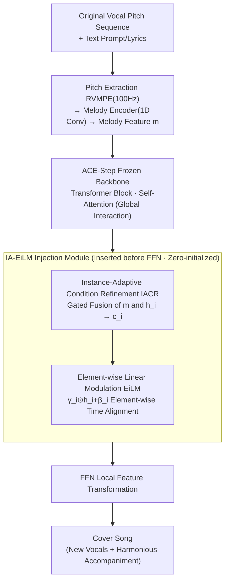

# SongEcho: Towards Cover Song Generation via Instance-Adaptive Element-wise Linear Modulation

**Conference**: ICLR 2026  
**arXiv**: [2602.19976](https://arxiv.org/abs/2602.19976)  
**Code**: [GitHub](https://github.com/lsfhuihuiff/SongEcho_ICLR2026)  
**Area**: Image Generation  
**Keywords**: Cover song generation, FiLM, element-wise linear modulation, melody control, parameter-efficient

## TL;DR

Proposes the SongEcho framework, which achieves cover song generation through Instance-Adaptive Element-wise Linear Modulation (IA-EiLM), generating new vocals and accompaniments while preserving the original song's melody contour.

## Background & Motivation

Cover songs are a vital component of music culture, retaining the core melody of the original while injecting new emotional depth and themes. However:

**Cover generation tasks are under-explored**: Although melody-guided instrumental generation exists, cover generation—which involves simultaneously generating new vocals and accompaniments—remains largely blank.

**Limitations of existing condition injection mechanisms**:
   - Cross-attention requires extra modeling for temporal alignment, which is indirect and introduces computational redundancy.
   - Element-wise addition leverages temporal correspondence but has limited flexibility (affine transformation with a fixed scaling factor).

**Lack of adaptivity in condition representation**: Existing methods encode melody conditions independently, ignoring compatibility with the hidden states of the generative model.

## Method

### Overall Architecture

SongEcho formalizes cover generation as a conditional generation task: synthesizing new vocals and harmonious accompaniments given the original vocal melody contour (a pitch sequence) and a text prompt. It uses the text-to-song model ACE-Step (a Linear Diffusion Transformer) as the backbone. First, a pitch extractor and melody encoder convert the pitch sequence into melody features $m$. Then, $m$ is injected into the FFN layer of each Transformer block via a lightweight module named IA-EiLM. The injection occurs in two steps: IACR allows the melody condition to "preview" the current hidden state to refine it into an instance-adaptive condition $c_i$, and EiLM then modulates the hidden state element-wise using $c_i$. The entire backbone weights are frozen; only IA-EiLM and the melody encoder are trained. Thus, melody-controllable covers are achieved with minimal trainable parameters (approx. 49M). The Suno70k dataset was also constructed to support this training paradigm.

### Key Designs

**1. Element-wise Linear Modulation (EiLM): Point-wise time-aligned injection of melody conditions**

Melody is a time-varying sequence with a natural frame-level temporal correspondence to hidden states. Existing injection methods fail to utilize this effectively: cross-attention is flexible but redundant in modeling alignment, while element-wise addition utilizes alignment but degrades into an affine transformation with a fixed scaling factor, limiting flexibility. EiLM expands classic FiLM from "affine only in the feature channel dimension" to "all dimensions." The modulation is denoted as $h_i^m = \text{EiLM}(h_i \mid c) = \gamma_i \odot h_i + \beta_i$, where the shapes of $(\gamma_i, \beta_i) = f_i(c)$ precisely match the hidden states, including the time dimension $T$, i.e., $\gamma_i, \beta_i \in \mathbb{R}^{B \times T \times D_i}$. Consequently, each time step and channel receives independent scaling and offsets. The melody is written into the hidden states in an element-wise, time-aligned manner, retaining the benefits of addition while overcoming flexibility bottlenecks. Unlike TFiLM, which uses RNNs for recursive parameter generation, EiLM generates all parameters in a single operation without temporal dependencies.

**2. Instance-Adaptive Condition Refinement (IACR): Dynamic adaptation of conditions based on current hidden states**

Using EiLM alone presents a risk: if the melody condition is encoded independently and mapped statically, a single melody must be compatible with vast variations in hidden states, forming an under-constrained many-to-one mapping that degrades injection quality. IACR ensures the condition feature "sees" the current hidden state before deciding the injection strategy. After linear projections of both paths, cross-modal interaction is performed using a gating mechanism inspired by WaveNet: $c_i = \tanh(L_{h_i}(h_i)) \odot \tanh(L_{m_i}(m))$. By directly accessing the hidden state $h_i$, the many-to-one mapping is tightened into a one-to-one mapping, alleviating feature conflicts and sound quality degradation caused by static injection. IA-EiLM, the core module of the paper, combines EiLM and IACR to improve the mechanism and representation respectively.

**3. Zero Initialization and Parameter-Efficient Integration: Control injection without destroying the backbone**

IA-EiLM is inserted before the FFN layer of each Transformer block. Since self-attention handles global interaction and FFN handles local feature transformation, this placement allows melody injection while avoiding dilution by global attention. To ensure training starts smoothly from original model behavior, the modulation uses zero initialization: $\text{EiLM-zero}(h_i \mid c_i) = (\gamma_i + 1) \odot h_i + \beta_i$, which is equivalent to an identity mapping at initialization. During training, all pre-trained parameters (Linear DiT, lyric encoder, text encoder) are frozen, and only IA-EiLM and the melody encoder are updated, keeping trainable parameters at approximately 49M, which is about 3% of SA ControlNet.

**4. Suno70k Dataset: Filling the gap in full-track cover training data**

Cover generation has long suffered from a lack of paired full-track data. The authors constructed the Suno70k dataset with 69,469 AI-generated songs filtered from 659K Suno.ai songs. Songs were filtered based on quality across five dimensions using SongEval, and augmented labels were generated using Qwen2-audio, providing large-scale, text-labeled material for melody-controllable cover training.

## Key Experimental Results

### Comparison Methods
- ACE-Step + SA ControlNet (1.6B trainable parameters)
- ACE-Step + SA ControlNet + LoRA (331M)
- ACE-Step + MuseControlLite (188M)
- SongEcho (**49M**, approx. 3% of ControlNet parameters)

### Main Results (Suno70k Test Set)

| Method | RPA↑ | RCA↑ | OA↑ | CLAP↑ | FD↓ | KL↓ | PER↓ | Parameters |
|------|------|------|-----|-------|-----|-----|------|-------|
| Original ACE-Step | - | - | - | 0.293 | 73.5 | 0.267 | 0.417 | - |
| +SA ControlNet | 0.621 | 0.644 | 0.686 | 0.288 | 106.0 | 0.202 | 0.371 | 1.6B |
| +MuseControlLite | 0.521 | - | - | - | - | - | - | 188M |
| **SongEcho (Ours)** | **Best** | **Best** | **Best** | **Best** | **Best** | **Best** | **Best** | **49M** |

### Ablation Study

| Configuration | RPA | CLAP | FD |
|------|-----|------|----|
| EiLM only (no IACR) | Lower | Lower | Higher |
| Addition injection only | Lower | Lower | Higher |
| Cross-attention only | Lower | Lower | Higher |
| IA-EiLM (Full) | Best | Best | Best |

## Highlights & Insights

1. **Extreme Parameter Efficiency**: Surpasses all baselines using less than 3% of ControlNet parameters.
2. **Unified Condition Injection Paradigm**: EiLM combines the advantages of both addition and attention-based methods.
3. **Clear Theoretical Motivation for IACR**: Optimization analysis moving from under-constrained to one-to-one mappings.
4. **Construction of High-Quality Open-Source Dataset**: Suno70k provides a foundation for the field.

## Limitations & Future Work

1. Trained on AI-generated songs; generalization to real songs is not fully evaluated.
2. Narrow definition of "cover" (global style transfer + melody preservation), excluding local customized adaptations.
3. Limited by the 4-minute generation cap of the backbone ACE-Step.
4. Melody control is based on pitch sequences, lacking richer musical dimensions like rhythm variations.

## Related Work & Insights

- **Text-to-Song**: Jukebox, Suno, DiffRhythm, ACE-Step
- **Singing Voice Synthesis/Conversion**: SVS, SVC series
- **Controllable Music Generation**: ControlNet, MuseControlLite
- **Conditional Normalization**: FiLM, AdaIN, T-FiLM

## Rating

- **Novelty**: ⭐⭐⭐⭐ — The EiLM+IACR combination is novel, and IACR has strong theoretical motivation.
- **Value**: ⭐⭐⭐⭐ — Parameter-efficient with excellent quality; possesses high practical application value.
- **Experimental Thoroughness**: ⭐⭐⭐⭐ — Multi-dataset evaluation with thorough ablations.
- **Writing Quality**: ⭐⭐⭐⭐ — Clear structure and well-explained motivations.

<!-- RELATED:START -->

## Related Papers

- [\[CVPR 2026\] Head-wise Adaptive Rotary Positional Encoding for Fine-Grained Image Generation](../../CVPR2026/image_generation/head-wise_adaptive_rotary_positional_encoding_for_fine-grained_image_generation.md)
- [\[ICLR 2026\] I-DRUID: Layout to Image Generation via Instance-Disentangled Representation and Unpaired Data](i-druid_layout_to_image_generation_via_instance-disentangled_representation_and_.md)
- [\[CVPR 2026\] Layer-wise Instance Binding for Regional and Occlusion Control in Text-to-Image Diffusion Transformers](../../CVPR2026/image_generation/layer-wise_instance_binding_for_regional_and_occlusion_control_in_text-to-image_.md)
- [\[ICLR 2026\] Scale-wise Distillation of Diffusion Models](scale-wise_distillation_of_diffusion_models.md)
- [\[ICLR 2026\] RegionE: Adaptive Region-Aware Generation for Efficient Image Editing](regione_adaptive_region-aware_generation_for_efficient_image_editing.md)

<!-- RELATED:END -->
