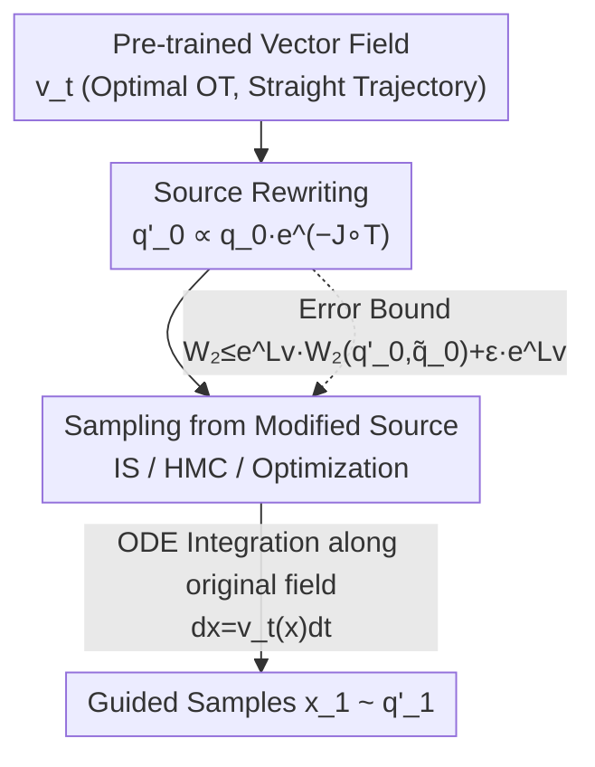

# Source-Guided Flow Matching

**Conference**: ICLR 2026  
**OpenReview**: [https://openreview.net/forum?id=p56ZAQUCUr](https://openreview.net/forum?id=p56ZAQUCUr)  
**Area**: Diffusion Models / Generative Models / Flow Matching Guidance  
**Keywords**: Flow Matching, Guided Generation, Optimal Transport, Source Distribution Sampling, Inverse Problems  

## TL;DR
This paper proposes the SGFM framework, which reformulates the "guided generation" problem in flow matching as "sampling from a modified source distribution." By modifying only the source distribution while leaving the pre-trained vector field untouched, the method accurately recovers the target distribution, preserves the straight-line trajectories of optimal transport vector fields (enabling fast inference), and allows users to choose samplers (Importance Sampling / HMC / Optimization) as needed.

## Background & Motivation

**Background**: Flow Matching (FM) pushes samples from a source distribution $q_0$ to a target distribution $q_1$ along an ordinary differential equation $dx = u_t(x)dt$ by learning a vector field $u_t(x)$. "Optimal Flow Matching," trained with Optimal Transport (OT) coupling, yields a vector field where each sample moves at a **constant speed along a straight line** (corresponding to Wasserstein geodesics), ensuring stable training and requiring very few integration steps during inference. Guided generation involves satisfying additional constraints during sampling—expressed as an energy function $J$, leading to a new target distribution $q_1'(x_1) \propto q_1(x_1)\,e^{-J(x_1)}$.

**Limitations of Prior Work**: Existing "precise guidance" methods (e.g., formulating guidance as Stochastic Optimal Control (SOC) or the g-MC class methods by Feng et al. 2025) almost exclusively achieve this by **modifying the vector field**—adding a guidance term $g_t$ to the original vector field. This introduces two specific issues: first, once the vector field is modified, the valuable **straight-line trajectory** of optimal flow matching is destroyed, becoming curved (see Figure 2 in the original paper), which necessitates finer time discretization and slows down inference; second, the guidance term $g_t$ often requires repeated Monte Carlo estimation at **many intermediate time points** $t\in[0,1]$, where each estimation entails substantial sampling overhead. Furthermore, SOC-like methods must be re-solved for every new constraint scenario, lacking flexibility.

**Key Challenge**: Precision of guidance, straightness of the vector field (inference speed), and sampling flexibility are currently coupled in the approach of "modifying the vector field"—whenever the vector field is altered, straightness is lost, and guidance is locked into a specific estimation/control scheme.

**Goal**: To achieve precise guidance without **touching the pre-trained vector field**, maintaining straight-line trajectories, and returning the choice of "sampling mechanism" to the user.

**Key Insight**: The authors leverage an overlooked symmetry—since the vector field represents a fixed transport map $T=\phi_1$, ensuring the flow endpoint falls into $q_1'$ can be achieved entirely by **adjusting the distribution of the starting points** rather than modifying the map itself.

**Core Idea**: Replace the original source distribution $q_0$ with a **modified source distribution** $q_0'(x_0) \propto q_0(x_0)\,e^{-J\circ T(x_0)}$. By integrating along the **unaltered vector field**, the guided target $q_1'$ is accurately obtained. The guidance problem is thus reduced to a well-defined sub-problem: sampling from $q_0'$.

## Method

### Overall Architecture
The core of SGFM is a "problem relocation": moving guidance from $\mathbb{R}^d\times[0,1]$ (space × time), which requires repeated vector field modifications, to a **single time point** ($t=0$) as a source distribution sampling problem on $\mathbb{R}^d$. The workflow is: first, train a vector field $v_t^\theta$ (ideally using optimal OT) with standard Flow Matching loss; during guidance, without retraining or adding guidance terms, the constraint $J$ is pulled back to the source via the transport map $T=\phi_1$, resulting in a weighted source distribution $q_0'(x_0)\propto q_0(x_0)\,e^{-J\circ T(x_0)}$; samples are then drawn from $q_0'$ (using a user-selected sampler) and integrated via the original vector field ODE to arrive at the guided target $q_1'$.

Conceptual visualization (Figure 1 in the original paper): The optimal vector field maps each source point $x_0$ to a target point $x_1$ in a straight line. Satisfying constraint $J$ is equivalent to **selecting a subset of source samples** that will flow into the high-density regions of $q_1'$—this subset follows $q_0'$. Since only the source distribution is modified, straightness is fully preserved.

### Key Designs

**1. Source Rewriting: Precise Equivalence of Guidance and Source Modification**

This step addresses the pain points of losing straightness and repeated sampling. The authors prove (Theorem 1): Given a flow map $\phi_1$ (denoted as $T=\phi_1$) that pushes $q_0$ to $q_1$, replacing the source with $q_0'(x_0)=\frac{1}{Z_0}q_0(x_0)\,e^{-J\circ T(x_0)}$ allows the **same flow $\phi_t$** to push $q_0'$ precisely to $q_1'(x_1)=\frac{1}{Z_1}q_1(x_1)\,e^{-J(x_1)}$, i.e., $(\phi_1)_\# q_0' = q_1'$. This is essentially a classic change of variables: the likelihood of the constraint $e^{-J}$ is "pulled back" along the transport map to the source as $e^{-J\circ T}$, acting as a weight for reweighting source samples.

This is effective because all guidance information is now concentrated into a single scalar weight at the source, and the vector field does not need to know $J$ exists. Consequently, inference still follows the original straight-line ODE, avoiding the burden of estimating guidance terms at every intermediate step. This is the fundamental difference from g-MC/SOC methods: while they inject $J$ into the $\mathbb{R}^d\times[0,1]$ dynamics, this work only injects $J$ into a distribution over $\mathbb{R}^d$.

**2. Error Bound: Controlling Approximation Errors via Small Lipschitz Constants**

In practice, the vector field is learned (with bias $\epsilon$) and the source distribution can only be sampled approximately (obtaining $\tilde q_0$ instead of $q_0'$). The authors provide Theorem 2: If $\|v_t-v_t^\theta\|_\infty\le\epsilon$ and the learned flow $v_t^\theta$ is $L_v$-Lipschitz with respect to $x$, the 2-Wasserstein error between the generated and true target distributions satisfies:

$$W_2\big(q_1',\,[\phi_1^\theta]_\#\tilde q_0\big)\le e^{L_v}\,W_2(q_0',\tilde q_0) + \epsilon\,e^{L_v}.$$

The first term is the bias from inaccurate source sampling, amplified by the Lipschitz factor $e^{L_v}$ of the flow map; the second term is the cumulative learning error of the vector field along the trajectory. Both are dominated by $L_v$, so a smaller $L_v$ leads to more stable guidance. This bound cleanly decomposes the error into **two independent sources** and provides a clear engineering guideline: use vector fields that minimize $L_v$.

**3. Preferring Optimal (Straight) Vector Fields and Adaptive Samplers**

Following the error bound guideline, the authors advocate for using Optimal Flow Matching (mini-batch OT training, Tong et al. 2023) to learn the optimal vector field $v_t^*$. Its trajectories are constant-speed straight lines, and the corresponding flow map is the optimal Monge map $T^*$. This yields a smaller $L_v$ (decreasing from ~16–20 to ~11 in experiments), significantly reduces NFE due to straight paths, and lowers the cost of evaluating $T^*$ to compute the $q_0'$ weight.

For the sub-problem of "sampling from $q_0'$," a spectrum of samplers is provided:
- **Importance Sampling (IS)**: Simplest for low dimensions or non-differentiable $J$—using $q_0$ as the proposal distribution with weights $w(x_0)=e^{-J\circ T^*(x_0)}$. As $N\to\infty$, $W_2(\tilde q_N,q_0')\to 0$, making it asymptotically exact.
- **Hamiltonian Monte Carlo (HMC)**: Avoids the curse of dimensionality in high dimensions by using gradients of $-\ln q_0'(x_0)=-\ln q_0(x_0)+J\circ T^*(x_0)$, with ergodicity ensuring asymptotic convergence.
- **Optimization-based Sampling**: When the target is near-Dirac (e.g., finding a high-probability solution for imaging inverse problems), one can directly $\min_{x_0}-\ln q_0'(x_0)$ to find the mode. The authors note that naive regularization $-\ln q_0(x_0)=\|x_0\|^2/2$ attracts Gaussian source samples to $x_0=0$, causing **mode collapse**. Instead, using the Chi-squared density regularization $-\ln p_{\chi^2_d}(\|x_0\|^2)$ shifts the mode from the origin to a hypersphere shell $\|x_0\|^2\approx d$, or adding the constraint $|\,\|x_0\|^2-d\,|\le\sqrt{2d}$ (Eq. 6) preserves diversity. This optimization approach covers the heuristic regularization of D-Flow (Ben-Hamu et al. 2024), interpreting D-Flow as a special case of SGFM and providing its first theoretical foundation.

### Loss & Training
The training phase uses the standard conditional flow matching loss $L_{FM}(\theta)=\mathbb{E}_{t,(x_0,x_1)\sim\pi}\|v_t^\theta((1-t)x_0+tx_1)-(x_1-x_0)\|^2$. The key is choosing the coupling $\pi$ as the optimal OT coupling $\pi^*$ (approximated via mini-batch OT) to obtain straight trajectories and a small $L_v$. During the guidance phase, **no training occurs**; only source distribution sampling and ODE integration are performed (see Algorithm 1).

## Key Experimental Results

### Main Results

**2D Synthetic (uniform source → 8-Gaussian target, diffusion guidance is inapplicable due to non-Gaussian source)**: Using SGFM-IS, performance consistently exceeds baselines in "guidance precision (empirical Wasserstein distance to true guided distribution) vs. NFE." The precision is largely unaffected by lower NFE, confirming the efficiency of the optimal vector field's straight paths.

**Optimal vs. Independent Vector Fields (Table 1, Guidance Error ↓)**:

| Task | Vector Field | $L_v$ | Guidance Error |
|------|--------|------|----------|
| 8gaussian→moon | Independent | 20.1 | 0.125 ± 0.186 |
| 8gaussian→moon | Optimal | 11.9 | **0.066 ± 0.047** |
| uniform→8gaussian | Independent | 16.8 | 0.124 ± 0.023 |
| uniform→8gaussian | Optimal | 11.1 | **0.067 ± 0.019** |

The optimal vector field achieves lower $L_v$ and lower guidance error, directly validating Theorem 2.

**CelebA Imaging Inverse Problems (Table 4, PSNR ↑)**:

| Method | Denoise | Deblur | SR | Random Inp. | Box Inp. |
|------|------|--------|------|----------|--------|
| g-covA | 26.73 | 29.72 | 18.45 | 19.61 | 24.88 |
| g-covG | 30.35 | 29.50 | 24.18 | 25.49 | 26.12 |
| PnP | 32.14 | **38.74** | 31.33 | 33.87 | 29.92 |
| SGFM-OPT-2 (D-Flow) | 28.95 | 35.23 | 33.32 | 34.01 | 28.43 |
| SGFM-OPT-4 | 31.60 | 35.27 | **33.31** | 34.03 | **30.12** |

SGFM variants outperform g-covA/g-covG across all tasks. Compared to the imaging-specific PnP, results are competitive, slightly trailing in deblurring but leading in super-resolution and inpainting.

### Ablation Study

**Darcy flow PDE Inverse Problem (Table 2, Multi-modal Posterior, median[IQR], lower is better)**:

| Method | Validity | Guidance Cost | Physical Consistency |
|------|-----------|---------|-----------|
| SGFM-HMC | 0.591 | 0.281 | 0.188 |
| SGFM-OPT-1 | 0.907 | 0.206 | 0.421 |
| **SGFM-OPT-2** | **0.474** | 0.187 | 0.194 |
| g-covA | 0.992 | **0.030** | 0.289 |
| Uncond. Sampling | 1.006 | 1.051 | 0.214 |

**NFE Sensitivity (Table 5, SGFM-OPT-2, PSNR ↑)**: A significant jump occurs from NFE=1 to 3 (denoising 21.33→28.64), but gains saturate after NFE=3, proving that 3 steps suffice for straight vector fields.

### Key Findings
- **Sampler selection is critical to performance**: SGFM-OPT-2 (Chi-squared norm regularization) is the best overall; SGFM-OPT-1 (naive $\|x_0\|^2$ regularization) suffers from mode collapse and poor physical consistency (0.421).
- **"Low guidance cost" does not equal "good solution"**: While g-covA has the lowest guidance cost (0.030), it sacrifices physical consistency and solution validity, highlighting the need to maintain proximity to the true prior.
- **Straight vector fields provide "free" acceleration**: Reducing NFE from 9 to 3 hardly affects performance, corresponding to the low discretization error theorized for optimal vector fields.

## Highlights & Insights
- **"Problem Relocation" eliminates intermediate sampling**: Converting multi-timestep guidance on $\mathbb{R}^d\times[0,1]$ into a single-step source sampling problem at $t=0$ is the most elegant insight, preserving straightness and decoupling "guidance" from the "vector field."
- **Theoretical Grounding for D-Flow**: What was once a heuristic optimization regularization in D-Flow is proven to be a special case of SGFM optimization-based sampling, explaining the roles of various regularizers (naive vs. Chi-squared) in balancing mode-finding and diversity.
- **Error Bound as a Design Guide**: The inequality $W_2\le e^{L_v}W_2(q_0',\tilde q_0)+\epsilon e^{L_v}$ quantifies why one should choose optimal OT vector fields for smaller $L_v$ and lower NFE, closing the loop between theory and implementation.
- **Transferable Framework**: The "modify source, not map" strategy can be applied to any scenario involving pre-trained generators + inference-time constraints (molecular generation, decision planning, scientific inverse problems).

## Limitations & Future Work
- **Sampling difficulty is shifted, not removed**: The authors acknowledge that sampling from $q_0'$ in high-dimensional or complex source distributions can be difficult (slow HMC convergence, IS dimensional catastrophe).
- **Mode collapse in optimization sampling**: When the true conditional distribution is multi-modal, optimization-based sampling (including D-Flow) tends to collapse to a single mode, losing diversity; HMC is required for better coverage.
- **Runtime issues**: In complex distributions, SGFM (especially HMC) is slower than g-covA, limiting the number of samples that can be evaluated and the thoroughness of mode-coverage assessments.
- **Straightness is an engineering preference, not a theoretical necessity**: Theorems 1–2 hold for any vector field; optimal OT is used simply to minimize $L_v$ and NFE.

## Related Work & Insights
- **vs g-MC / g-covA / g-covG (Feng et al. 2025)**: These modify the vector field, necessitating multi-step MC estimation and causing curved trajectories; Ours modifies the source once at $t=0$, preserving straightness and efficiency.
- **vs SOC-based Precise Guidance (Uehara 2024; Tang 2024)**: These require re-solving control problems for every new constraint; Ours keeps the vector field constant, requiring no re-training or re-solving of dynamics.
- **vs D-Flow (Ben-Hamu et al. 2024)**: D-Flow is heuristic; SGFM provides the theoretical framework that rigorously justifies its optimization regularizers.
- **vs PnP-flow (Martin et al. 2024)**: PnP is specialized for imaging; SGFM is more general and more stable across multi-modal scientific problems (PDEs).

## Rating
- Novelty: ⭐⭐⭐⭐⭐ The "modify source, not field" perspective is clean and novel in the field of guided generation.
- Experimental Thoroughness: ⭐⭐⭐⭐ Validated across 2D, PDEs, and CelebA, though high-dimensional multi-modal coverage is limited by runtime.
- Writing Quality: ⭐⭐⭐⭐⭐ Excellent alignment between design motivations and formal theorems.
- Value: ⭐⭐⭐⭐⭐ Training-free, plug-and-play, and trajectory-preserving, offering high utility for constrained generation.

<!-- RELATED:START -->

## Related Papers

- [\[ICLR 2026\] Delay Flow Matching](delay_flow_matching.md)
- [\[ICLR 2026\] Flow Matching with Semidiscrete Couplings](flow_matching_with_semidiscrete_couplings.md)
- [\[ICLR 2026\] Value Matching: Scalable and Gradient-Free Reward-Guided Flow Adaptation](value_matching_scalable_and_gradient-free_reward-guided_flow_adaptation.md)
- [\[ICLR 2026\] Carré du champ Flow Matching: 用几何感知噪声改善生成模型的质量-泛化权衡](carré_du_champ_flow_matching_better_quality-generalisation_tradeoff_in_generativ.md)
- [\[ICLR 2026\] Structured Flow Autoencoders: Learning Structured Probabilistic Representations with Flow Matching](structured_flow_autoencoders_learning_structured_probabilistic_representations_w.md)

<!-- RELATED:END -->
