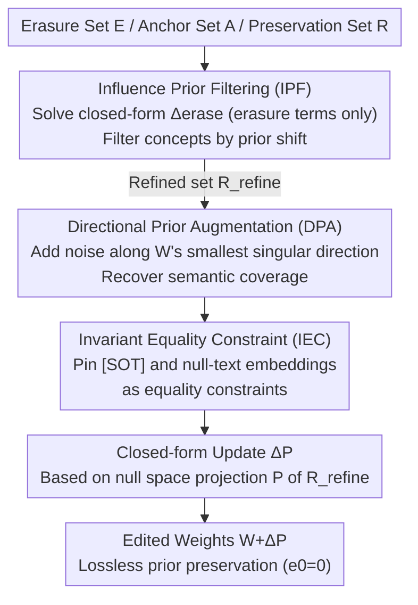

# SPEED: Scalable, Precise, and Efficient Concept Erasure for Diffusion Models

**Conference**: ICLR 2026  
**arXiv**: [2503.07392](https://arxiv.org/abs/2503.07392)  
**Code**: [GitHub](https://github.com/Ouxiang-Li/SPEED)  
**Area**: Diffusion Models / Security / Forgetting  
**Keywords**: Concept Erasure, Null Space Constraint, Model Editing, Prior Preservation, Multi-concept Erasure  

## TL;DR

SPEED proposes a closed-form model editing method based on null space constraints. By utilizing three complementary techniques—Influence Prior Filtering (IPF), Directional Prior Augmentation (DPA), and Invariant Equality Constraint (IEC)—to refine the preservation set, it achieves scalable (erasing 100 concepts in 5 seconds), precise (zero semantic loss for non-target concepts), and efficient concept erasure.

## Background & Motivation

**Background**: Concept erasure in T2I diffusion models is divided into two major paradigms: training-based (fine-tuning, e.g., ESD, MACE) and editing-based (closed-form, e.g., UCE, RECE). Editing-based methods are naturally suited for multi-concept scenarios as they do not require additional training.

**Limitations of Prior Work**: Editing-based methods (e.g., UCE) use weighted least squares to simultaneously optimize erasure error $e_1$ and preservation error $e_0$. However, $e_0$ has a provable non-zero lower bound. As the number of concepts to be erased increases, the accumulation of $e_0$ leads to semantic degradation of non-target concepts.

**Key Challenge**: Null space methods (e.g., AlphaEdit) can force $e_0$ to zero, but an increasing preservation set causes the feature matrix to approach full rank, shrinking the null space dimension $\dim = d_0 - \text{rank}(\mathbf{C}_0\mathbf{C}_0^\top)$. This necessitates the use of an approximate null space, which reintroduced semantic degradation.

**Goal**: Simultaneously ensure (a) erasure effectiveness, (b) zero loss for non-target concepts, and (c) operational efficiency in multi-concept erasure.

**Key Insight**: Instead of simply expanding the preservation set, strategically refine it—filter out low-influence concepts to prevent full rank and enhance high-influence concepts to improve coverage.

**Core Idea**: Refine the preservation set through prior knowledge to maintain accurate null space constraints during large-scale erasure, achieving lossless prior preservation where $e_0 = 0$.

## Method

### Overall Architecture

SPEED addresses the trilemma of "erasure effectiveness, non-target preservation, and speed" in multi-concept erasure. The input consists of three concept sets: Erasure set $\mathbf{E}$ (target concepts), Anchor set $\mathbf{A}$ (replacement concepts, e.g., Snoopy → Dog), and Preservation set $\mathbf{R}$ (non-target concepts). The core pipeline first refines the preservation set into a leaner but sufficient $\mathbf{R}_{\text{refine}}$, then calculates a closed-form weight update $\bm{\Delta}\mathbf{P}$ for cross-attention layers—where $\mathbf{P}$ is the null space projection matrix corresponding to $\mathbf{R}_{\text{refine}}$. The null space constraint ensures $e_0 = 0$. Refinement follows three serial steps: IPF filters out redundant concepts unaffected by erasure to prevent full rank, DPA adds directional noise along the smallest singular direction of the weights to recover semantic coverage, and IEC pins invariant embeddings shared across all generations as hard constraints. The process concludes with a closed-form solution and weight update.

### Key Designs

The three components of SPEED address the following contradiction: as the preservation set grows, the null space dimension $\dim = d_0 - \text{rank}(\mathbf{C}_0\mathbf{C}_0^\top)$ decreases; approaching full rank forces the use of an approximate null space. IPF "slims" the set by removing concepts insensitive to erasure; DPA "fills" the gaps using semantically aligned directional noise; IEC pins invariant embeddings common to all generations. Together, they maintain the validity of null space constraints under large-scale erasure.

**1. Influence Prior Filtering (IPF): Removing preservation concepts unaffected by erasure to prevent full rank.**

The vulnerability of null space methods is that a large preservation set makes the feature matrix $\mathbf{C}_0\mathbf{C}_0^\top$ approach full rank, collapsing the space. However, many concepts in $\mathbf{R}$ are unrelated to the target and do not drift—keeping them only consumes rank space. IPF calculates a closed-form update $\bm{\Delta}_{\text{erase}}$ using only erasure terms $e_1$, then quantifies the perturbation on each preservation concept $\bm{c}_0$, defined as the prior shift $\|\bm{\Delta}_{\text{erase}} \bm{c}_0\|^2$. Only concepts with a shift above the mean are retained; others are filtered. This drastically reduces the size of the preservation set, keeping the correlation matrix away from full rank and maintaining null space precision without training.

**2. Directional Prior Augmentation (DPA): Recovering coverage with semantically aligned directional noise.**

IPF's slimming might reduce coverage for non-target concepts not explicitly listed. While random noise could expand coverage, it often maps to semantically meaningless positions via $\mathbf{W}$, wasting rank space. DPA makes noise directional by performing SVD on $\mathbf{W}$ and using the **smallest singular value direction** to construct a projection $\mathbf{P}_{\text{min}}$. Random noise is projected onto this direction before being added to concept embeddings:

$$\bm{c}_0' = \bm{c}_0 + \bm{\epsilon} \cdot \mathbf{P}_{\text{min}}$$

Because $\mathbf{W}$ has the smallest amplification in this direction, the resulting semantic shift after mapping is minimized, "densely sampling" semantic neighbors without filling the rank space with noise. This allowed DPA to reduce non-target FID from 32.62 (random augmentation) to 29.35 in ablations.

**3. Invariant Equality Constraint (IEC): Pinning [SOT] and null-text embeddings to naturally maintain priors.**

The [SOT] token and null-text embeddings appear in **every** generation, acting as the common foundation for all concepts. SPEED treats "protecting them" as a hard constraint: requiring outputs for these invariant embeddings to remain strictly unchanged after erasure through the equality constraint $(\bm{\Delta}\mathbf{P})\mathbf{C}_2 = \mathbf{0}$, solved via Lagrange multipliers. Securing these foundation points preserves significant prior knowledge at low cost; adding IEC alone reduced non-target FID from 50.43 to 48.17.

### Loss & Training

The final closed-form solution is:

$$(\bm{\Delta}\mathbf{P})_{\text{Ours}} = \mathbf{W}(\mathbf{C}_*\mathbf{C}_1^\top - \mathbf{C}_1\mathbf{C}_1^\top)\mathbf{P}\mathbf{Q}\mathbf{M}$$

Where $\mathbf{M} = (\mathbf{C}_1\mathbf{C}_1^\top\mathbf{P} + \mathbf{I})^{-1}$ and $\mathbf{Q} = \mathbf{I} - \mathbf{M}\mathbf{C}_2(\mathbf{C}_2^\top\mathbf{P}\mathbf{M}\mathbf{C}_2)^{-1}\mathbf{C}_2^\top\mathbf{P}$. The entire process requires no training and is executed via direct matrix operations.

## Key Experimental Results

### Main Results (Multi-concept Erasure - Celebrities)

| # Erased | Metric | UCE | MACE | RECE | **SPEED** |
|--------|------|-----|------|------|-----------|
| 10 | $\text{Acc}_r$↑ / $H_o$↑ | 71.19 / 83.10 | 87.73 / 92.75 | 67.43 / 80.44 | **89.09 / 93.42** |
| 50 | $\text{Acc}_r$↑ / $H_o$↑ | 31.94 / 48.41 | 84.31 / 90.03 | 19.77 / 32.95 | **88.48 / 92.34** |
| 100 | $\text{Acc}_r$↑ / $H_o$↑ | 20.92 / 34.60 | 80.20 / 87.06 | 23.71 / 38.16 | **85.54 / 89.63** |
| 100 | Runtime(s) | 2.1 | 1736 | 11.0 | **5.0** |

### Ablation Study

| Configuration | Target CS↓ | Non-target FID↓ | MS-COCO FID↓ |
|------|----------|-------------|--------------|
| Baseline (Eq.3, w/o refinement) | 27.20 | 50.43 | 26.33 |
| +IEC | 27.20 | 48.17 | 24.95 |
| +IEC+IPF | 26.68 | 38.02 | 20.57 |
| +IEC+IPF+DPA (SPEED) | **26.29** | **29.35** | **20.36** |

### Key Findings

- IPF contributes the most: Non-target FID dropped from 48.17 to 38.02, proving that filtering incorrect concepts to avoid full rank is critical.
- DPA is superior to Random Prior Augmentation (RPA): Directional noise maintains semantic consistency.
- SPEED provides a 350× speed advantage over MACE (5s vs 1736s) with superior prior preservation.
- The method is transferable to SDXL and SDv3 (DiT architecture) and supports knowledge editing.

## Highlights & Insights

- **Null Space Constraint + Refinement = Provable $e_0=0$**: This achieves precise rather than approximate preservation, which is vital as the number of concepts increases.
- **IPF's Prior Shift Metric**: Using closed-form updates to quantify influence is elegant and avoids the need for training.
- **DPA's Directional Noise**: Projecting noise onto the smallest singular direction of $\mathbf{W}$ is a clever trick applicable to other model editing tasks.

## Limitations & Future Work

- Only cross-attention layer weights are modified; impact on internal representations like self-attention is limited.
- The closed-form solution relies on a linear assumption, which may be imperfect for highly non-linear concept interactions.
- Preservation sets must still be pre-defined; guarantees for entirely unknown non-target concepts are not provided.
- Erasure effectiveness in some scenarios remains slightly lower than aggressive training-based methods.

## Related Work & Insights

- **vs UCE**: Both are editing-based, but UCE's weighted least squares has a non-zero $e_0$ bound, leading to severe degradation (20.92% accuracy for 100 concepts).
- **vs MACE**: Performance is similar, but MACE requires 1736 seconds compared to SPEED's 5 seconds.
- **vs RECE**: Scaleability is poor (23.71% accuracy for 100 concepts).
- Moving null space constraints from continual learning into concept erasure is a promising research direction.

## Rating

- Novelty: ⭐⭐⭐⭐ The combination of null space constraints and prior refinement is a core innovation.
- Experimental Thoroughness: ⭐⭐⭐⭐⭐ Comprehensive tasks, thorough ablations, and cross-architecture validation.
- Writing Quality: ⭐⭐⭐⭐ Clear derivations and illustrative tables.
- Value: ⭐⭐⭐⭐⭐ Highly practical, erasing 100 concepts in 5 seconds with optimal preservation.

<!-- RELATED:START -->

## Related Papers

- [\[ICLR 2026\] Forget Many, Forget Right: Scalable and Precise Concept Unlearning in Diffusion Models](forget_many_forget_right_scalable_and_precise_concept_unlearning_in_diffusion_mo.md)
- [\[ICML 2026\] Orthogonal Concept Erasure for Diffusion Models](../../ICML2026/image_generation/orthogonal_concept_erasure_for_diffusion_models.md)
- [\[CVPR 2026\] MapRoute: Semantic Routing for Precise Concept Erasure with Mapper](../../CVPR2026/image_generation/maproute_semantic_routing_concept_erasure.md)
- [\[ICLR 2026\] Localized Concept Erasure in Text-to-Image Diffusion Models via High-Level Representation Misdirection](localized_concept_erasure_in_text-to-image_diffusion_models_via_high-level_repre.md)
- [\[CVPR 2026\] Erasing Thousands of Concepts: Towards Scalable and Practical Concept Erasure for Text-to-Image Diffusion Models](../../CVPR2026/image_generation/erasing_thousands_of_concepts_towards_scalable_and_practical_concept_erasure_for.md)

<!-- RELATED:END -->
