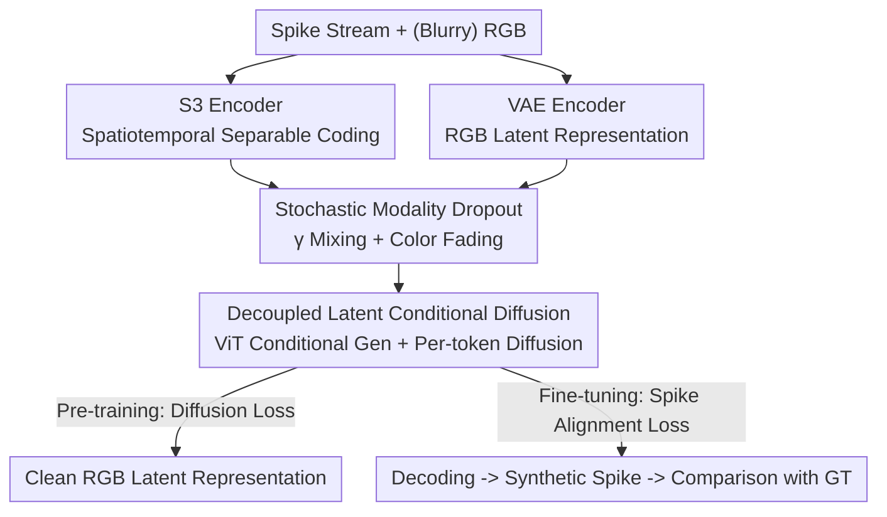

# SpikeGen: Decoupling "Rod-Cone" Visual Representations with a Latent Generative Framework

**Conference**: ICLR 2026  
**OpenReview**: [https://openreview.net/forum?id=WEuc8D8sAM](https://openreview.net/forum?id=WEuc8D8sAM)  
**Code**: None  
**Area**: Diffusion Models / Image Generation / Neuromorphic Vision  
**Keywords**: Spike Camera, Latent Generative Models, Multimodal Fusion, Image Deblurring, Frame Reconstruction

## TL;DR
SpikeGen encodes visual information from spike cameras (rods, high temporal resolution) and RGB cameras (cones, high color/spatial resolution) into a shared VAE latent space. It then utilizes a modified MAR + per-token diffusion framework for generative fusion within this latent space. A single pre-trained model simultaneously achieves or exceeds SOTA performance across three tasks: conditional deblurring, dense frame reconstruction from spike streams, and new-view synthesis for high-speed scenes.

## Background & Motivation

**Background**: The human eye decouples the functions of cones and rods—cones handle color, while rods detect motion and intensity changes—which are then integrated at the "representation level" by the visual cortex. In the hardware world, RGB cameras correspond to cones (high spatial/color resolution but low temporal sensitivity), while dynamic vision systems (DVS) like spike cameras correspond to rods (achieving high temporal resolution through continuous integration but with poor color and spatial resolution). Fusing these complementary modalities is a natural progression.

**Limitations of Prior Work**: Existing cross-modal spike processing methods (e.g., S-SDM, STIR, SpikeGS) predominantly perform deterministic modeling and self-supervision in **pixel space**. This leads to two specific issues. First is the "sharpness trap": optimizing pixel-level losses often only increases overall contrast without truly recovering geometric structures; the output appears sharp, but the details are hallucinated. Second is the **spatial sparsity** of individual spike frames—pixels do not fire spikes if they do not accumulate enough intensity within a sampling window, causing spatial uncertainty. While blurry RGB frames retain global spatial relationships that could serve as coarse constraints, deterministic methods fail to utilize them effectively as generative priors.

**Key Challenge**: Human vision integrates information and "brain-fills" missing content within **latent representations**, whereas existing methods remain at the level of pixel-level self-supervision. Pixel-level modeling is both computationally expensive and prone to the sharpness trap with poor generalization. Whether it is the temporal insufficiency of RGB (blur) or the spatial insufficiency of spikes (sparsity), the essence is an **information deficiency** problem, which is naturally suited for probabilistic generative models rather than deterministic regression.

**Goal**: To build a unified framework that both decouples dual-modality representations and performs probabilistic generation in latent space, covering all mainstream spike-RGB processing tasks (deblurring, frame reconstruction, and new-view synthesis).

**Key Insight**: The authors posit that "functional decoupling + latent cortical processing" are two vital aspects of human vision. Consequently, they adopt the latent diffusion paradigm: pre-training a spike encoder to align with the RGB VAE latent space, achieving 512x spatio-temporal downsampling before running diffusion in that space. Operating in latent space saves computation and captures representation-level similarities rather than pixel-level errors, thereby bypassing the sharpness trap.

**Core Idea**: Both spike streams and blurry RGB frames are treated as "degraded inputs." After being encoded into the same latent space, generative completion is performed using a non-autoregressive MAR + per-token diffusion framework. A configurable modality mixing ratio $\gamma$ allows the same pre-trained model to freely adjust the weights of the two modalities during inference.

## Method

### Overall Architecture
SpikeGen employs a two-stage pipeline: "self-supervised pre-training + task-specific fine-tuning." The input consists of a spike stream and a (potentially blurry) RGB image, and the output is a clear RGB latent representation (subsequently decoded into an image). Each modality passes through its own encoder: RGB through a standard VAE, and spikes through the self-developed S3 (Spatial-Temporal Separable Spike) encoder. The two latent representations are linearly combined according to a random ratio $\gamma$ to form a mixed latent $z_{mixed}$. A ViT processes the full tokens from both modalities to generate conditions, which are then passed to a lightweight MLP for **per-token diffusion** to decode the predicted latent representation. The pre-training stage uses a diffusion loss between the predicted latent and the clean RGB latent; the fine-tuning stage, often lacking clear RGB ground truth for downstream tasks, uses a "spike alignment" loss—where the predicted image is synthesized back into a spike stream and compared with the ground truth spikes.

### Key Designs

**1. S3 Spatiotemporal Separable Spike Encoder: Compressing Sparse Spike Streams into RGB Latent Space**

Spike streams are binary (0/1) voxel data of shape $[B,1,T,H,W]$. They have a long temporal dimension but are spatially sparse, making them incompatible with latent diffusion pipelines designed for RGB. The S3 encoder first uses a series of 3D convolution blocks to downsample the input hierarchically to $[B,C_{out},T/8,H/8,W/8]$ ($C_{out}=512$), trading space for channels like a UNet encoder. This is followed by a **temporal fusion** stage: two consecutive $1\times1\times1$ 3D convolutions generate temporal attention weights, which are element-wise multiplied back into the features and summed along the temporal dimension. This collapses the temporal dimension to obtain a spatial feature map of $[B,C_{out},H/8,W/8]$. Finally, a 2D convolution + LayerNorm + LeakyReLU perfroms refinement. This aligns the spike latent representation with the RGB VAE latent in the same space and scale, achieving a total 512x spatio-temporal downsampling. This is the prerequisite for all subsequent latent generation operations and significantly reduces the cost of pixel losses during large-scale pre-training.

**2. Decoupled Latent Conditional Non-Autoregressive Diffusion: Treating Dual Degraded Modalities as MAR Conditional Tokens**

The authors modified the Masked Auto-Regressive Model (MAR). While the original MAR performs Masked Image Modeling (MIM) to predict new tokens from "empty" space, SpikeGen perceives blurry RGB (temporal deficiency) and sparse spikes (spatial deficiency) as **degradations** rather than missing data. Thus, the ViT directly receives the **full tokens** from both encoders to generate conditions for per-token diffusion. Since there is no need to generate tokens from scratch, the autoregressive process of MAR is further simplified into **simultaneous generation of all tokens** (non-autoregressive), making both training and inference faster. Experiments in the appendix show this does not compromise performance. A standard diffusion denoising $\mathcal{L}_{LDM}=\mathbb{E}_{\mathcal{E}(x),\epsilon,t}[\lVert\epsilon-\epsilon_\theta(z_t,t)\rVert_2^2]$ is performed on each token, with conditions derived from the decoupled dual-modality latents. Using probabilistic diffusion instead of deterministic regression specifically addresses "information deficiency" scenarios, as diffusion models are more capable of recovering textures and man-made structures in super-resolution or denoising tasks.

**3. Stochastic Modality Dropout: Configuring Modality Weights via $\gamma$ Mixing and Color Fading**

To allow the pre-trained model to freely adjust the two modalities (or even work with a single modality) during inference, the authors randomly sample a mixing ratio $\gamma\sim\mathcal{N}_{[0,1]}(\mu=0.5,\sigma^2=1)$ during pre-training. The mixed latent is $z_{mixed}=(1-\gamma)z_{RGB}+\gamma z_{spike}$. However, this introduces a subtle problem: if the spike proportion is high, the clean RGB latent can no longer be the sole learning target. The solution is **color fading** of the supervision target based on $\gamma$: $I_{faded}=(1-\gamma)\cdot I_{clear}+\gamma\cdot I_{gray}$. As $\gamma\to1$ (spike dominant), the target tends toward a grayscale image $I_{gray}$, forcing the model to focus on texture reconstruction rather than precise color. As $\gamma\to0$ (RGB dominant), the target remains close to the clean color image $I_{clear}$. This design directly echoes the rod/cone division—spikes (rods) are inherently poor at color, so the supervision signal fades accordingly, aligning modal behavior with biological mechanisms.

**4. Spike Alignment Fine-tuning: Introducing Pixel-level Constraints without Clean RGB Ground Truth**

Pre-training only aligns in the latent space. When fine-tuning data is scarce (e.g., outdoor 3D reconstruction datasets with only 34 images per scene), the model may fail to capture fine-grained details. Conventional methods supplement this with RGB pixel-space MSE/perceptual losses (like SDXL). However, SpikeGen’s downstream tasks often **lack clean RGB ground truth**. The authors instead decode the predicted latent back to pixels to get $I_{pred}$, perform min-max normalization to get $I_{norm}$, and apply Gaussian kernel $K_G$ (parameter $\sigma_s$) convolution smoothing to get $I_{smooth}$. After gamma correction $P_{pred}=(I_{smooth})^{\gamma_c}$ and the addition of uniform noise, a probability map is generated. Sampling according to $P_{pred}$ synthesizes a "predicted spike stream," which is compared with the ground truth spike stream to calculate the spike alignment loss. This allows pixel-level geometric/texture constraints to be reintroduced during fine-tuning even without RGB ground truth.

## Key Experimental Results

The authors compared SpikeGen against 20+ SOTA baselines across 3 major tasks, following the data usage and evaluation protocols of S-SDM, STIR, and SpikeGS.

### Main Results

Conditional Video Deblurring (GOPRO, sparsity controlled by spike threshold $V_{th}$):

| Method | Dual-modality | $V_{th}{=}1$ PSNR | $V_{th}{=}2$ PSNR | $V_{th}{=}4$ PSNR |
|------|--------|------|------|------|
| REFID (CVPR23) | ✓ | 28.12 | 15.29 | 13.62 |
| SpkDeblurNet (NIPS23) | ✓ | 28.31 | 14.41 | 11.62 |
| S-SDM (NIPS24) | ✓ | 26.89 | 26.37 | 25.43 |
| **SpikeGen (Ours)** | ✓ | **29.30** | **28.78** | **28.07** |

Dense Frame Reconstruction (SREDS) and New-View Synthesis (Blender, average):

| Task / Dataset | Metric | Prev. SOTA | SpikeGen (Ours) |
|------|------|----------|----------|
| Reconstruction SREDS | PSNR ↑ | 38.79 (STIR) | **39.25** |
| Reconstruction SREDS | LPIPS ↓ | 0.02 (STIR) | **0.01** |
| NVS Blender Avg. | PSNR ↑ | 29.12 (SpikeGS) | **30.04** |
| NVS Blender Avg. | LPIPS ↓ | 0.13 (SpikeGS) | **0.10** |

### Ablation Study

| Configuration | Key Observation | Description |
|------|---------|------|
| Full Model | SOTA across 3 tasks | Complementary RGB + Spike |
| Increasing Spike Sparsity (larger $V_{th}$) | Relative PSNR gain increases from ~1 to ~3 | Robustness from stochastic dropout + few-frame training |
| Non-autoregressive vs Autoregressive (App. Table 7) | Performance unchanged, latency significantly reduced | Simultaneous generation of all tokens is effective |
| Without TFP Prior (App. C.4) | Reconstruction degrades | TFP as a pseudo-dense grayscale image mitigates spatial ambiguity |
| RGB-only Input (App. C.3) | Still functional | Validates single-modality generalization |

### Key Findings
- **The sparser the spikes, the greater SpikeGen’s relative advantage**: When $V_{th}$ increases from 1 to 4 (making spike guidance sparser), most baselines (REFID, SpkDeblurNet) see PSNR drop sharply to the teens, while SpikeGen maintains 28+. This is attributed to the data diversity from latent pre-training and the sparsity robustness developed by using only 8 spike frames during training.
- **The TFP pseudo-dense modality is a crucial prior for reconstruction tasks**: Aggregating spike frames within a fixed window into a "shutter exposure" style grayscale image (TFP) trades temporal resolution for spatial richness, providing spatial constraints for sparse spikes. SpikeGen then uses the raw spike stream for secondary refinement to remove TFP blur.
- **The generative framework achieves "quality balance" in NVS**: DeblurGS is sharp overall but blurry in details due to RGB dependence; SpikeGS fixes textures via binary spikes but has biased coloring. SpikeGen achieves a better color-texture balance, outperforming rivals even as a two-stage method.

## Highlights & Insights
- **"Degradation as deficiency" perspective enables non-autoregressive MAR**: Redefining blurry RGB and sparse spikes as degraded inputs eliminates the need for empty token generation, naturally simplifying MAR into simultaneous generation of all tokens. This reduces time without losing accuracy—a reframing worth migrating to other conditional generative completion tasks.
- **Clever coupling of $\gamma$ mixing and color fading**: The modality mixing ratio and the color saturation of the supervision target are bound by the same $\gamma$. This ensures that "spike dominance $\rightarrow$ learning texture without color" holds automatically at the loss level without extra loss-weight hacking. This maps biological rod/cone division into a clean training mechanism.
- **Latent space alignment bypasses the sharpness trap**: Pre-training the spike encoder to align with the RGB VAE latent space and performing diffusion there essentially replaces pixel-level error with representation-level similarity. This philosophy, consistent with DINO/JEPA, can be reused for other low-quality input restoration tasks.

## Limitations & Future Work
- **Not Open-Source**: No code link provided; the S3 encoder, color fading, and spike alignment details present high reproduction barriers.
- **Heavy Reliance on Synthetic Data/Simulators**: Pre-training relies on ImageNet synthetic spikes, and deblurring relies on SpikingSim (converting blurry RGB to 98 frames, using 8). There may be a gap between simulated and real spike camera noise/threshold distributions, validated only on the momVidarReal2021 real dataset.
- **Stability Issues in Lower-Data Regimes**: Outdoor 3D scenes have only 34 images each; although spike alignment loss helps, it remains a low-data regime, and cross-scene generalization boundaries are not fully characterized.
- **NVS is a Two-Stage Method**: New-view synthesis requires reconstruction before rendering, making it less end-to-end than pure 3DGS routes and resulting in a longer inference chain.
- **Future Directions**: Extending the spike alignment loss from "resampling synthetic spikes" to differentiable spike generation or introducing real spike camera data for domain adaptation could further narrow the sim-to-real gap.

## Related Work & Insights
- **vs S-SDM**: Both use spike texture cues to guide structural recovery, but S-SDM is a deterministic model with pixel-level self-supervision, making it prone to the sharpness trap. SpikeGen operates with probabilistic diffusion in latent space, showing clear advantages under sparse spikes (PSNR 28.07 vs 25.43 at $V_{th}{=}4$).
- **vs STIR**: STIR uses spatiotemporal interaction to improve spike reconstruction efficiency as a deterministic spike-specific model. SpikeGen is a unified generative framework, slightly outperforming STIR on SREDS (PSNR/LPIPS 39.25/0.01 vs 38.79/0.02) while being cross-task capable.
- **vs SpikeGS / SpikeNeRF**: These use multi-view spike streams for 3DGS/NeRF in high-speed NVS. SpikeGen is not dedicated to 3D but covers NVS with the same latent generative model, surpassing SpikeGS on Blender average (30.04 vs 29.12).
- **vs MAR / LDM**: Inherits the per-token diffusion of MAR and the latent space paradigm of LDM but transforms masked generation into decoupled dual-modality conditional, non-autoregressive one-pass generation, customized for spike-RGB degradation scenarios.

## Rating
- Novelty: ⭐⭐⭐⭐⭐ The first latent generative framework for decoupled spike-RGB representations, with biological motivation mapping consistently to the methodology.
- Experimental Thoroughness: ⭐⭐⭐⭐ Covers three major tasks and 20+ baselines, though mostly reliant on synthetic data with limited real spike validation.
- Writing Quality: ⭐⭐⭐⭐ Clear narrative for motivation and method; some details (color fading, spike alignment) require cross-referencing the appendix.
- Value: ⭐⭐⭐⭐ Provides a unified foundation for latent generative modeling in neuromorphic vision, though the lack of open-sourcing limits immediate impact.

<!-- RELATED:START -->

## Related Papers

- [\[ICLR 2026\] Synthetic History: Evaluating Visual Representations of the Past in Diffusion Models](synthetic_history_evaluating_visual_representations_of_the_past_in_diffusion_mod.md)
- [\[ICLR 2026\] Adapting Self-Supervised Representations as a Latent Space for Efficient Generation](adapting_self-supervised_representations_as_a_latent_space_for_efficient_generat.md)
- [\[NeurIPS 2025\] CORAL: Disentangling Latent Representations in Long-Tailed Diffusion](../../NeurIPS2025/image_generation/coral_disentangling_latent_representations_in_longtailed_dif.md)
- [\[ICLR 2026\] Structured Flow Autoencoders: Learning Structured Probabilistic Representations with Flow Matching](structured_flow_autoencoders_learning_structured_probabilistic_representations_w.md)
- [\[ICLR 2026\] Latent Stochastic Interpolants](latent_stochastic_interpolants.md)

<!-- RELATED:END -->
## Related Papers

- [\[ICLR 2026\] Generalization of Diffusion Models Arises with a Balanced Representation Space](generalization_of_diffusion_models_arises_with_a_balanced_representation_space.md)
- [\[ICLR 2026\] Improving Classifier-Free Guidance in Masked Diffusion: Low-Dim Theoretical Insights with High-Dim Impact](improving_classifier-free_guidance_in_masked_diffusion_low-dim_theoretical_insig.md)
- [\[ICLR 2026\] Purrception: Variational Flow Matching for Vector-Quantized Image Generation](purrception_variational_flow_matching_for_vector-quantized_image_generation.md)
- [\[ICLR 2026\] Entering the Era of Discrete Diffusion Models: A Benchmark for Schrödinger Bridges and Entropic Optimal Transport](entering_the_era_of_discrete_diffusion_models_a_benchmark_for_schrödinger_bridge.md)
- [\[ICLR 2026\] FlowCast: Trajectory Forecasting for Scalable Zero-Cost Speculative Flow Matching](flowcast_trajectory_forecasting_for_scalable_zero-cost_speculative_flow_matching.md)

<!-- RELATED:END -->
