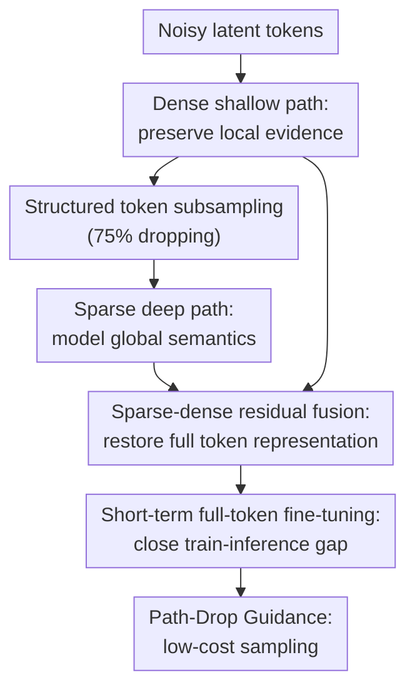

# SPRINT: Sparse-Dense Residual Fusion for Efficient Diffusion Transformers

**Conference**: ICLR2026  
**OpenReview**: [https://openreview.net/forum?id=aTVollXaaI](https://openreview.net/forum?id=aTVollXaaI)  
**Code**: To be confirmed  
**Area**: Diffusion Models / Image Generation / Efficient Training  
**Keywords**: Sparse training, Diffusion Transformer, token dropping, residual fusion, efficient sampling

## TL;DR
SPRINT merges the shallow dense local features and deep sparse global features of the Diffusion Transformer using a residual approach, enabling DiT to be efficiently pre-trained at a 75% token dropping ratio and further reducing sampling costs through Path-Drop Guidance.

## Background & Motivation
**Background**: Diffusion Transformer (DiT) has become a vital backbone for high-quality image generation. From DiT and SiT to larger rectified-flow transformers, these models rely on self-attention over long sequences of patch tokens to model image structures. However, self-attention scales quadratically with the number of tokens; as image resolution and patch counts increase, pre-training costs and memory pressure become prohibitive.

**Limitations of Prior Work**: A direct idea is to drop a portion of tokens during training so that middle layers process shorter sequences. However, naive token dropping disrupts spatial coverage. Particularly for the noisy inputs of diffusion models, the model must simultaneously recover local high-frequency details and understand global semantic structures. If the deep layers see too few tokens and shallow information is not reliably preserved, representation degradation and a train-inference gap occur when facing complete token sequences during inference.

**Key Challenge**: All layers in a standard DiT process the full set of tokens identically, yet layers at different depths serve different roles. Shallow layers, being closer to noisy patches, are naturally suited for preserving fine-grained information like local textures, noise, and edges. Deep layers are better suited for modeling object shapes, categories, and cross-regional relationships. Forcing deep layers to continue expensive computations on every local token is both a waste of FLOPs and fails to explicitly encourage focus on global semantics.

**Goal**: The authors aim to address three sub-problems: first, stable training of DiTs under high drop ratios (typically 75%); second, ensuring representations learned via sparse training transfer to full-token inference; third, transforming this dual-path structure into a cheaper guidance sampling mechanism beyond just training.

**Key Insight**: The observation is that "shallow dense information" and "deep sparse semantics" are complementary rather than mutually exclusive. If shallow layers retain the full set of tokens, they provide local evidence for final velocity prediction. If deep layers process only a few tokens via structured sampling, they are forced to learn more global, noise-invariant contexts.

**Core Idea**: Replace the dense full-layer computation of traditional DiT with a "shallow full-token encoding + middle-layer sparse token processing + residual fusion for full-token decoding" architecture, architecturally decoupling local details from global semantics.

## Method

### Overall Architecture
SPRINT starts from a standard DiT/SiT and partitions transformer blocks into three segments: the first two layers serve as the dense encoder $f_\theta$, several middle layers serve as the sparse deep path $g_\theta$, and the last two layers serve as the dense decoder $h_\theta$. During training, noisy latent patch tokens pass through $f_\theta$ to obtain full-length shallow features. Then, approximately 25% of tokens are retained via structured sampling for $g_\theta$. The deep output is padded back to the original length, merged with shallow features, and passed to $h_\theta$ to predict the velocity for all tokens.

This process is not merely "calculating fewer tokens" but preserving the local information of dropped tokens through the dense shallow path, allowing expensive middle blocks to focus solely on sparser, more semantic context modeling. After pre-training, a short full-token fine-tuning phase adapts the middle layers to full inputs. During inference, the shallow path acts as a natural weak unconditional model, forming Path-Drop Guidance (PDG).

### Key Designs

**1. Dense Shallow Path: Decoupling local noise evidence from expensive deep computation**

SPRINT retains a shallow encoder $f_\theta$ that processes all tokens. Given noisy tokens $x_t \in \mathbb{R}^{B \times N \times C}$, the model first computes $f_t=f_\theta(x_t)$, where $f_t$ still covers all spatial positions. The key is not just adding a skip connection, but acknowledging that diffusion velocity prediction is highly sensitive to local noise and edges. If this information is lost during token dropping, the decoder can hardly recover it from sparse semantic tokens. Visualizations show that using only the dense shallow path preserves local textures but results in unstable global structures, proving its role as a local evidence highway.

**2. Sparse Deep Path: Learning global semantics with few tokens in middle blocks**

Following $f_t$, SPRINT performs token dropping to get $f_t^{drop}$, which enters middle blocks: $g_t^{drop}=g_\theta(f_t^{drop})$. The default 75% drop ratio significantly reduces FLOPs and memory. More importantly, the deep path is no longer forced to repeat detailed modeling on every local patch, instead learning object contours and long-range relationships from sparse tokens. SPRINT posits that seeing fewer tokens does not necessarily weaken deep layers; with shallow local information intact, deep sparsity actually facilitates better semantic representation.

**3. Sparse-Dense Residual Fusion: Aligning sequences with mask tokens to restore full prediction**

Since $g_\theta$ only processes retained tokens, $g_t^{drop}$ is shorter than $N$. SPRINT pads the dropped positions with a fixed `[MASK]` token to reconstruct $g_t^{pad}\in\mathbb{R}^{B\times N\times C}$, concatenates it with dense shallow features $f_t$ along the channel dimension, projects it back, and uses decoder $h_\theta$ for full-token velocity prediction. This mechanism reunites "local evidence at every position" with "global semantics from sparse positions." Compared to other methods, SPRINT requires minimal changes: standard DiT blocks remain unchanged, adding only a fusion projection layer ($\approx 0.3\%$ parameter increase).

**4. Structured Group-wise Sampling: Avoiding spatial holes**

Pure uniform random dropping can leave local regions entirely unrepresented, which is dangerous for image generation as semantic context would be absent in the deep path. SPRINT utilizes group-wise subsampling based on the 2D topology: the patch grid is divided into $n \times n$ groups, and $k$ tokens are randomly retained in each group (ratio $r=1-k/n^2$). With $n=2, k=1$, a 75% drop ratio is achieved. This ensures every $2 \times 2$ region has at least one token in the deep path while maintaining randomness during iterations to prevent the model from memorizing fixed patterns.

**5. Path-Drop Guidance: Replacing full unconditional passes with the shallow path**

Standard Classifier-Free Guidance (CFG) necessitates two full forward passes (conditional and unconditional) per step, doubling inference FLOPs. SPRINT's dual-path structure provides a built-in weak model: the unconditional branch can bypass $g_\theta$, merging dense shallow features $f_\theta(x_t, \emptyset)$ with `[MASK]` placeholders. This embeds a "cheaper unconditional model" into the network, similar to Auto Guidance but without extra training. To adapt the model, the deep path is randomly dropped with a 10% probability during training. PDG reduces inference TFLOPs on ImageNet 256 from $\approx 0.477$ to $0.274$ while improving FDD/FID.

### Loss & Training
SPRINT follows standard flow matching / diffusion velocity loss. Given real sample $x_0$ and Gaussian noise $x_1$, a linear schedule $x_t=(1-t)x_0+t x_1$ is used. The network optimizes $\mathbb{E}\|v(x_t,t)-v_\theta(x_t,t)\|^2$. No auxiliary reconstruction tasks are added.

Training involves two stages. Stage one: long-range sparse pre-training (75% dropping). Stage two: short-range full-token fine-tuning (all blocks process full sequences). Fine-tuning for 20K steps can recover over 94% of the performance of 200K steps. Both stages include 10% path-drop learning to support PDG.

## Key Experimental Results

### Main Results
The method was evaluated on ImageNet-1K class-conditional generation using SD VAE / Flux VAE latents with SiT-B/2 and SiT-XL/2.

| Setting | Method | Training Cost | FDD ↓ | FID ↓ | Note |
|------|------|----------|-------|-------|------|
| ImageNet 256, SiT-XL/2, 400K, SD VAE, w/o CFG | Improved SiT-XL/2 | $24.4 \times 10^6$ TFLOPs | 351.1 | 12.8 | Dense baseline |
| ImageNet 256, SiT-XL/2, 400K, SD VAE, w/o CFG | SPRINT | $18.7 \times 10^6$ TFLOPs | 262.6 | 9.30 | 75% token dropping |
| ImageNet 256, SiT-XL/2, 1M, SD VAE, w/ CFG | Improved SiT-XL/2 | $61.2 \times 10^6$ TFLOPs | 146.0 | 2.36 | Full-token baseline |
| ImageNet 256, SiT-XL/2, 1M, SD VAE, w/ CFG | SPRINT | $31.5 \times 10^6$ TFLOPs | 126.1 | 2.29 | $\approx 1.94\times$ savings |
| ImageNet 256, SDE 250 steps | SPRINT + PDG | $65.1 \times 10^6$ TFLOPs | 58.4 | 1.62 | Inference 0.274 TFLOPs |
| ImageNet 512, SDE 250 steps | SPRINT + PDG | $184.8 \times 10^6$ TFLOPs | 46.9 | 1.96 | $\approx 1/2$ train/infer cost |

### Ablation Study
- **Sampling method**: Structured sampling (FID 27.5) outperforms random sampling (FID 30.1) at 75% dropping.
- **Path necessity**: Sparse-only path (FID 85.1) or dense-only path (FID 81.4) fail; dual-path fusion (FID 27.5) is critical.
- **Drop ratio**: 75% ratio is the optimal "sweet spot"; 87.5% leads to insufficient capacity (FID 50.2).
- **Block distribution**: $f/g/h = 2/24/2$ provides the best balance of cost and performance.

### Key Findings
- Dense shallow and sparse deep paths are not interchangeable. One handles local evidence, the other handles global semantics.
- 75% dropping is not just "workable" but optimal under the SPRINT architecture.
- Short-term fine-tuning is essential but efficient, showing fast transfer from sparse representations.
- PDG not only saves FLOPs but often improves image quality by using the inherent dual-path structure.

## Highlights & Insights
- Decoupling layers by "role" (local detail vs. global semantics) is more effective than uniform token reduction.
- Residual fusion is extremely lightweight, requiring no auxiliary decoders, making it easy to integrate into existing architectures like SiT or REPA.
- Structured sampling proves that *which* tokens are kept is as important as *how many*.
- PDG is a clean system design that internalizes guidance within a single network, avoiding external weak models or distillation.

## Limitations & Future Work
- Experiments primarily focus on class-conditional ImageNet; large-scale text-to-image or video generation needs more direct validation.
- A short full-token fine-tuning stage is still required, adding some engineering complexity.
- PDG parameters like path-drop probability currently rely on empirical tuning.
- Fixed $2 \times 2$ group sampling could be replaced by adaptive sampling based on timestep or texture complexity.

## Related Work & Insights
- **vs MaskDiT**: SPRINT avoids auxiliary reconstruction tasks and supports higher drop ratios (75%) by using the dense residual path.
- **vs REPA**: SPRINT is complementary. Combining REPA (representation alignment) with SPRINT (structural sparsity) further improves performance.
- **vs Progressive Training**: While progressive training saves early-stage resolution costs, SPRINT addresses the attention bottleneck directly via sequence length reduction in deep layers.

## Rating
- Novelty: ⭐⭐⭐⭐☆ Combines layer specialization and residual fusion elegantly.
- Experimental Thoroughness: ⭐⭐⭐⭐☆ Extensive on ImageNet, but needs larger text-to-image/video data.
- Writing Quality: ⭐⭐⭐⭐☆ Clear motivation and figures.
- Value: ⭐⭐⭐⭐⭐ Highly practical for reducing DiT training/inference costs with minimal architectural changes.

<!-- RELATED:START -->

## Related Papers

- [\[CVPR 2026\] ResCa: Residual Caching for Diffusion Transformers Acceleration](../../CVPR2026/image_generation/resca_residual_caching_for_diffusion_transformers_acceleration.md)
- [\[ICLR 2026\] DenseGRPO: From Sparse to Dense Reward for Flow Matching Model Alignment](densegrpo_from_sparse_to_dense_reward_for_flow_matching_model_alignment.md)
- [\[ICLR 2026\] Diffusion Transformers with Representation Autoencoders](diffusion_transformers_with_representation_autoencoders.md)
- [\[CVPR 2026\] NOVA: Sparse Control, Dense Synthesis for Pair-Free Video Editing](../../CVPR2026/image_generation/nova_sparse_control_dense_synthesis_for_pair-free_video_editing.md)
- [\[ICLR 2026\] DiffSparse: Accelerating Diffusion Transformers with Learned Token Sparsity](diffsparse_accelerating_diffusion_transformers_with_learned_token_sparsity.md)

<!-- RELATED:END -->
