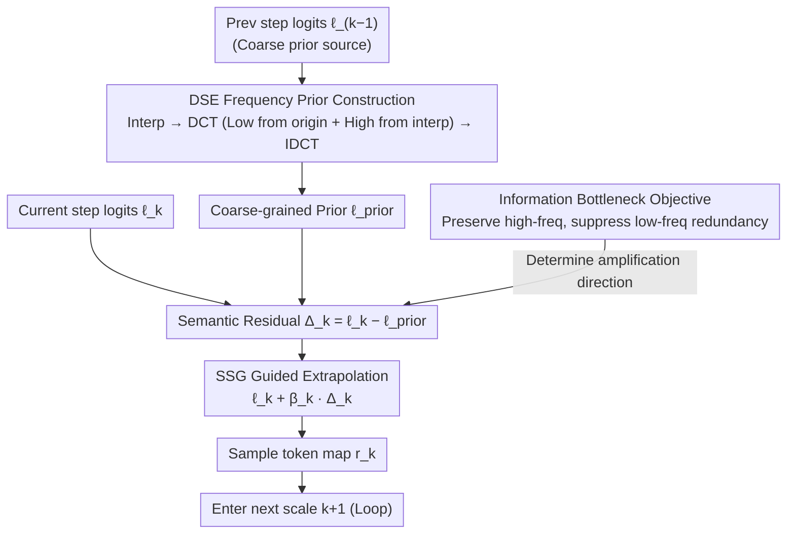

# SSG: Scaled Spatial Guidance for Multi-Scale Visual Autoregressive Generation

**Conference**: ICLR 2026  
**arXiv**: [2602.05534](https://arxiv.org/abs/2602.05534)  
**Code**: [GitHub](https://github.com/Youngwoo-git/SSG)  
**Area**: Visual Autoregressive Models / Image Generation / Inference-time Guidance  
**Keywords**: VAR, next-scale prediction, information bottleneck, frequency domain guidance, training-free

## TL;DR

Proposes Scaled Spatial Guidance (SSG), a training-free inference-time guidance method that enhances the coarse-to-fine hierarchical generation quality of visual autoregressive models through frequency-domain prior construction and semantic residual amplification.

## Background & Motivation

Visual Autoregressive (VAR) models generate images via next-scale prediction, naturally achieving coarse-to-fine hierarchical synthesis. However:

**Training-Inference Bias**: Limited model capacity and accumulated errors cause the model to deviate from the coarse-to-fine essence during inference, where low-frequency information is redundantly predicted.

**Limitations of Prior Work**:
   - Auxiliary refinement modules (CoDe, HMAR) require retraining.
   - Flow-matching integration increases overhead.
   - Self-correction mechanisms require architecture modifications.

**Core Problem**: How to guide each generation step to produce novel high-frequency information specific to that scale without modifying model parameters?

## Method

### Overall Architecture

SSG addresses the training-inference bias in VAR inference: the model tends to repeat already determined low-frequency structures in each next-scale prediction rather than filling in the high-frequency details unique to that scale. SSG formulates this step as an Information Bottleneck (IB) optimization—aiming to retain novel high-frequency signals belonging to the current scale while suppressing low-frequency redundancy overlapping with previous coarser scales. Mechanism: For step $k$, the previous $logits \ell_{k-1}$ are first constructed into a non-distorted coarse-grained prior $\ell_{\text{prior}}$ in the frequency domain (DSE module). Then, the semantic residual $\Delta_k$ is obtained by subtracting the prior from the current $logits \ell_k$. This high-frequency signal is amplified along the direction of $\Delta_k$ using a scaled factor $\beta_k$ and re-injected into the sampling distribution. Finally, tokens for the current scale are sampled to proceed to the next. The entire process only modifies logits within the sampling loop and reuses cached outputs without additional forward passes or weight modifications, enabling zero-cost integration with existing VAR models.

### Key Designs

**1. Information Bottleneck Objective: Formalizing goal for each scale**

The training-inference bias in VAR stems from the model repeating predicted low-frequency structures instead of adding high-frequency details—but "what to add" was initially a vague intuition. SSG derives this from IB principles as a variational optimization $\mathcal{L}_{\text{VAR-IB}} = \max_{z_k} \beta I(z_k; H(\hat{f}_K)) - I(z_k; L(\hat{f}_K))$: the first term maximizes mutual information between the $k$-th latent $z_k$ and the final high-frequency components $H(\hat{f}_K)$ (generating new details), while the second term minimizes redundant mutual information with low-frequency components $L(\hat{f}_K)$ (reducing repetition), where $L(\hat{f}_K)\approx \hat{f}_{k-1}$. This transforms the goal into an actionable "more high-frequency, less low-frequency" trade-off, providing a theoretical basis for closed-form guidance.

**2. DSE Frequency Domain Prior Construction: Building a non-distorted coarse reference**

Guidance quality depends on the accuracy of $\ell_{\text{prior}}$. If the prior is distorted, the residual $\Delta_k$ will be misaligned, potentially suppressing correct details. Naive spatial interpolation of previous logits leads to over-smoothing (linear) or blocky artifacts (nearest-neighbor), both polluting $\Delta_k$. DSE performs fusion in the frequency domain: previous $logits \ell_{k-1}$ are spatially interpolated to get $\ell'_{\text{interp}}$, then DCT is applied to both. The low-frequency coefficients of $\ell_{k-1}$ are combined with the high-frequency coefficients of $\ell'_{\text{interp}}$, and IDCT is used to recover $\ell_{\text{prior}}$. Leveraging DCT orthogonality, this fusion precisely separates frequency bands—low frequencies remain faithful to the original scale while high frequencies provide a smooth extrapolation, resulting in a prior that is neither blurry nor aliased.

**3. SSG Guided Extrapolation: Amplifying high frequencies with semantic residuals**

The IB objective is mapped to a MAP-style proxy function $\mathcal{L}(\ell') = \beta(\ell')^{\top}\Delta_k - \tfrac12\|\ell'-\ell_k\|_2^2$. Since this quadratic form is strictly concave, its unique closed-form maximum yields the guidance formula: $\ell_k^{\text{SSG}} = \ell_k + \beta_k \Delta_k = \ell_k + \beta_k(\ell_k - \ell_{\text{prior}})$. The residual $\Delta_k$ corresponds precisely to the new high frequencies of the current scale. Extrapolating along this direction with factor $\beta_k$ amplifies scale-specific semantic residuals and suppresses low-frequency redundancy. While similar in form to CFG, the difference vector here arises from cross-scale frequency discrepancies rather than condition discrepancies, making it naturally suited for the VAR hierarchy without requiring unconditional forward passes.

## Key Experimental Results

### Main Results: ImageNet 256×256 Class-Conditioned Generation

| Model | FID↓ | sFID↓ | IS↑ | Pre↑ | Rec↑ |
|-------|------|-------|-----|------|------|
| VAR-d16 | 3.42 | 8.70 | 275.6 | 0.84 | 0.51 |
| +SSG | **3.27** | **8.39** | **285.3** | **0.85** | 0.50 |
| VAR-d20 | 2.67 | 7.97 | 299.8 | 0.83 | 0.55 |
| +SSG | **2.49** | **7.60** | **305.2** | 0.83 | **0.56** |
| VAR-d24 | 2.39 | 8.18 | 314.7 | 0.82 | 0.58 |
| +SSG | **2.20** | **6.95** | **324.0** | **0.83** | **0.59** |
| VAR-d30 | 2.02 | 8.52 | 302.9 | 0.82 | 0.60 |
| +SSG | **1.68** | **8.50** | **313.2** | 0.81 | **0.62** |

### Cross-model generalization

SSG is effective across different tokenization schemes:
- Standard VAR (Tian et al.)
- HART (Hybrid tokens)
- Infinity (Bitwise tokens)

### Comparison with other generation models

VAR-d30 + SSG (FID 1.68) is competitive with diffusion and masked models while maintaining the low-latency advantages of VAR (10-step inference).

### Ablation Study

| Component | FID | IS |
|-----------|-----|-----|
| w/o SSG (Baseline) | 2.02 | 302.9 |
| SSG + Linear Interpolation Prior | Limited gain | — |
| SSG + Nearest Neighbor Prior | Potential degradation | — |
| SSG + DSE (Freq Fusion) | **1.68** | **313.2** |

## Highlights & Insights

1. **Information-theory-driven design**: Elegant derivation of binary closed-form SSG from IB principles.
2. **Completely training-free**: No modification to weights, no extra data, no fine-tuning.
3. **Theoretically sound DSE**: Utilizes DCT orthogonality for energy-conserving frequency band fusion.
4. **Consistency**: Effective across various VAR model scales and tokenization designs.
5. **Minimal implementation**: Can be integrated with a few lines of code.

## Limitations & Future Work

1. SSG performance depends on a reasonable $\beta_k$ schedule, requiring hyperparameter tuning.
2. No prior is available for the first step (coarsest scale), where SSG is inactive.
3. As a posterior correction, it cannot recover information loss inherent to the tokenizer.
4. Specifically designed for VAR models with discrete visual tokens.

## Related Work & Insights

- **VAR Models**: VAR (Tian 2024), HART (Tang 2025), Infinity (Han 2025).
- **Visual Guidance**: CFG, SAG, PAG, STG, though none target the VAR structure.
- **Training-Inference Bias Mitigation**: CoDe, HMAR, but these require retraining.

## Rating

- **Novelty**: ⭐⭐⭐⭐⭐ — Elegant bridge from information theory to practice.
- **Value**: ⭐⭐⭐⭐⭐ — Zero-cost integration, plug-and-play.
- **Experimental Thoroughness**: ⭐⭐⭐⭐ — Verified across multiple models and settings.
- **Writing Quality**: ⭐⭐⭐⭐⭐ — Clear theoretical derivation and intuitive explanations.

<!-- RELATED:START -->

## Related Papers

- [\[ICLR 2026\] MVAR: Visual Autoregressive Modeling with Scale and Spatial Markovian Conditioning](mvar_visual_autoregressive_modeling_with_scale_and_spatial_markovian_conditionin.md)
- [\[ICLR 2026\] SoftCFG: Uncertainty-guided Stable Guidance for Visual Autoregressive Model](softcfg_uncertainty-guided_stable_guidance_for_visual_autoregressive_model.md)
- [\[ICLR 2026\] NextStep-1: Toward Autoregressive Image Generation with Continuous Tokens at Scale](nextstep-1_toward_autoregressive_image_generation_with_continuous_tokens_at_scal.md)
- [\[ICLR 2026\] BAR: Refactor the Basis of Autoregressive Visual Generation](bar_refactor_the_basis_of_autoregressive_visual_generation.md)
- [\[ICML 2026\] Visual Implicit Autoregressive Modeling](../../ICML2026/image_generation/visual_implicit_autoregressive_modeling.md)

<!-- RELATED:END -->
