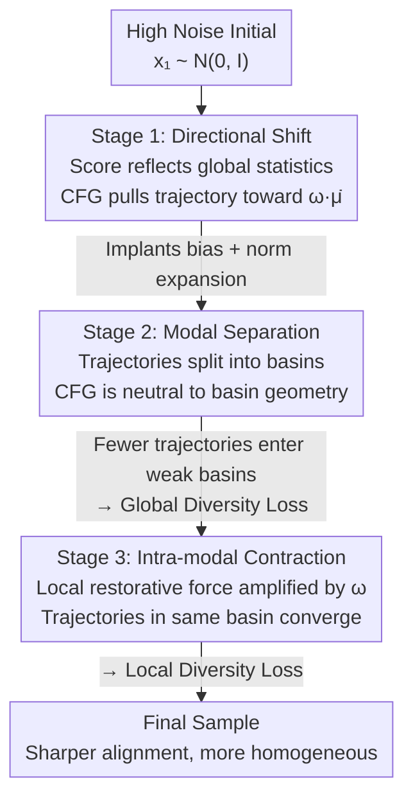

# Stage-wise Dynamics of Classifier-Free Guidance in Diffusion Models

**Conference**: ICLR 2026  
**OpenReview**: [https://openreview.net/forum?id=fP0s1TEow3](https://openreview.net/forum?id=fP0s1TEow3)  
**Code**: https://github.com/sqt24/tvcfg  
**Area**: Diffusion Models  
**Keywords**: Classifier-Free Guidance, Diffusion Model Sampling, Diversity Collapse, Gaussian Mixture, Time-varying Guidance

## TL;DR
Under the assumption of **multi-modal (Gaussian mixture) conditional distributions**, this paper decomposes the Classifier-Free Guidance (CFG) sampling process into three stages: "directional shift → modal separation → intra-modal contraction." By characterizing the effect of CFG on trajectories in each stage using three theorems, the authors provide a unified explanation for the long-standing empirical phenomenon where "stronger guidance improves alignment but degrades diversity." Consequently, a low-high-low time-varying guidance schedule is proposed to simultaneously enhance quality and diversity.

## Background & Motivation

**Background**: When performing conditional generation, diffusion models almost entirely rely on Classifier-Free Guidance (CFG) to strengthen semantic alignment with prompts or class labels. Its approach is extremely simple—extrapolating between the unconditional score and the conditional score: increasing the guidance strength $\omega>1$ results in stronger alignment. Due to its simplicity and effectiveness, CFG has become the de facto standard for all large-scale diffusion pipelines.

**Limitations of Prior Work**: CFG is a **heuristic formula**, and the extrapolated score no longer corresponds to any valid probability model. Thus, how it reshapes sampling dynamics has remained unclear. Existing theoretical analyses fall into two categories: one assumes the conditional distribution is a **unimodal Gaussian**, which yields clean derivations but completely ignores the multi-modal nature of real-world tasks; the other relaxes distribution assumptions but only provides weak qualitative conclusions that cannot make precise predictions.

**Key Challenge**: The most famous yet theoretically unexplained empirical phenomenon is **diversity collapse as guidance strength increases**—images become clearer and more aligned with the prompt, but samples look increasingly similar. Under a unimodal assumption, "diversity" cannot even be discussed because there is no mechanism for "weak modes being eliminated"; conversely, overly weak assumptions fail to provide the mechanism for "why it collapses."

**Goal**: This paper aims to characterize how CFG erodes diversity step-by-step throughout the sampling process under a distribution assumption that accommodates "multiple modes." It separates the explanation into two phenomena: "global diversity loss" (disappearance of weak modes) and "local diversity loss" (convergence of details within the same semantic).

**Key Insight**: The authors model the conditional distribution $p(x\mid y)$ as a **Gaussian mixture** rather than a unimodal Gaussian. Once multiple peaks are allowed, sampling trajectories exhibit distinct behaviors at different noise scales—viewing global statistics at high noise, splitting into respective attraction basins at medium noise, and contracting within basins at low noise—naturally partitioning the sampling process into three stages.

**Core Idea**: The CFG mechanism is analyzed using the "Gaussian mixture + three-stage decomposition" framework. The authors prove that CFG creates an initialization bias in the first stage, remains neutral but amplifies existing bias in the second stage, and exacerbates intra-modal contraction in the third stage. The combination of these three effects explains the diversity collapse.

## Method

Instead of proposing a new module, the paper introduces a **theoretical analysis framework**. A simplified distribution and noise schedule capable of multi-modality are used as an "experimental bench," and the effect of CFG is decomposed into three consecutive stages along the sampling timeline. In each stage, a theorem describes "what CFG does relative to pure conditional sampling" as a provable inequality. The key to understanding the method is: **CFG is actually neutral in the second stage; diversity collapse is not caused by any single stage but is a composite result of the bias from the first stage being "amplified in relay" by the subsequent two stages.**

### Overall Architecture

The analysis is based on three assumptions (Assumption 3.1): the unconditional distribution follows a standard Gaussian prior $p_0(x)=\mathcal{N}(0,I_d)$; the conditional distribution is modeled as a Gaussian mixture $p(x\mid y)=\sum_{k=1}^{K}\pi_k\,\mathcal{N}(x;\mu_k,\sigma_y^2 I_d)$ ($\sigma_y<1$, a prerequisite for discussing diversity); and the noise schedule takes the flow-matching form $\alpha(t)=\frac{1}{1-t}$, $\beta(t)=\frac{t}{1-t}$, so that $p(x_t\mid x_0)=\mathcal{N}((1-t)x_0,\,t^2 I_d)$. CFG defines the guidance score as:

$$\hat{s}_t(x_t;y,\omega)=(1-\omega)\,\nabla_{x_t}\log p_t(x_t)+\omega\,\nabla_{x_t}\log p_t(x_t\mid y),\qquad \omega>1,$$

which is substituted into the probability flow ODE $\frac{dx_t}{dt}=-\alpha(t)x_t-\beta(t)\hat{s}_t(x_t;y,\omega)$ for solving. As noise decays from high to low, a guided trajectory passes through three regimes with different dynamic properties:

The three stages are not isolated: the bias created in the first stage is "carried" into the following two. Thus, understanding CFG requires viewing the three stages as a causal chain, which is the fundamental difference between this work and previous "single-point analyses" of CFG.

### Key Designs

**1. Directional Shift Stage: CFG accelerates toward the amplified global mean and implants initialization bias**

Stage 1 corresponds to the early high-noise regime. At this point, fine-grained multi-modal information is suppressed by strong noise, and the score reflects only the **global statistics** of the conditional distribution rather than specific modal structures. Theorem 3.2 proves: given the class-weighted mean $\bar{\mu}=\sum_k\pi_k\mu_k$, for trajectories starting from the same $x_1\sim\mathcal{N}(0,I)$, there exists a time $t_{e1}<1$ such that for all $t\in[t_{e1},1)$:

$$\mathbb{E}\big[\|x_t^{(\mathrm{CFG})}-\omega\bar{\mu}\|_2^2\big]<\mathbb{E}\big[\|x_t^{(y)}-\omega\bar{\mu}\|_2^2\big],$$

indicating that the guided trajectory approaches the **amplified mean** $\omega\bar{\mu}$ faster and more closely than the pure conditional trajectory. This leads to two consequences: **acceleration**, as CFG amplifies attraction toward the mean; and **norm expansion**, as $\omega>1$ pushes the target point further from the origin, resulting in larger norms for trajectories pulled toward it. Together, these implant a structural bias at the very beginning—trajectories are rapidly flung toward the amplified global mean, naturally predisposing them to collapse into dominant modes later. This stage not only determines early speed and scale but **plants the seeds for mode selection**.

**2. Modal Separation Stage: CFG is neutral to basin geometry, yet trajectories rarely enter weak modes**

Stage 2 corresponds to the medium-noise regime where multi-modal structures begin to dominate. Trajectories no longer rush toward the global mean but split into attraction basins of individual modes. The core counter-intuitive conclusion is: **CFG is neutral here**. Amplifying the conditional score only makes the trajectory converge faster within the basin to which it already belongs; it does not change the basin's geometry or push trajectories from one basin to another. Theorem 3.3 proves under a two-component mixture: there exists a region $U_{s2}$ **independent of $\omega$** such that if a trajectory falls into $U_{s2}$ at $t_{s2}$, it will eventually align with the weak mode $\mu_1$ regardless of guidance strength—the attraction basin of the weak mode exists and remains constant for any $\omega$.

So why do weak modes disappear in practice? The culprit is the initialization bias from stage 1. Proposition 3.4 shows: once a trajectory is pulled sufficiently close to $k\bar{\mu}$ at $t_{s1}$ (with radius $r(k)$ increasing monotonically with $k$), the posterior likelihood of the strong mode $\mu_2$ dominates $\mu_1$ at all earlier moments. Per Theorem 3.2, larger $\omega$ makes the trajectory closer to $\omega\bar{\mu}$ (corresponding to a larger effective $k$), thus expanding the region dominated by the strong mode. Conclusion: **The weak mode basin $U_{s2}$ mathematically persists, but strong guidance makes it nearly unreachable for trajectories**. Global diversity loss is not caused by Stage 2 "erasing" weak modes, but by the composite effect of Stage 1 and 2—early displacement combined with decreased basin occupancy.

**3. Intra-modal Contraction Stage: CFG amplifies local restorative forces, squeezing fine-grained diversity**

Stage 3 corresponds to the late regime after noise has decayed significantly. Dynamics are dominated by the **local geometry** around each mode $\mu_k$. Trajectories are influenced almost exclusively by the nearest mode, making CFG's effect entirely "intra-modal." Theorem 3.5 proves: there exist $t_{s3}$ and radius $r$ such that for two trajectories starting from the same pair of initial points $x_{t_{s3}},z_{t_{s3}}\in B((1-t_{s3})\mu_k,r)$, the following holds for $t\in[0,t_{s3})$:

$$\big\|x_t^{(\mathrm{CFG})}-z_t^{(\mathrm{CFG})}\big\|<\big\|x_t^{(y)}-z_t^{(y)}\big\|,$$

meaning CFG forces neighboring trajectories within the same basin to contract more tightly than pure conditional sampling ($\omega=1$). The intuition is clear: when noise is negligible, the conditional score approximates a **linear restorative force** toward the local mean. Multiplying this by $\omega>1$ amplifies the force, causing nearby trajectories to converge faster and their spacing to shrink. This contraction is a double-edged sword: it explains why samples at high guidance weights are sharper and cleaner (trajectories are pulled tightly into the most semantically representative regions of each mode), but also explains **why intra-class diversity suffers**—variations in pose, texture, and fine-grained style that should emerge under relaxed sampling are flattened.

### Loss & Training

This work does not train a new model. Instead, the three-stage analysis directly inspires a **time-varying guidance schedule (TV-CFG)** as a byproduct: since early strong guidance creates global bias and late strong guidance squeezes local details, an ideal schedule should **weaken guidance in both early and late stages while strengthening it in the middle** (low-high-low). This schedule requires no retraining and is plug-and-play, transforming the "timing of strong guidance" from empirical tuning into a design guided by theoretical mechanisms.

## Key Experimental Results

Experiments are conducted directly on SOTA diffusion models rather than toy settings to validate the three-stage predictions and evaluate TV-CFG.

### Main Results

Two core predictions are verified: (1) Early strong guidance erodes global diversity—comparing "early-strong/late-weak" versus "early-weak/late-strong" schedules shows that the early-weak schedule (e.g., for the prompt "A view of a bathroom that is clean") produces significantly richer spatial structures and color palettes, whereas constant and early-high weights collapse into repetitive layouts with large windows and cold tones. (2) Late strong guidance inhibits fine-grained diversity—starting from the same noise and injecting small perturbations mid-sampling, the late-high schedule produces almost identical local details (MSE=0.0025 for flying car shapes/positions), while the constant schedule allows for more variation (MSE=0.0103). Both align with the theory.

The table below shows results for fixed NFE=10 while scanning guidance strength $\omega$ (higher CLIP/IR is better, lower FID is better, higher Diversity is better; CFG refers to the baseline):

| Metric | Method | $\omega=3$ | $\omega=5$ | $\omega=7$ | $\omega=9$ |
|------|------|------|------|------|------|
| IR ↑ | vanilla | 0.894 | 0.806 | 0.553 | 0.223 |
| IR ↑ | **TV(Ours)** | 0.859 | **0.935** | **0.950** | **0.932** |
| FID ↓ | vanilla | 28.305 | 29.275 | 32.859 | 38.988 |
| FID ↓ | **TV(Ours)** | **27.898** | **27.722** | 28.547 | 30.259 |
| Diversity ↑ | vanilla | 1.066 | 1.101 | 1.105 | 1.081 |
| Diversity ↑ | **TV(Ours)** | 1.092 | **1.158** | **1.196** | **1.223** |

Key Findings: For vanilla CFG, as $\omega$ increases, IR collapses from 0.894 to 0.223, FID rises from 28.3 to 39.0, and Diversity eventually drops—demonstrating the collapse where "strong guidance destroys diversity and quality." In contrast, TV-CFG performs significantly better across IR, FID, and Diversity at large $\omega$, with Diversity monotonically increasing to 1.223, confirming that a low-high-low schedule can simultaneously improve quality and diversity.

### Ablation Study

A second set of comparisons (Table 2) fixes $\omega=9$ and scans NFE budgets (5/10/15/20) to check robustness across sampling steps. At a high budget of NFE=50, a comparison between vanilla-CFG, interval-CFG, TV-CFG, and $\beta$-CFG (Fig. 4) reveals that methods following the "low-high-low" principle (TV, $\beta$, interval) yield significantly higher diversity than the constant schedule. While the constant schedule maintains semantic consistency, it results in excessive homogeneity. this suggests the improvement stems from the time-varying schedule itself rather than increased compute—consistent with the three-stage theory.

## Related Work & Insights / Limitations & Future Work

**Related Work & Insights**: Prior theoretical analyses of CFG mostly resided at extremes: either assuming unimodal Gaussians (clean derivation but no diversity discussion) or being too weak (qualitative conclusions only). Diffusion sampling theory has advanced rapidly, but CFG's heuristic form remained a gap. This work echoes early empirical studies (noting diffusion models "determine global structure early and details late")—which precisely matches the distinction between global and local diversity in this paper.

**Limitations & Future Work**: (1) The analysis relies on simplified assumptions such as Gaussian mixture conditional distributions, standard Gaussian priors, and specific flow-matching noise schedules. The authors emphasize these are for technical convenience and that different diffusion forms can be interchanged via reparameterization, but real data distributions are far more complex than GMMs. (2) Some theorems (3.3, 3.5, Proposition 3.4) rely on "some mild assumptions" not fully detailed in the main text; specific boundaries should be checked in the original appendix ⚠️. (3) TV-CFG is a byproduct rather than the primary contribution; the paper’s main goal is "explaining the mechanism." The optimal shape of the time-varying schedule remains an empirical setting without a closed-form optimal solution.

<!-- RELATED:START -->

## Related Papers

- [\[ICLR 2026\] Overshoot and Shrinkage in Classifier-Free Guidance: From Theory to Practice](overshoot_and_shrinkage_in_classifier-free_guidance_from_theory_to_practice.md)
- [\[ICLR 2026\] Improving Classifier-Free Guidance in Masked Diffusion: Low-Dim Theoretical Insights with High-Dim Impact](improving_classifier-free_guidance_in_masked_diffusion_low-dim_theoretical_insig.md)
- [\[CVPR 2026\] CFG-Ctrl: Control-Based Classifier-Free Diffusion Guidance](../../CVPR2026/image_generation/cfg-ctrl_control-based_classifier-free_diffusion_guidance.md)
- [\[AAAI 2026\] Studying Classifier(-Free) Guidance From A Classifier-Centric Perspective](../../AAAI2026/image_generation/studying_classifier-free_guidance_from_a_classifier-centric_perspective.md)
- [\[AAAI 2026\] DICE: Distilling Classifier-Free Guidance into Text Embeddings](../../AAAI2026/image_generation/dice_distilling_classifier-free_guidance_into_text_embedding.md)

<!-- RELATED:END -->
