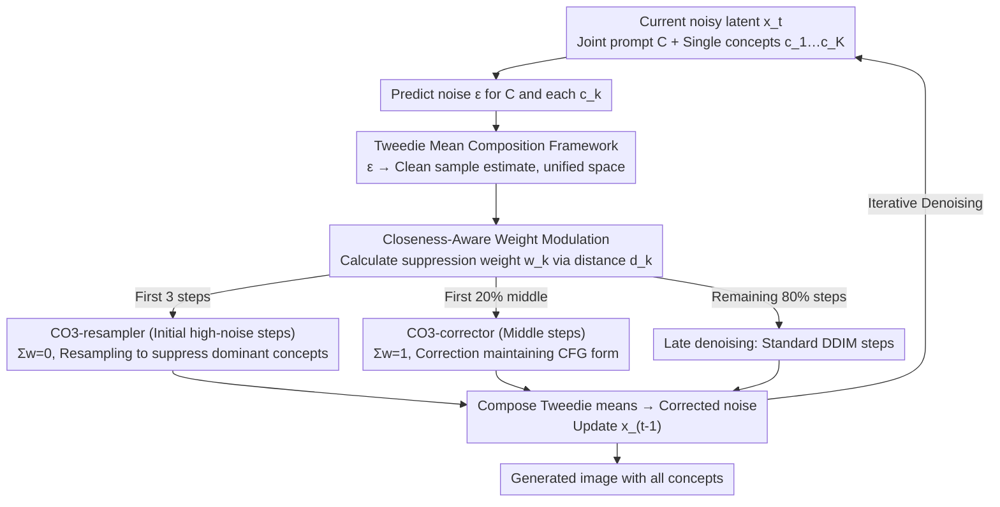

# Steer Away From Mode Collisions: Improving Composition In Diffusion Models

**Conference**: ICLR 2026  
**arXiv**: [2509.25940](https://arxiv.org/abs/2509.25940)  
**Code**: [https://github.com/debottam-dutta7/co3](https://github.com/debottam-dutta7/co3)  
**Area**: Diffusion Models / Compositional Generation  
**Keywords**: Compositional Generation, Mode Collision, Tweedie Mean Composition, Gradient-free correction, Plug-and-play  

## TL;DR

To address concept omission or collision in multi-concept prompts for diffusion models, this paper proposes the "Mode Collision" hypothesis (mode overlap between joint and single-concept distributions). It introduces CO3 (Concept Contrasting Corrector), which steers generation away from degenerate modes by composing a corrected distribution $\tilde{p}(x|C) \propto p(x|C) / \prod_i p(x|c_i)$ in the Tweedie mean space, achieving plug-and-play, gradient-free, and model-agnostic improvements in compositional generation.

## Background & Motivation

**Background**: Diffusion models have achieved significant breakthroughs in text-to-image generation. However, even for simple multi-concept prompts (e.g., "a cat and a dog"), issues such as missing concepts, ambiguity, or unnatural fusions frequently occur.

**Limitations of Prior Work**:
   - Optimization-based correction methods (Attend-Excite, SynGen, ToMe) require gradient computation with respect to the model, making them model-dependent.
   - Composable Diffusion methods are model-agnostic but perform poorly because linear score composition at $t>0$ does not correspond to a valid forward distribution.
   - Both approaches have strengths and weaknesses but lack a unified framework.

**Key Challenge**: The joint distribution $p(x|C)$ of multi-concept prompts contains "problematic modes"—modes that highly overlap with single-concept distributions $p(x|c_i)$, causing the generation to favor a single dominant concept.

**Goal**: (i) Theoretically analyze and unify existing methods (correction vs. composable diffusion); (ii) Design a training-free, gradient-free, and model-agnostic sampling correction strategy to improve multi-concept composition.

**Key Insight**: The paper proposes the "Mode Collision" hypothesis—when certain modes of $p(x|C)$ overlap with $p(x|c_i)$, sampling tends toward that single concept. The solution is to design a correction distribution that suppresses these overlapping regions.

**Core Idea**: Use $\tilde{p}(x|C) \propto p(x|C) / \prod_i p(x|c_i)$ to steer away from single-concept dominated degenerate modes, and prove that Tweedie mean composition serves as a unified framework.

## Method

### Overall Architecture

CO3 (Concept Contrasting Corrector) solves the issue where one concept dominates others in multi-concept prompts like "a cat and a dog." Without modifying the model or calculating gradients, it inserts a corrector into the denoising loop of standard DDIM sampling. At each step, it performs noise prediction for the joint prompt $C$ and each single concept $c_1,\dots,c_K$, mapping them all to a unified **Tweedie mean space**. During composition, negative weights for each concept are dynamically calculated based on their "closeness" to the current sample. Two composition rules are switched based on the denoising stage: **CO3-resampler** (weight sum = 0) is used in early high-noise steps to suppress dominant concepts, while **CO3-corrector** (weight sum = 1) is used in middle steps for fine-grained correction. The process reverts to standard DDIM in late denoising stages. Correction occurs only within the first 20% of denoising steps, resulting in an image where all concepts are present.

### Key Designs

**1. Tweedie Mean Composition Framework: Moving distribution composition from score space to Tweedie mean space to unify two categories of methods**

Composable diffusion performs linear combinations directly in the score (noise prediction) space. The problem is that at $t>0$, such combinations do not correspond to any valid forward distribution, pushing samples out-of-distribution and creating artifacts. CO3 composes in the Tweedie mean space: each conditional noise prediction is first mapped to an estimate of the clean sample $\hat{x}_{\text{tweedie}}[\epsilon_t^{\lambda,c}] = x_t - \sigma_t \epsilon_t^{\lambda,c}$, then aggregated by weights:

$$\tilde{x}_{\text{tweedie}} = w_0 \hat{x}_{\text{tweedie}}[\epsilon_t^{\lambda,C}] + \sum_{k=1}^K w_k \hat{x}_{\text{tweedie}}[\epsilon_t^{\lambda,c_k}].$$

The value of this framework lies in the weight constraints revealed by Proposition 1: when $\sum_k w_k = 1$, the composed Tweedie mean remains a valid Tweedie mean, corresponding to the CO3-corrector; when $\sum_k w_k = 0$, it degrades into weighted noise, corresponding to the CO3-resampler (the latter only has strict theoretical guarantees at $t=T$). This constraint unifies existing correction methods and composable diffusion into a single map—the two denoising stages are simply instances of this framework under different weight sums.

**2. Closeness-Aware Concept Weight Modulation: Supressing concepts more heavily as they get closer to the current sample**

The negative weight for each single concept should not be fixed but should depend on how "dominant" it currently is. CO3 calculates the closeness (distance) $d_k$ between the joint noise prediction $\epsilon^C$ and each concept noise $\epsilon^{c_k}$. It uses an exponential kernel $a_k = \exp(-\beta d_k)$ to convert distance into affinity—shorter distance leads to higher affinity. After normalization, the negative of this value is used as the suppression weight:

$$w_k = -\,a_k \Big/ \sum_j a_j.$$

Consequently, the concept closest to the current generation direction—the one most likely to "swallow" others—is suppressed most heavily, achieving a dynamic balance during sampling. These weights are fed into the composition rules of the following stages.

**3. CO3-resampler: Resampling initial noise in early high-noise steps to suppress dominant concepts**

In the earliest denoising steps, noise dominates. At this point, replacing the current $x_t$ with a weighted combination of concept noises (where the weight sum is 0) is equivalent to resampling from a distribution where concepts have been suppressed. Experiments show that resampling provides more significant gains as $t$ increases, so it specifically handles the start of generation to correct the tendency of one concept to dominate another right from the beginning.

**4. CO3-corrector: Correcting Tweedie means in middle steps while maintaining CFG form**

After the initial stage, it switches to a correction where the weight sum is 1: the joint prompt is given a positive weight $w_0 > 0$, and individual concepts are given the negative suppression weights $w_1, \dots, w_K < 0$ calculated previously. Crucially, the resulting noise prediction can still be written in the standard CFG form:

$$\tilde{\epsilon}_t^{\tilde{\lambda},C} = \epsilon_t^\phi + \lambda\Big(\sum_k w_k \epsilon_t^{c_k} - \epsilon_t^\phi\Big),$$

meaning the ratio between the unconditional and conditional terms is preserved. Composable diffusion uses linear combinations with arbitrary $\lambda_i$, which disrupts this ratio and pushes samples out-of-distribution. CO3-corrector, by locking the CFG structure with $\sum w_k = 1$, achieves concept suppression without producing OOD artifacts.

### Loss & Training

This is a training-free method. Based on SDXL with 50-step DDIM sampling, guidance scale $\lambda=5.0$. Correction is applied in the first 20% of steps, with the first 3 steps using the resampler and subsequent steps using the corrector. $\beta=0.8$.

## Key Experimental Results

### Main Results (Two-concept prompts, Attend-Excite benchmark)

| Method | Training-free | Gradient-free | Model-Agnostic | ImageReward (A-A) | ImageReward (A-O) | ImageReward (O-O) |
|------|:---:|:---:|:---:|:---:|:---:|:---:|
| SDXL | ✓ | ✓ | - | 0.782 | 1.547 | 0.679 |
| Attend-Excite | ✓ | ✗ | ✗ | 0.824 | 1.238 | 0.874 |
| InitNO | ✓ | ✗ | ✓ | 1.008 | 1.393 | 1.138 |
| Tweediemix | ✓ | ✓ | ✓ | 1.002 | 1.313 | 0.796 |
| **CO3 (Ours)** | ✓ | ✓ | ✓ | **1.234** | **1.674** | **1.016** |

### Ablation Study (Progressive addition of components)

| Configuration | ImageReward Avg | BLIP-VQA Avg |
|------|:---:|:---:|
| SDXL base | 0.843 | — |
| + Resampling | 0.944 | — |
| + Corrector | 0.946 | — |
| + Weight modulation | **1.012** | — |

### Key Findings

- CO3 is the only high-performance method that is simultaneously training-free, gradient-free, and model-agnostic, yet it matches or exceeds methods requiring gradients across all metrics.
- The weight sum constraint of 1 is critical—it preserves the CFG form, whereas arbitrary weights in composable diffusion tend to produce out-of-distribution samples.
- Resampler and Corrector play complementary roles: the resampler is effective in high-noise stages, while the corrector takes effect in the middle stages.
- Weight modulation contributes significantly (Avg ImageReward from 0.946 to 1.012), indicating that adaptive suppression is more effective than fixed weights.
- It outperforms specialized designs (e.g., R2F) on complex prompts (T2ICompBench) and rare concepts (RareBench).

## Highlights & Insights

- **Strong Theoretical Unification**: Proposition 1 unifies existing correction methods and composable diffusion under the Tweedie mean composition framework, revealing the key role of weight constraints ($\sum w_k = 1$ for preserving CFG form vs. $\sum w_k = 0$ for resampling). This unified perspective is highly valuable.
- **Mode Collision Hypothesis**: Using $p(x|C) / \prod_i p(x|c_i)$ to suppress degenerate modes overlapping with single concepts provides clear intuition and is supported by experiments.
- **Fully Plug-and-Play**: It requires no model modification, no gradients, and no additional training, making it directly applicable to any diffusion model.

## Limitations & Future Work

- Each denoising step requires running noise prediction for $K+1$ conditions, making inference overhead scale linearly with the number of concepts.
- While claimed to be model-agnostic, it was only validated on SDXL and not tested on DiT architectures (e.g., Flux, SD3).
- Theoretically, CO3-resampler is not strictly valid for $t < T$; although effective until $t \approx 0.9T$ in experiments, it lacks a rigorous guarantee.
- The $\beta$ parameter in weight modulation and the ratio of correction steps require manual tuning.
- Concept decomposition relies on prompt parsing; the quality of decomposition for complex natural language prompts is not discussed.

## Related Work & Insights

- **vs. Attend-Excite**: AE binds attributes through attention map optimization, which requires gradients and is architecture-dependent; CO3 solves the problem at the mode level with a higher theoretical perspective.
- **vs. Composable Diffusion**: Both are model-agnostic score compositions, but composable diffusion uses linear combinations with arbitrary weights. CO3 proves that weight constraints are key.
- **vs. Tweediemix**: Both operate in Tweedie space, but Tweediemix requires a LoRA fine-tuning stage, whereas CO3 is a pure sampling-time correction.
- The Mode Collision hypothesis may inspire a deeper understanding of the training dynamics of diffusion models.

## Rating

- Novelty: ⭐⭐⭐⭐ Mode Collision hypothesis is novel; the unified theory of Tweedie mean composition is insightful.
- Experimental Thoroughness: ⭐⭐⭐⭐ Multiple benchmarks (simple/complex/rare prompts), complete ablation, and human evaluation.
- Writing Quality: ⭐⭐⭐⭐ Theoretical derivations are clear, though notation is dense, posing a higher reading barrier.
- Value: ⭐⭐⭐⭐ Plug-and-play improvement for compositional generation has high practical value.

<!-- RELATED:START -->

- **Attend-and-Excite**: Attention-based correction (CVPR 2023)
- **Composable Diffusion**: Score-based composition (ICLR 2023)
- **Tweedie's Formula**: The mathematical basis for denoising (Original theory)

<!-- RELATED:END -->

## Related Papers

- [\[ICLR 2026\] Compose Your Policies! Improving Diffusion-based or Flow-based Robot Policies via Test-time Distribution-level Composition](compose_your_policies_improving_diffusion-based_or_flow-based_robot_policies_via.md)
- [\[ICLR 2026\] Constantly Improving Image Models Need Constantly Improving Benchmarks](constantly_improving_image_models_need_constantly_improving_benchmarks.md)
- [\[ICLR 2026\] Improving Diffusion Models for Class-imbalanced Training Data via Capacity Manipulation](improving_diffusion_models_for_class-imbalanced_training_data_via_capacity_manip.md)
- [\[ICLR 2026\] AlphaFlow: Understanding and Improving MeanFlow Models](alphaflow_understanding_and_improving_meanflow_models.md)
- [\[ICLR 2026\] GAS: Improving Discretization of Diffusion ODEs via Generalized Adversarial Solver](gas_improving_discretization_of_diffusion_odes_via_generalized_adversarial_solve.md)

<!-- RELATED:END -->
