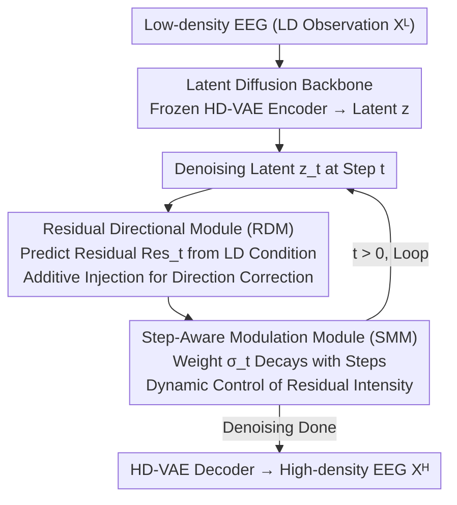

# Step-Aware Residual-Guided Diffusion for EEG Spatial Super-Resolution

**Conference**: ICLR 2026  
**arXiv**: [2510.19166](https://arxiv.org/abs/2510.19166)  
**Code**: [GitHub](https://github.com/DhrLhj/ICLR2026SRGDiff)  
**Area**: Diffusion Models / EEG Signals / Super-Resolution  
**Keywords**: EEG Super-resolution, Residual-guided Diffusion, Step-aware Modulation, Brain-computer Interface, Conditional Generation

## TL;DR

Ours proposes SRGDiff, a step-aware residual-guided diffusion model that reformulates EEG spatial super-resolution as a dynamic conditional generation task, achieving high-fidelity reconstruction through step-wise residual direction correction and step-dependent affine modulation.

## Background & Motivation

EEG (Electroencephalogram) is a non-invasive brain activity monitoring technology widely used in brain-computer interfaces, epilepsy diagnosis, and emotion recognition. However:

**Spatial Resolution Constraints**: High-density (HD) systems are costly and inconvenient to wear; low-density (LD) systems (8-16 electrodes) are practical but suffer from severe sampling bias.

**Limitations of Prior Work**:
- Direct feature mapping methods (CNN/Transformer) oversimplify non-linear dependencies, leading to smoothed results.
- GAN-based methods require massive data and computation.
- Static conditioning strategies in diffusion models lead to a trade-off between distribution shift and distortion.

**Key Challenge**: The contradiction between fidelity (generating HD-like content) and consistency (consistency with LD observations).

## Method

### Overall Architecture

SRGDiff formulates EEG spatial super-resolution (recovering high-density $X^H\in\mathbb{R}^{C_H\times Length}$ from low-density $X^L\in\mathbb{R}^{C_L\times Length}$, where $C_H>C_L$) within a latent diffusion space. First, a VAE pre-trained on HD EEG compresses signals into a latent space. Then, a residual-guided denoising network restores HD latents conditioned on LD observations. The core is not treating LD as a static condition but predicting a "correction direction" residual at each denoising step and dynamically controlling the residual intensity via a time-step-dependent modulation factor. This achieves a balance between fidelity and consistency. The workflow consists of "Frozen VAE Encoding → Residual-Guided Step-wise Denoising (RDM for direction, SMM for intensity, iterative loop) → VAE Decoding".

### Key Designs

**1. Latent Diffusion Backbone: Moving Super-resolution to Compressed Latent Space**

Original EEG waveforms are long and noisy; direct diffusion in the signal domain is slow and unstable. SRGDiff trains a VAE encoder-decoder on HD EEG using a loss function comprising point-wise reconstruction, STFT spectral fidelity, and KL regularization. The spectral term preserves rhythmic structures in the frequency domain. After VAE convergence, parameters are frozen, and diffusion is performed on the latent $z$, which provides a dimensionally compressed and spectrum-friendly representation space.

**2. Residual Directional Module (RDM): Step-wise Directional Correction**

Standard conditional diffusion treats LD information as background, leaving the denoising direction to the network's learning, which often deviates from true HD content. RDM explicitly learns "how far the current noisy latent is from the clean latent." It defines a residual label $\delta z_t = z_0 - z_t$ and uses a lightweight convolutional predictor $R_\phi$ to predict $Res_t = R_\phi(\tau(t), c)$ from the LD condition $c$ and step embedding $\tau(t)$, supervised by $\mathcal{L}_{res}=\sum_t\|Res_t-\delta z_t\|_2^2$. The predicted residual is injected via $\hat{z}_t^{RDM}=\text{LayerNorm}(\hat{z}_t)+Res_t$, ensuring each step is "pulled" toward the HD ground truth.

**3. Step-Aware Modulation Module (SMM): Dynamic Scaling of Residual Influence**

Residual correction should be strong in early diffusion stages (high noise, undefined structure) to establish the global morphology and weaker in later stages (detail refinement) to allow point-wise denoising. SMM fuses LD features $h_t$ and step embeddings $e_t$ using a linearly decaying weight $\sigma_t$: $\widetilde{h}_t=\sigma_t h_t+(1-\sigma_t)e_t$. This fused representation predicts channel-wise affine scaling $\gamma_t$ and bias $\beta_t$ to modulate the RDM output: $\hat{z}_t^{SMM}=\gamma_t\odot\hat{z}_t^{RDM}+\beta_t^c$. As $\sigma_t$ decays, the influence of the residual condition shifts from strong to weak, aligning with the "coarse-to-fine" denoising pace.

### Loss & Training

Training occurs in two stages: Stage 1 involves pre-training and freezing the HD-VAE; Stage 2 trains the residual-guided diffusion in the latent space. The total loss combines the standard denoising term, the residual supervision term, and an SMM regularization term:

$$\mathcal{L}_{\text{Stage 2}} = \mathbb{E}[\|\epsilon - \epsilon_\theta(z_t, t, c)\|_2^2] + \lambda_{res}\sum_t\|R_\varphi(c,t) - (z_0 - z_t)\|_2^2 + \lambda_{SMM}(\|\gamma_t - 1\|_2^2 + \|\beta_t\|_2^2)$$

The residual term aligns RDM prediction directions, while SMM regularization pulls $\gamma_t$ toward 1 and $\beta_t$ toward 0 to prevent excessive modulation from destabilizing the diffusion process.

## Key Experimental Results

### Datasets
- **SEED**: 62 channels, 1000Hz, Emotion Recognition (Pos/Neu/Neg)
- **SEED-IV**: 62 channels, 4 emotions
- **Localize-MI**: 256 channels, 8000Hz, Epilepsy stimulation

### Main Results (Localize-MI)

| Method | 2× SNR | 4× SNR | 8× SNR | 16× SNR |
|------|--------|--------|--------|---------|
| SaSDim | 5.74 | 4.38 | 3.55 | 2.77 |
| SADI | 5.75 | 4.37 | 3.55 | 2.89 |
| RDPI | 5.73 | — | — | — |
| ESTformer | Baseline | Baseline | Baseline | Baseline |
| STAD | Baseline+ | Baseline+ | Baseline+ | Baseline+ |
| **SRGDiff** | **Best** | **Best** | **Best** | **Best** |

### Key Findings
- In the challenging 8× setting, relative SNR Gain is approximately 75%.
- Topographic visualizations and EEG-FID metrics show significant improvement.
- Effectively mitigates spatial-spectral shifts between low-density and high-density recordings.

### Evaluation Protocol
1. **Signal Level**: SNR, NMSE, PCC (temporal consistency, spectral fidelity, spatial topology).
2. **Feature Level**: EEG-FID (representation quality).
3. **Downstream Level**: Classification accuracy.

### Ablation Study

| Component | SNR Change |
|------|--------|
| w/o RDM | Significant Decrease |
| w/o SMM | Moderate Decrease |
| Static Condition (Concat/Cross-Attn) | Lower than Dynamic |
| Full SRGDiff | Best |

## Highlights & Insights

1. **Dynamic Conditional Generation Paradigm**: Couples the LD forward noise trajectory with the HD reverse denoising trajectory.
2. **Residual Directional Guidance**: Unlike static priors, it provides directional correction at every step.
3. **Comprehensive Three-Level Evaluation**: Goes beyond point-wise error to cover signals, features, and downstream tasks.
4. **Robustness**: Demonstrates stability across datasets and scaling factors.

## Limitations & Future Work

1. Complexity: Requires pre-trained VAE and two-stage training.
2. Spatial Correspondence: Relies on mapping between LD and HD channel locations.
3. Speed: Denoising iterations limit real-time BCI application.
4. Scale: Accuracy at extreme ratios (e.g., 16×) still has room for improvement.

## Related Work & Insights

- **EEG Super-resolution**: EEGSR-GAN, ESTformer, STAD, DDPM-EEG.
- **Time-series Diffusion**: Diffusion-TS, SaSDim, SADI.
- **Residual Diffusion**: Residual synthesis in PET-MRI, event-driven video residual reconstruction.

## Rating

- **Novelty**: ⭐⭐⭐⭐ — Residual guidance + step-aware modulation is novel for EEG.
- **Value**: ⭐⭐⭐⭐ — Significant utility for low-cost BCI devices.
- **Experimental Thoroughness**: ⭐⭐⭐⭐⭐ — Comprehensive three-level evaluation.
- **Writing Quality**: ⭐⭐⭐⭐ — Clear methodology and thorough ablation.

<!-- RELATED:START -->

## Related Papers

- [\[CVPR 2026\] EMR-Diff: Edge-aware Multimodal Residual Diffusion Model for Hyperspectral Image Super-resolution](../../CVPR2026/image_generation/emr-diff_edge-aware_multimodal_residual_diffusion_model_for_hyperspectral_image_.md)
- [\[CVPR 2026\] Physics-Consistent Diffusion for Efficient Fluid Super-Resolution via Multiscale Residual Correction](../../CVPR2026/image_generation/physics-consistent_diffusion_for_efficient_fluid_super-resolution_via_multiscale.md)
- [\[AAAI 2026\] Mixture of Ranks with Degradation-Aware Routing for One-Step Real-World Image Super-Resolution](../../AAAI2026/image_generation/mixture_of_ranks_with_degradation-aware_routing_for_one-step_real-world_image_su.md)
- [\[AAAI 2026\] Realism Control One-step Diffusion for Real-World Image Super-Resolution](../../AAAI2026/image_generation/realism_control_one-step_diffusion_for_real-world_image_super-resolution.md)
- [\[CVPR 2026\] Bridging Fidelity-Reality with Controllable One-Step Diffusion for Image Super-Resolution](../../CVPR2026/image_generation/bridging_fidelity-reality_with_controllable_one-step_diffusion_for_image_super-r.md)

<!-- RELATED:END -->
