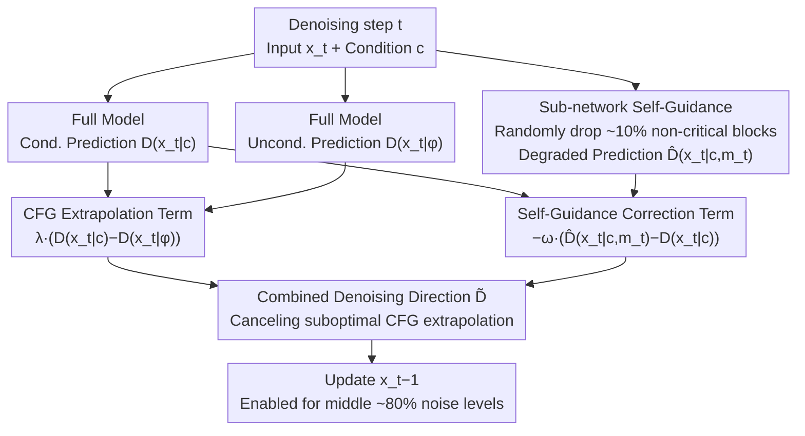

# Stochastic Self-Guidance for Training-Free Enhancement of Diffusion Models

**Conference**: ICLR2026  
**arXiv**: [2508.12880](https://arxiv.org/abs/2508.12880)  
**Code**: [Project Page](https://s2guidance.github.io/)  
**Area**: Image Generation  
**Keywords**: Diffusion Models, Classifier-Free Guidance, Sub-networks, Stochastic block-dropping, Self-guidance, Text-to-Image, Text-to-Video

## TL;DR

This paper proposes S²-Guidance, which utilizes **randomly dropped transformer block sub-networks** as weak models for self-guidance during the denoising process. This corrects suboptimal CFG predictions without additional training, consistently outperforming CFG and other advanced guidance strategies in text-to-image and text-to-video tasks.

## Background & Motivation

1. **CFG is the cornerstone of conditional generation**: Classifier-Free Guidance enhances generation quality by extrapolating conditional and unconditional predictions, becoming the standard in diffusion models.
2. **Inherent flaws in CFG**: Empirical analysis shows that CFG produces results biased away from the true distribution, leading to semantic inconsistencies and loss of detail.
3. **Promising direction of weak model guidance**: Works like Autoguidance found that guiding with a degraded version of the model can improve CFG, but this requires training an extra weak model, which is infeasible for large-scale pre-trained models.
4. **Poor generalization of manual architectural modifications**: Methods like SEG simulate weak models by modifying attention regions but rely on empirical hyperparameter tuning and task-specific designs.
5. **Significant redundancy in Transformer blocks**: In mainstream architectures like DiT, outputs from different blocks are highly similar, suggesting that sub-networks can serve as substitutes for the full model for functional prediction.
6. **Need for a universal training-free solution**: Existing methods either require training weak models or depend on task-specific modifications, lacking a concise and general framework.

## Method

### Overall Architecture

S²-Guidance aims to solve the following: While Classifier-Free Guidance (CFG) pulls generation toward the conditional distribution, it accompanies mode shift and collapse, causing results to deviate from the true distribution and lose details. The core idea is to avoid external weak models; instead, during each denoising step, it **randomly drops a small subset of transformer blocks** from the current DiT to obtain a "degraded" sub-network prediction. The difference between the full model and this sub-network prediction serves as an additional **self-guidance correction term** to counteract suboptimal CFG extrapolation. The entire process is training-free: each step calculates the unconditional, conditional, and sub-network predictions in parallel. The first two form the regular CFG term, while the difference between the latter two forms the self-guidance correction. Compared to standard CFG, it only requires one additional masked forward pass.

### Key Designs

**1. Sub-network Self-Guidance: Using the model's own degraded version as a weak model**

While CFG shifts generation toward conditional distributions, it introduces mode shift and collapse—evidenced by samples scattering to non-target regions in Gaussian mixture toy examples and confirmed by t-SNE on CIFAR-10. Methods like Autoguidance rely on training degraded weak models for correction, which is impractical for large models. This work exploits the redundancy where different blocks in DiT have highly similar outputs: applying a binary mask $\mathbf{m}$ to randomly drop blocks yields a sub-network prediction $\hat{D}_\theta(x_t|c,\mathbf{m})$. The deviation between this and the full prediction $D_\theta(x_t|c)$ characterizes the "ability lost" by the dropped blocks; subtracting this deviation pushes results away from suboptimal regions. The naive form averages $N$ masks per step to stabilize the signal:

$$\tilde{D}_\theta^\lambda(x_t|c) = D_\theta(x_t|\phi) + \lambda(D_\theta(x_t|c) - D_\theta(x_t|\phi)) - \frac{\omega}{N}\sum_{i=1}^N(\hat{D}_\theta(x_t|c, \mathbf{m}_i) - D_\theta(x_t|c))$$

where $\lambda$ is the CFG scale and $\omega$ (S²Scale) controls self-guidance strength.

**2. Single Random Dropping: Reducing N forward passes to one**

The naive form is computationally expensive as it requires $N$ sub-network passes per step. The authors discovered that within a reasonable drop range, any random selection of dropped blocks consistently pulls the model toward the ideal distribution. They simplified the multi-mask sampling to a **single** random block-dropping per step:

$$\tilde{D}_\theta^\lambda(x_t|c) = D_\theta(x_t|\phi) + \lambda(D_\theta(x_t|c) - D_\theta(x_t|\phi)) - \omega(\hat{D}_\theta(x_t|c, \mathbf{m}_t) - D_\theta(x_t|c))$$

Since the mask $\mathbf{m}_t$ varies across timesteps, the cumulative effect across the denoising process retains the diversity of the naive form while requiring only one extra forward pass per step, with no increase in peak VRAM (as the sub-network and full model are executed sequentially).

**3. Engineering constraints for block-dropping: Where, how much, and when**

Randomness must be constrained for stability. First, **protect critical blocks**: exclude structurally essential layers like the first block and only drop from non-critical layers to avoid destroying basic generation capabilities. Second, a **drop ratio of ~10%** is used, as experiments showed this performs best—too much causes excessive degradation, while too little weakens the guidance signal. Finally, the **application interval** is restricted to approximately the middle 80% of noise levels during denoising, skipping extreme early and late timesteps. The combination of these constraints and the "independent mask per step" dynamic diversity makes the method more robust than a static weak model with fixed dropped blocks.

## Key Experimental Results

### Table 1: Text-to-Image Comparison on HPSv2.1 and T2I-CompBench

| Model | Method | HPSv2.1 Avg↑ | Color↑ | Shape↑ | Texture↑ | Qalign(HPSv2.1)↑ |
|------|------|:---:|:---:|:---:|:---:|:---:|
| SD3 | CFG | 30.48 | 53.61 | 51.20 | 52.45 | 4.66 |
| SD3 | CFG-Zero | 30.78 | 52.70 | 52.84 | 53.37 | 4.66 |
| SD3 | SEG | 30.39 | 58.20 | 57.68 | 57.17 | 4.33 |
| SD3 | **S²-Guidance** | **31.09** | **59.63** | **58.71** | 56.77 | **4.65** |
| SD3.5 | CFG | 30.82 | 51.29 | 47.71 | 47.39 | 4.63 |
| SD3.5 | **S²-Guidance** | **31.56** | 57.57 | 51.23 | 50.13 | **4.70** |

The method achieves the best scores across all dimensions of HPSv2.1 and significantly leads in the Color and Shape categories of T2I-CompBench.

### Table 2: ImageNet 256×256 Class-Conditional Generation

| Method | IS↑ | FID↓ |
|------|:---:|:---:|
| Baseline | 125.13 | 9.41 |
| CFG | 258.09 | 2.15 |
| CFG-Zero | 258.87 | 2.10 |
| **S²-Guidance** | **259.12** | **2.03** |

### Table 3: VBench Text-to-Video Comparison (Wan Model)

| Model | Method | Total↑ | Quality↑ | Semantic↑ |
|------|------|:---:|:---:|:---:|
| Wan-1.3B | CFG | 80.29 | 84.32 | 64.16 |
| Wan-1.3B | CFG-Zero | 80.71 | 84.51 | 65.53 |
| Wan-1.3B | **S²-Guidance** | **80.93** | **84.74** | **65.70** |
| Wan-14B | CFG | 82.65 | 84.88 | 73.76 |
| Wan-14B | **S²-Guidance** | **82.84** | **84.89** | **74.65** |

Achieved the highest total scores on both 1.3B and 14B models, validating the generalizability of the method.

### Computational Overhead

- Runtime: Increases by ~40% compared to CFG (29.2s → 40.2s).
- Peak VRAM: Unchanged (sequential execution).
- Efficiency: S²-Guidance at 20 steps outperforms CFG at 60 steps in HPS Score, offering a superior performance-efficiency frontier.

## Highlights & Insights

- **Training-free and Plug-and-play**: No need to train external weak models; it leverages internal sub-network redundancy and adapts to any DiT architecture.
- **Clear Theoretical Intuition**: Starts from closed-form analysis of Gaussian mixtures and transitions to real data with a complete logical chain.
- **Extremely Simple and Efficient**: Only one extra forward pass (dropping ~10% blocks) per step with no extra memory usage.
- **Multi-modal Task Coverage**: Consistent improvements across class-conditional image generation, T2I, and T2V tasks, verified on models like SD3, SD3.5, and Wan.
- **Dynamic Diversity Superiority**: The time-varying diversity of random dropping naturally avoids the limitations of using a fixed weak model throughout the entire denoising process.

## Limitations & Future Work

- **40% Computational Overhead**: While VRAM is constant, the extra forward pass per step remains a cost for large-scale deployment.
- **Manual Hyperparameter $\omega$**: The optimal S²Scale value may vary by model and task; excessive $\omega$ can lead to over-correction.
- **Heuristic Block-dropping Design**: Identifying non-critical blocks and the drop ratio still relies on empirical analysis, lacking an automated selection mechanism.
- **Applicability to non-DiT Architectures**: Primarily tested on Transformer-based diffusion models; applicability to UNet remains to be verified.
- **Diminishing Returns on Scale**: Improvements on Wan-14B are smaller than on 1.3B, suggesting gains converge as models approach SOTA.

## Related Work & Insights

| Method | Training Required? | Generality | Core Mechanism | Comparison with S²-Guidance |
|------|:---:|--------|---------|------------------|
| CFG | × | High | Cond-Uncond Extrapolation | Suffers from mode shift and collapse |
| Autoguidance | ✓ | Low | Trained degraded weak model | Requires extra training; hard to select weak model |
| SEG | × | Medium | Modify attention regions | Task-specific, sensitive to hyperparams, drops aesthetic scores |
| CFG++ | × | High | Manifold constraints | Performance on some metrics is lower than original CFG |
| CFG-Zero | × | High | Zero-init correction | Close performance but doesn't explore weak model guidance |
| **S²-Guidance** | **×** | **High** | **Random block-drop self-guidance** | **Universal, training-free, best results** |

## Rating

- Novelty: ⭐⭐⭐⭐ — The insight of using random block-dropping as a weak model is novel and intuitive.
- Experimental Thoroughness: ⭐⭐⭐⭐⭐ — Comprehensive coverage from toy examples to ImageNet, T2I, and T2V with sufficient ablation.
- Writing Quality: ⭐⭐⭐⭐ — Logical progression from toy to real-world scenarios with intuitive illustrations.
- Value: ⭐⭐⭐⭐ — A practical, plug-and-play universal enhancement for diffusion models.

<!-- RELATED:START -->

## Related Papers

- [\[AAAI 2026\] Self-NPO: Data-Free Diffusion Model Enhancement via Truncated Diffusion Fine-Tuning](../../AAAI2026/image_generation/self-npo_data-free_diffusion_model_enhancement_via_truncated_diffusion_fine-tuni.md)
- [\[ICLR 2026\] Stage-wise Dynamics of Classifier-Free Guidance in Diffusion Models](stage-wise_dynamics_of_classifier-free_guidance_in_diffusion_models.md)
- [\[ICLR 2026\] Generative Modeling from Black-Box Corruptions via Self-Consistent Stochastic Interpolants](generative_modeling_from_black-box_corruptions_via_self-consistent_stochastic_in.md)
- [\[ICLR 2026\] Overshoot and Shrinkage in Classifier-Free Guidance: From Theory to Practice](overshoot_and_shrinkage_in_classifier-free_guidance_from_theory_to_practice.md)
- [\[ICLR 2026\] Dynamic Classifier-Free Diffusion Guidance via Online Feedback](dynamic_classifier-free_diffusion_guidance_via_online_feedback.md)

<!-- RELATED:END -->
