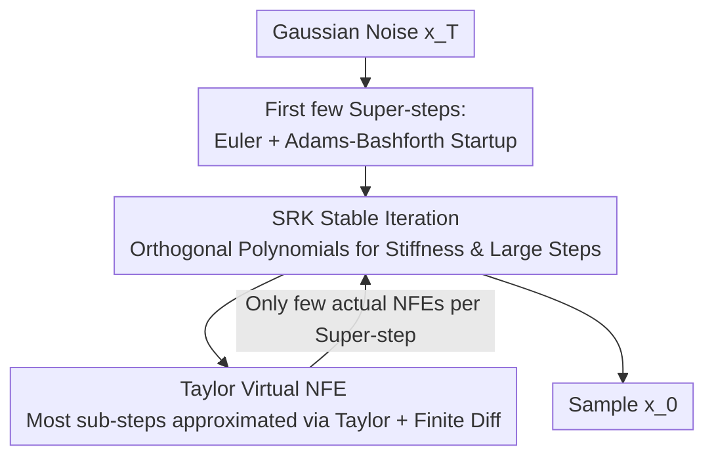

# STORK: Accelerating Diffusion and Flow Matching Sampling by Simultaneously Solving Stiffness and Structural Dependency

**Conference**: ICLR 2026  
**OpenReview**: [https://openreview.net/forum?id=CeOIVXMl4r](https://openreview.net/forum?id=CeOIVXMl4r)  
**Code**: https://github.com/ZT220501/STORK  
**Area**: Diffusion Models / Fast Sampling / Numerical Solvers  
**Keywords**: Diffusion Models, Flow Matching, Training-free Sampling, Stabilized Runge-Kutta, Stiff ODE

## TL;DR
STORK introduces Stabilized Runge-Kutta (SRK) methods from numerical analysis—designed specifically for "stiff ODEs"—into diffusion and flow matching sampling. By utilizing Taylor expansion to compress the high Number of Function Evaluations (NFE) typical of SRK into "virtual NFEs," it yields a training-free solver that handles stiffness without structural dependence. At ultra-low budgets of 7–20 NFE, it consistently outperforms DPM-Solver++ and UniPC in FID.

## Background & Motivation

**Background**: Sampling in Diffusion Models (DM) and Flow Matching models is essentially solving an ODE/SDE in reverse. However, this often requires dozens or hundreds of neural network forward passes (NFE), making inference expensive. Training-free fast samplers (which change only the numerical solver without modifying the model) have become a research focus, represented by DPM-Solver and DEIS, which exploit the semi-linear structure of noise-diffusion ODEs, and the predictor-corrector-based UniPC.

**Limitations of Prior Work**: The authors point out that existing training-free methods cannot solve two key challenges **simultaneously**. The first is ODE **stiffness**—where the velocity field is not "straight" and the slope changes rapidly in localized regions; explicit methods with large step sizes suffer from numerical explosion or inaccuracy, corresponding to the "highly curved trajectories" often mentioned in fast sampling research. The second is **structure-dependence**—exponential integrator methods like DPM-Solver are specifically designed for the semi-linear structure $\frac{dx}{dt}=Lx+N(x)$ (where $L$ is a linear operator and $N$ is a nonlinear term). However, the flow matching ODE $\frac{dx}{dt}=v(x(t),t)$ lacks this semi-linear structure, forcing these methods to use "data prediction" steps that introduce additional errors.

**Key Challenge**: The primary tool for addressing stiffness (exponential integrators) is structure-dependent. These two properties are coupled; there is currently no solver in the existing toolbox that is both stiff-handling and agnostic to the ODE form.

**Goal**: To find a training-free sampling method that is both a **stiff solver** and a **structure-independent solver**, allowing it to be applied directly and universally to both noise diffusion and flow matching models.

**Key Insight**: The authors recur to **Stabilized Runge-Kutta (SRK) methods** from classical numerical analysis. SRK methods use orthogonal polynomials (such as Chebyshev or Gegenbauer) to construct stability polynomials specifically for stiff ODEs. This allows the step size to be scaled up to $h \sim O(s^2)$ (where $s$ is the number of sub-steps) while maintaining stability, without assuming any special structure for the ODE. In other words, SRK naturally occupies the quadrant of being both "stiff" and "structure-independent" (as shown in Figure 4).

**Core Idea**: Introduce SRK into sampling to address the first two issues, then utilize **Taylor expansion in the time direction + finite differences** to replace most of the $s$ actual NFEs required per super-step with "virtual NFEs" that cost zero forward passes. This retains SRK's stability while keeping inference costs comparable to SOTA—this is STORK.

## Method

### Overall Architecture
STORK defines one sampling progression from $x(t_0)$ to $x(t_0-h)$ as a **super-step**, which is further decomposed into $s$ **sub-steps**. Directly applying an $s$-stage SRK would require $s$ NFEs ($s$ is typically 10–50), making the cost prohibitively high (Table 1 shows raw SRK4 results in FID as high as 443 at low NFE). The solution in STORK is to perform actual NFEs at only a few points within a super-step, while approximating the velocity $v(Y_j,t_j)$ at other sub-steps using **Taylor expansion as a function that varies only with time $t$**. Derivatives are estimated from historical velocities via forward finite differences. These approximated points are called **virtual NFEs** and do not consume actual forward passes. The pipeline is isomorphic for noise prediction $\epsilon_\theta$ and flow matching velocity $v$—swapping $v$ for $\epsilon_\theta$ maintains the structure-independence.

### Key Designs

**1. SRK Stable Iteration: Using Orthogonal Polynomials for Stiffness and Structure-Independence**

This step addresses the "stiffness + structure-dependence coupling" key challenge. STORK uses a fourth-order SRK (specifically Abdulle’s orthogonal Chebyshev Runge-Kutta, primarily STORK-4, as it outperforms STORK-1/2; SRK orders above three only exist for specific $s$ due to stability polynomial roots) as its backbone. An $s$-stage super-step takes the form:

$$Y_0=x(t_0),\quad Y_1=Y_0-h\mu_1 v(Y_0,t_0),$$
$$Y_j=-h\mu_j v(Y_{j-1},t_{j-1})-\nu_j Y_{j-1}-\kappa_j Y_{j-2},\quad j=2,\dots,s-4,$$

where $\mu_j, \nu_j, \kappa_j$ are **precomputed constants independent of the ODE** (derived from Chebyshev polynomial recurrences), and intermediate times $t_j$ depend only on $t_0$ and $t_0-h$. Crucially, this recurrence makes no assumptions about the structure of the velocity field, allowing it to treat noise diffusion (semi-linear) and flow matching (non-semi-linear) identically. Simultaneously, the stability domain constructed by orthogonal polynomials allows the step size to be scaled to $h \sim O(s^2)$ while remaining numerically stable, providing its stiffness-handling capability. Unlike classical RK, which increases sub-steps to improve the **convergence order**, SRK increases sub-steps to expand the **stability domain**.

**2. Taylor Virtual NFE: Compressing s Actual Evaluations into a Few**

The fatal flaw of raw SRK is the requirement of $s$ NFEs per super-step. STORK overcomes this by observing that the velocity can be approximated as a **pure time function** via a Taylor expansion in the time direction at $(Y_0, t_0)$:

$$v(Y_j,t_j)=v(Y_0,t_0)+(t_j-t_0)v'(Y_0,t_0)+\frac{(t_j-t_0)^2}{2}v''(Y_0,t_0)+\frac{(t_j-t_0)^3}{6}v'''(Y_0,t_0)+O((t_j-t_0)^4),$$

To avoid the cost of calculating high-order derivatives, **forward finite differences** are used to estimate $v', v'', v'''$ from **stored historical velocities** from previous super-steps. Thus, except for an actual NFE at the start of each super-step, other sub-steps are "virtual NFEs." For the initial steps where history is unavailable, Euler and Adams-Bashforth steps are used to gather data. The Taylor order $n$ is empirically set to $n=2$ for noise prediction (unconditional/conditional) and $n=1$ for latent conditional flow matching. Theorem 1 provides convergence guarantees: STORK-$k$ (for $k=2,4$) converges at order $k$ without Taylor, and the error between Taylor and non-Taylor versions is $O(h^2)$.

**3. Tuning the Number of Sub-steps s: Balancing Stability and Taylor Error**

Although $s$ does not increase NFE cost, it directly affects generation quality. A tension exists: if $s$ is too small, the SRK stability domain is insufficient to handle stiffness; if $s$ is too large, approximation errors from the Taylor expansion accumulate along sub-steps. The paper provides empirical values—$s=14$ for CIFAR-10 and $s=24$ for LSUN-Bedroom and MJHQ-30K. This clarifies that $s$ is not an arbitrary hyperparameter but an explicit trade-off between stability and Taylor accuracy.

### Loss & Training
STORK is a **training-free** sampler. It does not modify model weights and requires no training or distillation, replacing only the numerical solver during inference. All experiments default to STORK-4, using 2nd-order Taylor for noise generation and 1st-order for flow matching. To avoid singularity at $t=0$, denoising stops at a small value $\epsilon > 0$.

## Key Experimental Results

### Main Results
STORK was compared against SOTA training-free samplers DPM-Solver++ and UniPC (and their Flow variants) across unconditional/conditional, pixel/latent, noise/flow matching, and image/video tasks. Metrics include FID↓ (images) and EvalCrafter↑ (videos).

| Task Setup | Model / Data | NFE | STORK Performance |
|--------|------|------|------|
| Uncond Pixel | DDIM / CIFAR-10 32px | 9–20 | FID curve remains the lowest until convergence |
| Uncond Latent | DDIM / LSUN-Bedroom 256px | 9–20 | Consistent robustness across datasets |
| Cond Noise | Pixart-α / MJHQ-30K 512px, CFG=4.5 | 9–20 | Consistently lower FID than DPM-Solver++, UniPC |
| Cond Flow | SANA-1.6B / MJHQ-30K 1024px | 7–15 | Significantly outperforms Flow- baselines |
| Cond Flow | SD-3.5-L / MS-COCO 512px | 7–15 | Leading performance across distributions |
| Video Generation | Hunyuan Video 512×320 | 4–8 | Highest EvalCrafter final score (1st training-free work for video) |

In video generation (EvalCrafter, 700 prompts), STORK won in the final aggregate score, especially at NFE=7 (219 vs. Flow-DPM-Solver++ 215). The advantage was most pronounced in "Visual Quality" at ultra-low NFE (50.00 vs. 45.02/45.51 at NFE=4).

### Ablation Study
Comparison of raw RK4, raw SRK4, and STORK-4 on CIFAR-10 highlights the necessity of "Virtual NFE" (FID↓):

| Method \ NFE | 10(12) | 20 | 30(32) | 40 | 50(52) |
|------|------|------|------|------|------|
| RK4 | 121.41 | 33.66 | 4.50 | 5.06 | 5.09 |
| SRK4 | 443.81 | 40.83 | 6.23 | 6.32 | 6.17 |
| STORK-4 (Ours) | **5.50** | **4.17** | **3.89** | **3.81** | **3.79** |

### Key Findings
- **Virtual NFE is critical**: Raw SRK4 is unusable at low NFE (FID ~443). Adding Taylor Virtual NFE drops STORK-4's FID to 5.50 at 10 NFE.
- **Superior at Extremes**: The performance gap between STORK and baselines is largest in the 7–10 NFE range, narrowing as NFE increases towards convergence.
- **Negligible Cost**: At 10 NFE (FLUX.1-dev, 512px), STORK-4 has an average wall-clock time of 1.224s (vs. 1.223s for Flow-UniPC), with identical memory usage.

## Highlights & Insights
- **Formalizing "Curved Trajectories" as Classical Stiffness**: The author maps the informal concept of "non-straight velocity fields" to "stiffness" from numerical analysis, allowing the use of mature SRK stability polynomial theory.
- **Two-Axis Quadrant Chart (Figure 4)**: By plotting "Stiff-handling vs. Structure-independent," the paper clearly positions DPM-Solver (stiff but dependent) and RK (independent but not stiff) against SRK/STORK (both).
- **Transferable Virtual NFE Idea**: Approximating intermediate evaluations in multi-stage solvers via Taylor + historical finite difference is a general NFE amortization technique.
- **Universality via Structure Independence**: The same solver works across noise/flow matching and image/video without "data prediction" hacks.

## Limitations & Future Work
- The sensitivity of $s$ and $n$ (requiring empirical tuning for different datasets/resolutions) lacks an automated selection mechanism.
- Taylor approximation treats velocity as a pure time function, effectively ignoring the dependence of $v$ on $x$. This sets a ceiling on scaling $s$ due to error accumulation.
- In video experiments, STORK's "Temporal Consistency" was slightly lower than baselines, suggesting gains are primarily in visual quality.

## Related Work & Insights
- **vs. DPM-Solver++ / DEIS**: These rely on exponential integrators to handle semi-linear structures for stiffness but are **structure-dependent**. STORK uses SRK to be inherently structure-independent.
- **vs. UniPC / DC-Solver**: These are predictor-corrector frameworks focused on convergence order; STORK focuses on stability (stiffness).
- **vs. Classical RK / PNDM**: PNDM noted classical RK fails for fast sampling; STORK clarifies that the issue isn't RK's order, but its lack of stiffness-handling, which SRK addresses.

## Rating
- Novelty: ⭐⭐⭐⭐⭐ 
- Experimental Thoroughness: ⭐⭐⭐⭐⭐ 
- Writing Quality: ⭐⭐⭐⭐ 
- Value: ⭐⭐⭐⭐⭐

## Related Papers

- [\[ICLR 2026\] PCPO: Proportionate Credit Policy Optimization for Aligning Image Generation Models](pcpo_proportionate_credit_policy_optimization_for_aligning_image_generation_mode.md)
- [\[ICLR 2026\] Mitigating Noise Shift in Denoising Generative Models with Noise Awareness Guidance](mitigating_noise_shift_in_denoising_generative_models_with_noise_awareness_guida.md)
- [\[ICLR 2026\] FlowAlign: Trajectory-Regularized, Inversion-Free Flow-based Image Editing](flowalign_trajectory-regularized_inversion-free_flow-based_image_editing.md)
- [\[ICLR 2026\] Improving Classifier-Free Guidance in Masked Diffusion: Low-Dim Theoretical Insights with High-Dim Impact](improving_classifier-free_guidance_in_masked_diffusion_low-dim_theoretical_insig.md)
- [\[ICLR 2026\] Generalization of Diffusion Models Arises with a Balanced Representation Space](generalization_of_diffusion_models_arises_with_a_balanced_representation_space.md)

<!-- RELATED:END -->

<!-- RELATED:START -->

## Related Papers

- [\[ICLR 2026\] Delay Flow Matching](delay_flow_matching.md)
- [\[ICLR 2026\] FastFlow: Accelerating The Generative Flow Matching Models with Bandit Inference](fastflow_accelerating_the_generative_flow_matching_models_with_bandit_inference.md)
- [\[ICLR 2026\] MeanCache: From Instantaneous to Average Velocity for Accelerating Flow Matching Inference](meancache_from_instantaneous_to_average_velocity_for_accelerating_flow_matching_.md)
- [\[ICLR 2026\] Source-Guided Flow Matching](source-guided_flow_matching.md)
- [\[ICLR 2026\] Structured Flow Autoencoders: Learning Structured Probabilistic Representations with Flow Matching](structured_flow_autoencoders_learning_structured_probabilistic_representations_w.md)

<!-- RELATED:END -->
