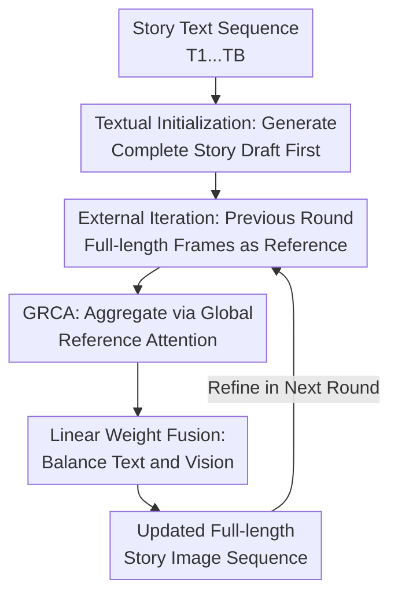

# Story-Iter: A Training-free Iterative Paradigm for Long Story Visualization

**Conference**: ICLR2026  
**OpenReview**: [https://openreview.net/forum?id=puBVb9vTah](https://openreview.net/forum?id=puBVb9vTah)  
**Code**: https://github.com/UCSC-VLAA/story-iter  
**Area**: Image Generation / Long Story Visualization  
**Keywords**: Long story visualization, training-free iterative generation, global reference cross-attention, character consistency, text-to-image diffusion models  

## TL;DR
Story-Iter transforms long story visualization from a "one-time dependency on fixed reference images" into a training-free external iterative process: it first generates the entire story via text, then repeatedly uses the full-length frames from the previous round as a global reference through the GRCA attention module to maintain character consistency and fine-grained text interaction, significantly outperforming existing paradigms on 100-frame long stories.

## Background & Motivation
**Background**: Story visualization aims to convert a sequence of text prompts into continuous images, maintaining consistency in characters, scenes, and narrative states across frames. As diffusion models can generate high-quality single images, recent methods typically use models like Stable Diffusion as a backbone, adding cross-frame references, character memory, or self-attention sharing mechanisms.

**Limitations of Prior Work**: In long stories, the challenge shifts from "quality of individual images" to "whether the entire story resembles the same world." Autoregressive paradigms generate sequentially and can only reference limited historical frames, leading to error propagation and the inability to "see" future characters or objects. Reference-image paradigms use initial frames as fixed anchors, which is stable but locks the story into a few initial references: flaws in the initial images propagate, and new characters appearing later lack global context.

**Key Challenge**: Long stories require global visual context, but sharing high-dimensional intermediate denoising features in the diffusion UNet incurs prohibitive VRAM and computational overhead. Conversely, retaining only a few fixed references fails to cover character changes, scene transitions, and fine-grained interactions over 50 or 100 frames. In short, the method must "see the whole story" without stuffing every frame's high-dimensional features into the attention mechanism.

**Goal**: The authors aim to solve three sub-problems: first, enabling each frame to reference the entire story during generation rather than just neighboring or initial frames; second, allowing reference images to improve iteratively rather than propagating fixed early errors; third, maintaining visual consistency without sacrificing control over actions, objects, and character interactions via the text prompt.

**Key Insight**: The observation is that while diffusion models utilize internal denoising iterations, a story-level "external iteration" can be added. The complete story frames generated in the previous round can serve as a reference for all frames in the next round. Thus, each round uses the "current version of the entire story" to refine the next round, rather than treating specific reference images as immutable truths.

**Core Idea**: Replace fixed reference images or high-dimensional features with "Global CLIP embeddings of full-length story frames + training-free cross-attention," allowing long story visualization to converge iteratively towards a more consistent and text-aligned visual narrative.

## Method

### Overall Architecture
Story-Iter takes a sequence of story text prompts as input and outputs an image sequence of the same length. The process consists of two layers: Round 0 uses only text prompts to call Stable Diffusion to generate an initial full-length story draft; each subsequent round encodes all $B$ images from the previous round as global references, which are inserted into the diffusion model's cross-attention via GRCA to regenerate the current round's story frame by frame.

In this context, "iteration" refers to an external story-level round rather than a denoising step. When generating the $k$-th frame in round $i$, the model simultaneously views the current text $T_k$ and the complete image sequence $x^{i-1}_{1...B}$ from the previous round, allowing frame 80 to reference character appearances and narrative cues from frames 2, 30, or 99.

### Key Designs
**1. Textual Initialization: Generating the Complete Draft**

Story-Iter does not start with manual character images or fixed initial frames. Instead, Round 0 generates initial frames using only text prompts: $x^0_k=SDM(z,T_k)$. This step is crucial: if a single character reference is forced from the start, the model may ignore new objects or actions in subsequent prompts. Textual initialization allows each frame to establish its basic semantic content, providing a story-wide draft for subsequent iterations.

This also avoids the issue where early frames might not contain characters that appear later. While consistency in Round 0 is low, each frame achieves its own text-semantic grounding, and subsequent GRCA iterations extract similar character and scene cues from the draft to refine consistency.

**2. External Iteration: Full-length Frames as Reference**

Traditional story generation often operates within a single diffusion sampling process. Story-Iter treats the "entire story" as an iteratively optimizable object. When generating the $k$-th frame in round $i$, the model uses the full sequence from the previous round: $x^i_k=SDM_{GRCA}(z,T_k,x^{i-1}_{1...B})$. After generating all $B$ frames, the new sequence $x^i_{1...B}$ is used for the next round.

The benefit is that references are updated iteratively. If a character's appearance or a text-aligned interaction becomes clearer in one round, these improved visual cues propagate globally in the next. Conversely, irrelevant or noisy references from the previous round are re-weighted by attention rather than being permanently inherited.

**3. GRCA: Aggregating the Whole Story with Global Reference Attention**

Referencing intermediate UNet features for all frames in a 100-frame story would cause extreme VRAM pressure. GRCA is lighter: it uses a pre-trained CLIP image encoder to encode each reference image $x^{i-1}_b$ into a global embedding $c_b$, then projects each into a few reference tokens via a matrix $W_c$ (default $n=4$ tokens per frame). Tokens from all frames are flattened to serve as key/value pairs for cross-attention with the current frame's query.

Formally, GRCA obtains $\tilde{c}^{i}_{1...B}\in R^{1\times(B\times n)\times e}$, constructs $Q^i_k=I^i_kW_q, K^i_k=\tilde{c}^{i}_{1...B}W_k, V^i_k=\tilde{c}^{i}_{1...B}W_v$, and computes $Attention(Q^i_k,K^i_k,V^i_k)$. Since each frame contributes only a few global tokens, many frames can be included in the attention; since the attention selects tokens based on the current frame's features, it avoids mechanically averaging all historical images.

**4. Linear Weight Fusion: Balancing Text and Vision**

Long story visualization cannot focus solely on consistency. If visual reference weights are too strong, character stability is high, but fine-grained actions (e.g., "holding an umbrella") might be suppressed. Story-Iter sums the outputs of text cross-attention and GRCA, using a linearly increasing $\lambda_i$ to control visual reference strength: $I^i_k=Attention(I^i_k,T_k,T_k)+\lambda_iGRCA(I^i_k,x^{i-1}_{1...B})$.

With 10 iterations, $\lambda_i$ typically increases from 0.3 to 0.5. The intuition is to let text constraints establish story content early on to avoid over-following a crude reference, then gradually strengthen global visual consistency to stabilize appearances, tones, and scene relationships.

### Mechanism Example
Take a 100-sentence story: sentences 1-10 introduce a snowman, sentence 30 introduces a fox, and after sentence 70, they act together. In Round 0, the snowman’s scarf color might fluctuate between red and blue. 

In Round 1, generating frame 70 uses the 100 images from Round 0 as CLIP global tokens. GRCA finds visual cues for the snowman, fox, and snow background while incorporating the action from sentence 70. By Round 10, stable visuals for the snowman from the beginning and the fox from the end flow back into the whole story, maintaining long-range consistency while actions remain text-controlled.

### Loss & Training
Story-Iter is a training-free method. It does not retrain diffusion models or optimize losses. It reuses existing cross-attention weights from Stable Diffusion / SDXL, CLIP, and IP-Adapter, functioning by inserting GRCA and adjusting inference-time attention fusion.

Experiments use 10 external iterations, DDIM 50-step sampling, and CFG 7.5. For efficiency, "Story-Iter-Fast" uses SDXL-LCM to reduce sampling steps from 50 to 4, cutting time for a 100-frame story from 250 minutes to approximately 20 minutes, with some trade-off in quality.

## Key Experimental Results

### Main Results
Evaluation was conducted on standard stories (StorySalon, avg. 14 frames) and long stories (GPT-4o generated, 50/100 frames). Metrics include CLIP-T (alignment) and aCCS / aFID (consistency).

| Scenario | Method | CLIP-T ↑ | aCCS ↑ | aFID ↓ | Note |
|------|------|----------|--------|--------|------|
| StorySalon | StoryGen | 0.255 | 0.724 | 36.34 | Autoregressive baseline |
| StorySalon | StoryDiffusion | 0.311 | 0.765 | 14.84 | Strong fixed-reference paradigm |
| StorySalon | Story-Iter | 0.305 | 0.760 | 16.52 | SD version, beats most baselines |
| StorySalon | Story-IterXL | 0.310 | 0.818 | 14.63 | SDXL version, highest consistency |
| Long Story (50/100f) | StoryGen | 0.223 | 0.740 | 126.13 | High error accumulation |
| Long Story (50/100f) | StoryDiffusion | 0.315 | 0.768 | 102.44 | Limited global semantic coverage |
| Long Story (50/100f) | Story-IterXL | 0.318 | 0.802 | 94.30 | Best overall across metrics |

In terms of efficiency, Story-IterXL requires higher computation due to 10 external iterations, but VRAM usage is lower than StoryDiffusion because it uses global embeddings instead of sharing high-dimensional features.

| Method | Steps | Rounds | FLOPs | VRAM | Time | CLIP-T | aCCS | aFID |
|------|----------|----------|-------|------|------|--------|------|------|
| StoryDiffusion | 50 | 1 | 22 PFLOPs | 40GB | 31 min | 0.315 | 0.768 | 102.44 |
| Story-IterXL | 50 | 10 | 43 PFLOPs | 19GB | 250 min | 0.318 | 0.802 | 94.30 |
| Story-IterXL-Fast | 4 | 10 | 3 PFLOPs | 19GB | 20 min | 0.309 | 0.788 | 109.13 |

### Ablation Study
| Configuration | CLIP-T ↑ | aCCS ↑ | aFID ↓ | Description |
|------|----------|--------|--------|------|
| w/o Initialization | 0.302 | 0.788 | 90.30 | Replacing text init with character ref; lower alignment |
| w/o GRCA | 0.319 | 0.740 | 97.86 | Referencing fixed-index frames; poor global consistency |
| w/o Iteration Paradigm | 0.322 | 0.757 | 105.17 | Single round; worst aFID |
| Ours | 0.318 | 0.802 | 94.30 | Best aCCS and overall balance |

### Key Findings
- GRCA's contribution is most evident in long-distance, multi-character consistency. Referencing only corresponding indices yields slightly higher CLIP-T but drops aCCS from 0.802 to 0.740.
- External iteration significantly impacts aFID; removing it results in an aFID of 105.17 vs. 94.30 for the full method, showing that a single round cannot correct early long-sequence flaws.
- Linear weighting is essential. A fixed large weight lowers aFID but drops CLIP-T to 0.261, meaning images follow references but ignore text; the $[0.3, 0.5]$ schedule is the optimal trade-off.

## Highlights & Insights
- The most ingenious aspect is shifting story-level consistency from a "model training problem" to an "inference-time external iteration problem," allowing previous outputs to serve as global memory.
- Using CLIP global embeddings for GRCA instead of UNet features is a pragmatic engineering choice that sacrifices some local detail for the feasibility of referencing 100+ frames.
- Reference images are treated as dynamic assets that are refined round-by-round, a concept applicable to long-video storyboarding or character editing.
- The linear weight strategy—text first, consistency later—is a simple yet effective way to maintain both narrative accuracy and visual identity.

## Limitations & Future Work
- Computational cost remains high for standard versions (250 mins for 100 frames), making it less suitable for interactive use without the "Fast" version.
- Global embeddings are effective for identity and color but may lack the precision needed for complex spatial interactions or hand movements.
- The long story benchmark is relatively small (20 cases); larger, more diverse public benchmarks for 100+ frames are needed.
- If the backbone model fundamentally midinterprets a character, iterations may simply make the error more consistent rather than correcting it.

## Related Work & Insights
- **vs StoryGen**: StoryGen suffers from cumulative errors in long sequences; Story-Iter references the entire story in every round to bridge long distances.
- **vs StoryDiffusion**: StoryDiffusion excels at short stories but lacks global context for 50-100 frames; Story-Iter updates references iteratively via GRCA.
- **vs IP-Adapter**: While IP-Adapter uses images for identity conditioning, Story-Iter expands the reference target to a collective set of global embeddings of the entire story.

## Rating
- Novelty: ⭐⭐⭐⭐⭐ The combination of external iteration and full-length GRCA is a clear and effective solution for long story visualization.
- Experimental Thoroughness: ⭐⭐⭐⭐ Excellent coverage across benchmarks and metrics, though the long-story benchmark size is a limitation.
- Writing Quality: ⭐⭐⭐⭐ Strong logic in motivation and ablation; clear comparisons.
- Value: ⭐⭐⭐⭐⭐ Training-free and plug-and-play, offering high utility for long-sequence image generation tasks.

<!-- RELATED:START -->

## Related Papers

- [\[CVPR 2026\] ViStoryBench: Comprehensive Benchmark Suite for Story Visualization](../../CVPR2026/image_generation/vistorybench_comprehensive_benchmark_suite_for_story_visualization.md)
- [\[ICLR 2026\] LogiStory: A Logic-Aware Framework for Multi-Image Story Visualization](logistory_a_logic-aware_framework_for_multi-image_story_visualization.md)
- [\[AAAI 2026\] Infinite-Story: A Training-Free Consistent Text-to-Image Generation](../../AAAI2026/image_generation/infinite-story_a_training-free_consistent_text-to-image_gene.md)
- [\[CVPR 2026\] DreamingComics: A Story Visualization Pipeline via Subject and Layout Customized Generation using Video Models](../../CVPR2026/image_generation/dreamingcomics_a_story_visualization_pipeline_via_subject_and_layout_customized_.md)
- [\[ICLR 2026\] Stochastic Self-Guidance for Training-Free Enhancement of Diffusion Models](stochastic_self-guidance_for_training-free_enhancement_of_diffusion_models.md)

<!-- RELATED:END -->
