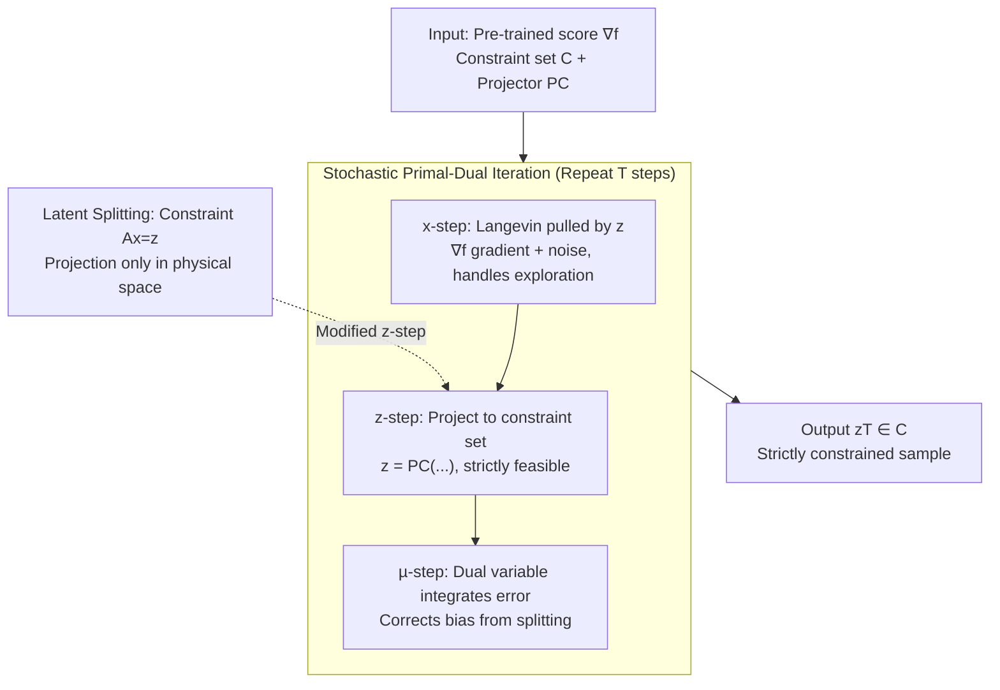

# Strictly Constrained Generative Modeling via Split Augmented Langevin Sampling

**Conference**: ICLR 2026  
**OpenReview**: [https://openreview.net/forum?id=aDJcWNmfce](https://openreview.net/forum?id=aDJcWNmfce)  
**Code**: TBD  
**Area**: Diffusion Models / Constrained Sampling / Scientific Generative Modeling  
**Keywords**: Constrained Langevin, Variable Splitting, Primal-Dual, Diffusion Posterior Sampling, Physical Conservation

## TL;DR
Addressing the issue where generative models fail to strictly satisfy physical constraints in scientific sampling, this paper draws from the variational perspective of Langevin dynamics and Lagrangian duality to propose **CASAL (Constrained Alternated Split Augmented Langevin)**. By using variable splitting to decouple "exploration" and "constraint satisfaction" into two separate variables and employing a dual variable for correction, the method maintains Langevin's exploration capability while **strictly satisfying non-convex constraints**. It can be applied zero-shot to pre-trained diffusion models and significantly outperforms projection and penalty methods in constrained field generation, data assimilation, and optimal control feasibility tasks.

## Background & Motivation

**Background**: Deep generative models (energy-based, score-based, and diffusion models) have demonstrated the ability to sample from complex distributions and are increasingly applied to physical sciences, such as climate prediction, molecular dynamics, and data assimilation. Most of these models fundamentally rely on **Langevin dynamics**, which use noisy gradient steps $x_{t+1}=x_t-\tau\nabla f(x_t)+\sqrt{2\tau}w_t$ to push samples toward high-likelihood regions.

**Limitations of Prior Work**: While perceptual tasks only require samples to "look realistic," scientific and engineering applications require samples to **strictly obey known constraints**, such as conservation of energy, mass, or system dynamics. These constraints often form non-convex sets (e.g., $C=\{x\mid\|x\|_2^2=E\}$). Current approaches are unsatisfactory: ① **Projected Langevin** (projecting the iterate back to $C$ at each step) has guarantees in convex cases but **traps dynamics in local regions** of non-convex constraint sets, destroying exploration and introducing significant sampling bias; ② **Soft Penalty / Diffusion Guidance** (adding a differentiable cost $\lambda\nabla c$ to the potential) only "encourages" constraint satisfaction without enforcing it and requires a differentiable constraint model, whereas many physical constraints lack a differentiable form.

**Key Challenge**: A fundamental tension exists between **strict constraint satisfaction** and **unbiased exploration**. The more a sample is "pinned" to a low-dimensional manifold, the harder it is to sample the correct conditional distribution on that manifold. The authors reveal a deeper theoretical cause: when applying Lagrangian duality directly to the "projection to $C$" problem, **strong duality fails** (the constraint set being a proper subset of $\mathbb{R}^d$ causes constraint qualification to fail). Consequently, penalty-based methods cannot force $P_q(C)=1$ regardless of how large $\lambda$ is.

**Goal**: Design a sampling algorithm that, for **any constraint set** $C$, produces samples that strictly lie within $C$ while following the correct conditional distribution $p_C$, using only the unconstrained score $\nabla f$ and a projection operator related to $C$, without retraining (zero-shot).

**Key Insight / Core Idea**: Formulate constrained sampling as an **information projection** optimization problem in Wasserstein space, then borrow the **variable splitting (ADMM concept)** from optimization. By introducing an auxiliary variable $z\in C$, one variable handles exploration while the other ensures constraint satisfaction, with a dual variable used for coupling and bias correction. In short: **"Use variable splitting and primal-dual iteration to decouple hard constraints from the main Langevin path, assigning them to a dedicated projection variable."**

## Method

### Overall Architecture
CASAL addresses the problem of sampling from the conditional distribution $p_C(x)\propto e^{-f(x)}\mathbf 1_C(x)$ given an unconstrained distribution $p(x)=e^{-f(x)}/Z$ and a constraint set $C$. The overall approach consists of three layers: **viewing sampling as optimization, relaxing it into a solvable dual problem, and implementing a three-variable alternating iteration**.

**Layer 1 (Theoretical Foundation)**: Langevin sampling is equivalent to the gradient flow of the KL divergence $D(q\|p)$ in the Wasserstein space $\mathcal P_2(\mathbb R^d)$. Thus, constrained sampling is the projection of $p$ onto the "set of distributions supported on $C$," i.e., $p_C=\arg\min_q D(q\|p)\ \text{s.t.}\ P_q(x\in C)=1$. However, the authors prove that this primal projection problem **lacks strong duality**, meaning dual-based numerical methods are destined to fail to converge to $p_C$—the root cause of penalty method failures.

**Layer 2 (Relaxation)**: **Split** the single variable $x$ into a pair $(x,z)\in\mathbb R^d\times C$, forcing $z\in C$ and requiring $x$ to be close to $z$. The hard equality $x=z$ is relaxed to "equality in expectation $\mathbb E[x-z]=0$ plus a variance penalty $\frac{\rho}{2}\mathbb E\|x-z\|^2$." In this relaxed problem $(\mathrm P)$, the constraints become "qualified," **restoring strong duality** and ensuring the existence of a solvable saddle point.

**Layer 3 (Algorithm)**: Use stochastic primal-dual iterations to approximate the saddle point of $(\mathrm P)$. The variable $x$ follows a "Langevin path pulled by $z$" (exploration), $z$ is projected onto $C$ (strict feasibility), and the dual variable $\mu$ integrates their error to correct bias. This iteration serves as a **plug-and-play replacement** for standard Langevin steps in pre-trained diffusion models.

### Key Designs

**1. Variational Perspective & Duality Diagnosis**: The authors clarify why penalty methods are destined to fail. Using the link between Langevin dynamics and KL gradient flow in Wasserstein space, the conditional distribution $p_C$ is characterized as an information projection $p_C=\arg\min_q D(q\|p)$ s.t. $P_q(x\in C)=1$ (Prop 3.1). While one might attempt to solve this via Lagrangian duality, the authors prove **strong duality does not hold** (Prop 3.2) because the support $C$ is a proper subset of $\mathbb R^d$, violating constraint qualification. This implies that **penalty methods (Eq 2.5) cannot force $P_q(C)=1$ regardless of the coefficient size** (Corollary 1).

**2. Variable Splitting Relaxation**: To address the diagnosis, CASAL introduces an auxiliary variable to perform **variable splitting**: $x$ is duplicated as $(x,z)$, where $z\in C$ ensures constraint satisfaction and $x$ maximizes likelihood. Crucially, instead of requiring pointwise equality, they relax it to equality in expectation with a variance penalty:
$$\min_{q}\ D(q^x\|p)+\mathbb E[\chi_C(z)]+\frac{\rho}{2}\mathbb E\|x-z\|^2\quad \text{s.t.}\quad \mathbb E[x-z]=0.$$
In this relaxed problem $(\mathrm P)$, **strong duality is restored**, and a saddle point exists (Prop 3.4). The relaxation error is bounded by $W_2^2(q^x_\star,q^z_\star)\le \frac1\rho D(p_C\|p)$ (Prop 4.3). Unlike soft penalties, $z$ is **projected** strictly onto $C$, ensuring output feasibility.

**3. Stochastic Primal-Dual Iteration**: The saddle point is approximated using a three-step alternating iteration (Eq 3.6, with $\mu=\lambda/\rho$):
$$x_{t+1}=x_t-\tau\nabla f(x_t)-\tau\rho(x_t-z_t+\mu_t)+\sqrt{2\tau}\,w_t$$
$$z_{t+1}=P_C\big(z_t-\tau\rho(z_t-x_{t+1}-\mu_t)\big)$$
$$\mu_{t+1}=\mu_t+(\tau/\rho)(x_{t+1}-z_{t+1})$$
$x$ provides **exploration** (gradient + noise); $z$ ensures **strict feasibility** (proximal/projection step $P_C$); and $\mu$ performs **dual ascent** to correct splitting bias. This is effectively a stochastic version of ADMM in the sample space.

**4. Latent Space Splitting**: Many diffusion models sample in a latent space $\mathbb R^d$, while constraints $C$ are defined in a physical space $\mathbb R^k$, linked by a decoder $A\in\mathbb R^{k\times d}$. CASAL adapts to this by changing the splitting constraint to $Ax=z$. Consequently, the **projection step is performed only in the physical space** ($z=P_C(\cdot)$), avoiding the need to invert the decoder, which is a major engineering advantage for tasks like data assimilation.

### Loss & Training
CASAL is a **sampling-only** algorithm and does not introduce new training losses. The score $\nabla f$ is obtained from existing pre-trained models, and constraints are enforced via the projection operator $P_C$ during sampling.

## Key Experimental Results

### Main Results

| Task | Constraint | Key Phenomenon | CASAL Performance |
|------|------------|----------------|-------------------|
| Energy-constrained field generation | Non-convex $\frac12\|x\|^2=E$ | Projection strictly satisfies constraints but fails at exploration, trapping samples in the **wrong mode**. | **Only method** to match the target $p_C$. |
| Burgers' equation data assimilation | Non-convex mass + energy conservation | Unconstrained diffusion drifts from ground truth; projection generates **high-frequency artifacts**. | Best trade-off: Lowest $\ell_2$ error and constraint violation. |
| Optimal control feasibility | Dynamics $C_d$ ∩ Obstacles $C_o$ | Penalty guidance results in **collisions**; projection distorts paths. | Highest percentage of **feasible solutions** while maintaining path quality. |

### Ablation Study

| Config | Key Finding |
|------|---------|
| Coupling Coefficient $\rho$ | Larger $\rho$ pins samples closer to $C$; smaller $\rho$ encourages exploration. |
| Dual Variable $\mu$ | Omitting $\mu$ results in biased distributions; $\mu$ centers the distribution correctly. |
| Latent $Ax=z$ | Projecting only in physical space is significantly faster than backpropagating through decoders. |

### Key Findings
- **Dual variables provide unbiasedness**: The dual ascent of $\mu$ centers the effective potential, explaining why CASAL captures the correct conditional distribution while penalty methods cannot.
- **Failures of projection methods are due to exploration, not feasibility**: Projected Langevin satisfies constraints but gets stuck in local modes of non-convex sets.
- **Latent splitting removes computational bottlenecks** by avoiding decoder inversion.

## Highlights & Insights
- **Theoretical diagnostic of penalty methods**: Proving that the violation of constraint qualification leads to the failure of strong duality provides a strong motivation for relaxation.
- **Decoupling non-differentiable constraints**: By splitting $x$ and $z$, the method **does not require a differentiable constraint model**, which is crucial for real-world physical laws.
- **Zero-shot & Plug-and-play**: The algorithm replaces Langevin steps without retraining the underlying generative model.

## Limitations & Future Work
- **Convergence assumptions**: Theoretical guarantees currently rely on $C$ being convex and bounded, while the method's strength lies in non-convex cases.
- **Relaxation bias**: Finite $\rho$ introduces a small bias, though corrected by $\mu$. High $\rho$ requires smaller step sizes, slowing down sampling.
- **Projection overhead**: Each step requires a projection onto $C$, which can be computationally expensive for complex non-convex sets.

## Related Work & Insights
- **vs. Projected Langevin**: Projection methods trap exploration in non-convex sets; CASAL uses splitting and duality to maintain exploration while ensuring feasibility.
- **vs. Soft Penalty/Guidance**: Penalty methods only satisfy constraints on average and require differentiability; CASAL is strict and handles non-smooth constraints.
- **vs. ADMM for sampling**: This work extends variable splitting to the density space, providing a rigorous framework for strictly constrained posterior sampling in diffusion models.

## Rating
- Novelty: ⭐⭐⭐⭐⭐ 
- Experimental Thoroughness: ⭐⭐⭐⭐ 
- Writing Quality: ⭐⭐⭐⭐⭐ 
- Value: ⭐⭐⭐⭐⭐ 

<!-- RELATED:START -->

## Related Papers

- [\[ICLR 2026\] Continuously Augmented Discrete Diffusion model for Categorical Generative Modeling](continuously_augmented_discrete_diffusion_model_for_categorical_generative_model.md)
- [\[ICLR 2026\] Gauge Flow Matching: Efficient Constrained Generative Modeling over General Convex Set and Beyond](gauge_flow_matching_efficient_constrained_generative_modeling_over_general_conve.md)
- [\[ICLR 2026\] Efficient Approximate Posterior Sampling with Annealed Langevin Monte Carlo](efficient_approximate_posterior_sampling_with_annealed_langevin_monte_carlo.md)
- [\[ICLR 2026\] Partition Generative Modeling: Masked Modeling Without Masks](partition_generative_modeling_masked_modeling_without_masks.md)
- [\[NeurIPS 2025\] PID-controlled Langevin Dynamics for Faster Sampling of Generative Models](../../NeurIPS2025/image_generation/pid-controlled_langevin_dynamics_for_faster_sampling_of_generative_models.md)

<!-- RELATED:END -->
