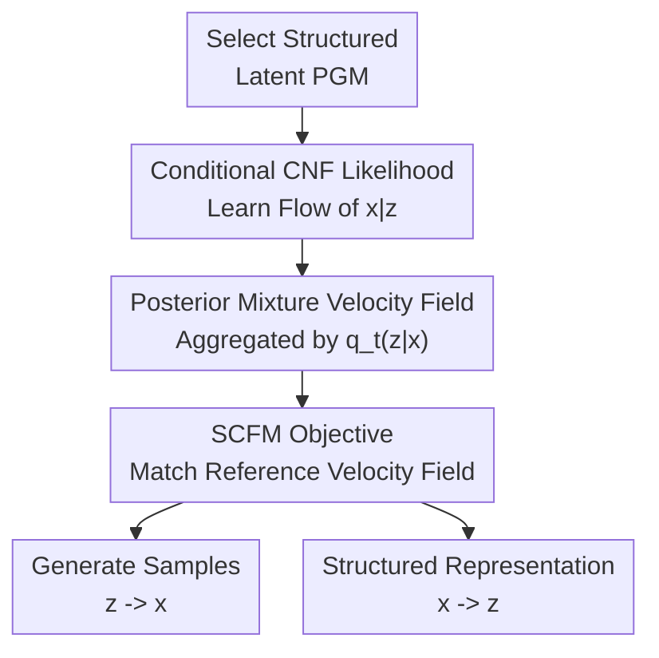

# Structured Flow Autoencoders: Learning Structured Probabilistic Representations with Flow Matching

**Conference**: ICLR 2026  
**OpenReview**: [https://openreview.net/forum?id=KYdfvF2SZN](https://openreview.net/forum?id=KYdfvF2SZN)  
**Code**: https://github.com/edenx/StructuredFlowAutoencoder  
**Area**: Generative Models / Structured Representation Learning  
**Keywords**: Structured Flow Autoencoders, Flow Matching, Continuous Normalizing Flows, Probabilistic Graphical Models, Latent Variable Representation

## TL;DR
This paper proposes Structured Flow Autoencoders, which integrate structured latent variables from probabilistic graphical models into conditional continuous normalizing flows. By employing Structured Conditional Flow Matching, it simultaneously learns high-fidelity generative distributions and interpretable posterior representations, achieving a superior balance between generative quality, sample diversity, and latent space structure compared to VAE / SVAE on image, RNA-seq, and sequential video data.

## Background & Motivation
**Background**: In recent generative models, diffusion models, flow matching, and continuous normalizing flows have excelled at high-dimensional density estimation and high-quality sampling. They transport a simple base distribution to a data distribution along a probability path, showing strong performance in images, sequences, and scientific data. Concurrently, another classic route involves probabilistic latent variable models like VAE and SVAE: these do not just generate samples but explicitly learn low-dimensional latent variables $z$, allowing the posterior $p(z|x)$ to serve clustering, interpretation, conditional generation, and scientific analysis.

**Limitations of Prior Work**: Both routes have shortcomings. Neural density estimators like flow matching typically fit the marginal distribution $p(x)$ directly; while sample quality is high, the training objective lacks explicit structured latent variables, making it difficult to obtain an interpretable and manipulatable representation after generation. VAE / SVAE are the opposite: they have clear probabilistic graphical structures and posterior inference, but are often limited by simple Gaussian decoders, the trade-off between reconstruction and KL divergence in the ELBO, and posterior collapse, resulting in generative quality that typically lags behind modern flow/diffusion methods.

**Key Challenge**: The difficulty lies in the fact that flows cannot simply be inserted as VAE decoders. Using CNFs to directly parameterize the VAE likelihood requires likelihood computation and ODE backpropagation at every training step, which is costly and unstable. Alternatively, compressing into a latent space with an autoencoder first and then training a flow in the latent space tends to simplify the probabilistic posterior into a deterministic encoding, losing structured uncertainty. In short, a unified and stable training principle for high-fidelity marginal modeling $p(x)$ and structured posterior $p(z|x)$ is missing.

**Goal**: The authors aim to construct a model family that retains designable latent structures from probabilistic graphical models (such as continuous latent variables, finite mixture categories, and temporal dynamic systems) while replacing the observation likelihood $p(x|z)$ with a more expressive conditional CNF. During training, the goal is not to maximize the traditional ELBO, but to align the posterior-decomposed conditional velocity field with the reference velocity field of flow matching at the marginal level.

**Key Insight**: The key observation comes from the continuity equation and Bayes' rule: if each latent variable $z$ corresponds to a conditional velocity field $v_t(x|z)$, then taking its expectation over the posterior $p_t(z|x)$ at time $t$ yields the marginal velocity field $v_t(x)=E_{p_t(z|x)}[v_t(x|z)]$. This indicates that marginal flow matching does not have to learn an unstructured $v_t(x)$; it can be interpreted as a posterior mixture of many structured conditional flows.

**Core Idea**: Use a "posterior-weighted conditional velocity field" to replace the single marginal velocity field of standard flow matching, thereby unifying the high-fidelity generation of CNFs and the structured latent learning of probabilistic graphical models into a single Structured Conditional Flow Matching objective.

## Method

### Overall Architecture
The overall approach of SFA is: first, specify a latent variable graphical model to determine the structure of $z$ and the form of the posterior; second, represent $p_1(x|z)$ with a conditional CNF, letting different latent variables correspond to different probability flows in the observation space; finally, use the SCFM training objective to ensure these conditional velocity fields match the reference flow matching velocity field when mixed via the approximate posterior $q_t(z_t|x_t)$. Once trained, the same model can sample from a prior or empirical latent distribution to generate $x$, and output structured posterior representations $q_1(z|x)$ for given samples.

The core contributions in this diagram are "Conditional CNF Likelihood", "Posterior Mixture Velocity Field", and the "SCFM Objective". The latent PGM is an input modeling assumption, while sample generation and structured representation are two usages after training. Key designs revolve around these three contribution nodes.

### Key Designs
**1. Conditional CNF Likelihood: Giving PGMs the Expressivity of Modern Flows**

A bottleneck of traditional VAEs is that $p(x|z)$ is often set as a simple distribution, such as a diagonal Gaussian or independent pixel likelihood; this is too weak for high-dimensional images, RNA-seq expression matrices, and video frames. SFA replaces this likelihood with a conditional continuous normalizing flow: given latent $z$, observation $x$ evolves along an ODE, and the conditional velocity field is written as $v_t(x|z;\theta)$, where the generation process is defined as

$$
\frac{d}{dt}\phi_t(x)=v_t(\phi_t(x)|z;\theta),\quad \phi_0(x)=x_0,\quad x_0\sim p_0(x).
$$

The advantage is that the latent variable is no longer just a low-dimensional code fed into a weak decoder but directly modulates the entire probability path from the base distribution to the observation distribution. For MNIST, different $z$ can correspond to different digit shapes and stroke styles; for RNA-seq, low-dimensional $z$ can capture expression structures related to cell types; for pendulum videos, $z_s$ can correspond to dynamic states like angle and angular velocity. Compared to placing a flow in the deterministic latent space of an autoencoder, SFA still retains the stochasticity and probabilistic interpretation of $q(z|x)$.

**2. Posterior Mixture Velocity Field: Splitting Marginal Flow into Structured Conditional Flows**

The core theoretical point of the paper is Theorem 3.1. If the conditional velocity field $v_t(x|z)$ under each $z$ generates the conditional path $p_t(x|z)$, then the velocity field of the marginal path $p_t(x)=\int p_t(x|z)p(z)dz$ can be written as

$$
v_t(x)=\int v_t(x|z)p_t(z|x)dz=E_{p_t(z|x)}[v_t(x|z)].
$$

This embeds "structured representation learning" into the mathematical core of flow matching: the model does not have to learn an unstructured $p(x)$ and explain it post-hoc, but rather requires the marginal motion to come from the posterior average of latent-conditioned motions during velocity field training. Intuitively, standard flow matching is a global current pushing noise to data; SFA splits this current into several sub-currents controlled by latent variables, and then merges them back using posterior weights. As long as the velocity field after posterior mixing is consistent with the target marginal velocity field, the model can simultaneously maintain good marginal density and meaningful latent decomposition.

The posterior here does not have to be exactly solvable. SFA uses an approximate family $Q=\{q_t(z|x)\}$, which can be time- and observation-dependent Gaussians or conditional CNFs. Empirically, the authors found that Gaussian approximations are usually sufficient and more stable for low-dimensional latent scenarios; while making the posterior a CNF increases expressivity, it significantly increases runtime as it requires repeated ODE solving during training.

**3. SCFM Objective: Learning Likelihood and Posterior Jointly Without Computing Likelihood**

With the posterior mixture velocity field, SFA's training objective is Structured Conditional Flow Matching. Given a real sample $x_1$, an intermediate point $x_t$ on the reference probability path, and a reference velocity field $u_t(x_t|x_1)$, SCFM minimizes

$$
R(\theta,q)=E_{x_1,x_t,t}\left\|E_{q_t(z_t|x_t)}[v_t(x_t|z_t;\theta)]-u_t(x_t|x_1)\right\|^2.
$$

The meaning of this objective is straightforward: it does not require each conditional flow to individually equal the reference velocity, but requires that the conditional flows "after posterior mixing" globally equal the reference velocity. Thus, training simultaneously pushes two things to happen: $v_t(x|z)$ learns how to generate observations given latent variables, and $q_t(z|x)$ learns how to assign observations to appropriate latent structures. Unlike the VAE's ELBO, SCFM has no explicit KL term pulling the posterior back to the prior, so it lacks direct pressure of posterior collapse from the objective form.

Computationally, this bypasses the most troublesome parts of CNF likelihood training. Traditional maximum likelihood CNF requires computing the divergence and log likelihood in the instantaneous change-of-variable during training; the SFA flow matching objective only matches velocity fields and does not need to evaluate exact likelihood at every step. Therefore, it can connect CNFs to graphical models while maintaining training overhead similar to VAE. The paper reports that on MNIST, SFA with a parameterized Gaussian posterior takes approximately $13.220\pm1.848$ seconds per epoch, close to the VAE's $12.789\pm2.011$ seconds; however, the CNF posterior version rises to $167.460\pm176.817$ seconds, indicating the choice of posterior family is critical in practice.

**4. PGM Instantiation: One Objective Covering Continuous, Mixture, and Dynamic Latents**

SFA is not a model designed for a single toy latent, but a recipe for connecting PGMs to flow matching. Continuous latent models are the simplest: $z\sim p(z)$, $x|z\sim p(x|z)$; training uses $q_t(z|x)$ to approximate the posterior and a sample $\tilde z\sim q_t(z|x)$ to estimate the inner expectation. This version is suitable for low-dimensional representations of MNIST, cell type structures in RNA-seq, etc.

Finite mixture models introduce discrete categories $\xi\in[K]$ and continuous $z$. Here, the inner expectation of SCFM must integrate over $q_t(\xi|x)$ and $q_t(z|x,\xi)$ simultaneously, and the objective becomes matching $E_{q_t(\xi|x)q_t(z|x,\xi)}[v_t(x|z)]$ with the reference velocity. The authors use Gumbel-Softmax to approximate the categorical posterior, allowing the model to learn cluster-like probabilistic representations unsupervised. The dynamic system version expands latents into trajectories $z^{[S]}$, where each time step $x^s$ conditionally depends on the corresponding $z^s$, and the posterior decomposes autoregressively by history and the full observation sequence; the training objective sums over time steps $s$, suitable for videos driven by low-dimensional physical states like a pendulum.

### Loss & Training
The core loss of SFA training is the SCFM velocity matching loss. In practice, the authors usually adopt linear interpolation paths as reference paths, i.e., constructing $x_t$ from base noise $x_0$ to real sample $x_1$, and using the reference velocity $u_t(x_t|x_1)$ from flow matching as the supervision signal. The inner posterior expectation is estimated using Monte Carlo; in continuous latent scenarios, a single reparameterized sample often works, similar to the reparameterization trick in VAE training.

Different structures correspond to different posterior families. Continuous latents typically use Gaussian approximations varying with $t$ and $x$; mixture models use Gumbel-Softmax for discrete categories followed by category-conditional Gaussians; dynamic systems use sequence encoders for full observation sequences, GRUs for accumulating latent history, and cross-attention for selecting frame information most useful for the current $z^s$. On the likelihood side, conditional CNFs use MLPs or MLPs with FiLM modulation to parameterize the velocity field. Experiments were conducted on a MacBook Pro M2 Pro, emphasizing that the method can be trained on medium hardware rather than relying on large clusters.

## Key Experimental Results

### Main Results
The paper covers four tasks: Pinwheel conditional density estimation, MNIST image modeling and clustering, single-cell RNA-seq expression modeling, and Pendulum video dynamic systems. The table below excerpts results showing the differences between SFA and VAE / SVAE / LatentFM.

| Dataset / Task | Metric | Ours | Main Comparison | Gain / Conclusion |
|--------|------|------|----------|------|
| Pinwheel Density | $\hat W_1\downarrow$ | SFA 0.024 | FM 0.025 / VAE 0.119 / Mixture-SVAE 0.457 | SFA achieves marginal density quality close to standard FM while retaining latent structure |
| Pinwheel Mixture | $\hat W_1\downarrow$ | Mixture-SFA 0.046 | Mixture-SVAE 0.457 | SFA significantly outperforms SVAE version in mixture structures |
| MNIST Continuous | NMI(OOD)$\uparrow$ | SFA 0.490 | LatentFM 0.488 / VAE 0.039 | Clustering quality is close to LatentFM and significantly higher than VAE |
| MNIST Continuous | Vendi$\uparrow$ / SSIM$\uparrow$ | SFA 25.589 / 0.716 | LatentFM 8.380 / 0.980 | SFA trades some reconstruction sharpness for much higher sample diversity |
| RNA-seq HVG | Vendi(x)$\uparrow$ / NMI$\uparrow$ | SFA 737.7 / 0.633 | LatentFM 5.801 / 0.617 / VAE 26.58 / 0.412 | SFA maintains both diversity and cell-type clustering on high-dim gene expression |
| Pendulum Video | RMSEz$\downarrow$ | LDS-SFA 1.526 | GLD-SVAE 8.090 | Latent state recovery error reduced by over 5x |

### Ablation Study
| Configuration | Key Metrics | Explanation |
|------|---------|------|
| SFA, Gaussian Posterior | MNIST $\log p(z|x)=793.262$, Vendi 25.589, SSIM 0.716 | Default choice, posterior expressivity is sufficient and training is stable |
| SFA, deterministic latent | MNIST Vendi 10.189, SSIM 0.732, NMI(OOD) 0.501 | Reconstruction slightly better, clustering similar, but diversity significantly lower than stochastic SFA |
| SFA, CNF posterior | MNIST $\log p(z|x)=356.141$, Vendi 23.166, SSIM 0.654 | More expressive but higher training cost; did not yield stable gains in experiments |
| Mixture-SFA vs Mixture-SVAE | MNIST SSIM 0.779 vs 0.634, NMI 0.489 vs 0.161 | Under the same mixture structure, replacing with SCFM + Conditional CNF improves representation and generation |
| LDS-SFA vs GLD-SVAE | Pendulum RMSEx 3.233 vs 4.574, RMSEz 1.526 vs 8.090 | In dynamic latents, SFA better restores observation trajectories and latent states |

### Key Findings
- SFA is not merely about "better generative quality." On Pinwheel, its marginal density estimation almost matches standard FM, but color-coded posterior representations recover the angular structure; this shows structured latents do not destroy the density modeling capability of the flow.
- On MNIST, LatentFM has the highest SSIM but very low Vendi, suggesting it favors reconstruction and low diversity; SFA's Vendi is significantly higher while OOD clustering NMI is close to LatentFM, reflecting the value of stochastic latent posteriors.
- RNA-seq results are important application signals: on 5000-dimensional highly variable gene data, SFA does not need to compute CNF log likelihood directly but still learns cell-type related structures and vastly outperforms LatentFM and VAE on the Vendi metric.
- More complex posterior families are not necessarily better. While CNF posterior is theoretically more flexible, it introduces ODE sampling at every gradient step, increasing training time and variance; in low-dimensional latent scenarios, Gaussian posteriors are more robust engineering choices.

## Highlights & Insights
- **Reinterpreting FM marginal velocity fields as posterior mixtures**: This is not a superficial combination but a proof using the continuity equation that $E_{p_t(z|x)}[v_t(x|z)]$ is precisely the marginal path velocity field. This perspective ensures that "structured latents" and "high-fidelity generation" are two sides of the same training objective.
- **Avoiding expensive VAE-CNF likelihood training**: The paper does not force CNF into the ELBO for likelihood calculation but uses velocity field matching to train the conditional CNF. This choice is critical as it allows expressive likelihoods into PGMs without making training costs prohibitive.
- **Wide adaptation of structures**: Continuous, mixture, and dynamic instances cover various dependency types. The dynamic system version especially shows that SFA is not just an image generation trick but a methodology for "swapping in flow likelihoods for any graphical model."
- **Convincing scientific data scenarios**: Single-cell RNA-seq is a high-dimensional, highly structured scenario with strong interpretability needs. SFA's performance here demonstrates method value better than pure image results, as biological data analysis needs usable low-dimensional posterior representations, not just pretty samples.
- **Inspiration for representation learning in generative models**: Many diffusion/flow representation methods rely on post-hoc probing or latent autoencoders. SFA reminds us that representation structure can be written directly into probability paths and velocity fields rather than being interpreted after training a large model.

## Limitations & Future Work
- The scalability of SFA is still influenced by architecture. While it solves the training objective and PGM combination at the method level, how to design strong decoders that do not bypass stochastic latents in more complex natural images remains an open question. The authors note that skip connections or overly strong networks might lead the model to ignore the stochastic latents.
- Absence of systematic principles for posterior family selection. Experiments show Gaussian posteriors are generally sufficient and CNF posteriors are too expensive, but when complex posteriors are needed and how to balance expressivity and stability remains largely empirical.
- Experimental scale is focused on method validation. MNIST, Pinwheel, Pendulum, and RNA-seq sufficiently illustrate framework flexibility but do not yet demonstrate boundaries on ImageNet-level images, long videos, or large-scale multi-omics data. Establishing SFA as a universal framework requires stronger backbones and larger-scale evaluation.
- Latent variable interpretability remains empirical. The paper shows evidence via clustering, t-SNE, and RMSE, but whether structured latents are identifiable or can stably support interventionist generation requires stronger theory or controlled experiments.
- Future work could connect SFA to richer graph structures, such as hierarchical latents, causal graphs, composable object representations, or physical state-space models. If SCFM can be stably trained in these structures, it will become a natural generative modeling tool for scientific machine learning.

## Related Work & Insights
- **vs VAE / $\beta$-VAE**: VAE learns the encoder and decoder through ELBO, but the likelihood is weak and the KL term creates a trade-off between reconstruction and posterior structure. SFA skips ELBO, matching the posterior-mixed conditional velocity field to the marginal reference velocity, making it better suited for high-expressivity CNFs.
- **vs SVAE / Mixture-SVAE / GLD-SVAE**: SVAE puts PGM structures into the inference network, but the decoding distribution is still limited by parametric families. SFA retains these structures (e.g., categories and linear dynamic states) while replacing observation likelihoods with conditional flows, thus outperforming SVAE in MNIST mixture clustering and pendulum dynamic recovery.
- **vs Latent Flow Matching**: LatentFM trains a flow in a latent space obtained by an autoencoder; reconstruction can be high, but the latent representation is deterministic, leading to weaker sample diversity and probabilistic interpretation. SFA learns $q(z|x)$ and $p(x|z)$ directly, balancing Vendi and structured clustering better.
- **vs Diffusion Autoencoder / Representation Learning Diffusion**: These methods also try to extract meaningful representations from generative models but often rely on specific encoder-decoder architectures. SFA's insight is viewing "representation" as a latent conditional structure within probability paths, allowing for natural migration to different PGMs.
- **Inspiration for Subsequent Research**: If a field already has clear structural assumptions—such as cell state transitions, object attribute hierarchies, robotic dynamics, or patient disease progression—one can first write the corresponding PGM and use SCFM to provide a flow-based likelihood for each condition. This is likely more effective than designing black-box generative models from scratch for combining domain knowledge with high-expressivity density estimation.

## Rating
- Novelty: ⭐⭐⭐⭐⭐ The paper links flow matching velocity matching with PGM posterior mixing through a clear theorem, rather than a routine VAE + flow assembly.
- Experimental Thoroughness: ⭐⭐⭐⭐☆ Covers synthetic, image, single-cell, and video dynamics, proving framework breadth, but lacks large-scale natural image or real long-sequence experiments.
- Writing Quality: ⭐⭐⭐⭐☆ The main line is clear, and theory, objective, and instantiations are naturally connected; some experimental details are scattered in the appendix.
- Value: ⭐⭐⭐⭐⭐ Highly valuable for scientific modeling and controllable generation directions requiring "generation + representation + structural interpretation," particularly as a universal recipe for upgrading domain PGMs with modern flow likelihoods.

<!-- RELATED:START -->

## Related Papers

- [\[ICLR 2026\] Delay Flow Matching](delay_flow_matching.md)
- [\[ICLR 2026\] Flow Matching with Injected Noise for Offline-to-Online Reinforcement Learning](flow_matching_with_injected_noise_for_offline-to-online_reinforcement_learning.md)
- [\[ICLR 2026\] Source-Guided Flow Matching](source-guided_flow_matching.md)
- [\[ICLR 2026\] Flow Matching with Semidiscrete Couplings](flow_matching_with_semidiscrete_couplings.md)
- [\[ICLR 2026\] Edit-Based Flow Matching for Temporal Point Processes](edit-based_flow_matching_for_temporal_point_processes.md)

<!-- RELATED:END -->
