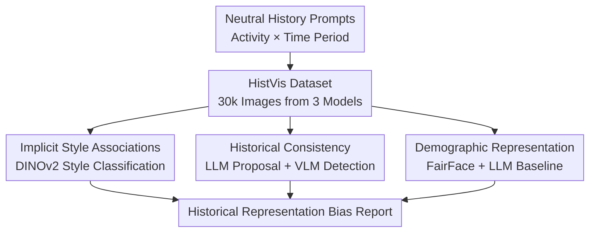

# Synthetic History: Evaluating Visual Representations of the Past in Diffusion Models

**Conference**: ICLR 2026  
**OpenReview**: [https://openreview.net/forum?id=Ix0vw6Mdzs](https://openreview.net/forum?id=Ix0vw6Mdzs)  
**Code**: Available (The paper claims open-source evaluation scripts, though the specific GitHub URL was not retained in the cache)  
**Area**: Diffusion Model Evaluation / Datasets & Benchmarks  
**Keywords**: Historical Representation, TTI Evaluation, Style Bias, Anachronism, Demographic Bias  

## TL;DR
This paper introduces the HistVis historical visual benchmark, generating 30,000 images of cross-era activities using three open-source text-to-image (TTI) diffusion models. It systematically reveals how models render the "past" as a synthetic history characterized by stereotypical associations, anachronisms, and distorted demographic distributions across three dimensions: implicit style associations, historical consistency, and demographic representation.

## Background & Motivation
**Background**: TTI diffusion models have evolved from research prototypes into content production tools, with generated images being directly utilized in education, media, art, and cultural dissemination. Evaluations surrounding TTI models are increasing, with existing work focusing on biases in professions, gender, race, geography, and cultural objects, demonstrating that models are not neutral visual generators but inherit social distributions and visual conventions from their training data.

**Limitations of Prior Work**: Compared to the systematic evaluation of whether "present people and objects" are portrayed fairly, there is a lack of systematic assessment regarding how models depict historical contexts. Errors in historical imagery are more complex than simple object misplacements: an image of a "person listening to music in the 18th century" featuring headphones is a clear anachronism. However, even without specific object errors, if a model defaults to rendering the 17th century as engravings or the 1910s as black-and-white photographs, it mistakes a specific medium of recording for history itself. Such errors affect the public’s visual imagination of the past, posing higher risks in educational and cultural heritage scenarios.

**Key Challenge**: Historical representation involves three layers that are difficult to handle simultaneously: first, visual style should not be excessively locked to era labels; second, objects, environments, and behaviors must be time-consistent; and third, the gender and ethnic representation of characters should neither ignore historical context nor simply adopt historical structures of exclusion as "correct answers." Most existing benchmarks focus on landmark recognition, historical figures, or descriptions of historical photos, failing to answer how generative models imagine an era without explicit prompts.

**Goal**: The authors aim to establish a reproducible and scalable evaluation framework that allows researchers to compare different TTI models across a unified set of historical activity prompts. Specifically, it seeks to answer: whether models bind fixed visual styles to different eras; whether they introduce modern objects into pre-modern scenes; and whether the generated demographic distributions systematically deviate from coarse-grained historical plausibility baselines.

**Key Insight**: Instead of using strong historical knowledge prompts like "Napoleon" or "Ancient Roman battles," the paper selects cross-era universal activities such as "cooking, listening to music, studying, and traveling." The advantage of this design is that only the temporal condition changes while the activity remains consistent; thus, changes in model output better reflect internal historical representations rather than events, celebrities, or objects explicitly written into the prompt.

**Core Idea**: Large-scale synthetic historical images are constructed using neutral "Person + Activity + Time Period" prompts. These are then analyzed using style classifiers, LLM/VLM-based anachronism detection, and demographic bias measurements to deconstruct the implicit imagination of the "past" in TTI models into three measurable axes.

## Method
### Overall Architecture
The methodology of this paper focuses on building a historical representation benchmark rather than training a new generative model. The process begins by designing the HistVis prompt set, using SDXL, SD3, and FLUX.1 Schnell to generate multiple images for each activity-era combination. Subsequently, three evaluation pipelines are run to measure whether style is dominated by era labels, whether anachronisms appear, and whether the demographic distribution deviates from LLM-estimated historical baselines.

The HistVis prompt template is fixed as "A person [activity] in the [time period]". The activity set includes 100 activities across 20 categories such as music, art, communication, family, transport, urban life, cooking, chores, religion, agriculture, education, and commerce. The temporal set covers five centuries (17th-21st) and five 20th-century decades (1910s, 1930s, 1950s, 1970s, 1990s). Each TTI model generates 10 images per activity-time combination, resulting in 100 activities × 10 periods × 10 images × 3 models = 30,000 images.

The three generating models evaluated are open-source diffusion-based TTI models: Stable Diffusion XL, Stable Diffusion 3, and FLUX.1 Schnell. This choice allows the paper to compare different architectures and observe changes in historical representation across iterations of the same model family. The framework is model-agnostic and can accommodate any new TTI model.

### Key Designs
**1. HistVis Neutral Activity Prompts: Decoupling Historical Representation from Explicit Facts**

If prompts like "WWII soldier" or "Victorian Queen" are used, the output mixes event knowledge, object knowledge, and historical common sense, making it difficult to pinpoint where errors occur. HistVis instead selects universal activities like "a person studying" or "a person cooking," only changing the time period. Consequently, differences in output for the same activity between the 17th century and 1990s primarily stem from the model's interpretation of the temporal condition.

**2. Implicit Style Association Evaluation: Measuring Era-Medium Binding via VSD**

The authors first construct a style classification dataset from WikiArt, categorized into: drawing, engraving, illustration, painting, and photography. Since photography does not distinguish between black-and-white and color, photography with low colorfulness (via Hasler-Suesstrunk) is labeled as monochrome. After comparing various visual encoders (VGG-16, ResNet-50, Swin, BEiT, MAE, DINOv2, and zero-shot CLIP), DINOv2 ViT-B/14 was selected for its superior performance.

The core metric is Visual Style Dominance (VSD): for model $m$ and period $t$, the proportion of each style among generated images is calculated, with the maximum value defining the dominance: $VSD(m,t)=\max_s P_m(s\mid t)$. High VSD suggests the model locks an era into a specific medium; low VSD suggests stylistic diversity.

**3. Two-Stage Anachronism Detection: LLM Proposal and VLM Verification**

Anachronism detection is an open-set problem. The study uses an LLM to generate candidate anachronistic elements $Z_{a,t}$ based on the activity-era prompt and formulates a Yes/No visual question-answering (VQA) task for each element. Then, three VLMs (GPT-4o, LLaMA-3.2-11B, and Qwen2.5-VL-7B) verify the presence of these elements via majority voting. Two metrics are calculated: Frequency (proportion of occurrence) and Severity (consistency of detection when proposed: $Severity(z_i)=n^{detected}_{z_i}/n^{proposed}_{z_i}$).

**4. Demographic Representation Evaluation: Comparison with LLM Historical Baselines**

Character attributes are extracted using FairFace. To identify extreme under- or over-representation, the study compares the generated distribution with a baseline estimated by GPT-4o for each activity-era combination. Deviations are split into two directions: when the generated proportion $P^{model}_d$ is less than the LLM estimate $\hat P^{llm}_d$, $Under_d=\hat P^{llm}_d-P^{model}_d$; otherwise, $Over_d=P^{model}_d-\hat P^{llm}_d$.

## Key Experimental Results

### Main Results
Main results are categorized into style dominance, anachronism rates, and demographic bias.

| Evaluation Dimension | Main Subject | Representative Result | Description |
|--------|---------|---------|------|
| Implicit Style Association | SDXL / SD3 / FLUX.1 | SDXL 17th century VSD=0.93 (engraving); SD3 and FLUX.1 17th century VSD=0.86/0.88 (painting) | Historical periods are strongly bound to specific visual media |
| 20th Century Style | Three Models | 1910s-1950s see monochrome dominance in most models; FLUX.1 and SD3 shift to photography in modern eras | Models treat archival media features as era characteristics |
| Anachronism | SD3 / FLUX.1 / SDXL | SD3: ~20% in 19th c., ~25% in 1930s; SDXL: mostly <5% | SD3 is more prone to introducing modern objects into history |
| Demographic Representation | Generations vs. GPT-4o Baseline | FLUX.1 consistently over-generates males in cooking & dining; White individuals are generally over-represented | Outputs reflect activity-related stereotypes and training distribution |

DINOv2 ViT-B/14 was selected as the default encoder for HistVis style evaluation due to its highest Macro F1 score.

| Style Classification Backbone | Accuracy | Macro F1 | Key Observation |
|-------------|----------|----------|----------|
| CLIP ViT-B/32 zero-shot | 0.734 | 0.658 | Photography and painting are okay; drawing/illustration are weak |
| ResNet-50 | 0.879 | 0.852 | Traditional CNNs show strong style recognition |
| DINOv2 ViT-B/14 | 0.896 | 0.876 | Highest Macro F1; used for HistVis evaluation |

### Ablation Study
The "ablation" focuses on the robustness of the evaluation pipeline and alternative configurations.

| Configuration / Analysis | Key Metric | Description |
|------------|---------|------|
| SDXL Raw vs. Photorealistic + Negative Prompt | 17-19th c. still dominated by engraving | Prompt engineering has limited effect on deep historical style priors |
| VLM Single Model vs. Three-Model Majority Vote | Human Agreement: 75% for Majority Vote | Ensemble VLM reduces individual model misjudgments |
| Human Anachronism Annotation | Fleiss' $\kappa = 0.63$ | Substantial agreement proves validity of the automated pipeline |
| GPT-4o vs. LLaMA-3.2 Demographic Estimation | MAE on OWID tasks: ~4.6-4.8 | Open-source LLMs serve as comparable baseline estimators |

### Key Findings
- **Style bias is not random noise**: SDXL strongly associates early centuries with engravings, while the first half of the 20th century is dominated by monochrome photography across models.
- **Limited mitigation via prompt engineering**: Explicitly requesting "photorealistic" outputs often results in a shift from monochrome to painting/illustration rather than true color photography for older eras.
- **Anachronisms stem from conceptual dominance**: Activities like "listening to music" trigger modern associations (headphones) that override temporal constraints.
- **SDXL has lower anachronism frequency** but remains heavily stereotyped in the style dimension.
- **Demographic bias is complex**: The LLM baseline identifies extreme deviations rather than serving as an absolute truth, highlighting the tension between historical accuracy and ethical representation.

## Highlights & Insights
- **Ours** transforms "historical representation" from an abstract cultural critique into a reproducible benchmark.
- The neutral activity design is ingenious; it exposes internal historical visual priors by avoiding the explicit historical knowledge typically found in prompts.
- **VSD** is a simple yet interpretative metric that quantifies the collapse of an era into a single visual medium.
- The two-stage anachronism detection is adaptable to other open-set bias evaluations by using LLMs for candidate generation and VLMs for verification.
- The paper maintains a measured stance on demographic baselines, treating them as reference points rather than normative goals.

## Limitations & Future Work
- **Ours** covers only 100 activities and 10 time periods, lacking coverage of regional, class-based, or non-Western visual traditions.
- Style categories are coarse; they cannot distinguish between specific art movements or regional photographic processes.
- Anachronism detection is limited by the LLM's imagination; subtle errors in period-specific architecture or dress may be missed.
- Demographic evaluation relies on FairFace and LLM estimates, both of which inherit their own biases.
- Future work should expand to closed-source models, video generation, and more diverse cultural contexts.

## Related Work & Insights
- **Vs. CUBE / CulturalFrames**: While those focus on contemporary cultural authenticity, this study shifts focus to the temporal dimension.
- **Vs. HEIM / CENTURY**: Unlike benchmarks focusing on fact alignment (recognizing landmarks/persons), this study evaluates open-ended "imagination" of the past.
- **Vs. OpenBias / TIBET**: This study adapts open-set bias detection to historical consistency, showing the feasibility of LLM-VLM pipelines for this purpose.
- **Insight for Evaluation**: Future benchmarks should not just ask if an image is "aesthetic," but whether it mistakes media conventions for reality or overrides constraints with modern associations.

## Rating
- **Novelty**: ⭐⭐⭐⭐⭐ First systematic deconstruction of historical representation in TTI models across style, consistency, and demographics.
- **Experimental Thoroughness**: ⭐⭐⭐⭐☆ Large-scale data and human validation are solid, though historical baselines remain an approximation.
- **Writing Quality**: ⭐⭐⭐⭐☆ Clear structure and definitions; demographic assumptions require careful reading.
- **Value**: ⭐⭐⭐⭐⭐ Directly valuable for AIGC, cultural heritage, and responsible AI.

<!-- RELATED:START -->

## Related Papers

- [\[ICLR 2026\] HiGS: History-Guided Sampling for Plug-and-Play Enhancement of Diffusion Models](higs_history-guided_sampling_for_plug-and-play_enhancement_of_diffusion_models.md)
- [\[ICLR 2026\] SpikeGen: Decoupling "Rod-Cone" Visual Representations with a Latent Generative Framework](spikegen_decoupled_rods_and_cones_visual_representation_processing_with_latent_g.md)
- [\[ICCV 2025\] DiffSim: Taming Diffusion Models for Evaluating Visual Similarity](../../ICCV2025/image_generation/diffsim_taming_diffusion_models_for_evaluating_visual_similarity.md)
- [\[ICLR 2026\] Reconciling Visual Perception and Generation in Diffusion Models](reconciling_visual_perception_and_generation_in_diffusion_models.md)
- [\[ICLR 2026\] Structured Flow Autoencoders: Learning Structured Probabilistic Representations with Flow Matching](structured_flow_autoencoders_learning_structured_probabilistic_representations_w.md)

<!-- RELATED:END -->
