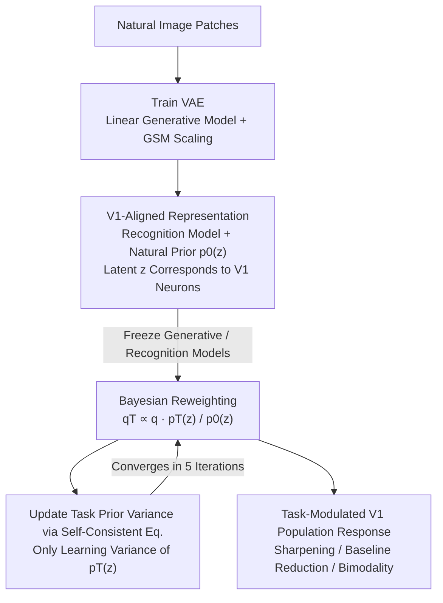

# TAVAE: A VAE with Adaptable Priors Explains Contextual Modulation in the Visual Cortex

**Conference**: ICLR 2026  
**arXiv**: [2602.11956](https://arxiv.org/abs/2602.11956)  
**Code**: [https://github.com/CSNLWigner/mouse-V1-task-priors](https://github.com/CSNLWigner/mouse-V1-task-priors)  
**Area**: Computational Neuroscience / Visual Cortex Modeling  
**Keywords**: Variational Autoencoders, Task Priors, V1, Contextual Modulation, Probabilistic Inference

## TL;DR
A Task-Amortized VAE (TAVAE) is proposed by extending the VAE formalism to explain contextual modulation in mouse V1 by flexibly learning task-specific priors over learned representations. This explains the bimodal population responses observed during orientation discrimination tasks when training stimuli and test stimuli are mismatched.

## Background & Motivation

**Background**: Deep learning models (discriminative and generative) have been successfully used to model neuronal responses in the visual system. Population activity in V1 has been interpreted as representing the posterior of latent variables in a generative model. Priors learned from natural image statistics have been shown to explain certain V1 characteristics.

**Limitations of Prior Work**: V1 responses depend not only on the stimulus itself but are also strongly influenced by non-stimulus attributes such as tasks. Recent studies have found systematic task-specific biases in V1. However, existing models fail to explain these biases—standard VAEs require retraining from scratch to adapt to new tasks, which is data-inefficient and biologically implausible.

**Key Challenge**: Task learning should reuse previously learned visual representations (rather than retraining the entire network for every task) while flexibly introducing task-specific priors to modulate inference.

**Goal**: Develop a VAE framework capable of flexibly acquiring task priors while reusing learned representations, and use it to explain task-related contextual modulation in mouse V1.

**Key Insight**: Maintain the VAE likelihood (generative model) and recognition model unchanged, and reweight the variational posterior using a new task prior via Bayes' rule: $q_T(\mathbf{z}|\mathbf{x}) \propto q(\mathbf{z}|\mathbf{x}) \cdot p_T(\mathbf{z}) / p_0(\mathbf{z})$.

**Core Idea**: Explain task-dependent response biases in V1, including bimodal responses under uncertainty, by learning only task-specific priors without retraining the VAE.

## Method

### Overall Architecture
This paper explains the phenomenon where neuronal responses in mouse V1 are systematically modulated by the task (rather than the stimulus) during orientation discrimination. If the training and test stimuli mismatch, the population response even exhibits counter-intuitive bimodality. The difficulty lies in the fact that adapted standard VAEs would require retraining the entire network, which is data-inefficient and contradicts the biological intuition of "reusing learned representations."

The TAVAE pipeline consists of two stages. In the **first stage**, a VAE is trained on natural images, strictly constrained as a linear generative model with GSM scaling, allowing the learned latent variables $\mathbf{z}$ to correspond one-to-one with V1 neurons. This provides the recognition model $q(\mathbf{z}|\mathbf{x})$ and the natural image prior $p_0(\mathbf{z})$. The **second stage** is core: the generative and recognition models are frozen, and only a task-specific prior $p_T(\mathbf{z})$ is learned. This prior is used to reweight the original posterior via Bayes' rule to obtain the task posterior $q_T$. The solution for $p_T$ is further simplified into a self-consistent equation that depends on the reweighted posterior, converging in 5 iterations. This task posterior is then compared directly with calcium imaging data from 15K neurons.

### Key Designs

**1. Linear Generative Model + GSM Scaling: Aligning VAE Latents with V1 Neurons**

To allow the model to be compared with real V1 recordings, the generative model must resemble V1. The VAE generative model is constrained to a linear form:

$$p(\mathbf{x}|\mathbf{z},s) = \mathcal{N}(\mathbf{x}; e^s \mathbf{A}\mathbf{z}, \sigma^2 \mathbf{I}),$$

The latent space is high-dimensional (1799 dimensions) to match the overcomplete structure of V1. The sparsity of the Laplace prior $p_0(\mathbf{z})$ forces the dictionary $\mathbf{A}$ to learn Gabor-shaped filters, corresponding to the receptive fields of V1 simple cells. An additional Gaussian Scale Mixture (GSM) factor $e^s$ models contrast, providing more reliable inference under low-contrast stimuli. This constraint ensures latents $\mathbf{z}$ correspond to V1 neurons, enabling downstream task-prior modulation comparisons with calcium imaging data.

**2. Bayesian Reweighting of Task Priors: Task-Adapted Posteriors without Retraining**

How to explain task-induced biases with V1-aligned representations? Instead of retraining the whole VAE, TAVAE keeps the likelihood (generative model) and recognition model fixed. It replaces the natural prior $p_0(\mathbf{z})$ with a task prior $p_T(\mathbf{z})$ and reweights the variational posterior via Bayes' rule:

$$q_T(\mathbf{z}|\mathbf{x}) \propto q(\mathbf{z}|\mathbf{x}) \cdot p_T(\mathbf{z}) / p_0(\mathbf{z}).$$

The task prior belongs to the zero-mean Laplace distribution family, where only a variance parameter $\sigma_{T,i}$ is learned for each latent. This corresponds to top-down cortical connections passing task-related prior information back to V1 to modulate inference—the representation remains fixed while the prior changes.

**3. Solving the Self-Consistent Equation: Fixed-Point Iteration for Task Prior Learning**

Learning prior variances is simplified into a fixed-point iteration. By extremizing the task loss (log-likelihood of the prior), the optimal variance satisfies a self-consistent equation:

$$\sigma_{T,i} = \frac{1}{n} \sum_{\mathbf{x}} \mathbb{E}_{q_T}[|z_i|],$$

where the prior variance equals the mean absolute value under the task posterior $q_T$. Since $q_T$ also depends on the prior, this couples with the reweighting step, converging quickly in 5 iterations. This avoids full ELBO optimization, making task adaptation data-efficient.

### Loss & Training

The VAE stage optimizes the standard ELBO. The TAVAE stage freezes ELBO components and only optimizes the log-likelihood of the task prior, solved via the iterative self-consistent equation.

## Key Experimental Results

### Main Results

V1 calcium imaging from 10 mice (15,027 neurons) vs. TAVAE predictions:

| Model Configuration | Population Response Correlation $r$ | Contextual Modulation Correlation |
|---------|-----------------|----------------|
| **TAVAE (45°, 90°)** | **0.78±0.02** | **0.58±0.09** |
| VAE (No task prior) | 0.53±0.12 | — |
| TAVAE (45°, 135°) | 0.54±0.10 | 0.32±0.17 |
| TAVAE (Eager adapter) | 0.53±0.11 | -0.10±0.23 |

### Ablation Study

| Analysis | Key Findings |
|------|---------|
| Task Learning Effects | Population response sharpening + baseline activity reduction—qualitatively consistent with trained vs. naive mice. |
| OOD Stimuli Bimodality | When test stimuli deviate from the training distribution, bimodality appears in population responses—consistent with experiments. |
| Prior Update Trajectory | Changes in bimodal asymmetry across early/late trials in D2 sessions align with gradual prior update predictions. |
| GSM Scaling Ablation | Removing scaling still works but reduces fit quality. |
| Contrast Dependence | Low contrast increases uncertainty → bimodality becomes more pronounced → better match with experiments. |

### Key Findings
- TAVAE task priors lead to enhanced responses for neurons matching task-preferred orientations and suppression for others, resulting in sharpening.
- The most striking finding: when the test stimulus orientation mismatches the prior, a counter-intuitive bimodality appears in the population response (a dip at the stimulus orientation and peaks on either side), a direct signature of uncertainty in probabilistic inference.
- Evidence of prior update speed: session-based trial analysis shows the prior gradually shifting from (45°, 135°) toward (45°, 90°).
- The likelihood function and prior strength can be reverse-engineered from the position of the population response modes.

## Highlights & Insights
- **Bimodality as a Signature of Uncertainty**: While the posterior is unimodal in high-dimensional latent space, the projection onto 1D orientation space becomes bimodal, revealing how multi-alternative uncertainty manifests at the population level.
- **Extremely Efficient Task Adaptation**: Learning only prior variance via 5 iterations of a self-consistent equation without modifying recognition or generative models is computationally efficient and biologically plausible.
- **Prediction-First Paradigm**: Instead of just fitting neural data, the model predicts phenomena from normative principles and validates them on 15,027 neurons.
- **Methodology for Reverse Engineering**: Provides a way to infer likelihood width and prior strength from the offset of population response modes.

## Limitations & Future Work
- The linear generative model is oversimplified; V1 computation likely involves non-linear components.
- The task prior assumes independent residues and zero-mean Laplace distributions, limiting the modeling of correlations across features.
- Limited temporal resolution of calcium imaging prevents verification of "sampling" vs. "MAP estimation" posterior representations.
- Validated only on simple orientation discrimination tasks; not yet extended to complex visual tasks.

## Related Work & Insights
- **vs. Standard VAEs**: Standard VAEs only have natural image priors and cannot explain task-induced biases. TAVAE explains these without changing representations.
- **vs. Csikor et al. (2025)**: While they used hierarchical VAEs for natural image contextual priors, TAVAE extends this to task-specific priors.
- **Implications for VLM/Multimodal Research**: TAVAE's "preserve representation + adapt prior" approach is analogous to parameter-efficient fine-tuning or prompt modulation.

## Rating
- Novelty: ⭐⭐⭐⭐⭐ Elegant theory; striking prediction and validation of bimodality.
- Experimental Thoroughness: ⭐⭐⭐⭐ Large-scale neural data + comparison of multiple model variants.
- Writing Quality: ⭐⭐⭐⭐ Strong integration of theory/experiment, requires neuroscience background.
- Value: ⭐⭐⭐⭐⭐ Significant advance for computational neuroscience and VAE applications.

<!-- RELATED:START -->

## Related Papers

- [\[ICLR 2026\] Eliminating VAE for Fast and High-Resolution Generative Detail Restoration](eliminating_vae_for_fast_and_high-resolution_generative_detail_restoration.md)
- [\[CVPR 2026\] ViHOI: Human-Object Interaction Synthesis with Visual Priors](../../CVPR2026/image_generation/vihoi_human-object_interaction_synthesis_with_visual_priors.md)
- [\[ICLR 2026\] SESaMo: Symmetry-Enforcing Stochastic Modulation for Normalizing Flows](sesamo_symmetry-enforcing_stochastic_modulation_for_normalizing_flows.md)
- [\[CVPR 2025\] Learning Visual Generative Priors without Text](../../CVPR2025/image_generation/learning_visual_generative_priors_without_text.md)
- [\[ICLR 2026\] SongEcho: Towards Cover Song Generation via Instance-Adaptive Element-wise Linear Modulation](songecho_towards_cover_song_generation_via_instance-adaptive_element-wise_linear.md)

<!-- RELATED:END -->
