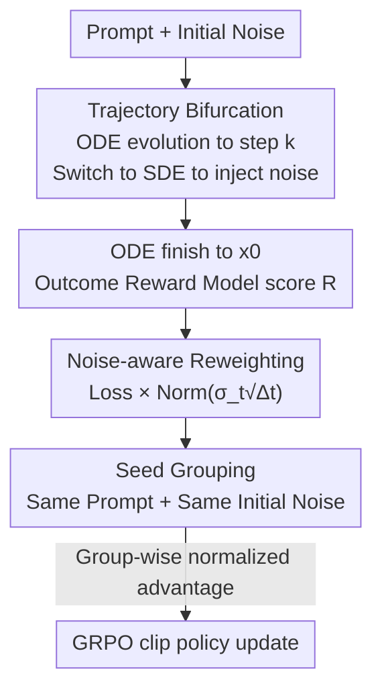

# TempFlow-GRPO: When Timing Matters for GRPO in Flow Models

**Conference**: ICLR 2026  
**OpenReview**: [https://openreview.net/forum?id=7mCo3R3Wyn](https://openreview.net/forum?id=7mCo3R3Wyn)  
**Code**: TBD  
**Area**: Diffusion Models / Image Generation / Reinforcement Learning Alignment  
**Keywords**: Flow Matching, GRPO, Text-to-Image Alignment, Process Reward, Time-Aware Optimization

## TL;DR
TempFlow-GRPO identifies that "treating all denoising steps equally" in existing Flow-GRPO training is a core bottleneck. By using a triad of "process rewards via trajectory bifurcation + noise-level reweighting + seed grouping," it matches optimization intensity to the real exploration potential of each step, achieving SOTA on GenEval and PickScore with significantly fewer steps (GenEval 0.63→0.97, ~10× training efficiency).

## Background & Motivation
**Background**: Flow matching models for text-to-image (e.g., SD3.5, FLUX.1-dev) already exhibit high image quality, but aligning outputs with human preferences still relies on reinforcement learning (RL). Current "Diffusion RL" approaches like Flow-GRPO and DanceGRPO adapt GRPO to flow models: sampling a group of images for a prompt, scoring them with a reward model, calculating advantages via group-wise normalization, and performing policy optimization on the entire reverse trajectory.

**Limitations of Prior Work**: These methods treat multi-step generation as a "black box," applying **completely uniform** optimization pressure across all time steps, with rewards provided only once at the trajectory's end. Empirical observations by the authors reveal this ignores a critical fact: the "importance" of different denoising steps varies significantly. In controlled experiments applying SDE perturbations to single time steps, the final reward standard deviation peaks during early structural decision phases (steps 0-2) and nearly vanishes during late refinement phases (steps 6-8). Essentially, early errors are catastrophic, while late perturbations have minimal impact, yet Flow-GRPO treats both identically, wasting high-value early exploration opportunities.

**Key Challenge**: Implementing fine-grained credit assignment requires knowing the quality of intermediate states. However, intermediate states are "semi-denoised" images with vague semantics, making the training of specialized Process Reward Models (PRMs, such as SPO) extremely difficult and expensive. Conversely, using only sparse terminal rewards without process rewards fails to distinguish between critical early decisions and late micro-adjustments. How can terminal rewards be accurately attributed to specific intermediate actions without training an intermediate reward model, while making optimization intensity adaptive to the exploration capability of each step?

**Key Insight**: The authors exploit the unique property of flow matching: the "deterministic ODE / stochastic SDE" interchangeability. If a trajectory evolves deterministically for the most part and injects randomness only at a specific step, then the entire variance of the final reward can be "attributed" to the exploration result of that single bifurcation point—effectively creating a process reward signal for free. Furthermore, observing that the "reward standard deviation curve" aligns closely with the "noise level curve," the noise level itself can serve as a natural proxy for exploration potential at each step.

**Core Idea**: Upgrade GRPO from "time-agnostic" to "time-aware" by using "trajectory bifurcation" for precise credit attribution, "noise-aware reweighting" to match gradient contributions to exploration potential, and "seed grouping" to isolate interference from initial noise.

## Method

### Overall Architecture
TempFlow-GRPO is built upon Flow-GRPO: given a prompt, the flow model samples a group of images, scores them using off-the-shelf **Outcome Reward Models** (PickScore / GenEval / HPSv3), calculates advantages via group-wise normalization, and performs PPO-style clipped optimization. Its modifications focus on three areas: (1) The sampling phase no longer uses SDE for the entire trajectory; instead, it uses "ODE evolution → switch to SDE to inject noise at a selected bifurcation step → ODE deterministic finish," allowing exploration results at that step to be attributed individually. (2) The loss phase weights each time step proportionally to the noise level $\sigma_t\sqrt{\Delta t}$, amplifying learning signals for early high-noise steps. (3) The grouping phase adds a "same initial noise" constraint on top of "same prompt" to attribute reward fluctuations strictly to the bifurcation exploration itself.

### Key Designs

**1. Trajectory Bifurcation for Process Rewards: Precise Attribution of Terminal Rewards**

Traditional process rewards require a specialized PRM to score intermediate states $x_t$, which is difficult and expensive. The authors' alternative elegantly utilizes the "deterministic + stochastic" switchable sampling of flow models: a trajectory starts from initial noise $x_T$ using a deterministic ODE ($dx_t = v_t dt$) and switches to SDE to inject randomness $x_{k-1} = \text{SDE}(x_k, \epsilon)$ at a specified bifurcation step $k$, then resumes ODE evolution until $x_0$. Since stochasticity is injected only at step $k$, **all variance in the final reward and all parameter-related improvements can only be attributed to the outcome of noise injection at step $k$** (referred to as the "Credit Positioning Theorem"). In practice, the reward for step $k$ is replaced with $R(\text{ODE}_{k-1}(\text{SDE}(x_k, \epsilon)), c)$, using the "ODE-SDE-ODE" result to score that specific step. This converts sparse terminal rewards into locatable process reward signals without new reward models.

**2. Noise-Aware Policy Reweighting: Matching Gradient Contributions to Exploration Potential**

Process rewards alone are insufficient, as $T$ potential bifurcation points across a trajectory have vastly different characteristics: the noise magnitude $\sigma_t\sqrt{\Delta t}$ injected by SDE is large in early stages and approaches zero in late refinement. Visualization shows that "reward standard deviation" and "noise level" curves align, suggesting noise level is an intrinsic proxy for exploration capability (and risk). More critically, theoretical derivation shows that after expanding the policy gradient, the gradient scale of standard GRPO is proportional to $\sqrt{\Delta k(1-k)/k}$, causing **low-noise late steps to dominate optimization**—they receive the largest gradient weights despite having the least impact on content. The authors correct this mismatch by weighting the loss with the noise level:

$$J_{\text{policy}}(\theta) = \frac{1}{G}\sum_{i=1}^{G}\frac{1}{T}\sum_{t=0}^{T-1}\text{Norm}(\sigma_t\sqrt{\Delta t})\big(\min(r_t^i(\theta)\hat{A}_t^i,\ \text{clip}(r_t^i(\theta), 1-\epsilon, 1+\epsilon)\hat{A}_t^i)\big)$$

After reweighting, the scale term simplifies to be proportional to step size $\Delta k$; when flow shift is 1, gradient contributions across time steps are balanced. Intuitively, this amplifies learning signals during early high-noise phases to encourage structural exploration while performing gentle updates in late low-noise phases to prevent aggressive exploration from damaging high-fidelity details.

**3. Seed Grouping: Isolating Initial Noise for Pure Exploration Signals**

While GRPO normally groups by "same prompt" and Reinforce++ introduces batch-level normalization, TempFlow-GRPO performs $K$ explorations at each step via bifurcation. If samples in the same group have different initial noises, reward differences are confounded by "initial noise luck" rather than "exploration quality." The authors propose that trajectories in the same group must share the **same initial noise**. By controlling the initial noise, reward changes can be purely attributed to the exploration during bifurcation, ensuring cleaner credit assignment for the first two designs. Experiments (Figure 6) show that TempFlow-GRPO consistently outperforms Flow-GRPO regardless of grouping strategy, with seed grouping providing an additional ~2% gain.

### Loss & Training
The core loss is the noise-weighted GRPO objective (Eq. 7), maintaining the PPO clip mechanism and KL regularization against a reference policy. For fair comparison with Flow-GRPO, step weights are normalized to a mean of 1. The configuration uses 4 initial noise seeds × bifurcation factor $K=6$, totaling a group size of 24 (matching Flow-GRPO's config), with 48 groups. Base models include SD3.5-Medium and FLUX.1-dev (1024 resolution), using GenEval reward, PickScore, and HPSv3.

## Key Experimental Results

### Main Results

GenEval Synthetic Image Generation (base = SD3.5-Medium):

| Method | Step | Overall ↑ | Two Obj. ↑ | Counting ↑ | Position ↑ | Attr. Binding ↑ |
|------|------|-----------|------------|------------|------------|-----------------|
| SD3.5-M (base) | - | 0.63 | 0.78 | 0.50 | 0.24 | 0.52 |
| GPT-4o | - | 0.84 | 0.92 | 0.85 | 0.75 | 0.61 |
| Flow-GRPO | 3800 | 0.88 | 0.96 | 0.90 | 0.83 | 0.78 |
| Flow-GRPO | 5600 | 0.95 | 0.99 | 0.95 | 0.99 | 0.86 |
| **TempFlow-GRPO** | **3800** | **0.97** | **1.00** | **0.96** | **0.99** | **0.91** |

Key comparison: TempFlow-GRPO achieves 0.97 at 3800 steps, whereas Flow-GRPO achieves only 0.88 under the same conditions; to reach 0.95, TempFlow requires ~2000 steps, while Flow-GRPO requires ~5600 steps.

Human Preference Alignment (PickScore / HPSv3):

| Setting | Conclusion |
|------|------|
| PickScore (SD3.5-M) | ~1.7% higher than original Flow-GRPO, ~1.0% higher than improved baseline Flow-GRPO(Prompt); matches Flow-GRPO in 100-200 steps |
| GPU Hours | ~10× training efficiency (to reach equivalent PickScore) |
| HPSv3 (FLUX.1-dev, 1024) | Matches Flow-GRPO at 300 steps within only 80 steps, with lower and more stable KL loss |

### Ablation Study

| Config (Incremental) | GenEval (at ~1200 steps) | Note |
|------------------|------------------------|------|
| Flow-GRPO (Prompt) | ~0.82 | Improved baseline (group std stabilization) |
| + Trajectory Bifurcation | + ~5% | Introduces process rewards |
| + Noise-Aware Reweighting | Increases to ~0.92 | ~10% gain over Flow-GRPO; largest single improvement |
| + Seed Grouping | + ~2% | Isolates initial noise |

Bifurcation configuration (fixed group size 24): Among 2×12 / 4×6 / 6×4, more initial noises lead to faster early convergence, while more bifurcations lead to a higher late-stage ceiling; **4×6** is selected as the default compromise.

### Key Findings
- **Noise-aware reweighting is the primary contributor**: This single modification increases performance on GenEval from 0.82 to 0.92, validating the theoretical analysis that "low-noise late steps dominating optimization" was the true bottleneck.
- **Early steps are high-value exploration zones**: Reward standard deviation peaks at steps 0-2 and vanishes at steps 6-8, matching the noise level curve and providing empirical support for noise weighting.
- **Significant efficiency gains**: TempFlow-GRPO generally requires 1/4 to 1/10 of the steps/compute compared to Flow-GRPO to reach equivalent performance, with more stable KL loss.

## Highlights & Insights
- **Zero-cost process rewards via sampler properties**: Instead of training PRMs, relying on ODE/SDE switchability and single-step noise injection turns sparse terminal rewards into locatable signals—an ingenious way to bypass the "hard-to-score intermediate states" problem, transferable to any deterministic/stochastic switchable generative RL.
- **Theory explains "why uniform optimization is wrong"**: Policy gradient expansion reveals that standard GRPO's scale term $\sqrt{\Delta k(1-k)/k}$ allows low-noise steps to dominate. Noise weighting simplifies this to $\Delta k$, balancing contributions when flow shift=1—a derivation-backed rather than heuristic motivation.
- **Orthogonal and complementary designs**: Bifurcation provides the "signal," reweighting provides the "intensity," and seed grouping provides "clean control." Ablations show cumulative gains, making it easy to integrate into existing flow-RL frameworks.

## Limitations & Future Work
- The authors acknowledge focus on **algorithmic innovation rather than reward model enhancement**; future work involves stronger multimodal rewards and comprehensive reward frameworks.
- Potential Issue: The "credit positioning" assumption relies on "complete determinism except for the bifurcation point." In practice, ODE solvers for flow models have discretization errors, making it questionable if 100% of variance originates strictly from the bifurcation.
- Grouping configurations like 4×6 were tuned for a fixed group size of 24; whether these need re-tuning for different base models/resolutions/reward models is not fully explored.

## Related Work & Insights
- **vs. Flow-GRPO**: Flow-GRPO introduced online RL to flow models but used uniform optimization and sparse terminal rewards. This work adds "time-aware" process rewards and noise weighting as direct improvements.
- **vs. SPO (Process Reward path)**: SPO trains step-wise preference models for noisy/clean images, but intermediate semantics are vague and training is expensive. This work bypasses PRMs by attributing outcome rewards to single steps.
- **vs. DanceGRPO**: Also a GRPO method for flow/diffusion; the core difference remains "time-uniform vs. time-aware."

## Rating
- Novelty: ⭐⭐⭐⭐⭐ Elegant use of sampler properties for zero-training process rewards + theoretical derivation for noise weighting.
- Experimental Thoroughness: ⭐⭐⭐⭐ Coverage of GenEval/PickScore/HPSv3 and SD3.5/FLUX; clear ablations, though results are heavily represented by curves rather than tables.
- Writing Quality: ⭐⭐⭐⭐ Solid motivation-observation-method-theory chain; the "astronaut exploring planets" analogy is intuitive.
- Value: ⭐⭐⭐⭐⭐ ~10× training efficiency + SOTA results; immediate practical value for flow-RL alignment.

<!-- RELATED:START -->

## Related Papers

- [\[CVPR 2026\] Neighbor GRPO: Contrastive ODE Policy Optimization Aligns Flow Models](../../CVPR2026/image_generation/neighbor_grpo_contrastive_ode_policy_optimization_aligns_flow_models.md)
- [\[ICLR 2026\] TreeGRPO: Tree-Advantage GRPO for Online RL Post-Training of Diffusion Models](treegrpo_tree-advantage_grpo_for_online_rl_post-training_of_diffusion_models.md)
- [\[CVPR 2026\] GRPO-Guard: Mitigating Implicit Over-Optimization in Flow Matching via Regulated Clipping](../../CVPR2026/image_generation/grpo-guard_mitigating_implicit_over-optimization_in_flow_matching_via_regulated_.md)
- [\[CVPR 2026\] Fine-Grained GRPO for Precise Preference Alignment in Flow Models](../../CVPR2026/image_generation/fine-grained_grpo_for_precise_preference_alignment_in_flow_models.md)
- [\[ICML 2026\] LithoGRPO: Fast Inverse Lithography via GRPO Reinforced Flow Matching](../../ICML2026/image_generation/lithogrpo_fast_inverse_lithography_via_grpo_reinforced_flow_matching.md)

<!-- RELATED:END -->
