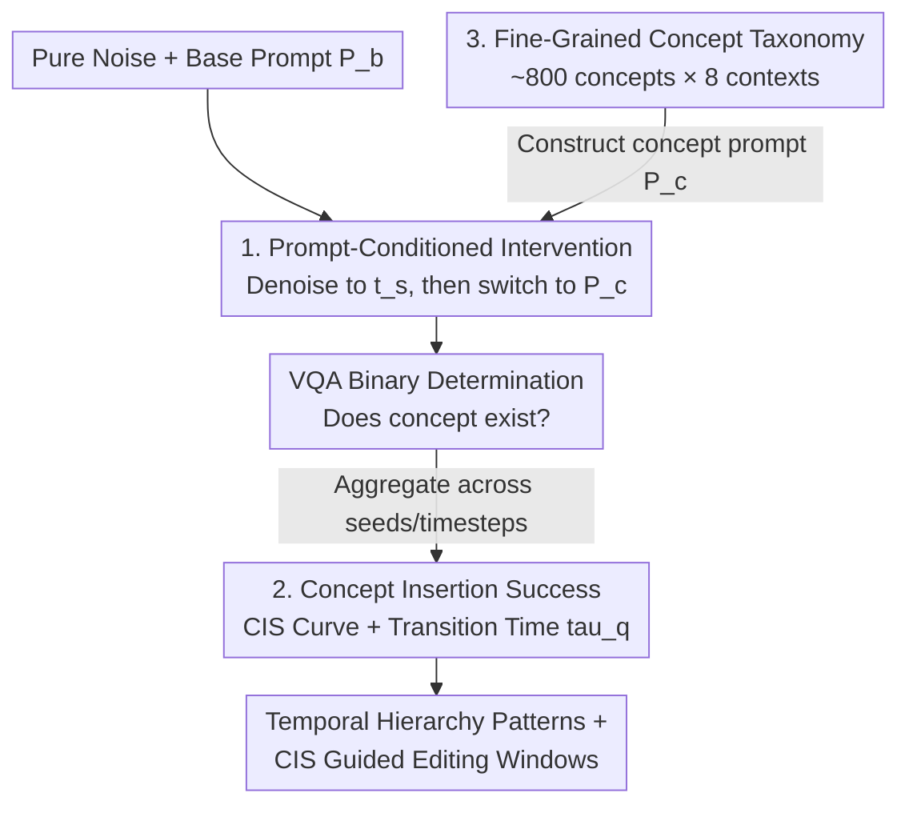

# Temporal Concept Dynamics in Diffusion Models via Prompt-Conditioned Interventions

**Conference**: ICLR 2026  
**arXiv**: [2512.08486](https://arxiv.org/abs/2512.08486)  
**Code**: [PCI Framework](https://github.com/agoerguen/PCI)  
**Area**: Diffusion Models / Interpretability / Image Editing  
**Keywords**: Temporal Concept Dynamics, Prompt-Conditioned Intervention, Concept Insertion Success, Diffusion Interpretability, Training-free Editing

## TL;DR

The PCI (Prompt-Conditioned Intervention) framework is proposed to quantify when concepts are fixed in diffusion models by switching text prompts at different timesteps of the denoising trajectory, applying these findings to time-aware image editing.

## Background & Motivation

Diffusion models are typically evaluated only by their final outputs, yet the generation process is a dynamic evolution along a trajectory:

**Temporal dynamics are overlooked**: Most existing interpretability methods focus on "where" (attribution maps) or "what" (concept bottlenecks) rather than "when".

**Limitations of Prior Work**:
   - Attribution maps locate concepts but do not explain when they emerge.
   - Concept bottleneck models require additional training and may not be faithful to the original model.
   - Sparse autoencoders (SAEs) are often evaluated at single timesteps.

**Editing lacks time-awareness**: Current editing methods lack knowledge of when intervention is most effective.

**Core Problem**: At what point does noise transform into specific concepts (e.g., age, weather) and become fixed within the denoising trajectory?

## Method

### Overall Architecture

PCI transforms the question of "when a concept is fixed" into a measurable perturbation experiment: a denoising trajectory is first followed using a base prompt without the target concept, then the prompt is suddenly switched to a version containing the concept at a specific timestep to observe if the concept emerges in the final image. By aggregating statistics across numerous random seeds and switching intervals, a Concept Insertion Success (CIS) curve is generated. The shape of this curve characterizes the temporal dynamics of the concept. Transition time scalars derived from the curve allow for cross-concept and cross-model comparisons and guide the selection of optimal timesteps for editing. The entire process is training-free, model-agnostic, and involves only text condition interventions without modifying weights or reading internal activations.

### Key Designs

**1. Prompt-Conditioned Intervention: Probing plasticity via mid-trajectory switching**

To determine the fixation point of a concept, PCI tests if inserting the concept at a specific timestep is still effective. The process denoises from pure noise to an intermediate state $\mathbf{x}_{t_s} = \text{Denoise}(\mathbf{x}_T, P_b)$ using a base prompt $P_b$. At the switching time $t_s$, the condition is replaced with the concept prompt $P_c$ (base prompt + target concept) to complete the denoising $\mathbf{x}_0(P_b \xrightarrow{t_s} P_c) = \text{Denoise}(\mathbf{x}_{t_s}, P_c)$. Early $t_s$ usually results in success, while late $t_s$ results in failure, indicating lost plasticity. A VQA model (Qwen-VL-3B) performs binary detection on the output to determine concept presence.

**2. Concept Insertion Success (CIS) and Transition Windows: Quantifying curves into scalars**

CIS is defined as the probability that a concept appears in the final image after being inserted at timestep $t_s$, averaged over various seeds and base prompts. Since CIS is monotonic with respect to $t_s$, transition times $\tau_q$ (the timestep where the curve first reaches level $q$) are well-defined. The study uses $\tau_{50}$ and $\tau_{70}$ to denote when a concept "starts to fixate" and is "essentially locked." The transition window width $W_{70 \to 50} = |\tau_{70} - \tau_{50}|$ quantifies the speed of fixation: narrow windows imply rapid transition (e.g., global style), while wide windows suggest a longer editable margin (e.g., detailed accessories).

**3. Fine-Grained Concept Taxonomy: Ensuring broad generalizability**

To ensure findings are not anecdotal, the authors constructed approximately 800 fine-grained concept descriptions spanning demographics (gender, race, age), objects (animals, artifacts, natural elements), human attributes (clothing, accessories, physical traits), as well as actions, environments, and styles. Each concept is evaluated within 8 different contexts to analyze how context affects fixation time, providing the data foundation for discovering that out-of-distribution (OOD) combinations fixate earlier.

## Method

### Main Results

#### Temporal Hierarchy Across Categories

| Concept Type | Fixation Time | Characteristics |
|:---|:---|:---|
| Global Factors (Style, Time, Weather, Season, Color) | **Early** | Narrow transition window |
| Human Attributes (Age, Gender) | **Intermediate** | Medium window |
| Detail Attributes (Accessories) | **Mid-Late** | Wide window |
| OOD Concepts (A horse in a living room) | **Abnormally Early** | Narrow and fragile window |

#### Cross-Model Differences

| Model Type | Characteristics |
|:---|:---|
| Diffusion Models (SD 2.1, SDXL) | Retain more late-stage flexibility |
| Rectified Flow Models (SD 3.5, FLUX) | Earlier concept fixation, steeper transitions |
| PixArt-alpha (DiT) | Intermediate behavior |

#### Context Dependency

- The same concept fixates at significantly different times depending on the context.
- Example: "Baby" fixates later in a "playground" than at a "bus stop" (more natural context).
- Example: "Surgical scrubs" fixate later in a "hospital" than on a "street".
- **OOD concepts fixate earlier**: Uncommon concept-context pairs lead to earlier locking.

### Image Editing Applications

| Method | CLIP_img↑ | CLIP_txt↑ | CLIP_dir↑ |
|:---|:---|:---|:---|
| NTI+P2P | 0.867 | 0.222 | 0.098 |
| Stable Flow | 0.832 | 0.215 | 0.063 |
| PCI-$\tau_{50}$ | 0.889 | **0.224** | **0.139** |
| PCI-$\tau_{60}$ | 0.863 | **0.229** | **0.153** |
| PCI-$\tau_{70}$ | 0.835 | **0.234** | **0.168** |

Editing windows guided by CIS $[\tau_{50}, \tau_{70}]$ achieve the best balance between editability and identity preservation across all metrics.

### Ablation Study

| Setting | Effect |
|:---|:---|
| Different VQA Models | Consistent results |
| Prompt Phrasing | Robust |
| Number of Seeds | Seed noise is suppressed after averaging |

## Highlights & Insights

1. **Pioneering Temporal Analysis Tool**: Transforms diffusion time into an interpretable axis for analysis.
2. **Discovery of Temporal Patterns**: Reveals a fixation hierarchy of Global → Human → Details.
3. **Architectural Insights**: Cross-model comparisons highlight temporal differences between Rectified Flow and Diffusion models.
4. **Practical Editing**: CIS-guided editing outperforms SOTA methods across various metrics.
5. **Zero Training**: The framework requires no training or optimization.

## Limitations & Future Work

1. CIS depends on the VQA model (Qwen-VL-3B), which may introduce evaluation bias.
2. Binary concept determination (Yes/No) may be too coarse.
3. Analysis is focused on Text-to-Image; temporal dynamics in video diffusion remain unexplored.
4. Multi-concept interaction analysis is still preliminary.
5. Automating CIS-guided editing requires running the full CIS curve first.

## Related Work

- **Static Interpretability**: Attribution maps (Tang 2022), Concept Bottlenecks (Ismail 2024).
- **Dynamic Interpretability**: P2P (Hertz 2023), Sparse Autoencoders (Tinaz 2025).
- **Diffusion Editing**: NTI+P2P, Stable Flow, SDEdit.

## Rating

- **Novelty**: ⭐⭐⭐⭐⭐ — A new paradigm for temporal dimension analysis.
- **Value**: ⭐⭐⭐⭐ — Practical for editing and provides valuable insights.
- **Experimental Thoroughness**: ⭐⭐⭐⭐⭐ — Extremely comprehensive with 800+ concepts and 5 models.
- **Writing Quality**: ⭐⭐⭐⭐⭐ — Clear structure, interesting findings, and precise delivery.

<!-- RELATED:START -->

## Related Papers

- [\[ICLR 2026\] Stage-wise Dynamics of Classifier-Free Guidance in Diffusion Models](stage-wise_dynamics_of_classifier-free_guidance_in_diffusion_models.md)
- [\[ICLR 2026\] Intention-Conditioned Flow Occupancy Models](intention-conditioned_flow_occupancy_models.md)
- [\[ICLR 2026\] SPEED: Scalable, Precise, and Efficient Concept Erasure for Diffusion Models](speed_scalable_precise_and_efficient_concept_erasure_for_diffusion_models.md)
- [\[ICML 2026\] Temporal Difference Learning for Diffusion Models](../../ICML2026/image_generation/temporal_difference_learning_for_diffusion_models.md)
- [\[ICLR 2026\] Pareto-Conditioned Diffusion Models for Offline Multi-Objective Optimization](pareto-conditioned_diffusion_models_for_offline_multi-objective_optimization.md)

<!-- RELATED:END -->
