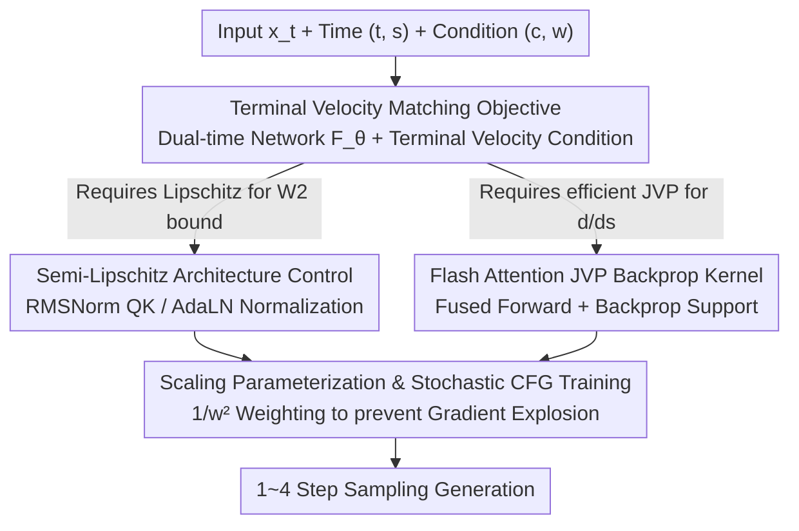

# Terminal Velocity Matching

**Conference**: ICLR 2026  
**OpenReview**: [https://openreview.net/forum?id=plISxvVf6j](https://openreview.net/forum?id=plISxvVf6j)  
**Code**: None (Large-scale text-to-image results available at lumalabs.ai/blog/engineering/tvm)  
**Area**: Diffusion Models / Image Generation  
**Keywords**: Flow Matching, Single-step generation, Terminal velocity, 2-Wasserstein bound, JVP

## TL;DR
This paper proposes Terminal Velocity Matching (TVM), which shifts Flow Matching from "matching velocity at the trajectory start" to "matching velocity at the trajectory end." This allows a single-stage training process to directly learn the displacement mapping between any two time steps with a provable upper bound on the 2-Wasserstein distance. Combined with a semi-Lipschitz architectural modification and a Flash Attention JVP kernel supporting backpropagation, it achieves SOTA results for from-scratch few-step generation on ImageNet-256 (1-step 3.29 FID, 4-step 1.99 FID).

## Background & Motivation

**Background**: Diffusion models and Flow Matching (FM) are currently the mainstream paradigms for image/video generation. However, they essentially learn an instantaneous velocity field $u(x_t,t)$, requiring dozens of iterative steps (e.g., 50 steps) with an ODE solver during inference to produce high-quality samples, which is particularly expensive for high-dimensional data like video.

**Limitations of Prior Work**: To achieve few-step inference, recent works have attempted to directly learn the "integrated trajectory" in a single stage rather than relying on ODE solvers. One category includes consistency-based methods (CT, sCT) and trajectory matching methods (MeanFlow), which predict or match the derivatives of trajectories but lack an **explicit connection to distribution matching**—the latter being the fundamental measure of generative model quality. Another category, such as IMM, provides distribution-level guarantees using Maximum Mean Discrepancy (MMD), but requires **multiple particles per training step**, making it difficult to scale to large models or high-dimensional data (especially critical when memory limits batch size per GPU).

**Key Challenge**: Current few-step generation methods either provide distribution-level theoretical guarantees but require multiple particles (difficult to scale), or are single-sample scalable but lack distribution guarantees. These two aspects are hard to reconcile. Furthermore, these methods often place constraints at the trajectory **start** (matching the derivative of instantaneous velocity at $s=t$), which requires passing the highly volatile $u(x_t,t)$ into a Jacobian-Vector Product (JVP), leading to training instability.

**Goal**: To learn the displacement mapping for any $t\to s$ in a single-stage, single-sample setting without the need for curriculum learning, while providing provable distribution-level guarantees.

**Key Insight**: The authors observe that the net displacement $f(x_t,t,s)=\psi(x_t,t,s)-x_t$ must simultaneously satisfy two conditions: it equals the integral of the true velocity field from $t$ to $s$, and its derivative with respect to $s$ at $s=t$ equals the instantaneous velocity $u(x_t,t)$. Generalizing the derivative with respect to $s$ to any $s$ (rather than just $s=t$) yields a "**Terminal Velocity Condition**": $\frac{d}{ds}f(x_t,t,s)=u(\psi(x_t,t,s),s)$. This holds for any true displacement and bypasses explicit ODE integration during training.

**Core Idea**: The core idea is to **move the matching from the start of the trajectory to the end of the trajectory** (terminal velocity rather than initial velocity). A dual-time network is used to represent both the instantaneous velocity field and the displacement mapping, ensuring the training objective provably upper-bounds the 2-Wasserstein distance between the data distribution and the model distribution.

## Method

### Overall Architecture

TVM utilizes **a single** dual-time conditional network $F_\theta(x_t,t,s)$ to perform two tasks: when $s=t$, it reduces to the instantaneous velocity $u_\theta(x_t,t)=F_\theta(x_t,t,t)$; when $s\neq t$, it provides the displacement for jumping from $t$ to $s$, defined as $f_\theta(x_t,t,s)=(s-t)F_\theta(x_t,t,s)$ (the prefix $(s-t)$ ensures the boundary condition of zero displacement when $t=s$). During training, two terms are optimized simultaneously: one forces the instantaneous velocity to approximate the true velocity (standard FM loss, serving as the boundary case of the terminal velocity condition at zero displacement), and the other aligns the "terminal velocity" $\frac{d}{ds}f_\theta$ of the displacement mapping with the true velocity as proxied by the network itself. The overall objective provably upper-bounds the 2-Wasserstein distance, provided the network is Lipschitz continuous—a property DiT does not satisfy, necessitating architectural modifications. Furthermore, since terminal velocity involves calculating $\frac{d}{ds}$ (i.e., JVP) for the network, a specialized efficient kernel is required for scaling.

The training flow is illustrated below:

### Key Designs

**1. Terminal Velocity Matching Objective: Moving constraints to the end for distribution guarantees**

Existing trajectory matching methods (e.g., MeanFlow) compute $\frac{d}{dt}$ of $f_\theta$ at the trajectory **start** $t$ and match it against $-u(x_t,t)$, which requires passing the volatile true velocity $u(x_t,t)$ into a JVP, and the relationship with distribution divergence remains ambiguous. TVM instead computes the derivative at the **endpoint** $s$, utilizing the identity $\frac{d}{ds}f(x_t,t,s)=u(\psi(x_t,t,s),s)$. Since both true displacement and true velocity are unknown, the authors use the network itself as a proxy: $u(\psi(x_t,t,s),s)\approx u_\theta(x_t+f_\theta(x_t,t,s),s)$. Thus, the terminal velocity error can be jointly optimized with the FM loss (where FM is the boundary case for zero displacement). The per-step objective is:

$$\mathcal{L}^{t,s}_{\text{TVM}}(\theta)=\mathbb{E}\Big[\big\|\tfrac{d}{ds}f_\theta(x_t,t,s)-u_\theta(x_t+f_\theta(x_t,t,s),s)\big\|_2^2+\big\|u_\theta(x_s,s)-v_s\big\|_2^2\Big],$$

where the first term satisfies "displacement = integral of velocity" and the second satisfies "instantaneous velocity = true velocity." The key benefit is given in Theorem 1: when $u_\theta(\cdot,s)$ is Lipschitz continuous for all $s$ (with constant $L(s)$), the weighted integral of this objective upper-bounds the 2-Wasserstein distance between the model push-forward distribution $f^\theta_{t\to0\#}p_t$ and the data distribution $p_0$: $W_2^2\le\int_0^t\lambda[L](s)\,\mathcal{L}^{t,s}_{\text{TVM}}(\theta)\,ds+C$. This means TVM achieves distribution-level approximation guarantees **without multi-particle sampling**, which is the core distinction from MeanFlow (no distribution guarantee) and IMM (requires multiple particles). In practice, to avoid calculating the weight function $\lambda[L]$, $(t,s)$ are sampled randomly to take the expectation, and an EMA-weighted stop-gradient proxy objective $\hat{\mathcal{L}}^{t,s}_{\text{TVM}}$ is constructed, using an indicator function $\mathbb{1}_{t\neq s}$ to ensure strict reduction to the FM loss when $t=s$.

**2. Semi-Lipschitz Architecture Control: Adding Lipschitz properties to DiT**

The $W_2$ bound in Theorem 1 depends on $u_\theta$ being Lipschitz continuous. However, Scaled Dot-Product Attention (SDPA) and LayerNorm in modern Transformers, including DiT, do not satisfy this property—manifesting as spikes in network activations (e.g., time embedding layers) and training divergence (Fig. 4). The authors' strategy is to implement **minimal, non-restrictive** changes rather than globally constraining the Lipschitz constant: replacing QK-Norm with provably Lipschitz RMSNorm (equivalent to L2 QK-Norm with learnable scaling); replacing all LayerNorms with $\text{RMSNorm}^-(\cdot)$ without learnable parameters; and for DiT's AdaLN—whose Lipschitz constant depends on the time modulation magnitude $a(t)$ which can grow unboundedly—applying $\text{RMSNorm}^-$ to the modulation parameters as well:

$$\text{AdaLN}(x,t)=\text{RMSNorm}^-(x)\odot\text{RMSNorm}^-(a(t))+\text{RMSNorm}^-(b(t)).$$

Additionally, Lipschitz initialization is used for all linear layers except time embeddings. Notably, these changes only **control key layers susceptible to instability** (hence "semi-Lipschitz"). The authors found that this partial control is sufficient in practice to smooth activations and stabilize training.

**3. Flash Attention JVP Backprop Kernel: Scalability for terminal velocity calculations**

The calculation of terminal velocity $\frac{d}{ds}f_\theta(x_t,t,s)=F_\theta(x_t,t,s)+(s-t)\partial_s F_\theta(x_t,t,s)$ requires a Jacobian-Vector Product (JVP) for $\partial_s F_\theta$. PyTorch and open-source Flash Attention have poor support for JVP in SDPA. Critically, unlike sCT or MeanFlow which only perform forward JVP, TVM requires **backpropagating gradients through** the JVP term $\partial_s F_\theta$. To address this, the authors implemented an efficient Flash Attention kernel that: (i) fuses JVP with the forward pass, (ii) consumes significantly less memory than naive PyTorch attention, and (iii) supports backpropagation through the JVP results. Tests show up to a 65% speedup and significant memory reduction compared to standard PyTorch operators, allowing TVM to scale with Transformer size. Regarding optimizer details: since JVP introduces high-order gradients, the default AdamW $\beta_2=0.999$ causes loss oscillations. Borrowing from language modeling experience, using $\beta_2=0.95$ accelerates second-moment updates, resulting in much smoother terminal velocity error curves (Fig. 5).

**4. Scaling Parameterization & Stochastic CFG Training: Stabilizing gradients under guidance**

With classifier-free guidance (CFG), the true velocity magnitude grows linearly with the weight $w$. Directly predicting velocity may be suboptimal. The authors utilize a **scaling parameterization** $f_\theta(x_t,t,s,c,w)=(s-t)\,w\,F_\theta(\cdot)$, allowing $u_\theta=wF_\theta$ to naturally scale with $w$. During training, CFG weights are sampled randomly and $w$ is fed directly into the objective, with the loss weighted by $1/w^2$ to prevent gradient explosion as the true velocity magnitude $\propto w$:

$$\frac{1}{w^2}\mathbb{E}\Big[\big\|\tfrac{d}{ds}f_\theta(\cdot,w)-u_{\theta^*_{\text{sg}}}(\cdot,w)\big\|_2^2\,\mathbb{1}_{t\neq s}+\hat{\mathcal{L}}^{s,c,w}_{\text{FM}}\Big].$$

The reason TVM converges stably under **stochastic CFG** while CT/MeanFlow often collapse is that its JVP only differentiates with respect to $s$, independent of the start point $x_t$ and time $t$. This avoids passing the $w$-sensitive $u(x_t,t)$ into the JVP (Fig. 7 shows TVM's gradient norms and $\|u\|$ are much smoother than MeanFlow's). Consequently, it does not require curriculum learning, specific $t$-intervals for CFG, or adaptive loss weighting, making it simple to implement and scale.

### Loss & Training
The final objective samples $t, s, w$ according to a distribution $p(t,s)p(w)$ and takes the expectation of the equation above, with a $\sim10\%$ probability of nulling the class $c=\varnothing$ (setting $w=1$). The proxy objective uses EMA weights $\theta^*_{\text{sg}}$ with stop-gradient. During sampling, the model iterates via $x\leftarrow x+(s-t)F_\theta(x,t,s,c,w)$ along equally spaced time steps from $t=1\to0$, allowing natural interpolation between 1-step and $n$-step generation without retraining.

## Key Experimental Results

The backbone is DiT-XL/2, incorporating $t-s$ as a second time condition, with semi-Lipschitz control and single-stage training from scratch.

### Main Results

ImageNet-256×256 (FID↓):

| Method | NFE | FID | Parameters |
|------|-----|-----|--------|
| DiT-XL/2 (w=1.5) | 250×2 | 2.27 | 675M |
| iCT-XL/2 | 1 | 34.24 | 675M |
| Shortcut-XL/2 | 1 | 10.60 | 675M |
| IMM-XL/2 | 2×4 | 2.51 | 675M |
| MeanFlow-XL/2 | 1 | 3.43 | 676M |
| **TVM-XL/2 (w=2)** | **1** | **3.29** | 678M |
| **TVM-XL/2 (w=1.75)** | **4** | **1.99** | 678M |

ImageNet-512×512 (FID↓):

| Method | NFE | FID | Parameters |
|------|-----|-----|--------|
| DiT-XL/2 (w=1.5) | 250×2 | 3.04 | 675M |
| sCT-XL | 1 | 4.33 | 1.1B |
| MeanFlow-XL/2 | 1 | 5.24 | 676M |
| **TVM-XL/2 (w=2.50)** | **1** | **4.32** | 678M |
| **TVM-XL/2 (w=2.25)** | **4** | **2.94** | 678M |

At 1-NFE, TVM outperforms from-scratch MeanFlow/IMM/sCT at both resolutions; at 512 resolution, with only 678M parameters, it outperforms the 1.1B sCT-XL, demonstrating more efficient capacity utilization. At 4-NFE, it matches or even exceeds the 500-NFE DiT diffusion baseline.

### Ablation Study

| Configuration | Key Metric | Description |
|------|---------|------|
| Time sampling gap scheme | 1-NFE FID 3.72 | $t$ biased to 1, $s$ biased to 0 helps learning long steps; gap outperforms trunc/clamp in long training |
| Constant CFG vs Stochastic CFG (w=2) | 4.81 vs 5.14 | Constant CFG is consistently superior; w=2 converges faster than the default 1.5 |
| EMA objective $\gamma=0.99$ | 1-NFE 4.90 | $\gamma=0$ degrades to 10.24; $\gamma$ being too large (0.999) causes instability |
| Scaling parameterization (w=1.5) | 6.04 vs 9.32 | Significant gains from scaling parameterization at low CFG |
| $t=s$ probability 0% vs 20% | 1-NFE 3.72 vs 3.88 | Setting $t=s$ hurts 1-NFE and only marginally improves 2-NFE, so it is unused by default |
| TVM vs MeanFlow (Naive SDPA) | Memory 71GB vs OOM | The custom kernel prevents OOM even for MeanFlow; detaching JVP can further reduce latency |

### Key Findings
- **EMA objective contributes most**: Removing EMA ($\gamma=0$) causes FID to collapse from ~4.9 to 10.24. This is attributed to variance/optimization noise reduction from slow updates, making the EMA weights themselves a better learning signal.
- **Capacity trade-off between NFEs**: Models trained with higher CFG perform better at 1-NFE but worse at 2-NFE. The authors suggest network capacity is insufficient to fit all NFEs simultaneously, leaving this for future work.
- **Stochastic CFG is convergent but not optimal**: Due to the $1/w^2$ weighting and capacity limits, some CFG scales show FID degradation; constant CFG yields better results.
- **Semi-Lipschitz control is a prerequisite**: Without it, activation magnitudes spike, leading to training divergence (Fig. 4).

## Highlights & Insights
- **"Endpoint vs Startpoint" perspective shift yields $W_2$ bound**: Generalizing the time derivative from $s=t$ to an arbitrary terminal $s$ explicitly links trajectory matching with the 2-Wasserstein distance—a link missing in MeanFlow-like methods—and avoids the multi-particle requirement of IMM.
- **Dual identity of a single network**: $F_\theta$ serves as both the instantaneous velocity field and the displacement mapping. The former is learned from data, while the latter is learned using the former as a proxy, eliminating the need for an external distillation teacher.
- **JVP differentiation with respect to $s$ is the root of stability**: Because the derivative w.r.t. $s$ is independent of $x_t$ and $t$, it avoids passing the $w$-explosive $u(x_t,t)$ into the JVP. This design choice is fundamental to TVM's stability under stochastic CFG and is a valuable insight for other flow map methods.
- **Theory-driven architecture**: Moving from the theoretical need for Lipschitz continuity for the $W_2$ bound to specific modifications of DiT normalization layers is a rare and successful alignment of theory and engineering.

## Limitations & Future Work
- Authors acknowledge the **trade-off between NFEs** and the non-optimality of stochastic CFG, attributing both to network capacity.
- Semi-Lipschitz only controls key layers rather than all layers; thus, the theoretical prerequisite (global Lipschitz) is not strictly satisfied, representing an "adequate" engineering compromise.
- Evaluation is primarily on ImageNet conditional generation. 10B+ text-to-image results are mentioned in blogs but omitted from the main text, lacking large-scale quantitative evidence via peer review.
- The modified DiT incurs higher latency/memory (71GB vs 59GB for naive DiT) due to architectural changes, which may require mitigation via detaching JVP or `torch.compile`.

## Related Work & Insights
- **vs MeanFlow**: MeanFlow differentiates w.r.t. $t$ at the start, requiring $u(x_t,t)$ (approximated by $v_t$) to be passed into the JVP, causing variance and gradient jitter; it also lack a clear distribution divergence link. TVM differentiates w.r.t. $s$ at the end, provides a $W_2$ bound, and is more stable under stochastic CFG. They form a dual relationship regarding "differentiation w.r.t. $s$ vs $t$."
- **vs IMM**: IMM provides distribution consistency via MMD but requires $>4$ particles per step. TVM maintains a distribution matching interpretation with a **single sample**, allowing it to scale to large models with batch=1.
- **vs PID (Physics-Informed Distillation)**: PID defines single-step displacement as $(s-1)u_\theta(x_1,s)$ to distill pre-trained diffusion models, equivalent to a TVM special case fixed at $t=1$. TVM introduces a continuous start-time $t$ distribution; the authors prove that naive PID+FM combinations lead to unstable optimization, making continuous $t$ essential for empirical success.

## Rating
- Novelty: ⭐⭐⭐⭐⭐ "Terminal velocity" perspective is simple yet provides distribution-level $W_2$ guarantees; tight coupling between theory and architecture.
- Experimental Thoroughness: ⭐⭐⭐⭐ Solid ImageNet dual-resolution results and systematic ablations, but lacks peer-reviewed large-scale text-to-image evidence.
- Writing Quality: ⭐⭐⭐⭐⭐ Theoretical derivations are clear; comparisons/positioning with MeanFlow/IMM/PID are well-defined.
- Value: ⭐⭐⭐⭐⭐ New SOTA for from-scratch few-step generation; single-sample scalable with provable bounds; provides methodological inspiration for generative model design.

<!-- RELATED:START -->

## Related Papers

- [\[ICLR 2026\] MeanCache: From Instantaneous to Average Velocity for Accelerating Flow Matching Inference](meancache_from_instantaneous_to_average_velocity_for_accelerating_flow_matching_.md)
- [\[ICML 2026\] Stable Velocity: A Variance Perspective on Flow Matching](../../ICML2026/image_generation/stable_velocity_a_variance_perspective_on_flow_matching.md)
- [\[ICLR 2026\] Any-step Generation via N-th Order Recursive Consistent Velocity Field Estimation](any-step_generation_via_n-th_order_recursive_consistent_velocity_field_estimatio.md)
- [\[ICLR 2026\] Delay Flow Matching](delay_flow_matching.md)
- [\[ICLR 2026\] Source-Guided Flow Matching](source-guided_flow_matching.md)

<!-- RELATED:END -->
