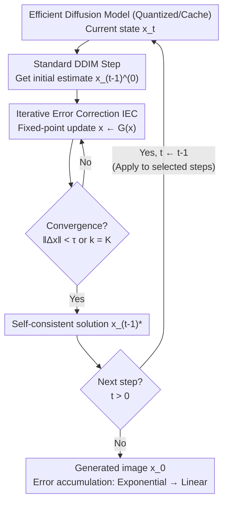

# Test-Time Iterative Error Correction for Efficient Diffusion Models

**Conference**: ICLR 2026  
**arXiv**: [2511.06250](https://arxiv.org/abs/2511.06250)  
**Code**: [GitHub](https://github.com/zysxmu/IEC)  
**Area**: Diffusion Models / Model Efficiency / Test-Time Optimization  
**Keywords**: Iterative Error Correction, Test-Time Augmentation, Quantized Diffusion, Feature Caching, Error Propagation

## TL;DR

Ours proposes IEC (Iterative Error Correction), a test-time plug-and-play method that corrects the inference errors of efficient diffusion models through iterative refinement, reducing error accumulation from exponential growth to linear growth.

## Background & Motivation

**Background**: To deploy diffusion models on resource-constrained scenarios like mobile phones or edge devices, network quantization (reducing weights/activations to low bits while shrinking models and accelerating speed) and feature caching (reusing intermediate features across time steps to avoid redundant computation) have become two mainstream efficiency routes. Both can significantly compress inference overhead.

**Limitations of Prior Work**: Efficiency comes at a cost—both quantization and caching introduce approximation errors between the output of the efficient model and the original full-precision model. The analysis in this paper further reveals that such errors **accumulate exponentially** along the sampling time steps, eventually severely degrading generation quality.

**Infeasibility Post-Deployment**: Existing mitigation strategies (step-wise quantization parameters, non-uniform caching strategies, etc.) are **pre-deployment** solutions requiring a rerun of the model efficiency pipeline or even access to the original full-precision model. However, once a model is deployed to edge or production environments, these premises often fail: rerunning pipelines is engineering-heavy, on-device models are often unmodifiable due to storage limits or deployment policies, and original high-precision weights may have been lost.

**Key Insight**: Inspired by test-time scaling—adjusting model behavior during inference without retraining—the authors propose the **Core Problem**: **Can the quality of a deployed efficient diffusion model be directly enhanced without repeating the efficiency pipeline?** IEC is the answer to this question.

## Method

### Overall Architecture

IEC addresses the specific problem of "uncontrolled error in efficient diffusion models after deployment." The overall approach consists of two steps: **first, analyzing why errors go out of control, and then providing a targeted test-time patch**. The analysis reveals that errors in adjacent time steps in DDIM sampling are cascaded and coupled; a small error in one step is repeatedly magnified by subsequent steps into exponential accumulation. The solution is to insert a lightweight fixed-point iteration loop **within** each sampling step, allowing the current step to converge to a self-consistent solution before proceeding, thereby cutting the transmission of errors between time steps. The method does not touch weights, modify architectures, or require the original model; it is a purely plug-and-play patch at inference time, which can be selectively applied to specific time steps to manage overhead.

### Key Designs

**1. Error Propagation Analysis: Locating the "Exponential Explosion"**

The deterministic single-step update of DDIM can be organized into a linear form $x_{t-1} = A_t x_t + B_t \epsilon_\theta(x_t, t)$, where $A_t, B_t$ are coefficients related only to the noise schedule. Quantization or caching introduces two types of errors at each step: the state error $\delta_t$ passed from the previous step, and the error $\epsilon_\theta^\delta$ perturbed in the network prediction itself. Substituting these and performing a first-order Taylor expansion on the network yields the recurrence relation $\delta_{t-1} = (A_t + B_t J_t)\delta_t + B_t \epsilon_\theta^\delta$, where $J_t$ is the Jacobian of the noise prediction network with respect to the input. Expanding the recurrence from step $T$ to step 0, the cumulative error is:

$$\delta_0 = \sum_{i=1}^{T} \Big(\prod_{j=i+1}^{T}(A_j + B_j J_j)\Big)(B_i \epsilon_\theta^\delta).$$

The root of the problem lies in the matrix product term: the authors measured the spectral norm $\|A_t + B_t J_t\| > 1$ on CIFAR-10 across all time steps, meaning every step amplifies the error. Early small perturbations are repeatedly multiplied by subsequent steps, eventually accumulating exponentially. This section identifies the "error coupling between adjacent time steps" as the core issue, which the subsequent design aims to terminate.

**2. Iterative Error Correction: Fixed-Point Iteration Towards Self-Consistency**

Since errors amplify through coupling between time steps, IEC repeatedly corrects **within** each time step until the current step's prediction is consistent with its own output. First, a standard DDIM step computes an initial estimate $x_{t-1}^{(0)}$, then $x_t$ is fixed, and $x_{t-1}$ is iterated:

$$x_{t-1}^{(k+1)} = x_{t-1}^{(k)} + \lambda\big(A_t x_t + B_t \epsilon_\theta(x_{t-1}^{(k)}, t) - x_{t-1}^{(k)}\big),$$

where the step size $\lambda$ controls the magnitude of each correction, iterating until the difference between adjacent iterations is below a threshold. This is equivalent to finding the fixed point $x_{t-1}^* = G(x_{t-1}^*)$ of the mapping $G(x) = (1-\lambda)x + \lambda\big(A_t x_t + B_t \epsilon_\theta(x, t)\big)$. Intuitively, while a one-time single-step prediction writes approximation errors directly into $x_{t-1}$ to be carried forward, iterating to a self-consistent solution allows the step to "self-correct" internally, preventing unassimilated errors from spilling over.

For the iteration to hold, $G$ must be a contraction mapping. Its Jacobian is $\nabla G(x) = (1-\lambda)I + \lambda B_t J_t$, corresponding to the Lipschitz constant $L = \|(1-\lambda)I + \lambda B_t J_t\|$. By the Banach Fixed Point Theorem, the iteration converges uniquely if $L < 1$. A key observation is that $B_t < 0$ in DDIM, so choosing an appropriate positive $\lambda$ allows the $\lambda B_t J_t$ term to compress $L$ into the unit ball. The authors measured that $\|\nabla G(x)\| < 1$ holds for all time steps when $\lambda \in [0.1, 0.7]$, using $\lambda = 0.5$ in practice—turning "heuristic correction" into a theoretically guaranteed convergence process.

**3. From Exponential to Linear: Core Benefit of Decoupling Time Steps**

After convergence, the residual error of each step is compressed to a bounded range $\|\delta_{t-1}^{(\infty)}\| \leq \frac{C}{1-L}$ (where $C$ is a bounded constant independent of iteration). More importantly, because each step is independently pushed to a self-consistent solution, IEC cuts the dependence of $\delta_{t-1}$ on the previous step $\delta_t$. The total cumulative error is no longer the matrix product term from Design 1 but degrades into a simple sum of independent errors from each step: $\delta_0^{\text{IEC}} = \sum_{j=1}^{T}\delta_j^x$. This is the core value of IEC: error accumulation is cured from exponential growth to linear growth.

**4. Selective Application: Fine-Grained Trade-off**

The implementation cost is minimal: the maximum number of iterations is set to $K=1$ (requiring only 1 extra forward pass), with early stopping at threshold $\tau = 10^{-5}$. The authors verified that more iterations ($K=2,3$) yield only marginal gains. The application positions are flexible: quantization methods can use it at every step, while caching methods use it only on non-cached steps (cached steps themselves have no recalculation error). On Stable Diffusion, applying it only to the first step is often sufficient. Since the analysis in Design 1 shows that $\|A_t + B_t J_t\|$ is largest at the beginning and end steps, applying IEC only to those segments captures most of the benefits. This selective application allows users to fine-tune the trade-off between quality and extra overhead.

## Key Experimental Results

### Settings
- Models: DDPM, LDM, Stable Diffusion
- Efficiency Techniques: Step-wise Quantization (W4A8 / W8A8), DeepCache, CacheQuant (Hybrid)
- Datasets: CIFAR-10, LSUN-Churches, LSUN-Bedrooms, ImageNet, MS-COCO
- Metrics: FID, IS, CLIP Score; Hardware NVIDIA 3090, DDIM sampling T=100

### Main Results: Quantization + IEC (Table 1, FID↓)

| Dataset | Full-precision Baseline | Precision | Baseline FID | +IEC FID |
|---------|-------------------------|-----------|--------------|----------|
| CIFAR-10 | DDIM 4.19 | W8A8 | 4.32 | **3.76** |
| CIFAR-10 | | W4A8 | 6.82 | **5.96** |
| LSUN-Churches | LDM-8 3.99 | W8A8 | 3.57 | **3.29** |
| LSUN-Churches | | W4A8 | 6.27 | **6.10** |
| LSUN-Bedrooms | LDM-4 3.37 | W8A8 | 8.97 | **7.78** |

IEC reduces FID across all quantization settings, with significant improvements in W8A8 (e.g., LSUN-Bedrooms 8.97→7.78), pulling the quality of quantized models back toward the full-precision baseline.

### Main Results: Caching + IEC (Table 2, DeepCache, FID↓)

| Dataset | Caching Level | Baseline FID | +IEC FID |
|---------|---------------|--------------|----------|
| CIFAR-10 | N=10 | 9.74 | **7.77** |
| CIFAR-10 | N=15 | 17.21 | **14.58** |
| LSUN-Churches | N=10 | 14.81 | **13.17** |
| LSUN-Bedrooms | N=5 | 14.28 | **9.20** |

**Key Findings**: The more aggressive the caching (larger N), the larger the approximation error, and consequently, the larger the correction magnitude of IEC—LSUN-Bedrooms at N=5 dropped from 14.28 to 9.20, indicating higher gains in more error-prone scenarios.

### Hybrid Schemes and Stable Diffusion
- **CacheQuant (Quantization + Caching)**: IEC consistently improved FID across multiple levels, e.g., CIFAR-10 8/8 N=10 from 8.19 to 6.47.
- **Stable Diffusion / MS-COCO**: Applying IEC only to the first step improved W8A8 N=10 FID from 23.65 to 23.36 and IS from 36.71 to 37.02. Quality and text-image alignment improved simultaneously.

### Ablation Study: Number of Time Steps (Fig. 3)
- Applying to all time steps yields the best results (FID 3.76 on W8A8).
- Applying to only the first and last 1/10 or 1/20 of steps still yields significant gains: improving FID by ~0.44 / 0.35 in quantization.
- **Key Findings**: Errors are concentrated in the first and last steps where $\|A_t + B_t J_t\|$ is largest. Thus, prioritizing these steps offers the best cost-performance ratio. Increasing iterations ($K=2/3$) yields marginal returns, confirming that single-step correction ($K=1$) is sufficient.

## Highlights & Insights

1. **Theoretical Rigor**: A complete theoretical chain from error propagation analysis to convergence proofs.
2. **Plug-and-Play**: No retraining, no architecture modifications, and no requirement for the original model.
3. **Broad Applicability**: Effective across different efficiency techniques (quantization, caching, hybrid).
4. **Flexible and Controllable**: Users can freely choose the degree of application to balance efficiency and quality.
5. **New Perspective on Test-Time Methods**: Adapting the test-time scaling concept to generative models.

## Limitations & Future Work

1. Each IEC iteration requires an extra forward pass, increasing inference time.
2. Theoretical analysis is based on DDIM; applicability to other samplers (e.g., DPM-Solver) requires further verification.
3. The optimal value of $\lambda$ may vary by model and data.
4. For extremely low-bit quantization (e.g., W2) with massive errors, IEC's improvement may be limited.
5. The relationship with test-time training methods was not discussed.

## Related Work & Insights

- **Diffusion Model Quantization**: PTQ4DM, Q-Diffusion, TDQ
- **Feature Caching**: DeepCache, CacheQuant
- **Test-Time Scaling**: TTT (Snell 2024), REPA
- **Efficient Sampling**: DDIM, DPM-Solver, Consistency Models

## Rating

- **Novelty**: ⭐⭐⭐⭐ — Exponential to linear error suppression with clear theoretical contribution.
- **Value**: ⭐⭐⭐⭐⭐ — Post-deployment optimization, true plug-and-play.
- **Experimental Thoroughness**: ⭐⭐⭐⭐ — Validated across models, techniques, and datasets.
- **Writing Quality**: ⭐⭐⭐⭐ — Rigorous theoretical derivation and reasonable experimental setup.

<!-- RELATED:START -->

## Related Papers

- [\[ICLR 2026\] Projected Coupled Diffusion for Test-Time Constrained Joint Generation](projected_coupled_diffusion_for_test-time_constrained_joint_generation.md)
- [\[ICLR 2026\] VFScale: Intrinsic Reasoning through Verifier-Free Test-time Scalable Diffusion Model](vfscale_intrinsic_reasoning_through_verifier-free_test-time_scalable_diffusion_m.md)
- [\[ICLR 2026\] MILR: Improving Multimodal Image Generation via Test-Time Latent Reasoning](milr_improving_multimodal_image_generation_via_test-time_latent_reasoning.md)
- [\[ICLR 2026\] Mitigating Semantic Collapse in Generative Personalization with Test-Time Embedding Adjustment](mitigating_semantic_collapse_in_generative_personalization_with_test-time_embedd.md)
- [\[ICLR 2026\] Compose Your Policies! Improving Diffusion-based or Flow-based Robot Policies via Test-time Distribution-level Composition](compose_your_policies_improving_diffusion-based_or_flow-based_robot_policies_via.md)

<!-- RELATED:END -->
