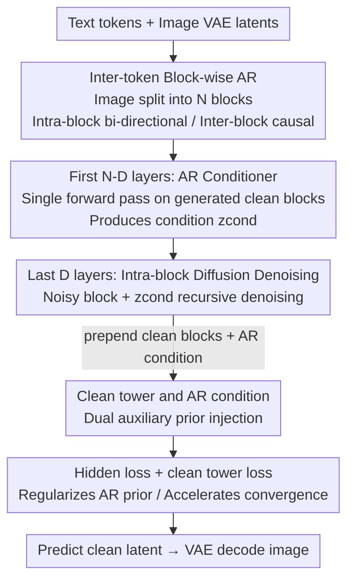

# MADFormer: Mixed Autoregressive and Diffusion Transformers for Continuous Image Generation

**Conference**: ICLR 2026  
**OpenReview**: [https://openreview.net/forum?id=9zUJbyR62q](https://openreview.net/forum?id=9zUJbyR62q)  
**Code**: Publicly released (Paper states Code and models will be released upon publication)  
**Area**: Diffusion Models / Image Generation  
**Keywords**: Autoregressive-Diffusion Hybrid, Continuous Image Generation, Block-wise Autoregression, Compute-Quality Trade-off, Unified Transformer

## TL;DR
MADFormer mixes Autoregression (AR) and Diffusion along both the "token axis" and the "layer axis." It utilizes AR for one-time global conditioning between blocks and Diffusion for iterative refinement within blocks. By treating early Transformer layers as AR conditioners and later layers as diffusion denoisers, it serves as a controllable testbed to systematically answer "how to allocate compute between AR and Diffusion," improving FID by up to 60–75% under constrained inference compute.

## Background & Motivation
**Background**: In multimodal generation, Autoregressive (AR) models and Diffusion models are two complementary mainstreams. AR excels at modeling long-range dependencies and producing contextually coherent sequences, while Diffusion gradually denoises in continuous latent spaces to refine high-fidelity visual details. Recently, increasing efforts (e.g., Transfusion, Show-o, ACDiT, MAR) have attempted to hybridize both to combine AR's structural properties with Diffusion's detail quality.

**Limitations of Prior Work**: There are three mainstream routes for image generation: ① AR on discrete visual tokens, which can reuse LLM architectures but suffers from quantization artifacts and limited upper bounds; ② Full diffusion in continuous latent space, offering high quality but slow sampling and high compute costs; ③ Hybrid architectures using both AR and Diffusion within the image generation pipeline. The third is the most promising, but there is almost no systematic answer to "how much model capacity should be allocated to AR versus Diffusion and along which axis," with most existing hybrid methods relying on empirical heuristics.

**Key Challenge**: AR and Diffusion are complementary in "global structure modeling" and "local detail refinement," yet they compete for the same fixed compute budget. One-time AR conditioning can efficiently encode global dependencies across blocks or modalities, while iterative diffusion denoising is expensive but restores details. Whether to bias toward AR or Diffusion depends on the inference budget and resolution, and no "one-size-fits-all" formula exists.

**Goal**: Rather than just creating another hybrid model, this work aims to build a **controllable testbed**. It decomposes the hybrid design space into several independently scannable axes (diffusion depth, AR block granularity, auxiliary modules, loss design) to quantitatively answer "how to distribute AR/Diffusion capacity."

**Key Insight**: Starting from a vanilla architecture (AR for language, Diffusion for images), the authors introduce **intra-image AR conditioning** and **flexible AR/Diffusion layer allocation**. This allows the structure and capacity distribution to be adjustable, enabling observation of their interaction.

**Core Idea**: Hybridize AR and Diffusion in a single unified Transformer along both the token axis and the layer axis—using inter-block AR for one-time global conditioning and intra-block diffusion for iterative refinement. By using early layers for AR and later layers for Diffusion, the work distills a practical guideline: "favor AR when compute is tight, and favor Diffusion when compute is abundant."

## Method

### Overall Architecture
MADFormer is a unified Transformer: text and images are concatenated into a single sequence. Text follows next-token prediction, while image latent patches are divided into several **blocks**. These blocks are generated autoregressively as "tokens" in the AR sequence, while the interior of each block is denoised using a diffusion objective. Images are processed in a continuous VAE latent space (non-quantized), using the Llama 3 tokenizer for text and the Stable Diffusion VAE for images. Bi-directional attention is used within blocks, and causal attention is used between blocks.

The key is conceptually splitting the **single Transformer layer stack into two segments**: the first $N-D$ layers serve as the "AR conditioner," performing a single forward pass on previously generated clean blocks to calculate the condition $z_{cond}$ for the next block; the last $D$ layers serve as the "diffusion denoiser," which recursively denoises the noisy current block latent $\sqrt{\bar\alpha_t}\,z_{image}+\sqrt{1-\bar\alpha_t}\,\epsilon$ plus the condition $z_{cond}$ to predict the clean latent $\hat z_{image}$. Note that the entire network shares the Llama backbone but with different training objectives; timestep information is encoded into the image latents via a U-Net downsampler rather than being injected into every layer like in DiT. This layout of "AR providing strong initialization + Diffusion converging in fewer steps" is particularly effective when compute is constrained.

### Key Designs

**1. Inter-token Block-wise AR + Intra-block Diffusion: Balancing structure and flexibility with coarse blocks**

To address the dilemma between "full diffusion is globally coherent but slow" and "pure AR is discrete with artifacts," MADFormer linearizes image latents (left-to-right, top-to-bottom) and splits them into **coarse blocks** (e.g., a $1024 \times 1024$ latent split into sixteen $256 \times 256$ blocks). **Between** blocks, it performs autoregression: the generation of the $i$-th block is autoregressively conditioned on all previous blocks, $p(x)=\prod_i p(x_i \mid x_{1:i-1})$. **Within** blocks, it performs diffusion: treating the continuous latent as real-valued, applying DDPM forward noise $x_t=\sqrt{\bar\alpha_t}x_0+\sqrt{1-\bar\alpha_t}\epsilon$ and then iteratively denoising. Thus, AR handles cross-block global structure and context, while Diffusion handles intra-block high-fidelity details. The number of blocks (AR length) is a critical knob: experiments show the optimal granularity depends on resolution—FFHQ-1024 prefers 16 blocks, while ImageNet-256 prefers a single block, suggesting high-resolution images benefit more from fine-grained AR decomposition.

**2. Layer-wise AR/Diffusion Hybrid: Allocating early layers to AR and later layers to Diffusion**

Addressing the issue that "existing works often use the entire model for diffusion, wasting compute," MADFormer splits a 28-layer Transformer along the depth axis into $N-D$ AR layers and $D$ diffusion layers. In the AR stage, it calculates condition representations for previous blocks: $h_0 = \text{Embed}(z_{prev}) + \text{PosEnc}$, then layer-by-layer $h_i = \text{DecoderBlock}_i(h_{i-1})$, resulting in $z_{cond} = h_{N-D}$ (using ACDiT's multi-dimensional RoPE-ND for positional encoding). Upon entering the diffusion stage, the noisy latent is added to the condition $h_{N-D} = \sqrt{\bar\alpha_t}z_{image} + \sqrt{1-\bar\alpha_t}\epsilon + z_{cond}$, and denoised through $D$ layers to obtain $\hat z_{image} = \text{Proj}(h_N)$. The core insight is: a one-time AR condition is sufficient to capture cross-modal and cross-block dependencies, requiring only a few subsequent layers for intra-block refinement. This makes "diffusion depth $D$" a scannable capacity knob (the paper compares $d=7/14/21/28$), allowing for quantitative answers on compute allocation—give more to AR when compute is tight (AR provides strong initialization, diffusion converges in fewer steps), and give more to Diffusion when compute is sufficient (higher upper bound for detail refinement).

**3. Clean tower and AR condition: Dual auxiliary priors for structure injection**

To provide stronger context for the denoising process, MADFormer borrows from ACDiT by **prepending clean image blocks** before the noisy blocks, supplemented by the **AR condition** generated autoregressively from previous blocks. Both inject structural priors into the denoising trajectory and are complementary. Implementation-wise, all modalities share the backbone but use **separate parameter sets** to process text, clean image blocks, and noisy image blocks (referred to as text tower / clean tower / noise tower). Interleaved causal attention is used across modalities, while bi-directional attention is used within blocks; the attention mask for mixed clean/noisy inputs is dynamically constructed via Flex Attention. Ablations show that removing either path (keeping only clean blocks or only the condition) consistently worsens FID, proving both are effective and work better in combination; however, whether parameters are truly separated has minimal impact (see ablation), as a dense model with shared parameters is equally sufficient.

**4. Hidden loss and clean tower loss: Regularizing AR priors and accelerating convergence**

In addition to standard text NLL and image MSE, the authors add two auxiliary losses. **Hidden loss** aligns the AR-produced condition with the clean latent of the next block $\|z_{condition}-z_{image}\|_2^2$, based on the philosophy that "the condition should encode the clean latent it aims to guide." **Clean tower loss** makes each clean block's output predict the next clean block $\|z_{clean}-z_{image}\|_2^2$, similar to AR's next-token prediction. The total loss is a weighted sum:

$$\mathcal{L}_{total}=\lambda_{text}\,(-\log p(y_{text}\mid x))+\lambda_{image}\,\|\hat z_{image}-z_{image}\|_2^2+\lambda_{hidden}\,\|z_{condition}-z_{image}\|_2^2+\lambda_{tower}\,\|z_{clean}-z_{image}\|_2^2$$

Where $\lambda_{text}=1$, $\lambda_{image}=5$ (following Transfusion), and $\lambda_{hidden}$, $\lambda_{tower}$ are adjustable. Experiments show hidden loss at $\lambda=0.1$ reduces FFHQ FID from 19.4 to 17.8—small weights provide regularization, while large weights over-constrain the AR prior and interfere with denoising. Clean tower loss has a smaller impact on final quality but both accelerate convergence in early training.

### Loss & Training
Image denoising training uses a 1000-step DDPM schedule. Optimization uses AdamW + WSD learning rate schedule, peak lr $3\times10^{-4}$, weight decay $5\times10^{-2}$, and EMA decay 0.9999. FFHQ-1024 uses 1.3B parameters and 28 layers, trained for 210k steps with batch size 64. ImageNet uses 2.1B parameters (adding text tower, token embeddings, LM head), trained for 250k steps (~50 epochs) with batch size 256. U-Net up/downsamplers have ~0.2B parameters, and the VAE is frozen. Sampling uses DDIM (250 steps for FFHQ, 100 steps for ImageNet), with FID averaged over the last 5 checkpoints to reduce variance. The authors emphasize that ImageNet FID is higher because training epochs are significantly fewer than MAR (400) and ACDiT (800), and CFG is not used, as the focus is on controlled design space analysis rather than SOTA chasing.

## Key Experimental Results

### Main Results
The core conclusion is "favor AR when compute is tight, favor Diffusion when compute is abundant." Scanning different AR:Diffusion ratios and NFE under a fixed 28-layer budget:

| Dataset | Compute Tier (NFE) | AR-heavy (e.g., 3:1, d=7) | Diffusion-heavy (e.g., d=28) | Trend |
|--------|--------------|------------------------|---------------------------|------|
| FFHQ-1024 | Low NFE | Better FID (up to 60–75% drop) | Worse | AR superior at low compute |
| FFHQ-1024 | High NFE | Worse | Better FID | Diffusion superior at high compute |
| ImageNet-256 | Low NFE | Better FID (up to 60–75% drop) | Worse | Same as above |

Diffusion depth ablation (fixed 28 layers, same diffusion steps) shows higher fidelity with greater diffusion capacity:

| Config | FFHQ FID ↓ | ImageNet FID ↓ |
|------|-----------|----------------|
| d = 7 | 20.2 | 34.0 |
| d = 14 | 17.8 | 30.0 |
| d = 21 | 16.6 | 28.1 |
| d = 28 | 15.9 | 27.4 |

These conclusions are not contradictory: at a fixed NFE, favoring AR saves compute (Figure 4), whereas if diffusion steps are also unrestricted, increasing diffusion layers simply yields higher fidelity (Table 1).

### Ablation Study

| Config | FFHQ FID ↓ | ImageNet FID ↓ | Description |
|------|-----------|----------------|------|
| Full (clean blocks + condition) | 17.8 | 30.0 | Full dual auxiliary priors |
| Clean blocks only | 20.1 | 31.9 | Remove AR condition, FFHQ +2.3 |
| Condition only | 19.7 | 31.2 | Remove clean blocks, FFHQ +1.9 |
| AR length l=16 (FFHQ) / l=1 (ImageNet) | 17.8 / 28.4 | — | Optimal graining depends on resolution |
| Shared parameters (Single Set) | 17.8 | 30.4 | Parameter separation offers almost no gain |
| MLP-style denoising (truncate cross-block attn) | 21.2 | 96.5 | Cross-block causal attention is critical |
| Hidden loss λ=0 → 0.1 | 19.4 → 17.8 | 30.2 → 30.0 | Small weight regularization for AR is optimal |

### Key Findings
- **Compute is the watershed**: The decision to favor AR or Diffusion is driven by inference budget and resolution rather than model size—AR-heavy improves FID by 60–75% at low NFE, while Diffusion takes the lead at high NFE.
- **Cross-block attention is non-negotiable**: Limiting attention to intra-block during the diffusion stage (simulating independent MLP denoising) causes ImageNet FID to explode from 30.0 to 96.5, proving sequence-level causal attention is vital for cross-block consistency.
- **Granularity depends on resolution**: High-resolution FFHQ benefits from fine-grained AR decomposition (16 blocks is best), while low-resolution ImageNet performs better with a single block (longer AR sequences degrade quality, consistent with ACDiT).
- **Parameter separation yields marginal gains**: Using three sets of parameters for text/clean/noise has almost no effect on FID, suggesting a dense shared model is sufficient and avoids the complexity of sparsification.
- **Auxiliary losses require small weights**: Small weights for hidden loss provide beneficial regularization; larger weights over-constrain the AR prior and interfere with denoising. Clean tower loss has little impact on final quality but accelerates early convergence.

## Highlights & Insights
- **"Testbed" Positioning**: This work elevates its contribution beyond "another hybrid model" to a "controllable platform for systematic design space scanning." By setting independent knobs for layer, token, and loss axes, it provides transferable design guidelines rather than a single SOTA point—this "method-as-experimental-framework" approach is highly commendable.
- **AR as Cheap Initialization for Diffusion**: Using early layers for a one-time AR condition provides a strong starting point for diffusion, allowing it to converge in fewer steps. This maps "AR for efficient structure + Diffusion for detail refinement" onto different layers of the same network, a practical trick for compute-constrained scenarios.
- **Unified Architecture with Target Switching**: The entire network shares the Llama backbone. AR and Diffusion differ only in their training objectives, with timesteps encoded via a U-Net downsampler into the latents rather than being injected into every layer, making it more concise than the DiT-style per-layer injection.

## Limitations & Future Work
- **Absolute FID is not high**: The authors explicitly state that ImageNet FID is high due to shorter training compared to MAR/ACDiT and lack of CFG. Therefore, its value lies in design trends rather than direct SOTA comparisons—of limited reference for readers seeking top-tier leaderboard numbers.
- **No closed-form solution for optimal config**: The optimal AR length varies by resolution, architecture, and dataset. The paper provides empirical values (16 blocks for FFHQ, 1 block for ImageNet) but lacks a predictive formula, requiring rescanning for new datasets.
- **Conservative parameterization**: Diffusion still predicts clean latents (rather than $\epsilon$ or velocity). The authors leave alternative parameterizations and adaptive loss weights for future work.
- **Overhead of clean blocks**: While prepending clean blocks improves fidelity, it increases computational cost. The paper does not deeply quantify the boundary of this cost-benefit trade-off.

## Related Work & Insights
- **vs. Transfusion / Show-o**: These works hybridize across modalities (sharing token sequences and switching objectives). MADFormer focuses on hybridizing **within the image generation process**, representing an orthogonal axis of research.
- **vs. ACDiT**: MADFormer reuses ACDiT's prepended clean blocks and RoPE-ND but generalizes the problem from "a single hybrid model" to "systematic allocation of AR and Diffusion capacity along layer/token axes," discovering fine-grained block benefits on high-res FFHQ not covered by ACDiT.
- **vs. MAR (Li et al., 2024)**: MAR uses auxiliary MLPs for independent block denoising; this paper's ablation shows that truncating cross-block attention significantly degrades quality, highlighting the importance of sequence-level causal attention.
- **vs. LMFusion / MoT**: These use parallel diffusion layers or sparse routing for scaling. MADFormer's experiments show minimal gains from parameter separation, suggesting dense sharing is sufficient in this setting.

## Rating
- Novelty: ⭐⭐⭐⭐ The combined perspective of dual-axis hybridization and testbed positioning is novel, though individual components mostly follow existing work.
- Experimental Thoroughness: ⭐⭐⭐⭐ Systematically ablated across multiple axes with clear conclusions, though absolute quality is limited by training duration and lack of CFG.
- Writing Quality: ⭐⭐⭐⭐ The framework and design space are clearly explained; formulas and figures are well-coordinated.
- Value: ⭐⭐⭐⭐ Provides actionable guidelines for compute allocation in future hybrid generative models.

<!-- RELATED:START -->

## Related Papers

- [\[ICLR 2026\] NextStep-1: Toward Autoregressive Image Generation with Continuous Tokens at Scale](nextstep-1_toward_autoregressive_image_generation_with_continuous_tokens_at_scal.md)
- [\[ICLR 2026\] Hyperspherical Latents Improve Continuous-Token Autoregressive Generation](hyperspherical_latents_improve_continuous-token_autoregressive_generation.md)
- [\[ICLR 2026\] Condition Errors Refinement in Autoregressive Image Generation with Diffusion Loss](condition_errors_refinement_in_autoregressive_image_generation_with_diffusion_lo.md)
- [\[ICLR 2026\] Autoregressive Image Generation with Randomized Parallel Decoding](autoregressive_image_generation_with_randomized_parallel_decoding.md)
- [\[CVPR 2026\] Training-free Mixed-Resolution Latent Upsampling for Spatially Accelerated Diffusion Transformers](../../CVPR2026/image_generation/training-free_mixed-resolution_latent_upsampling_for_spatially_accelerated_diffu.md)

<!-- RELATED:END -->
